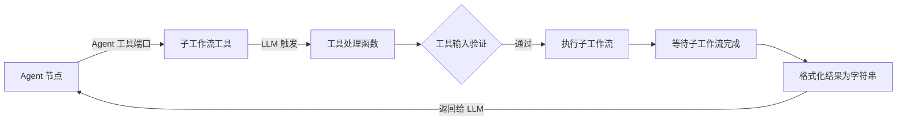

# AI Agent 与工作流即工具

## 1. 架构模式：Agent 路由层 + 工作流执行层

AI Agent 和 DAG 工作流不是二选一的关系，而是**层叠的**：

- **Agent 节点**负责意图识别和路由决策。
- **工作流/DAG**负责确定性执行。
- 每个 tool 本质上是一个可被 LLM 调用的执行单元。

```
用户输入
    │
    ▼
┌─────────────────────┐
│    AI Agent 节点     │  ← 识别意图
│      (LLM)          │
└──────┬──────────────┘
       │ LLM 决定调用哪个 tool
       │
┌──────┴──────────────┬──────────────────┬──────────────┐
▼                     ▼                  ▼              ▼
子工作流工具          子 Agent 工具      代码片段工具    HTTP 工具
(调用子工作流)        (嵌套 Agent)       (沙箱执行)    (HTTP 调用)
```

## 2. Agent 节点执行流程

```
输入数据
    │
    ▼
构建执行上下文 ─── 加载模型、记忆、批处理配置
    │
    ▼
按批次执行 Agent ─── 逐批处理数据项
    │              ├── 准备单条上下文 → 获取工具列表 + prompt
    │              ├── 构造 Agent 执行链 → 调用 LLM
    │              ├── LLM 决定调用哪个 tool
    │              └── 汇总结果 → 格式化输出
    │
    ├── LLM 产生 tool_calls → 转成引擎可执行的请求
    │       │
    │       ▼
    │   引擎执行 tool 对应的节点 → 结果返回 LLM
    │       │
    │       ▼
    │   LLM 决定下一步（继续调用/结束）
    │
    └── 无 tool_calls → 返回最终结果
```

## 3. AI 节点分类

Flow Engine 把 AI 能力嵌入为普通节点，但根据决策复杂度和工具调用方式，细分为三类：

| 节点类型               | LLM 调用方式                              | 是否自主选择工具   | 典型场景                                  |
| ---------------------- | ----------------------------------------- | ------------------ | ----------------------------------------- |
| **LLM Transform 节点** | 单次调用                                  | 否                 | Excel 列归类、HTML 关键信息提取、文本摘要 |
| **ToolChain 节点**     | 单次 LLM 调用中按固定顺序串行调用多个工具 | 否（工具顺序固定） | 先查银行模板库，再归类流水                |
| **Agent 节点**         | 多轮循环                                  | **是**             | 意图识别、复杂路由、动态决策              |

### 3.1 LLM Transform 节点

LLM Transform 节点是**单次 LLM 调用**的数据处理节点：

- **输入**：原始非结构化数据（Excel 二维数组、HTML 字符串、长文本）。
- **参数**：Prompt 模板、输出 Schema、模型选择、凭据。
- **输出**：符合 Schema 的结构化 JSON。

```
原始数据 ──→ LLM Transform 节点 ──→ 结构化 JSON
                ↓
            Prompt + Output Schema
                ↓
            单次 LLM 调用
```

示例：银行流水导入

```
Excel 内容
    ↓
Prompt: "把以下表格列归类到标准字段：日期、金额、对方账户、摘要"
OutputSchema: { "date": "string", "amount": "number", "counterparty": "string", "summary": "string" }
    ↓
输出: [{ "date": "2026-06-01", "amount": 100.00, "counterparty": "XXX公司", "summary": "货款" }]
```

### 3.2 ToolChain 节点

ToolChain 节点在**单次 LLM 调用上下文**中按**固定顺序**调用一个或多个工具，调用顺序由开发者在节点参数中写死，而非由 LLM 动态决定：

```
输入数据
    ↓
Tool 1（固定） → Tool 2（固定） → Tool 3（固定）
    ↓
最终输出
```

这种节点适合有明确步骤、不需要 LLM 做路由的场景。例如：

> 读取 Excel → 查询银行模板库 → 用 LLM 按模板归类 → 输出标准字段。

ToolChain 节点可以通过普通输入端口连接上游工具节点，也可以把工具调用逻辑内嵌在节点实现里。

### 3.3 Agent 节点

Agent 节点是**自主决策循环**：LLM 根据当前上下文决定调用哪个 tool、是否继续、何时返回最终结果。详见本章后续内容。

### 3.4 与 LLM 供应节点的关系

三类 AI 节点都可以通过 **LLM 供应端口**（`PortType = LLM`，`PortDirection = Output`）获取模型实例：

```
OpenAI 供应节点 ──LLM 端口（Output 方向）──→ LLM Transform 节点
                                                  ──→ ToolChain 节点
                                                  ──→ Agent 节点
```

这样模型配置（API Key、模型版本、温度等）可以集中管理，多个 AI 节点复用同一个供应节点。

## 4. Agent 节点的端口类型

| 端口类型           | 方向（从 Agent 节点视角） | 作用                                         |
| ------------------ | ------------------------- | -------------------------------------------- |
| **主数据端口**     | 输入                      | 接收普通输入数据                             |
| **Agent 工具端口** | 输出                      | 连接可被 LLM 调用的工具节点                  |
| **LLM 供应端口**   | 输入                      | 连接 LLM 供应节点（如 OpenAI），提供模型实例 |
| **记忆端口**       | 输入                      | 连接记忆节点，提供上下文记忆能力             |

**方向说明**：上表方向从 Agent 节点自身视角描述。LLM 供应端口在**供应节点**一侧为 `Output`，在**消费节点**（LLM Transform / ToolChain / Agent）一侧为 `Input`。

## 5. 工具收集机制

Agent 节点执行前，会扫描所有通过 Agent 工具端口连接的工具节点，并将它们注册为 LLM 可用工具。

**端口方向约定**：Agent 工具端口是 Agent 节点的**输出端口**，连线从 Agent 节点指向下游 tool 节点。

`ToolDefinition` 的字段定义见 [terminology.md#核心数据模型](terminology.md#核心数据模型)。`ParametersSchema` 优先从工具节点的 `ParameterDefinition` 推导；若工具节点声明了 `{{ai_param:描述}}` 占位符，则将其转换为结构化参数。

```csharp
public IReadOnlyList<ToolDefinition> CollectTools(
    NodeDefinition agentNode,
    IReadOnlyList<Connection> workflowConnections)
{
    var tools = new List<ToolDefinition>();

    // Agent 工具端口为出端口，连接下游 tool 节点
    var toolPorts = agentNode.Ports
        .Where(p => p.Type == PortType.AgentTool && p.Direction == PortDirection.Output);

    foreach (var port in toolPorts)
    {
        var toolConnections = workflowConnections
            .Where(c => c.SourceNodeId == agentNode.Id && c.SourcePortName == port.Name);

        foreach (var connection in toolConnections)
        {
            var toolNode = GetNode(connection.TargetNodeId);
            tools.Add(toolNode.ToToolDefinition());
        }
    }

    return tools;
}
```

## 6. 工具类型

| 工具类型          | 作用                                  | 实现                                  |
| ----------------- | ------------------------------------- | ------------------------------------- |
| **子工作流工具**  | 把整个子工作流注册为 LLM 可调用的工具 | 工作流工具节点 → 调用引擎执行子工作流 |
| **子 Agent 工具** | 子 Agent，支持多层嵌套                | Agent 工具节点 → 复用 Agent 执行逻辑  |
| **代码片段工具**  | 执行用户编写的代码片段                | 沙箱执行                              |
| **HTTP 工具**     | 发 HTTP 请求                          | 引擎 HTTP 层                          |
| **工具集（MCP）** | MCP 协议暴露的多个工具                | MCP Client 节点                       |

## 7. LLM 工具调用 → 引擎请求映射

LLM 返回的工具调用描述会被转成引擎可执行的内部请求：

```
LLM 工具调用
        │
        ▼
引擎内部执行请求（携带目标节点、输入参数、调用 ID 等）
        │
        ▼
引擎执行目标节点 → 收集结果 → 格式化后回填给 LLM → LLM 决定下一步
```

## 8. 工作流作为工具（Workflow-as-Tool）

### 8.1 调用方式

Agent 的 tool 可以调用另一个完整的工作流：

```
Agent 节点 ──Agent 工具端口──→ 子工作流工具节点
                               │
                     LLM 调这个 tool 时
                               │
                               ▼
                         执行子工作流
                    （银行流水对账 / 凭证挂账 / 异常告警）
                               │
                               ▼
                         返回结果给 LLM
```

### 8.2 子工作流来源

| 来源          | 方式                         | 适用场景             |
| ------------- | ---------------------------- | -------------------- |
| **数据库**    | 按工作流 ID 从库加载         | 生产环境，在线工作流 |
| **参数**      | 直接在节点里粘贴工作流 JSON  | 测试/调试，快速验证  |
| **JSON 配置** | 按工作流名称解析 + RBAC 鉴权 | 企业级敏捷配置       |

### 8.3 执行流程



### 8.4 Schema 感知

如果子工作流的输入参数包含需要从 LLM 获取的占位符，工具会自动升级为结构化工具，LLM 会收到结构化参数描述而不是任意字符串。例如：

```
用户定义子工作流参数:
  - 日期: {{ai_param:要查询的日期，格式 YYYY-MM-DD}}
  - 部门: {{ai_param:部门名称}}

→ 自动生成参数 Schema → LLM 按结构传参
```

## 9. 子 Agent 嵌套

子 Agent 工具节点可以让一个 Agent 嵌套另一个 Agent（Orchestrator 模式）：

```
父 Agent
  │
  ├── 工具 A（子 Agent A）
  │      ├── 工具 A1
  │      └── 工具 A2
  │
  └── 工具 B（子 Agent B）
         └── 工具 B1
```

### 9.1 内联解析器

内联解析器（Inline Resolver）是执行引擎中专门处理子 Agent 工具请求的组件。它接收子 Agent 产生的工具调用请求，在同一执行上下文中循环执行：

1. 解析请求，确定目标 tool 节点。
2. 调用引擎执行该 tool 节点。
3. 将结果返回给子 Agent。
4. 子 Agent 决定是否继续调用 tool。
5. 循环直到子 Agent 返回最终结果。

内联解析器本质上仍然是**引擎执行路径的本地优化**：它复用引擎的执行语义（执行记录、取消、错误策略、审计日志），只是避免为每个子 Agent 单独创建独立执行实例，从而减少上下文切换开销。

**关键约束**：

- 内联解析器调用的 tool 节点仍然走完整的节点执行路径，生成 `NodeExecutionRecord`，接受错误策略和审计。
- 不创建新的顶层 `ExecutionRecord`，子 Agent 及其 tool 调用产生的记录都作为父 Agent 节点执行记录的子记录存在。
- 子记录的 `ParentRecordId` 指向父 Agent 的 `NodeExecutionRecord.Id`。
- 执行历史展示时，可将父 Agent 及其子记录折叠为一次 Agent 调用过程。

### 9.2 嵌套执行流程

```
父 Agent 调用"子 Agent A"
    │
    生成引擎请求 → 子 Agent 执行
    │
    子 Agent 产生新的工具调用请求
    │
    内联解析器处理子 Agent 请求
        │
        └── 循环直到没有新的引擎请求
                └── 执行工具动作
                └── 重新调用 LLM
    │
    返回最终结果给父 Agent
```

## 10. 设计决策

| 决策                                              | 说明                                             |
| ------------------------------------------------- | ------------------------------------------------ |
| Agent 节点和普通节点在同一引擎内执行              | 复用执行队列、错误处理、审计日志                 |
| tool 执行通过引擎请求而非直接调用                 | 保留执行记录、支持暂停/取消、可观测              |
| 子工作流与父 Agent 上下文按策略共享或隔离         | 涉及敏感凭据或数据时默认隔离，仅在显式授权下共享 |
| Agent 负责意图决策与生成，关键数据流转由 DAG 承载 | 数据路径结构化，可审计、可回放、可调试           |
| Schema 由节点定义自动推导                         | 节点开发者不需要额外声明 JSON Schema             |

## 11. 安全与限制

- Agent 节点的最大迭代次数可配置，防止无限循环。
- LLM 调用超时可控。
- 子 Agent 嵌套深度限制。

### 11.1 Tool 结果消毒

tool 执行结果返回 LLM 前必须消毒，防止提示注入和无关信息干扰：

- **长度截断**：超过配置阈值的结果截断并附加省略说明。MVP 按字符数近似（如 32K 字符 ≈ 8K token），未来可由 LLM 供应节点提供 tokenizer 计数能力。
- **模式过滤**：过滤已知的 prompt injection 模式，如 `ignore previous instructions`、`<system>`、`<|endoftext|>` 等。
- **结构化包装**：将 tool 结果用 JSON 包裹，明确标注来源和类型，避免 LLM 将结果中的指令误解为系统指令。
- **敏感信息过滤**：移除可能包含的凭据、Token、私钥等。

```json
{
  "tool": "queryDatabase",
  "status": "success",
  "result": { "count": 42 }
}
```

### 11.2 流式输出

Agent 节点支持流式输出，用于前端实时展示 LLM 思考过程或中间结果：

```csharp
public interface IStreamingNodeType : INodeType
{
    IAsyncEnumerable<StreamingChunk> ExecuteStreamingAsync(
        NodeExecutionContext context,
        CancellationToken cancellationToken = default);
}

public class StreamingChunk
{
    public string Content { get; set; }
    public bool IsToolCall { get; set; }
    public ToolCall ToolCall { get; set; }
    public bool IsFinal { get; set; }
}
```

- 非流式节点仍使用 `ExecuteAsync` 返回完整结果。
- 流式节点通过 WebSocket / SSE 向前端推送 `StreamingChunk`。
- 流式执行同样生成 `NodeExecutionRecord`，最终聚合结果作为节点输出。
