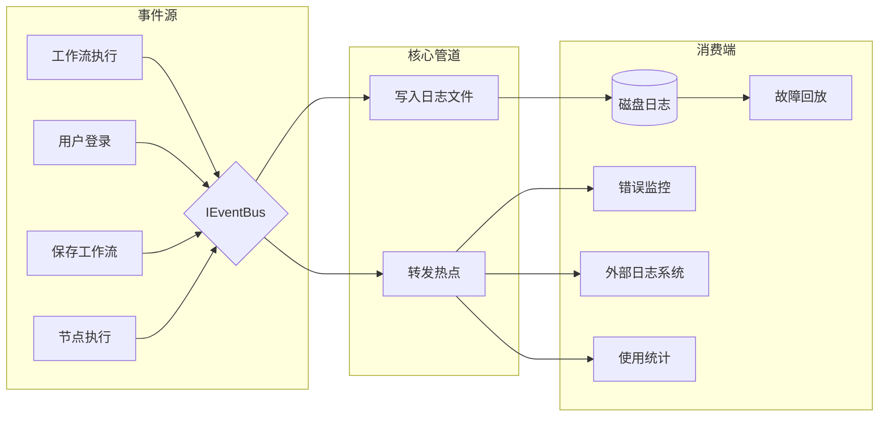

# 审计日志系统

## 1. 审计日志的目的

审计日志用于记录系统中所有关键操作和事件，支持：

- 故障排查与执行回放
- 安全审计与合规
- 使用统计与监控
- 操作追溯

## 2. 事件模型

```csharp
public class AuditEvent
{
    /// <summary>
    /// 事件唯一 ID
    /// </summary>
    public Guid Id { get; set; }

    /// <summary>
    /// 事件类型
    /// </summary>
    public string EventType { get; set; }

    /// <summary>
    /// 事件发生时间
    /// </summary>
    public DateTime Timestamp { get; set; }

    /// <summary>
    /// 操作人/触发源
    /// </summary>
    public string Actor { get; set; }

    /// <summary>
    /// 资源类型
    /// </summary>
    public string ResourceType { get; set; }

    /// <summary>
    /// 资源 ID
    /// </summary>
    public Guid ResourceId { get; set; }

    /// <summary>
    /// 事件体，包含具体上下文
    /// </summary>
    public Dictionary<string, object> Payload { get; set; }

    /// <summary>
    /// 客户端 IP、UserAgent 等
    /// </summary>
    public Dictionary<string, string> Metadata { get; set; }
}
```

## 3. 事件源

| 事件类型 | 触发场景 |
|----------|----------|
| `Workflow.Created` | 创建工作流 |
| `Workflow.Updated` | 更新工作流 |
| `Workflow.Deleted` | 删除工作流 |
| `Workflow.Activated` | 激活工作流 |
| `Workflow.Deactivated` | 停用工作流 |
| `Execution.Started` | 开始执行 |
| `Execution.Completed` | 执行完成 |
| `Execution.Failed` | 执行失败 |
| `Execution.Cancelled` | 执行取消 |
| `Node.Executed` | 节点执行完成 |
| `Node.Error` | 节点执行错误 |
| `User.Login` | 用户登录 |
| `User.Logout` | 用户登出 |
| `Credential.Created` | 凭据创建 |
| `Webhook.Triggered` | Webhook 被触发 |

## 4. 事件总线设计



### 4.1 EventBus 接口

单机版定义一个 `IEventBus` 接口，内部使用内存实现；横向扩展时只需替换实现，业务代码不变：

```csharp
public interface IEventBus
{
    Task PublishAsync<T>(T @event) where T : AuditEvent;
    IDisposable Subscribe<T>(Func<T, Task> handler) where T : AuditEvent;
}
```

内存实现使用**有界 `Channel<T>`** 做背压队列（默认容量 10000），后台单线程消费，避免同步写磁盘阻塞主流程：

```csharp
public class InMemoryEventBus : IEventBus, IDisposable
{
    private readonly Channel<AuditEvent> _channel = Channel.CreateBounded<AuditEvent>(10000);
    private readonly ConcurrentDictionary<Type, List<Delegate>> _handlers = new();
    private readonly CancellationTokenSource _cts = new();

    public InMemoryEventBus() => _ = ProcessLoopAsync();

    public Task PublishAsync<T>(T @event) where T : AuditEvent { ... }
    public IDisposable Subscribe<T>(Func<T, Task> handler) where T : AuditEvent { ... }

    // 后台循环：从 Channel 读取事件，分发给所有订阅者
    private async Task ProcessLoopAsync() { ... }
    public void Dispose() { ... }
}
```

**异常处理**：每个订阅者独立 `try/catch`，异常不影响其他订阅者，也不影响事件发布。异常信息写入 `InternalErrorSink`，供运维排查。

未来扩展为 RabbitMQ/Kafka 时，新增 `RabbitMqEventBus` / `KafkaEventBus` 实现 `IEventBus` 即可。

### 4.2 EventBus 职责

- 接收各类事件。
- 将事件写入内存缓冲 + 后台批量追加到本地日志文件（核心路径，保证不丢）。
- 异步转发到订阅者（不影响主流程）。

### 4.3 写入日志文件

审计日志订阅者采用后台批量刷盘策略，避免同步写文件阻塞执行引擎。关键事件同步刷盘，普通事件异步批量刷盘：

```csharp
public class AuditLogFileSink : IDisposable
{
    // 有界 Channel，普通事件异步入队；关键事件直接同步写文件 + Flush
    private readonly Channel<AuditEvent> _channel = Channel.CreateBounded<AuditEvent>(10000);
    private readonly StreamWriter _writer;
    private readonly Timer _flushTimer; // 每秒 Flush 一次

    public AuditLogFileSink(string logPath) { ... }
    public void OnEvent(AuditEvent @event) { ... }
    private async Task ProcessLoopAsync() { ... }
    public void Dispose() { ... }
}
```

- 事件通过 `OnEvent` 进入 `Channel<T>` 内存队列（有界，避免 OOM）。
- 普通事件后台消费线程批量追加到 NDJSON 文件，每秒 `Flush` 一次。
- 关键事件（凭据访问、凭据删除、执行删除等）同步刷盘，保证不丢。
- `Dispose` 时完成 Channel、取消 Timer、强制 Flush 并释放 Writer。

日志文件格式为 NDJSON（每行一个 JSON）：

```ndjson
{"id":"...","eventType":"Execution.Started","timestamp":"2026-06-17T10:00:00Z","actor":"user-1","resourceType":"Workflow","resourceId":"...","payload":{}}
{"id":"...","eventType":"Node.Executed","timestamp":"2026-06-17T10:00:01Z","actor":"system","resourceType":"Execution","resourceId":"...","payload":{}}
```

## 5. 日志消费端

| 消费端 | 用途 |
|--------|------|
| 故障回放 | 根据日志重建执行过程 |
| 错误监控 | 将错误事件转发到 Sentry |
| 外部日志系统 | 对接 Syslog、ELK 等 |
| 使用统计 | 统计工作流执行次数、节点使用频率 |
| 审计查询 | 按时间、类型、资源查询事件 |

## 6. 回放机制

回放允许管理员根据审计日志重新执行或查看某次执行：

1. 按执行 ID 从日志中提取所有相关事件。
2. 按时间顺序重放节点输入输出。
3. 可选：以只读模式重新执行，验证结果是否一致。

```csharp
public async Task ReplayExecutionAsync(Guid executionId)
{
    // ResourceType 使用约定值 "Execution"
    var events = await logStore.GetEventsAsync("Execution", executionId);
    foreach (var e in events.OrderBy(x => x.Timestamp))
    {
        // 重放节点输入输出到执行视图
        await replayEmitter.EmitAsync(e);
    }
}
```

常用 `ResourceType` 约定值：`Workflow`、`Execution`、`Node`、`Credential`、`User`、`Webhook`。

## 7. 安全与隐私

- 审计日志中不得包含明文密码、Token、私钥。
- 凭据相关事件只记录凭据 ID，不记录值。
- 日志文件定期归档，配置保留策略。
- 敏感操作（如凭据访问）提高日志级别。
