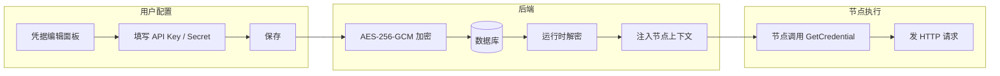

# 凭据系统

## 1. 凭据模型

凭据是全局存储、工作流引用的认证信息。典型凭据包括：

- API Key
- OAuth Token
- 数据库连接字符串
- 用户名/密码
- SSH 密钥



## 2. 数据模型

```csharp
public class Credential
{
    public Guid Id { get; set; }
    public string Name { get; set; }
    public string Type { get; set; } // "apiKey", "oauth", "basicAuth", "connectionString"...
    public Dictionary<string, EncryptedField> Data { get; set; }

    /// <summary>
    /// 加密时使用的密钥版本，用于密钥轮换。
    /// </summary>
    public string KeyVersion { get; set; }

    public DateTime CreatedAt { get; set; }
    public DateTime? UpdatedAt { get; set; }
}

public class EncryptedField
{
    /// <summary>
    /// 加密后的字节数组，以 base64 或 hex 存储。
    /// </summary>
    public string CipherText { get; set; }
    public string Nonce { get; set; }
    public string Tag { get; set; }

    /// <summary>
    /// 原始数据是否为二进制（如 SSH 私钥）。
    /// 为 true 时，解密后按 byte[] 返回；为 false 时按 UTF-8 字符串返回。
    /// </summary>
    public bool IsBinary { get; set; }
}
```

## 3. 加密方案

- 使用 **AES-256-GCM** 加密凭据值。
- 加密密钥通过环境变量或外部密钥管理服务（KMS）注入，不存储在数据库。
- 每个凭据字段使用独立 nonce。
- 前端永远看不到明文凭据值，只能看到凭据名称和类型。

### 3.1 加密流程

1. 生成 12 字节随机 nonce。
2. 使用 AES-256-GCM 加密明文，输出密文 + 16 字节认证标签。
3. nonce、密文、标签均以 hex 存储。

解密时反向操作，nonce 和标签用于完整性校验。

## 4. 运行时注入

节点通过参数定义声明自己需要哪种凭据：

```csharp
new ParameterDefinition
{
    Name = "apiCredential",
    Type = ParameterType.Credential,
    CredentialType = "apiKey"
}
```

用户在前端选择一个凭据，保存时只保存凭据 ID。运行时引擎解密凭据并注入上下文：

```csharp
public interface ICredentialAccessor
{
    CredentialValue GetCredential(Guid credentialId);
}
```

`CredentialValue` 的字段定义见 [terminology.md#核心数据模型](terminology.md#核心数据模型)。节点在执行时使用：

```csharp
public async Task<NodeExecutionResult> ExecuteAsync(NodeExecutionContext context)
{
    var credential = context.Credentials.GetCredential(
        Guid.Parse(context.RawParameters["apiCredential"].ToString()));

    var apiKey = credential.Fields["apiKey"];
    // 发请求...
}
```

## 5. 安全红线

- **凭据值不落日志**：日志中只记录凭据 ID，不记录明文值。
- **凭据值不返回前端**：API 响应中只返回凭据名称、类型、创建时间。
- **凭据值不落入异常信息**：异常中不得包含 API Key、密码等敏感内容。
- **加密密钥不硬编码**：密钥通过环境变量或 KMS 获取。
- **最小权限原则**：节点只能访问自己被授权的凭据。

## 6. 凭据使用范围

| 场景 | 处理方式 |
|------|----------|
| 同一工作流多个节点引用同一凭据 | 凭据 ID 保存在工作流定义中，运行时统一解密 |
| 多个工作流共享凭据 | 凭据全局存储，按 ID 引用 |
| 凭据更新 | 更新后立即生效，下次执行使用新值 |
| 凭据删除 | 删除前检查是否有工作流引用，避免执行失败 |

## 6.1 密钥轮换

凭据系统支持密钥轮换，降低单一密钥长期使用的风险：

- 每个 `Credential` 记录加密时使用的 `KeyVersion`。
- 解密时根据 `KeyVersion` 从密钥仓库中找到对应密钥。
- 轮换流程：
  1. 生成新主密钥，标记为新版本（如 `v2`）。
  2. 后台任务扫描所有 `KeyVersion != "v2"` 的凭据记录。
  3. 用旧版本密钥解密，再用新版本密钥重新加密。
  4. 更新记录的 `KeyVersion` 为 `v2`。
  5. 旧版本密钥保留一段时间，用于解密未及时轮换的记录。

## 6.2 凭据访问审计

节点每次访问凭据都会生成审计事件 `Credential.Accessed`：

```csharp
public class CredentialAccessedEvent : AuditEvent
{
    public Guid CredentialId { get; set; }
    public Guid ExecutionId { get; set; }

    /// <summary>
    /// 访问凭据的节点定义 ID，对应 <see cref="NodeDefinition.Id"/>。
    /// </summary>
    public Guid NodeDefinitionId { get; set; }

    public string AccessType { get; set; } // "read"
}
```

- 审计事件中只记录凭据 ID，不记录明文值。
- 关键操作（凭据访问、凭据删除）同步刷盘或写入高可靠通道。
- 凭据访问日志用于合规审计和异常检测。

## 7. 凭据类型扩展

1. 定义凭据字段 schema（哪些字段、是否加密）。
2. 前端根据 schema 渲染凭据编辑表单。
3. 后端校验字段并加密敏感字段。
4. 节点通过 `CredentialType` 限制可选择的凭据类型。
