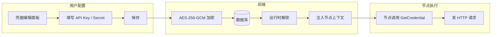

# 凭据系统

## 1. 凭据模型

凭据是全局存储、工作流引用的认证信息。典型凭据包括：

- API Key
- OAuth Token
- 数据库连接字符串
- 用户名/密码
- SSH 密钥


```mermaid
flowchart LR
    subgraph 用户配置
        UI[凭据编辑面板] --> Form[填写 API Key / Secret]
        Form --> Save[保存]
    end

    subgraph 后端
        Save --> Encrypt[AES-256-GCM 加密]
        Encrypt --> DB[(数据库)]
        DB --> Decrypt[运行时解密]
        Decrypt --> Context[注入节点上下文]
    end

    subgraph 节点执行
        Context --> Node[节点调用 GetCredential]
        Node --> Api[发 HTTP 请求]
    end
```

## 2. 数据模型

```csharp
public class Credential
{
    public Guid Id { get; set; }
    public string Name { get; set; }
    public string Type { get; set; } // "apiKey", "oauth2", "basicAuth", "connectionString"...
    public Dictionary<string, EncryptedField> Data { get; set; }

    /// <summary>
    /// 加密时使用的密钥版本，用于密钥轮换。
    /// </summary>
    public string KeyVersion { get; set; }

    public DateTime CreatedAt { get; set; }
    public DateTime? UpdatedAt { get; set; }
}

public class EncryptedField
{
    /// <summary>
    /// 加密后的字节数组，以 base64 或 hex 存储。
    /// </summary>
    public string CipherText { get; set; }
    public string Nonce { get; set; }
    public string Tag { get; set; }

    /// <summary>
    /// 原始数据是否为二进制（如 SSH 私钥）。
    /// 为 true 时，解密后按 byte[] 返回；为 false 时按 UTF-8 字符串返回。
    /// </summary>
    public bool IsBinary { get; set; }
}
```

### 2.1 凭据类型注册表

`Credential` 的 `Type` 不再只是任意字符串，而是由 `ICredentialTypeRegistry` 管理的类型名。注册表保存每种凭据类型的字段 schema，用于后端校验、CLI 本地校验与前端表单渲染。

```csharp
public interface ICredentialTypeRegistry
{
    IReadOnlyCollection<CredentialTypeDefinition> GetAll();
    CredentialTypeDefinition? Get(string type);
    bool IsKnown(string type);
    ValidationResult Validate(string type, Dictionary<string, string> fields);
}

public sealed class CredentialTypeDefinition
{
    public string Name { get; }
    public string DisplayName { get; }
    public IReadOnlyList<CredentialFieldDefinition> Fields { get; }
}

public sealed class CredentialFieldDefinition
{
    public string Name { get; }
    public string DisplayName { get; }
    public bool IsRequired { get; }
    public bool Secret { get; }
    public string? Hint { get; }
}
```

`ValidationResult` 返回成功或带可读提示的失败信息。创建/更新凭据时，`CredentialService` 调用注册表校验必填字段；CLI `credential create --type` 与 `credential types` 也复用同一内置 schema（后端注册表与 CLI 本地清单保持一致）。

内置凭据类型及字段：

| 类型               | 字段               | 必填 | 敏感                            |
| ------------------ | ------------------ | ---- | ------------------------------- |
| `apiKey`           | `apiKey`           | 是   | 是                              |
| `connectionString` | `connectionString` | 是   | 是                              |
| `basicAuth`        | `username`         | 是   | 否                              |
|                    | `password`         | 是   | 是                              |
| `oauth2`           | `tokenUrl`         | 是   | 否                              |
|                    | `clientId`         | 是   | 否                              |
|                    | `clientSecret`     | 是   | 是                              |
|                    | `scope`            | 否   | 否                              |
|                    | `grant`            | 否   | 否（默认 `client_credentials`） |
|                    | `tokenPath`        | 否   | 否（默认 `access_token`）       |

## 3. 加密方案

- 使用 **AES-256-GCM** 加密凭据值。
- 加密密钥通过环境变量或外部密钥管理服务（KMS）注入，不存储在数据库。
- 每个凭据字段使用独立 nonce。
- 前端永远看不到明文凭据值，只能看到凭据名称和类型。

### 3.1 加密流程

1. 生成 12 字节随机 nonce。
2. 使用 AES-256-GCM 加密明文，输出密文 + 16 字节认证标签。
3. nonce、密文、标签均以 hex 存储。

解密时反向操作，nonce 和标签用于完整性校验。

## 4. 运行时注入

节点通过参数定义声明自己需要哪种凭据：

```csharp
new ParameterDefinition
{
    Name = "apiCredential",
    Type = ParameterType.Credential,
    CredentialType = "apiKey"
}
```

用户在前端选择一个凭据，保存时只保存凭据 ID。运行时引擎解密凭据并注入上下文：

```csharp
public interface ICredentialAccessor
{
    Task<CredentialValue> GetCredentialAsync(Guid credentialId, CancellationToken cancellationToken = default);

    // 按名称获取（可选实现，供 dry-run 等临时凭据场景使用），未找到返回 null
    Task<CredentialValue?> GetCredentialByNameAsync(string name, CancellationToken cancellationToken = default);
}
```

`CredentialValue` 的字段定义见 [terminology.md#核心数据模型](terminology.md#核心数据模型)。节点在执行时使用（异步）：

```csharp
public async Task<NodeExecutionResult> ExecuteAsync(NodeExecutionContext context)
{
    var credential = await context.Credentials.GetCredentialAsync(
        Guid.Parse(context.RawParameters["apiCredential"].ToString()));

    var apiKey = credential.Fields["apiKey"];
    // 发请求...
}
```

### 4.1 OAuth2 令牌生命周期

`oauth2` 凭据由 `OAuth2TokenService` 统一托管令牌获取、缓存、刷新与错误重试。令牌按 `credentialName + tokenUrl + scope + grantType` 生成缓存键持久缓存，跨执行复用，避免每次运行都请求 token。

```csharp
public interface IOAuth2TokenService
{
    Task<OAuth2TokenResponse> GetTokenAsync(OAuth2TokenRequest request, CancellationToken ct = default);
    Task<OAuth2TokenResponse> GetOrRefreshTokenAsync(string cacheKey, OAuth2TokenRequest request, CancellationToken ct = default);
}

public class OAuth2TokenRequest
{
    public string TokenUrl { get; set; } = string.Empty;
    public string ClientId { get; set; } = string.Empty;
    public string ClientSecret { get; set; } = string.Empty;
    public string? Scope { get; set; }
    public string GrantType { get; set; } = "client_credentials";
    public string? TokenPath { get; set; } // 默认 access_token
    public Dictionary<string, string?>? ExtraParameters { get; set; }
}

public class OAuth2TokenResponse
{
    public string AccessToken { get; set; } = string.Empty;
    public string TokenType { get; set; } = "Bearer";
    public long? ExpiresIn { get; set; }
    public string? RefreshToken { get; set; }
    public string? Scope { get; set; }
    public JsonNode? Raw { get; set; }
}
```

生命周期行为：

- **首次获取**：按 `client_credentials` 向 `tokenUrl` 发送 `application/x-www-form-urlencoded` 请求，从 `tokenPath`（默认 `access_token`）提取令牌。
- **缓存**：结果存入内存缓存；缓存键为 `ComputeCacheKey(credentialName, tokenUrl, scope, grantType)` 的 SHA-256 前 16 位。
- **刷新**：调用 `GetOrRefreshTokenAsync` 时，若缓存命中且未到达 `ExpiresAt - RefreshBufferSeconds`，直接返回；否则重新获取并覆盖缓存。
- **重试**：`GetTokenAsync` 对 `HttpRequestException` 与非主动取消的 `TaskCanceledException` 按指数退避重试，默认 `MaxRetries = 3`，延迟分别为 1s / 2s / 4s；4xx 业务错误不重试。

`OAuth2CredentialAccessor` 包装 `ICredentialAccessor`，在解析 `oauth2` 凭据时自动调用令牌服务，并把返回的 `accessToken`、`tokenType`、`expiresAt` 注入凭据字段字典。因此表达式中可直接使用：

```
$credentials.myOAuth2.accessToken
```

`httpRequest` 节点也可以选择 `Authentication = BearerToken` 并引用 oauth2 凭据，由节点自动附加 `Authorization: Bearer <accessToken>` 头。

## 5. 安全红线

- **凭据值不落日志**：日志中只记录凭据 ID，不记录明文值。
- **凭据值不返回前端**：API 响应中只返回凭据名称、类型、创建时间。
- **凭据值不落入异常信息**：异常中不得包含 API Key、密码等敏感内容。
- **加密密钥不硬编码**：密钥通过环境变量或 KMS 获取。
- **最小权限原则**：节点只能访问自己被授权的凭据。

## 6. 凭据使用范围

| 场景                           | 处理方式                                   |
| ------------------------------ | ------------------------------------------ |
| 同一工作流多个节点引用同一凭据 | 凭据 ID 保存在工作流定义中，运行时统一解密 |
| 多个工作流共享凭据             | 凭据全局存储，按 ID 引用                   |
| 凭据更新                       | 更新后立即生效，下次执行使用新值           |
| 凭据删除                       | 删除前检查是否有工作流引用，避免执行失败   |

### 6.3 表达式中的凭据访问

执行上下文工厂在创建节点上下文时预加载节点参数中引用的凭据，并注入为 `$credentials` 全局变量。`$credentials` 是一个两层字典：凭据名称 → 字段名 → 解密后的字段值。

```csharp
// 节点执行上下文中
js.SetValue("$credentials", credentialsDict);
```

在节点参数表达式中，使用 `$` 前缀内建变量访问：

```
$credentials.db.connectionString
$credentials.myOAuth2.accessToken
```

`OAuth2CredentialAccessor` 保证 `$credentials.myOAuth2.accessToken` 返回的是已缓存/刷新后的有效令牌，节点无需自己处理 token 生命周期。

## 6.1 密钥轮换

凭据系统支持密钥轮换，降低单一密钥长期使用的风险：

- 每个 `Credential` 记录加密时使用的 `KeyVersion`。
- 解密时根据 `KeyVersion` 从密钥仓库中找到对应密钥。
- 轮换流程：
  1. 生成新主密钥，标记为新版本（如 `v2`）。
  2. 后台任务扫描所有 `KeyVersion != "v2"` 的凭据记录。
  3. 用旧版本密钥解密，再用新版本密钥重新加密。
  4. 更新记录的 `KeyVersion` 为 `v2`。
  5. 旧版本密钥保留一段时间，用于解密未及时轮换的记录。

## 6.2 凭据访问审计

节点每次访问凭据都会生成审计事件 `Credential.Accessed`：

```csharp
public class CredentialAccessedEvent : AuditEvent
{
    public Guid CredentialId { get; set; }
    public Guid ExecutionId { get; set; }

    /// <summary>
    /// 访问凭据的节点定义 ID，对应 <see cref="NodeDefinition.Id"/>。
    /// </summary>
    public Guid NodeDefinitionId { get; set; }

    public string AccessType { get; set; } // "read"
}
```

- 审计事件中只记录凭据 ID，不记录明文值。
- 关键操作（凭据访问、凭据删除）同步刷盘或写入高可靠通道。
- 凭据访问日志用于合规审计和异常检测。

## 7. 凭据类型扩展

1. 定义凭据字段 schema（哪些字段、是否加密）。
2. 前端根据 schema 渲染凭据编辑表单。
3. 后端校验字段并加密敏感字段。
4. 节点通过 `CredentialType` 限制可选择的凭据类型。
