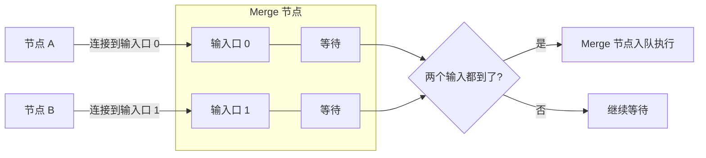

# 工作流执行流程

## 1. 执行引擎的职责

执行引擎是 Flow Engine 的核心。它负责：

- 加载工作流定义并构建可执行图。
- 找到入口节点并入队。
- 按 FIFO 顺序从执行队列中取出节点执行。
- 处理多输入节点的等待逻辑。
- 解析参数、求值表达式、注入凭据。
- 处理节点错误：重试、继续执行、终止。
- 记录执行结果并路由到下游节点。
- 向前端推送执行事件。

## 2. 执行上下文

每次节点执行时，引擎都会构造一个执行上下文：

```csharp
public class NodeExecutionContext
{
    /// <summary>
    /// 当前工作流定义
    /// </summary>
    public Workflow Workflow { get; set; }

    /// <summary>
    /// 当前执行 ID
    /// </summary>
    public Guid ExecutionId { get; set; }

    /// <summary>
    /// 当前节点定义（由 NodeInstance 结合节点类型元数据转换而来）
    /// </summary>
    public NodeDefinition Node { get; set; }

    /// <summary>
    /// 当前运行索引
    /// </summary>
    public int RunIndex { get; set; }

    /// <summary>
    /// 输入数据批次，按端口名组织
    /// </summary>
    public IReadOnlyDictionary<string, DataBatch> Inputs { get; set; }

    /// <summary>
    /// 参数原始值（未经表达式求值）
    /// </summary>
    public IReadOnlyDictionary<string, object> RawParameters { get; set; }

    /// <summary>
    /// 凭据访问器
    /// </summary>
    public ICredentialAccessor Credentials { get; set; }

    /// <summary>
    /// 日志记录器
    /// </summary>
    public ILogger Logger { get; set; }

    /// <summary>
    /// 取消令牌
    /// </summary>
    public CancellationToken CancellationToken { get; set; }
}
```

## 3. 整体执行循环

执行队列采用 FIFO。**拓扑序仅用于初始化入队**（决定哪些入口节点先进入队列），运行时由数据就绪驱动：节点出队后执行，执行结果路由到下游节点，下游节点在输入到齐后再次入队。

MVP 默认单线程消费队列，保证简单和可预测性；同一执行内的多条分支按入队顺序交错执行。未来通过 `Channel<T>` + 多 worker 实现分支并行与多执行并发。

```mermaid
flowchart TD
    Start([触发执行]) --> Init[初始化执行数据]
    Init --> FindEntry[找入口节点定义<br/>显式 IsEntry=true]
    FindEntry --> EnqueueEntry[入队]

    Loop{执行队列为空?}
    Loop -->|否| Dequeue[出队一个节点]
    Dequeue --> CheckMulti{多输入节点?}

    CheckMulti -->|是| Wait{所有输入到齐?}
    Wait -->|否| Skip[跳过, 等下次]
    Skip --> Loop
    Wait -->|是| CreateCtx[创建上下文]

    CheckMulti -->|否| CreateCtx

    CreateCtx --> ResolveParams[解析参数<br/>含 {{ }} 表达式求值]
    ResolveParams --> DecryptCred[解密凭据<br/>如需要]
    DecryptCred --> CheckMode{节点 ExecutionMode}
    CheckMode -->|OnceForAll| Execute[调用节点 ExecuteAsync]
    CheckMode -->|OncePerItem| Iterate[对 DataBatch 逐条迭代]
    Iterate --> Execute

    Execute --> Errors{有错误?}

    Errors -->|是| RetryMode{配置了重试?}
    RetryMode -->|是| Retry[等待 → 重试]
    Retry --> Execute
    RetryMode -->|否| ContinueMode{配置了继续执行?}
    ContinueMode -->|是| InsertError[注入错误数据项]
    ContinueMode -->|否| Stop[终止执行, 记录错误]
    Stop --> Done([结束])

    InsertError --> Record
    Errors -->|否| Record[记录执行结果]

    Record --> Route[路由到下游节点]
    Route --> Single{下游节点<br/>有几个输入?}
    Single -->|1个| Direct[直接入队]
    Single -->|多个| CheckFilled{这个输入<br/>是最后一个?}
    CheckFilled -->|否| WaitMarker[等待区标记]
    CheckFilled -->|是| EnqueueDownstream[入队]
    Direct --> Loop
    WaitMarker --> Loop
    EnqueueDownstream --> Loop
    Loop -->|是| Done
```

## 4. 入口节点识别

入口节点必须**显式声明**，不能通过"没有输入连接"反推。以下情况都需要显式标记：

- 触发器节点天然是入口节点。
- 普通节点即使无输入连接，若未被标记为入口，也不应启动。
- Merge 节点的可选输入端口未连线时，不会被误判为入口。

```csharp
public class NodeDefinition
{
    public Guid Id { get; set; }
    public string TypeName { get; set; }
    public bool IsEntry { get; set; }
    public Dictionary<string, object> Parameters { get; set; }
}

var entryNodes = workflowDefinition.Nodes
    .Where(n => n.IsEntry || registry.Get(n.TypeName).DefaultIsEntry)
    .ToList();
```

`DefaultIsEntry` 由节点类型自身声明：触发器节点返回 `true`，普通节点返回 `false`。

## 5. 多输入等待机制

### 5.1 场景

Merge、Join 等节点有多个输入端口，必须等所有输入端口都收到数据后才执行。



### 5.2 等待区实现思路

引擎按**执行实例**维护独立的等待区（Waiting Area），不同执行之间互不干扰。等待区必须线程安全，因为同一工作流的多个执行可并发运行：

```csharp
public class WaitingArea
{
    // Key: (ExecutionId, 目标节点定义 Id)
    // Value: 该节点已收到的输入端口 -> 数据批次
    private readonly ConcurrentDictionary<(Guid ExecutionId, Guid NodeDefinitionId),
        Dictionary<string, DataBatch>> _states = new();

    // 记录最近一次活动时间，用于滑动窗口超时检测
    private readonly ConcurrentDictionary<(Guid ExecutionId, Guid NodeDefinitionId),
        DateTime> _lastActivityTimes = new();

    private readonly TimeSpan _inputWaitTimeout = TimeSpan.FromMinutes(5);

    public void Receive(Guid executionId, Guid nodeDefinitionId, string portName, DataBatch data);
    public bool IsReady(Guid executionId, Guid nodeDefinitionId, IEnumerable<string> requiredPorts);
    public bool IsTimeout(Guid executionId, Guid nodeDefinitionId);
    public IEnumerable<(Guid ExecutionId, Guid NodeDefinitionId)> GetTimeoutKeys();
    public bool TryTake(Guid executionId, Guid nodeDefinitionId,
        out IReadOnlyDictionary<string, DataBatch> inputs);
    public void CancelWaiting(Guid executionId, Guid nodeDefinitionId);
}
```

**超时机制**：等待区为每个 `(ExecutionId, NodeDefinitionId)` 记录**最近一次活动时间**（滑动窗口）。引擎主循环每次迭代前调用 `GetTimeoutKeys()`，若超过 `InputWaitTimeout`（默认 5 分钟，可配置）未收到任何新输入，则按“输入缺失”错误处理：

- 生成 `NodeError { Code = "InputTimeout", Message = "等待输入超时" }`。
- 调用该节点的错误处理策略（终止/继续/重试）。
- 调用 `CancelWaiting` 从等待区移除该条目，避免永久挂起。

**孤儿条目清理**：引擎后台任务定期扫描 `_lastActivityTimes`，对于已不存在对应执行实例的条目（如执行被取消或完成但等待区未清理），直接移除。

**同端口多连接合并策略**：仅对**普通数据端口**生效。若多个上游节点连接到同一个目标输入端口，引擎先将各上游输出合并为一个 `DataBatch`，再调用 `Receive`。合并规则默认按上游节点执行顺序追加 `DataItem`，并为合并后的数据项重新分配连续的 `SourceIndex`（从 0 开始），保留原始 `SourceIndex` 作为元数据供调试使用。

**分支节点输出端口不参与合并**：If / Switch 等分支节点的输出端口每次只会有一个分支产生数据，引擎直接将该分支数据放入等待区，不做合并。

### 5.3 入队条件

- 如果下游节点只有一个输入端口：上游节点执行完直接将该下游节点入队。
- 如果下游节点有多个输入端口：
  - 把当前输出放入等待区。
  - 检查等待区是否已收集齐所有必需输入。
  - 齐了则取出所有输入，构造上下文并入队。
  - 没齐则继续等待，或等待超时/上游终止后触发错误处理。

## 6. 错误处理策略

每个节点可以配置错误处理策略：

| 策略     | 行为                                                       |
| -------- | ---------------------------------------------------------- |
| **终止** | 节点失败后立即停止整个执行                                 |
| **继续** | 节点失败后，向输出注入一条带错误信息的数据项，继续执行下游 |
| **重试** | 失败后按指数退避重试 N 次，仍失败则按上述策略处理          |

节点执行统一返回 `NodeExecutionResult`，由引擎根据 `Success` 字段判断是否需要错误处理。节点本身不抛异常，所有错误信息封装在 `NodeError` 中。

### 6.1 重试逻辑

`maxRetries` 表示**额外重试次数**，总执行次数为 `1 + maxRetries`。

```csharp
for (int attempt = 0; attempt <= maxRetries; attempt++)
{
    result = await node.ExecuteAsync(context);
    if (result.Success || attempt == maxRetries) break;

    var delay = CalculateBackoff(attempt, node.RetryPolicy);
    await Task.Delay(delay, context.CancellationToken);
}
```

重试间隔采用指数退避 + 随机抖动（jitter），`BaseDelay` 默认 2^attempt 秒，受 `MaxDelay`（默认 60 秒）上限约束。

### 6.2 继续执行模式

继续执行时，引擎生成一个包含错误信息的数据项：

```csharp
new DataItem
{
    Success = false,
    Error = new NodeError
    {
        Message = result.Error.Message,
        Code = result.Error.Code,
        NodeDefinitionId = context.Node.Id,
        Details = result.Error.Details,
        StackTrace = result.Error.StackTrace
    }
}
```

下游节点可通过 `{{ input.success }}` 或 `{{ input.error }}` 判断是否出错。

## 7. 补偿与 Saga 模式

当节点执行了具有副作用的操作（如扣款、发送邮件、创建订单）后失败，单纯的“终止”或“继续”无法消除已造成的影响。此时需要**补偿（Compensation）**机制，即执行相反操作把系统状态回滚。

### 7.1 补偿节点接口

补偿是可选能力。节点类型可实现 `ICompensatableNodeType`：

```csharp
public interface ICompensatableNodeType : INodeType
{
    /// <summary>
    /// 执行补偿逻辑，撤销本节点造成的影响
    /// </summary>
    Task<NodeExecutionResult> CompensateAsync(
        NodeExecutionContext context,
        NodeExecutionRecord originalRecord,
        CancellationToken cancellationToken = default);
}
```

- `originalRecord`：该节点原始执行的输入、输出、参数等上下文，用于定位需要撤销的操作。
- 补偿节点本身也应返回 `NodeExecutionResult`，补偿失败按错误策略处理。

### 7.2 补偿触发时机

1. **执行失败时自动补偿**：当节点错误策略为“终止”时，引擎沿执行路径反向查找**已实现 `ICompensatableNodeType` 且已成功执行的节点**，依次调用其 `CompensateAsync`。
2. **人工触发补偿**：管理员根据执行记录选择“回滚本次执行”。
3. **Saga 编排补偿**：在显式声明 Saga 边界的工作流中，某个步骤失败时自动触发该 Saga 内所有前置步骤的补偿。

Saga 边界通过节点参数声明。例如，在普通节点上设置 `SagaId` 参数，相同 `SagaId` 的节点属于同一个 Saga：

```json
{
  "id": "n2",
  "typeName": "deductBalance",
  "parameters": {
    "sagaId": "order-payment",
    "sagaOrder": 1
  }
}
```

当 Saga 内任意节点失败时，引擎只补偿该 Saga 内已成功执行的前置节点，不影响其他 Saga 或 Saga 外的节点。

**Saga 约束**：

- `sagaOrder` 必须为正整数。
- **串行步骤**：同一 `SagaId` 内串行执行的节点，`sagaOrder` 严格递增（不要求连续，便于编辑时插入节点）。工作流保存时校验重复。引擎在入队时保证 `sagaOrder` 小的节点先执行。
- **并行分支**：若业务需要 Saga 内并行分支，则并行分支的节点可共享同一 `sagaOrder`；补偿时按**完成时间逆序**执行，先完成的先补偿。
- **补偿基于最后一次成功执行记录**：节点重试 N 次后失败，补偿时使用最后一次成功执行的 `NodeExecutionRecord` 作为 `originalRecord`。若节点从未成功执行过，则无需补偿。
- **补偿重试策略**：补偿节点执行失败时，按该补偿节点自身的 `RetryPolicy` 重试；达到最大重试次数后进入 `CompensationFailed` 状态。`CompensationFailed` 不是终态，支持管理员人工干预后重试指定补偿节点，或标记为已忽略。

### 7.3 补偿执行顺序

补偿必须按**与执行相反的顺序**进行：

```
执行顺序: A → B → C → D（D 失败）
补偿顺序: C.compensate → B.compensate → A.compensate
```

引擎从执行记录中重建已执行节点列表，逆序调用补偿。

### 7.4 与“继续执行”策略的区别

| 策略     | 作用                         | 副作用                   |
| -------- | ---------------------------- | ------------------------ |
| 继续执行 | 注入错误数据项，让下游继续跑 | 不消除已造成的影响       |
| 补偿     | 调用反向操作，撤销影响       | 需要节点显式实现补偿逻辑 |

补偿不是默认行为，只适用于有副作用且可撤销的节点。

### 7.5 失败节点自身的副作用

上述补偿机制针对**已执行成功**的节点。失败节点在返回错误前可能已经产生部分副作用（例如扣款请求已发出但响应超时）。这种情况由节点自身处理：

- 如果失败节点实现了 `ICompensatableNodeType`，引擎也会调用其 `CompensateAsync`，由节点自己判断并撤销已产生的部分副作用。
- 如果失败节点未实现补偿接口，则这部分副作用无法通过引擎自动回滚，需人工介入或业务兜底。

### 7.6 持久化要求

为了让补偿可靠，执行记录必须保存：

- 节点原始输入/输出。
- 节点执行时的参数原始值与解析后值。
- 节点生成的外部标识（如订单号、支付流水号）。
- 节点执行时间戳，用于补偿时判断操作是否仍有效（如超过退款期限）。

## 8. 控制流节点执行语义

控制流节点不直接产生业务数据，而是影响执行队列的入队顺序。它们通过 `BranchIndex` 或特殊输出端口实现分支/循环/子工作流。

### 8.1 分支节点（If / Switch）

- **If 节点**：有两个输出分支，分别对应 `true` 和 `false`。执行后根据条件结果将数据路由到其中一个分支的下游节点。
- **Switch 节点**：有多个输出分支，根据条件匹配结果选择一条分支路由。

```csharp
public class NodeExecutionResult
{
    public bool Success { get; set; }
    public DataBatch Output { get; set; }
    public NodeError Error { get; set; }

    /// <summary>
    /// 分支索引，用于 If/Switch 等分支节点选择下游分支。
    /// </summary>
    public int? BranchIndex { get; set; }
}
```

引擎根据 `BranchIndex` 找到对应输出端口的连接，将数据入队到下游节点。

### 8.2 循环节点（Loop）

Loop 节点需要反复执行其循环体内的节点。实现方式：

- Loop 节点输出一个特殊的 `LoopControl` 数据项，标记当前迭代索引和是否继续循环。
- 引擎检测到 `LoopControl.Continue` 为 `true` 时，将循环体入口节点重新入队，并把当前迭代数据一并传入。
- 当 `LoopControl.Continue` 为 `false` 时，引擎将循环后的下游节点入队，退出循环。

Loop 节点自身返回的数据项包含：

```csharp
public class LoopControl
{
    public bool Continue { get; set; }
    public int IterationIndex { get; set; }
    public object NextItem { get; set; }
}
```

**循环执行记录模型**：

- Loop 节点每次迭代生成一条 `NodeExecutionRecord`，`RunIndex` 对应该次迭代索引（从 0 开始）。
- 循环体内部的节点每次迭代也生成独立的 `NodeExecutionRecord`，`RunIndex` 同样对应迭代索引。
- 引擎通过 `LoopControl.IterationIndex` 将同一迭代的记录关联起来。
- 循环退出后，Loop 节点的最终 `Output` 汇总所有迭代结果，作为下游节点的输入。

### 8.3 子工作流节点（SubWorkflow）

子工作流节点调用另一个工作流定义作为当前执行的一部分：

- 引擎为子工作流创建一个新的 `ExecutionRecord`，但 `ParentExecutionId` 指向当前执行。
- 子工作流执行完成后，其最终输出作为子工作流节点的 `Output` 返回给上游节点。
- 子工作流节点支持两种模式：
  - **同步阻塞**：当前执行等待子工作流完成后继续。
  - **异步触发**：子工作流独立运行，当前节点只返回触发结果。

子工作流失败时，错误传播策略由父工作流节点的错误处理配置决定。

## 9. 执行状态机

一次工作流执行可处于以下状态：

```
Pending → Running → Completed
              ↓
          Failed / Cancelled
              ↓
      Compensating → CompensationFailed
              ↓
          Compensated
```

| 状态                 | 含义                   |
| -------------------- | ---------------------- |
| `Pending`            | 已触发，等待引擎调度   |
| `Running`            | 正在执行               |
| `Completed`          | 所有可执行节点已完成   |
| `Failed`             | 发生不可恢复错误       |
| `Cancelled`          | 被用户或系统取消       |
| `Compensating`       | 执行失败后正在执行补偿 |
| `Compensated`        | 补偿成功完成           |
| `CompensationFailed` | 补偿过程中又发生错误   |

当执行失败且需要补偿时，状态从 `Failed` 转入 `Compensating`；所有补偿节点成功执行后转入 `Compensated`；任一补偿节点失败则转入 `CompensationFailed`，并记录失败的补偿节点。

## 10. 执行记录

每次执行都会生成执行记录：

```csharp
public class ExecutionRecord
{
    public Guid Id { get; set; }

    /// <summary>
    /// 工作流定义 ID，对应 <see cref="Workflow.Id"/>。
    /// </summary>
    public Guid WorkflowDefinitionId { get; set; }
    public DateTime StartedAt { get; set; }
    public DateTime? CompletedAt { get; set; }
    public ExecutionStatus Status { get; set; }
    public List<NodeExecutionRecord> NodeRecords { get; set; }
}

public class NodeExecutionRecord
{
    /// <summary>
    /// 节点定义 ID，对应 <see cref="NodeDefinition.Id"/>。
    /// </summary>
    public Guid NodeDefinitionId { get; set; }

    public int RunIndex { get; set; }
    public DateTime StartedAt { get; set; }
    public DateTime? CompletedAt { get; set; }

    /// <summary>
    /// 按端口名组织的输入数据，多输入节点每个端口对应一个 DataBatch。
    /// </summary>
    public IReadOnlyDictionary<string, DataBatch> Inputs { get; set; }

    public NodeExecutionResult Output { get; set; }

    /// <summary>
    /// 节点参数原始值（未经表达式求值）
    /// </summary>
    public IReadOnlyDictionary<string, object> RawParameters { get; set; }

    /// <summary>
    /// 节点参数解析后的值（表达式已求值）
    /// </summary>
    public IReadOnlyDictionary<string, object> ResolvedParameters { get; set; }
}
```

## 11. 并发与取消

- 同一工作流的多个执行可并发运行，互不影响。
- 执行支持 `CancellationToken`，用户可在前端点击“停止”。
- 长时间运行的节点必须定期检查 `CancellationToken.IsCancellationRequested`。
