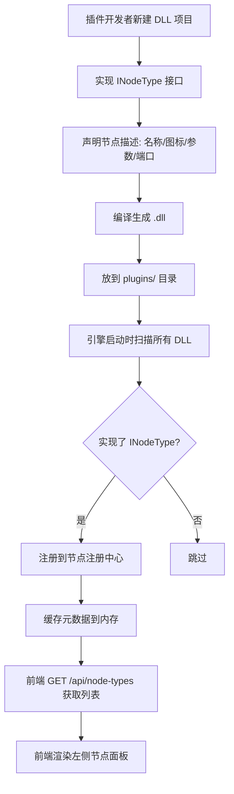
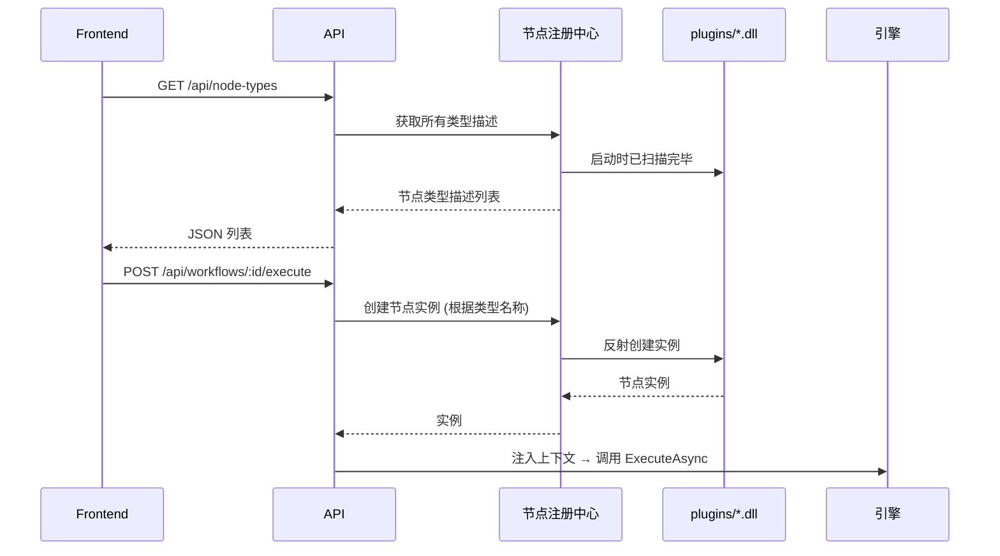

# 节点系统

## 1. 节点是什么

节点是 Flow Engine 中的最小执行单元。每个节点类型封装一种能力，例如：

- `HTTP Request`：发起 HTTP 请求
- `Code`：执行用户编写的代码片段
- `If`：根据条件分支
- `Postgres`：查询或写入 PostgreSQL 数据库

节点类型通过 DLL 插件提供，引擎启动时扫描 `plugins/` 目录完成注册。

## 2. 节点接口设计

一个节点类型至少需要实现以下接口：

```csharp
public interface INodeType
{
    /// <summary>
    /// 节点类型的唯一标识，如 "httpRequest"
    /// </summary>
    string TypeName { get; }

    /// <summary>
    /// 显示名称，如 "HTTP Request"
    /// </summary>
    string DisplayName { get; }

    /// <summary>
    /// 节点分类，如 "Core", "Data", "AI"
    /// </summary>
    string Category { get; }

    /// <summary>
    /// 节点图标，前端使用
    /// </summary>
    string Icon { get; }

    /// <summary>
    /// 执行模式：对整个批次执行一次，还是对每条数据项分别执行
    /// </summary>
    ExecutionMode ExecutionMode { get; }

    /// <summary>
    /// 参数定义列表，前端据此渲染配置面板
    /// </summary>
    IReadOnlyList<ParameterDefinition> Parameters { get; }

    /// <summary>
    /// 端口定义列表，决定节点有哪些输入/输出
    /// </summary>
    IReadOnlyList<PortDefinition> Ports { get; }

    /// <summary>
    /// 执行节点逻辑
    /// </summary>
    Task<NodeExecutionResult> ExecuteAsync(
        NodeExecutionContext context,
        CancellationToken cancellationToken = default);
}

public enum ExecutionMode
{
    /// <summary>
    /// 对整个 DataBatch 执行一次。节点内部自行决定如何迭代。
    /// </summary>
    OnceForAll,

    /// <summary>
    /// 对 DataBatch 中每条 DataItem 分别执行一次，引擎负责迭代。
    /// </summary>
    OncePerItem
}
```

### 2.1 端口与参数定义

`PortDefinition` 与 `ParameterDefinition` 的完整字段定义见 [terminology.md#核心数据模型](terminology.md#核心数据模型)。节点实现时遵循以下约定：

- **主输入端口**默认名称为 `input`。
- **主输出端口**默认名称为 `output`。
- 普通节点至少包含 `input`（输入）和 `output`（输出）两个主数据端口。
- 触发器节点没有输入端口，只有输出端口。
- 供应节点（如 LLM 供应节点）使用 `PortType.LLMSupply` 类型端口，方向为 `Output`，不返回数据项，而是向父节点提供模型运行时对象。

### 2.2 执行结果

```csharp
public class NodeExecutionResult
{
    /// <summary>
    /// 执行是否成功
    /// </summary>
    public bool Success { get; set; }

    /// <summary>
    /// 输出数据批次
    /// </summary>
    public DataBatch Output { get; set; }

    /// <summary>
    /// 错误信息，Success 为 false 时填充
    /// </summary>
    public NodeError Error { get; set; }

    /// <summary>
    /// 分支索引，用于 If/Switch 等分支节点
    /// </summary>
    public int? BranchIndex { get; set; }
}
```

## 3. 节点类型注册流程



### 3.1 注册中心职责

- 扫描 `plugins/` 目录下的 DLL 文件。
- 使用反射查找实现了 `INodeType` 的类。
- 实例化一次以读取元数据，然后缓存。
- 提供按类型名创建实例的能力。
- 处理 DLL 加载异常，避免一个插件失败导致整个系统崩溃。

### 3.2 DLL 加载技术要点

- 使用独立的 `AssemblyLoadContext` 加载插件 DLL，避免与主程序依赖冲突。
- 插件 DLL 应自包含依赖，或明确声明需要主程序提供哪些共享库。
- 加载失败时记录警告日志，不影响主程序启动。

## 4. 参数定义驱动 UI

每个节点类型的参数定义是一个声明式数组，不包含任何渲染逻辑。

### 4.1 参数定义示例

```csharp
new ParameterDefinition
{
    Name = "method",
    DisplayName = "请求方法",
    Type = ParameterType.Options,
    Options = new[] { "GET", "POST", "PUT", "DELETE" },
    DefaultValue = "GET"
},
new ParameterDefinition
{
    Name = "url",
    DisplayName = "URL",
    Type = ParameterType.String,
    Required = true
},
new ParameterDefinition
{
    Name = "body",
    DisplayName = "请求体",
    Type = ParameterType.Json,
    DisplayRule = new DisplayRule
    {
        Condition = "{{ parameter.method }} == 'POST' || {{ parameter.method }} == 'PUT'",
        Dependencies = new[] { "method" }
    }
}
```

### 4.2 条件显示规则

条件显示规则允许参数根据其他参数的值动态显示或隐藏：

- `Condition`：一个表达式，返回布尔值。
- `Dependencies`：明确依赖哪些参数，变化时重新求值。
- 前端缓存表达式结果，避免频繁求值。

### 4.3 参数定义字段说明

| 字段 | 说明 |
|------|------|
| `Name` | 参数唯一标识，节点内唯一。 |
| `DisplayName` | 前端显示名称。 |
| `Type` | 参数类型，见前端渲染映射表。 |
| `DefaultValue` | 默认值。 |
| `Required` | 是否必填。 |
| `ValidationRules` | 校验规则列表，如非空、正则、范围等。 |
| `DisplayRule` | 条件显示规则。 |
| `CredentialType` | 当 `Type == Credential` 时，限制可选择的凭据类型，如 `apiKey`、`oauth`。 |
| `Options` | 当 `Type == Options` 时的可选项列表。 |

完整字段定义见 [terminology.md#核心数据模型](terminology.md#核心数据模型)。

### 4.4 前端渲染映射

| 参数类型 | 前端渲染组件 |
|----------|--------------|
| `String` | 文本输入框 |
| `Number` | 数字输入框 |
| `Boolean` | 开关 |
| `Options` | 下拉选择 |
| `Json` | JSON 编辑器 |
| `Code` | 代码编辑器 |
| `Credential` | 凭据选择器 |
| `Resource` | 资源选择器 |

## 5. 节点分类

| 分类 | 说明 | 示例 |
|------|------|------|
| `Core` | 核心控制流节点 | `If`、`Loop`、`Merge` |
| `Data` | 数据读写节点 | `Postgres`、`MySQL`、`Redis` |
| `HTTP` | 网络请求节点 | `HTTP Request`、`Webhook` |
| `AI` | AI 相关节点 | `Agent`、`LLM`、`Prompt` |
| `Trigger` | 触发器节点 | `Schedule Trigger`、`Webhook Trigger` |
| `Utility` | 工具节点 | `Code`、`Set`、`Filter` |

## 6. 冷启动加载流程



## 7. 节点实例化注意事项

- 每次执行时创建新的节点实例，避免状态污染。
- 节点实例应是轻量的，不要在构造函数中做重初始化。
- 节点状态只应来自参数和上下文，不应依赖全局静态变量。

## 8. 节点开发规范

- 节点类型名全局唯一，使用小写驼峰或 snake_case。
- 参数名在节点内唯一，避免使用保留关键字。
- 节点执行失败时返回结构化的 `NodeError`，不要抛异常。
- 长时间运行的节点应支持 `CancellationToken`。

## 9. Dry Run 模拟执行

工作流执行可能有副作用（发邮件、扣款、写数据库）。调试时应支持 **Dry Run 模式**，不触发真实副作用：

```csharp
public interface IDryRunSupported : INodeType
{
    Task<NodeExecutionResult> ExecuteDryRunAsync(NodeExecutionContext context);
}
```

- 节点显式声明支持 Dry Run。
- Dry Run 时引擎调用 `ExecuteDryRunAsync`，节点返回模拟数据。
- 不支持 Dry Run 的节点在 Dry Run 模式下被跳过，并生成警告记录。
- Dry Run 结果同样生成 `ExecutionRecord`，状态为 `DryRunCompleted`，便于用户预览执行路径。

## 10. 端口输入/输出 Schema 校验

节点端口可声明 `OutputSchema`，下游节点可声明输入端口的 `ExpectedSchema`。引擎在以下时机校验：

- **设计期**：工作流保存时，校验连线两端端口的 Schema 是否兼容（可选，作为警告）。
- **运行期**：节点执行完成后，校验输出数据是否符合 `OutputSchema`；若不符合，按节点错误策略处理。

```csharp
public class PortDefinition
{
    public string Name { get; set; }
    public PortDirection Direction { get; set; }
    public PortType Type { get; set; }
    public DataSchema OutputSchema { get; set; }
    public DataSchema ExpectedSchema { get; set; }
}
```

- `OutputSchema`：本端口输出数据的结构声明。
- `ExpectedSchema`：连接到本端口的下游数据应满足的结构（用于设计期提示）。

运行期 Schema 校验失败时生成 `NodeError { Code = "SchemaMismatch" }`，帮助用户定位数据流问题。
