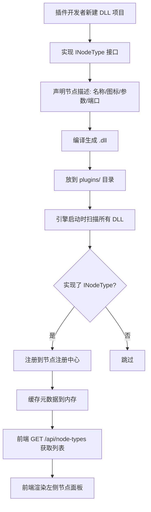
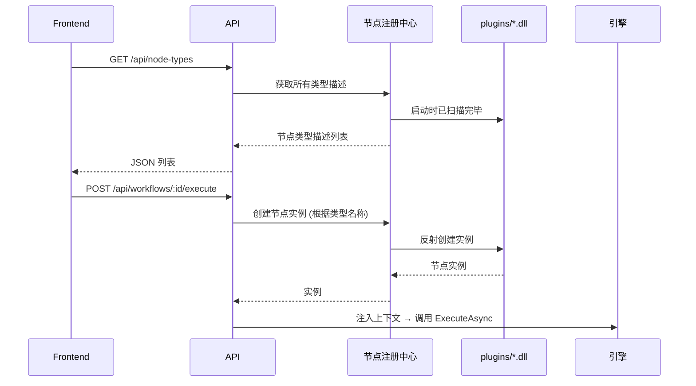

# 节点系统

## 1. 节点是什么

节点是 Flow Engine 中的最小执行单元。每个节点类型封装一种能力，例如：

- `HTTP Request`：发起 HTTP 请求
- `Code`：执行用户编写的代码片段
- `If`：根据条件分支
- `Postgres`：查询或写入 PostgreSQL 数据库

节点类型通过 DLL 插件提供，引擎启动时扫描 `plugins/` 目录完成注册。

## 2. 节点接口设计

一个节点类型至少需要实现以下接口：

```csharp
public interface INodeType
{
    /// <summary>
    /// 节点类型的唯一标识，如 "httpRequest"
    /// </summary>
    string TypeName { get; }

    /// <summary>
    /// 显示名称，如 "HTTP Request"
    /// </summary>
    string DisplayName { get; }

    /// <summary>
    /// 节点分类，如 "Core", "Data", "AI"
    /// </summary>
    string Category { get; }

    /// <summary>
    /// 节点图标，前端使用
    /// </summary>
    string Icon { get; }

    /// <summary>
    /// 执行模式：对整个批次执行一次，还是对每条数据项分别执行
    /// </summary>
    ExecutionMode ExecutionMode { get; }

    /// <summary>
    /// 参数定义列表，前端据此渲染配置面板
    /// </summary>
    IReadOnlyList<ParameterDefinition> Parameters { get; }

    /// <summary>
    /// 端口定义列表，决定节点有哪些输入/输出
    /// </summary>
    IReadOnlyList<PortDefinition> Ports { get; }

    /// <summary>
    /// 执行节点逻辑
    /// </summary>
    Task<NodeExecutionResult> ExecuteAsync(
        NodeExecutionContext context,
        CancellationToken cancellationToken = default);
}

public enum ExecutionMode
{
    /// <summary>
    /// 对整个 DataBatch 执行一次。节点内部自行决定如何迭代。
    /// </summary>
    OnceForAll,

    /// <summary>
    /// 对 DataBatch 中每条 DataItem 分别执行一次，引擎负责迭代。
    /// </summary>
    OncePerItem
}
```

### 2.1 端口与参数定义

`PortDefinition` 与 `ParameterDefinition` 的完整字段定义见 [terminology.md#核心数据模型](terminology.md#核心数据模型)。节点实现时遵循以下约定：

- **主输入端口**默认名称为 `input`。
- **主输出端口**默认名称为 `output`。
- 普通节点至少包含 `input`（输入）和 `output`（输出）两个主数据端口。
- 触发器节点没有输入端口，只有输出端口。
- 供应节点（如 LLM 供应节点）使用 `PortType.LLM` 类型端口，方向为 `Output`，不返回数据项，而是向父节点提供模型运行时对象。

### 2.2 执行结果

```csharp
public class NodeExecutionResult
{
    /// <summary>
    /// 执行是否成功
    /// </summary>
    public bool Success { get; set; }

    /// <summary>
    /// 输出数据批次
    /// </summary>
    public DataBatch Output { get; set; }

    /// <summary>
    /// 错误信息，Success 为 false 时填充
    /// </summary>
    public NodeError Error { get; set; }

    /// <summary>
    /// 分支索引，用于 If/Switch 等分支节点
    /// </summary>
    public int? BranchIndex { get; set; }
}
```

## 3. 节点类型注册流程


```mermaid
flowchart TD
    A[插件开发者新建 DLL 项目] --> B[实现 INodeType 接口]
    B --> C[声明节点描述: 名称/图标/参数/端口]
    C --> D[编译生成 .dll]
    D --> E[放到 plugins/ 目录]
    E --> F[引擎启动时扫描所有 DLL]
    F --> G{实现了 INodeType?}
    G -->|是| H[注册到节点注册中心]
    H --> I[缓存元数据到内存]
    I --> J[前端 GET /api/node-types 获取列表]
    J --> K[前端渲染左侧节点面板]
    G -->|否| L[跳过]
```

### 3.1 注册中心职责

- 扫描 `plugins/` 目录下的 DLL 文件。
- 使用反射查找实现了 `INodeType` 的类。
- 实例化一次以读取元数据，然后缓存。
- 提供按类型名创建实例的能力。
- 处理 DLL 加载异常，避免一个插件失败导致整个系统崩溃。

### 3.2 DLL 加载技术要点

- 使用独立的 `AssemblyLoadContext` 加载插件 DLL，避免与主程序依赖冲突。
- 插件 DLL 应自包含依赖，或明确声明需要主程序提供哪些共享库。
- 加载失败时记录警告日志，不影响主程序启动。

## 4. 参数定义驱动 UI

每个节点类型的参数定义是一个声明式数组，不包含任何渲染逻辑。

### 4.1 参数定义示例

```csharp
new ParameterDefinition
{
    Name = "method",
    DisplayName = "请求方法",
    Type = ParameterType.Options,
    Options = new[] { "GET", "POST", "PUT", "DELETE" },
    DefaultValue = "GET"
},
new ParameterDefinition
{
    Name = "url",
    DisplayName = "URL",
    Type = ParameterType.String,
    Required = true
},
new ParameterDefinition
{
    Name = "body",
    DisplayName = "请求体",
    Type = ParameterType.Json,
    DisplayRule = new DisplayRule
    {
        Condition = "{{ parameter.method }} == 'POST' || {{ parameter.method }} == 'PUT'",
        Dependencies = new[] { "method" }
    }
}
```

### 4.2 条件显示规则

条件显示规则允许参数根据其他参数的值动态显示或隐藏：

- `Condition`：一个表达式，返回布尔值。
- `Dependencies`：明确依赖哪些参数，变化时重新求值。
- 前端缓存表达式结果，避免频繁求值。

### 4.3 参数定义字段说明

| 字段              | 说明                                                                     |
| ----------------- | ------------------------------------------------------------------------ |
| `Name`            | 参数唯一标识，节点内唯一。                                               |
| `DisplayName`     | 前端显示名称。                                                           |
| `Type`            | 参数类型，见前端渲染映射表。                                             |
| `DefaultValue`    | 默认值。                                                                 |
| `Required`        | 是否必填。                                                               |
| `ValidationRules` | 校验规则列表，如非空、正则、范围等。                                     |
| `DisplayRule`     | 条件显示规则。                                                           |
| `CredentialType`  | 当 `Type == Credential` 时，限制可选择的凭据类型，如 `apiKey`、`oauth2`。 |
| `Options`         | 当 `Type == Options` 时的可选项列表。                                    |

完整字段定义见 [terminology.md#核心数据模型](terminology.md#核心数据模型)。

### 4.4 前端渲染映射

| 参数类型     | 前端渲染组件 |
| ------------ | ------------ |
| `String`     | 文本输入框   |
| `Number`     | 数字输入框   |
| `Boolean`    | 开关         |
| `Options`    | 下拉选择     |
| `Json`       | JSON 编辑器  |
| `Code`       | 代码编辑器   |
| `Credential` | 凭据选择器   |
| `Resource`   | 资源选择器   |

## 5. 节点分类

> 下表为**面向用户的功能视角**分类。代码中 `INodeType.Category` 字段的实际取值更粗：标准插件里大多数节点（含 `HTTP Request`、`Webhook`、`Code`、`Set`、`Filter`、`Paginate`、`OAuth2` 等）当前 `Category` 均为 `"Core"`，数据库写入类为 `"Data"`，AI 类为 `"AI"`。功能分类与代码字段并非一一对应。

| 分类      | 说明           | 示例                                  |
| --------- | -------------- | ------------------------------------- |
| `Core`    | 核心控制流 / 通用节点 | `If`、`Loop`、`Merge`、`HTTP Request`、`Paginate (Cursor)`、`OAuth2` |
| `Data`    | 数据读写节点   | `Postgres`、`MySQL`、`Redis`、`DB Upsert` |
| `AI`      | AI 相关节点    | `Agent`、`LLM`、`Prompt`              |
| `Trigger` | 触发器节点     | `Schedule Trigger`、`Webhook Trigger` |
| `Utility` | 工具节点（功能视角） | `Code`、`Set`、`Filter`（代码 `Category` 实为 `Core`） |

## 6. 冷启动加载流程


```mermaid
sequenceDiagram
    participant Frontend
    participant API
    participant Registry as 节点注册中心
    participant Plugin as plugins/*.dll

    Frontend->>API: GET /api/node-types
    API->>Registry: 获取所有类型描述
    Registry->>Plugin: 启动时已扫描完毕
    Registry-->>API: 节点类型描述列表
    API-->>Frontend: JSON 列表

    Frontend->>API: POST /api/workflows/:id/execute
    API->>Registry: 创建节点实例 (根据类型名称)
    Registry->>Plugin: 反射创建实例
    Plugin-->>Registry: 节点实例
    Registry-->>API: 实例
    API->>引擎: 注入上下文 → 调用 ExecuteAsync
```

## 7. 节点实例化注意事项

- 每次执行时创建新的节点实例，避免状态污染。
- 节点实例应是轻量的，不要在构造函数中做重初始化。
- 节点状态只应来自参数和上下文，不应依赖全局静态变量。

## 8. 节点开发规范

- 节点类型名全局唯一，使用小写驼峰或 snake_case。
- 参数名在节点内唯一，避免使用保留关键字。
- 节点执行失败时返回结构化的 `NodeError`，不要抛异常。
- 长时间运行的节点应支持 `CancellationToken`。

## 9. Dry Run 模拟执行

工作流执行可能有副作用（发邮件、扣款、写数据库）。调试时应支持 **Dry Run 模式**，不触发真实副作用：

```csharp
public interface IDryRunSupported : INodeType
{
    Task<NodeExecutionResult> ExecuteDryRunAsync(NodeExecutionContext context);
}
```

- 节点显式声明支持 Dry Run。
- Dry Run 时引擎调用 `ExecuteDryRunAsync`，节点返回模拟数据。
- 不支持 Dry Run 的节点在 Dry Run 模式下被跳过，并生成警告记录。
- Dry Run 结果同样生成 `ExecutionRecord`，状态为 `DryRunCompleted`，便于用户预览执行路径。

## 10. 端口输入/输出 Schema 校验

节点端口可声明 `OutputSchema`，下游节点可声明输入端口的 `ExpectedSchema`。引擎在以下时机校验：

- **设计期**：工作流保存时，校验连线两端端口的 Schema 是否兼容（可选，作为警告）。
- **运行期**：节点执行完成后，校验输出数据是否符合 `OutputSchema`；若不符合，按节点错误策略处理。

```csharp
public class PortDefinition
{
    public string Name { get; set; }
    public PortDirection Direction { get; set; }
    public PortType Type { get; set; }
    public DataSchema OutputSchema { get; set; }
    public DataSchema ExpectedSchema { get; set; }
}
```

- `OutputSchema`：本端口输出数据的结构声明。
- `ExpectedSchema`：连接到本端口的下游数据应满足的结构（用于设计期提示）。

运行期 Schema 校验失败时生成 `NodeError { Code = "SchemaMismatch" }`，帮助用户定位数据流问题。

## 11. plan-004 新增节点

本章节补充集成基础能力（plan-004）引入的三个标准节点：通用数据库写入、OAuth2 令牌物化、游标分页拉取。

### 11.1 DB Upsert (`dbUpsert`)

通用数据库写入节点，支持 PostgreSQL、MySQL、SQL Server，以及 SQLite 等测试环境。节点对上游 `DataBatch` 逐行执行 upsert / insert / update，输出受影响行数统计。

| 参数 | 类型 | 说明 |
| ---- | ---- | ---- |
| `connection` | Expression | 连接字符串或表达式，如 `$credentials.db.connectionString`。 |
| `table` | String | 目标表名。 |
| `mode` | Options | `upsert` / `insert` / `update`，默认 `upsert`。 |
| `keyColumns` | String | 主键列，逗号分隔；`upsert`/`update` 必填。 |
| `columns` | Script/Json | 列映射：键为数据库列名，值为 JS 表达式（如 `$input.item().userid`）。 |
| `dialect` | String? | 可选方言；留空时从连接字符串推断。 |

执行要点：

- `connection` 支持表达式求值，最终得到原始连接字符串。
- 使用 `DbDialectResolver` + `SqlGeneratorFactory` 生成对应方言的参数化 SQL；禁止字符串拼接字段名。
- `upsert` 模式下先按 `keyColumns` 查询行是否存在，再决定计数为 `inserted` 或 `updated`。
- 所有行在同一个事务中提交，失败时回滚。
- 输出 `DataItem`：

```json
{
  "success": true,
  "affectedRows": 6,
  "inserted": 3,
  "updated": 3
}
```

### 11.2 OAuth2 (`oauth2`)

OAuth2 节点是凭据层的薄封装，将已托管（已缓存/刷新）的令牌物化为工作流变量，供 query 形态 API 显式拼接 token 使用。节点本身不直接请求 token。

| 参数 | 类型 | 说明 |
| ---- | ---- | ---- |
| `credentialName` | String | 要物化的 oauth2 凭据名称。 |

执行逻辑：

1. 通过 `context.Credentials.GetCredentialByNameAsync` 获取凭据。
2. 读取 `accessToken`、`tokenType`、`expiresAt` 字段。
3. 输出单一 `DataItem`：

```json
{
  "accessToken": "tok-xxx",
  "tokenType": "Bearer",
  "expiresAt": "2026-07-09T10:00:00.0000000Z"
}
```

更常见的用法是直接在 `httpRequest` 的 URL 表达式中引用 `$credentials.<name>.accessToken`，或在 `PaginateNode` 中选择 `Authentication = BearerToken`。

### 11.3 Paginate (`paginate`)

游标分页节点，内置 HTTP 循环：反复使用当前 `$cursor` 发请求，按 `nextCursorPath` 提取下一页游标，按 `itemsPath` 抽取数组元素，最终把所有页的数据**打平为单一 item 流**输出。

| 参数 | 类型 | 说明 |
| ---- | ---- | ---- |
| `url` | Expression | 请求 URL，支持 `$cursor` / `$credentials...` 表达式。 |
| `method` | Options | `GET` / `POST` / `PUT` / ... |
| `bodyExpression` | Expression? | POST/PUT 请求体 JS 表达式，作用域含 `$cursor`。 |
| `authentication` | Options | `None` / `BearerToken` / `ApiKey` / `BasicAuth`。 |
| `credentialName` | String? | 用于认证头的凭据名称。 |
| `cursorInitial` | String | 起始游标，默认 `"0"`。 |
| `cursorType` | Options | `number` / `string`，默认 `string`。 |
| `nextCursorPath` | String | 响应中下一游标路径，如 `result.next_cursor`。 |
| `itemsPath` | String | 响应中本页数组路径，如 `result.list`。 |
| `terminateWhen` | Expression | 终止条件表达式，作用域含 `$nextCursor` / `$page` / `$response`。 |
| `maxPages` | Number | 最大分页次数（安全上限），默认 100。 |

执行要点：

- 节点私有变量 `$cursor` / `$nextCursor` / `$page` / `$response` 通过 `extraGlobals` 本地注入表达式引擎。
- 每轮迭代使用 **更新后的 `$cursor`** 重新解析 `url`/`bodyExpression`，不会恒为初值。
- 响应体取 HTTP 执行结果信封的 `.body` 字段。
- 终止条件满足或 `$nextCursor` 为空时停止。
- 主输出端口 `output` 发出**单个** `DataBatch`：所有页的 `itemsPath` 数组元素被**打平**，每个元素成为一个 `DataItem`。
- ⚠️ 节点虽声明了 `page` 端口，但当前 `ExecuteAsync` 只填充 `NodeExecutionResult.Output`（单一输出），**尚未向 `page` 端口逐页发送数据**。「每页输出一次本页数组」为规划中能力，需引擎支持多端口输出后再实现。

典型使用：

```
manualTrigger → Paginate($credentials.<name>.accessToken + 分页拉取)
              → script/map-fields ($input.item().userid)
              → dbUpsert
```

## 12. ScriptNode 返回格式说明

### 12.1 设计原则

ScriptNode（`typeName: "script"`）的返回值格式应保持灵活，不应强制特定结构。原因：

- **下游节点未知**：编写 ScriptNode 时，不一定知道下一个节点是什么，需要什么数据结构
- **数据转换自由**：用户应能根据业务需求自由组织输出格式
- **引擎统一处理**：无论返回什么格式，引擎都将其包装为 `DataItem.Data`

### 12.2 返回值处理

ScriptNode 的 JS 代码通过 `return` 语句返回值，引擎处理流程：

1. JS 返回值通过 Jint 引擎转换为 `JsonNode`
2. 包装为 `DataItem { Data = json, Success = true }`
3. 作为 `NodeExecutionResult.Output` 传递给下游节点

### 12.3 示例

```javascript
// 示例 1：返回扁平对象（推荐，下游可直接访问 $json.field）
const input = $input.first();
const list = input.body?.result?.list || [];
return list.map(item => ({
  id: item.id,
  name: item.name,
  email: item.email || ''
}));

// 示例 2：返回嵌套对象（下游需通过 $json.data.field 访问）
return {
  data: { id: 1, name: "Alice" },
  metadata: { timestamp: Date.now() }
};

// 示例 3：返回单个值
return { success: true, count: 42 };
```

### 12.4 注意事项

- **不要包裹 `{json: {...}}`**：这是 n8n 的遗留约定，Flow Engine 不需要此包装层
- **输入访问**：HTTP 节点的输出信封包含 `body` 字段，访问方式为 `$input.first().body`
- **下游兼容**：确保输出格式与下游节点的列映射或字段引用匹配
