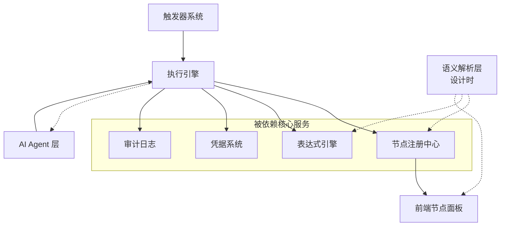
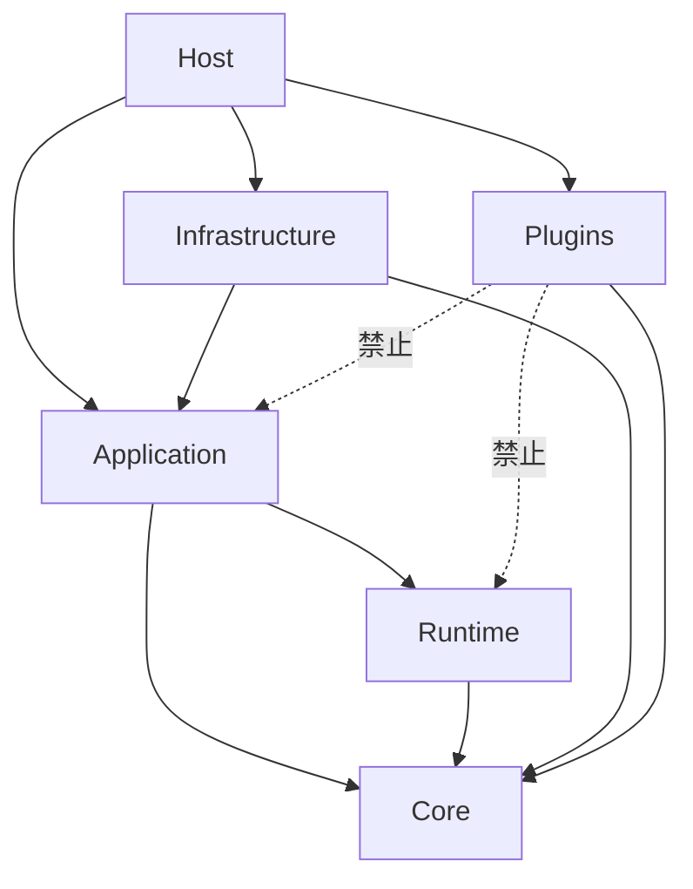

# 系统模块总览

## 1. 一句话定位

Flow Engine 是一个节点可热插拔的工作流自动化引擎：前端负责可视化编排，构建后由后端托管；后端负责确定性执行，节点通过 DLL 插件扩展。默认以单机后台服务形态运行，同时预留横向扩展能力。

## 2. 整体架构

```
┌──────────────────────────────────────────────────────────────────────────┐
│                         Flow Engine 后台服务进程                          │
│  ┌────────────────────────────────────────────────────────────────────┐  │
│  │                         前端静态资源 (wwwroot)                      │  │
│  │  ┌─────────────┐  ┌─────────────┐  ┌───────────────┐  ┌─────────┐  │  │
│  │  │  画布编辑器  │  │  节点面板    │  │  参数配置面板  │  │ 执行视图 │  │  │
│  │  └─────────────┘  └─────────────┘  └───────────────┘  └─────────┘  │  │
│  └────────────────────────────────────────────────────────────────────┘  │
│  ┌────────────────────────────────────────────────────────────────────┐  │
│  │                           核心层                                    │  │
│  │  ┌──────────────┐  ┌──────────────┐  ┌──────────────────────────┐  │  │
│  │  │   执行引擎    │  │  表达式求值   │  │       节点注册中心        │  │  │
│  │  │  (主循环)     │  │  (安全沙箱)   │  │    (扫描 DLL 注册)       │  │  │
│  │  └──────────────┘  └──────────────┘  └──────────────────────────┘  │  │
│  └────────────────────────────────────────────────────────────────────┘  │
│  ┌────────────────────────────────────────────────────────────────────┐  │
│  │                          基础设施层                                 │  │
│  │  ┌────────┐ ┌────────────┐ ┌──────────┐ ┌───────────┐ ┌────────┐   │  │
│  │  │ 凭据加密 │ │  审计日志   │ │ 调度器   │ │ 事件总线  │ │ 文件存储 │   │  │
│  │  │        │ │ NDJSON 文件 │ │ Quartz   │ │ IEventBus │ │ 本地存储 │   │  │
│  │  └────────┘ └────────────┘ └──────────┘ └───────────┘ └────────┘   │  │
│  └────────────────────────────────────────────────────────────────────┘  │
│  ┌────────────────────────────────────────────────────────────────────┐  │
│  │                        企业扩展层（单机可承载）                      │  │
│  │  ┌────────┐ ┌────────┐ ┌────────┐ ┌─────────┐ ┌────────┐           │  │
│  │  │ RBAC   │ │  SSO   │ │ MCP    │ │ Git     │ │ AI Builder│          │  │
│  │  │ 权限   │ │ 认证   │ │ 协议   │ │ 版本    │ │         │           │  │
│  │  └────────┘ └────────┘ └────────┘ └─────────┘ └────────┘           │  │
│  └────────────────────────────────────────────────────────────────────┘  │
│  ┌────────────────────────────────────────────────────────────────────┐  │
│  │                     企业扩展层（需多机/外部服务）                   │  │
│  │  ┌────────┐ ┌────────┐ ┌────────┐ ┌────────────────────────┐       │  │
│  │  │ 协作   │ │ Redis  │ │ 独立   │ │ 外部对象存储 / 日志系统   │       │  │
│  │  │ 编辑   │ │ 队列   │ │ Worker │ │                         │       │  │
│  │  └────────┘ └────────┘ └────────┘ └────────────────────────┘       │  │
│  └────────────────────────────────────────────────────────────────────┘  │
└──────────────────────────────────────────────────────────────────────────┘
```

## 3. 前后端分层职责

### 3.1 前端

| 模块 | 职责 |
|------|------|
| 画布编辑器 | 节点拖拽、连线、布局、撤销/重做、选中态 |
| 节点面板 | 从后端拉取节点类型列表，按分类渲染可拖拽卡片 |
| 参数配置面板 | 根据节点描述自动渲染表单，支持条件显隐、校验 |
| 执行实时视图 | 订阅 WebSocket 执行事件，高亮节点、展示输出 |

前端只做两件事：**描述工作流** 和 **展示执行过程**。真正的执行逻辑在后端。

**部署方式**：前端使用 React/TypeScript 开发，构建产物输出到后端 `wwwroot/` 目录，由后端统一通过 `UseStaticFiles` + `MapFallbackToFile("index.html")` 托管。开发时前端使用 Vite dev server，通过代理访问后端 API。详见 [deployment.md](deployment.md)。

### 3.2 后端

| 模块 | 职责 |
|------|------|
| 执行引擎 | 按 DAG 拓扑顺序执行节点，处理多输入等待、错误、重试、Saga 补偿 |
| 节点注册中心 | 扫描插件目录，加载节点类型，提供元数据查询 |
| 表达式求值 | 安全求值 `{{ }}` 表达式，访问输入/参数/其他节点数据 |
| 凭据系统 | 加密存储凭据，运行时解密注入节点上下文 |
| 审计日志 | 记录执行、登录、保存等事件，支持回放和外部转发。通过 `IEventBus` 接口接收事件，单机内存实现 |
| 触发器系统 | Schedule、Webhook、轮询触发器，启动工作流执行。Schedule 与轮询调度由 Quartz.NET 实现。详见 [trigger-system.md](trigger-system.md) |
| AI Agent 层 | 意图识别、工具收集、LLM 调用、子工作流/子 Agent 协调 |
| 语义解析层 | 自然语言转工作流 DSL、生成-校验-纠错循环、人工确认。详见 [natural-language-to-dsl.md](natural-language-to-dsl.md) |
| 部署宿主 | 单一 .NET 后台服务进程，同时承载 HTTP API、前端静态文件、执行引擎、Quartz 调度器、Webhook 路由。详见 [deployment.md](deployment.md) |

## 4. 核心数据流

### 4.1 编辑阶段

```
用户拖拽节点 或 自然语言输入 → 前端/语义解析层生成工作流定义 JSON 草案
                                                  ↓
                                          校验 + 人工确认 + 版本化
                                                  ↓
                                          POST /api/workflows
                                                  ↓
                                       后端校验并持久化到数据库
```

### 4.2 执行阶段

```
触发（手动/定时/Webhook）→ 后端加载工作流定义 → 初始化执行上下文
                                                  ↓
                                执行引擎按拓扑顺序执行节点
                                                  ↓
                            每个节点：解析参数 → 解密凭据 → 执行 → 输出给下游
                                                  ↓
                            WebSocket 推送执行事件 → 前端实时展示
                                                  ↓
                                  执行结束，保存执行记录
```

### 4.3 节点加载阶段

```
插件开发者实现节点接口 → 编译成 DLL → 放入 plugins/ 目录
                                                  ↓
                              后端启动时扫描 DLL 并注册到节点注册中心
                                                  ↓
                              前端 GET /api/node-types 获取节点描述列表
                                                  ↓
                              前端根据描述自动渲染节点面板和参数面板
```

## 5. 模块依赖关系



- 执行引擎依赖节点注册中心（创建实例）、表达式引擎（求值）、凭据系统（注入凭据）、审计日志（记录事件）。
- 触发器系统调用执行引擎启动执行。
- AI Agent 层调用执行引擎执行 tool；执行引擎在执行 Agent 节点时回调 AI Agent 层（虚线表示调用回环）。
- 节点注册中心向前端节点面板提供节点类型描述。
- 语义解析层位于设计时，通过虚线依赖节点注册中心（获取可用节点类型）、表达式引擎（校验表达式）、前端节点面板（渲染草案），不参与运行时执行。

## 6. 持久化设计

| 数据 | 默认存储 | 横向扩展时 |
|------|----------|-----------|
| 工作流定义 | SQLite | PostgreSQL / MySQL / SQL Server |
| 执行历史 | SQLite + 本地日志文件 | PostgreSQL + 外部日志系统 |
| 凭据 | SQLite（加密存储） | PostgreSQL / Vault |
| 审计日志 | 本地 NDJSON 文件 + `IEventBus` 内存转发 | ELK / RabbitMQ / Kafka |
| 触发器状态 | SQLite + Quartz RAMJobStore | PostgreSQL + Quartz ADO.NET JobStore |
| 节点插件 | 文件系统 plugins/ 目录 | 共享存储或镜像 |
| 文件存储 | 本地 storage/ 目录 | S3 / MinIO / NAS |

单机默认使用 SQLite + 本地文件，零配置即可启动。当并发量上升时，按 [deployment.md](deployment.md) 中的扩展路径逐步替换为有状态服务。

## 7. 代码组织与项目结构

后端采用**分层项目结构**，在 MVP 阶段保持 5 个核心项目 + 独立插件项目，既避免过度拆分，又保证依赖方向清晰。

```text
FlowEngine.sln
│
├── src/
│   ├── FlowEngine.Core/              # 最内层：实体、抽象契约、领域事件、值对象
│   │   ├── Abstractions/             # INode, IEngine, IContext, IEventBus 等接口
│   │   ├── Entities/                 # WorkflowDefinition, NodeDefinition, DataItem
│   │   ├── Events/                   # WorkflowStarted, NodeExecuted
│   │   └── ValueObjects/             # NodeDefinitionId, ExecutionId, CredentialKey
│   │   ⚠️ 零外部依赖，只有 POCO 和委托。
│   │
│   ├── FlowEngine.Runtime/           # 执行引擎核心
│   │   ├── Executor/                 # 执行器主循环、执行队列、worker
│   │   ├── WaitingArea/              # 多输入等待区（内部可称 MultiInputBarrier）
│   │   ├── Recovery/                 # 崩溃恢复：从执行记录重建等待区
│   │   ├── Expressions/              # 表达式解析器与安全沙箱
│   │   └── Snapshots/                # 执行范围凭据快照、上下文深拷贝
│   │   ⚠️ 依赖：Core + Microsoft.Extensions.Logging。
│   │
│   ├── FlowEngine.Application/       # 用例编排层
│   │   ├── Workflows/                # 工作流 CRUD、版本控制、激活/停用
│   │   ├── Executions/               # 启动执行、取消执行、查询状态
│   │   ├── Orchestrators/            # AI Agent 编排器（多轮循环控制）
│   │   ├── Tools/                    # Tool 注册与收集（子工作流→Tool）
│   │   └── DTOs/                     # 前端通信专用 ViewModel
│   │   ⚠️ 依赖：Core + Runtime。
│   │
│   ├── FlowEngine.Infrastructure/    # 基础设施适配器
│   │   ├── Persistence/              # 数据库实现（SQLite/PostgreSQL）
│   │   ├── Scheduling/               # Quartz.NET 适配器
│   │   ├── EventBus/                 # IEventBus 实现（内存 Channel / Kafka）
│   │   ├── Security/                 # 凭据加密（AES-GCM）+ Vault 适配器
│   │   └── FileStorage/              # 本地/S3 文件适配器
│   │   ⚠️ 依赖：Core + Application（实现其接口）。
│   │
│   └── FlowEngine.Host/              # 启动项与组合根
│       ├── Controllers/              # REST API
│       ├── WebSocketHandlers/        # 实时执行进度推送
│       ├── Middlewares/              # 多租户、限流、认证
│       ├── BackgroundServices/       # 托管服务（队列、恢复扫描）
│       └── wwwroot/                  # 前端 React 构建产物
│       ⚠️ 职责：注册 DI，组装一切。
│
└── plugins/                          # 热插拔节点，独立类库
    ├── FlowEngine.Plugins.Standard/  # HTTP, Code, If, Loop, Merge
    ├── FlowEngine.Plugins.Database/  # Postgres, MySQL, Redis
    ├── FlowEngine.Plugins.AI/        # LLM 供应节点、Agent 节点实现
    └── FlowEngine.Plugins.Triggers/  # ScheduleTrigger, WebhookTrigger
    ⚠️ 只引用 FlowEngine.Core，绝不允许引用 Application 或 Runtime。
```

### 7.1 依赖方向



### 7.2 关键约束

- **Plugins 只引用 Core**：插件是被引擎调用的执行单元，若引用 Application/Runtime 会导致循环依赖和执行死锁。
- **命名空间与文件夹一致**：`src/FlowEngine.Runtime/WaitingArea/MultiInputBarrier.cs` 对应 `namespace FlowEngine.Runtime.WaitingArea;`。
- **接口定义在 Core/Application**：所有 Infrastructure 实现类必须实现 Core 或 Application 中定义的接口。

## 8. 安全边界

- 节点插件通过独立 `AssemblyLoadContext` 加载，避免依赖冲突。
- 表达式引擎在受限沙箱中执行，禁止访问文件系统、网络、进程。
- 代码节点在隔离沙箱中运行，限制资源和时间。
- 凭据值不落日志、不返回前端。
- Webhook 入口支持签名验证和来源白名单。

