# 项目路线图

> 以下阶段和时间仅为示意，用于理解模块依赖关系，不构成交付承诺。实际需根据团队规模与优先级调整。
>
> 建议将 MVP 拆分为 **MVP-0**（核心可运行）和 **MVP-1**（增强稳定性），降低单阶段风险。

## 1. 阶段总览

```mermaid
gantt
    title 构建路线图（相对时间示意）
    dateFormat  x
    axisFormat  第%S周

    section MVP（约 3-4 周）
    节点接口+注册中心       :a1, 0, 7d
    执行引擎主循环           :a2, 4, 7d
    基础表达式求值           :a3, 7, 4d
    画布拖拽连线             :a4, 11, 6d
    参数面板自动渲染          :a5, 14, 5d
    凭据CRUD+加密            :a6, 17, 4d

    section Alpha（约 3-4 周）
    WebSocket推送            :b1, 24, 5d
    EventBus+审计日志        :b2, 26, 6d
    触发器+Webhook           :b3, 29, 6d
    沙箱强化                 :b4, 34, 4d
    Agent端口类型+工具收集   :b5, 36, 5d
    LLM供应+Tool基础        :b6, 40, 5d

    section Beta（约 5-6 周）
    RBAC权限                :c1, 48, 8d
    多租户/项目              :c2, 50, 8d
    限流+安全               :c3, 55, 5d
    文件存储                 :c4, 58, 4d
    导入导出                 :c5, 61, 4d
    Agent增强+工作流工具     :c6, 64, 8d
    Agent执行视图           :c7, 69, 5d

    section GA（约 6-8 周）
    Redis队列+Worker         :d1, 78, 10d
    监控指标                 :d2, 82, 6d
    Agent生产化              :d3, 84, 10d
    SSO                     :d4, 88, 7d

    section Enterprise（持续）
    Git集成                 :e1, 100, 7d
    协作编辑                 :e2, 103, 8d
    外部凭据                 :e3, 108, 5d
    JSON Config Agent       :e4, 112, 8d
    AI Builder              :e5, 115, 10d
    MCP协议                 :e6, 120, 6d
```

## 2. MVP（约 3-4 周）

### 目标

验证核心引擎是否可运行：节点可注册、工作流可编排、可手动执行。

### 功能清单

| 模块 | 功能点 |
|------|--------|
| **节点系统** | 定义节点接口、节点注册中心（扫描程序集）、基础节点（HTTP Request + Code + If） |
| **执行引擎** | 主循环（队列弹栈）、多输入等待、错误处理（重试/继续执行）、基础表达式求值 |
| **画布** | React Flow 拖拽、连线、删除、撤销/重做 |
| **配置面板** | 参数描述驱动渲染、条件显隐、下拉/文本/数字/开关 |
| **工作流 CRUD** | 创建、保存（JSON）、加载、列表 |
| **手动执行** | 点按钮执行，结果在界面上显示 |
| **凭据系统** | 凭据 CRUD、加密存储、运行时解密注入 |

### 验收标准

- 能拖入 HTTP Request、If、Code 节点并连线。
- 能保存工作流并从数据库加载。
- 能手动执行并看到节点输出。
- 凭据能加密保存并在 HTTP 节点中使用。

## 3. Alpha（约 3-4 周）

### 目标

补齐触发器、审计日志、实时执行视图，引入 AI Agent 基础能力。

### 功能清单

| 模块 | 功能点 |
|------|--------|
| **WebSocket 推送** | 建立连接、推送执行进度、推送节点输出、断开重连 |
| **审计日志** | EventBus 事件通道、日志文件写入、按类型/时间查询 |
| **表达式沙箱** | 安全求值 `{{ }}`、支持 `input/parameter/nodes/workflow` 等上下文变量、错误友好提示 |
| **触发器** | Schedule Trigger（Cron 表达式）、Webhook Trigger（HTTP 端点注册） |
| **节点执行视图** | 执行中高亮、节点输出预览 |
| **AI Agent 基础** | Agent 节点定义 + Agent 工具端口 / LLM 供应端口 / 记忆端口 + 工具收集机制 |
| **LLM 供应节点** | OpenAI/自定义 LLM 节点（供应模式，不返回数据只返回模型实例） |
| **Tool 基础** | 子工作流工具（只支持参数嵌入 JSON）、代码片段工具、HTTP 工具 |

### 验收标准

- Schedule Trigger 能按 Cron 触发工作流。
- Webhook 能接收外部 HTTP 请求并触发工作流。
- 执行过程中前端能实时看到节点输出。
- Agent 节点能调用至少一个 tool 并完成一次执行。

## 4. Beta（约 5-6 周）

### 目标

增加企业基础能力：权限、多租户、安全、文件、Agent 增强。

### 功能清单

| 模块 | 功能点 |
|------|--------|
| **限流** | IP 限流（登录/注册）、用户限流（API 调用）、配置化阈值 |
| **权限 RBAC** | 角色定义（管理员/编辑/查看）、Scope 枚举、中间件鉴权 |
| **多租户/项目** | 项目 CRUD、项目成员管理、工作流/凭据作用域隔离 |
| **轮询触发器** | 定时查询外部 API、去重机制、状态持久化 |
| **文件/二进制数据** | 文件上传、S3/本地存储、工作流中传递二进制数据 |
| **执行清理** | 定时删除过期执行记录、配置化保留策略 |
| **导入/导出** | 工作流 JSON 导出导入、批量操作 |
| **Agent 增强** | 子 Agent 工具（嵌套 Agent）、多轮对话记忆、最大迭代次数限制 |
| **工作流工具增强** | 数据库加载子工作流、AI 占位符 Schema 推导、重试配置 |
| **Agent 执行视图** | 前端显示 LLM 思考过程 + tool 调用链 |

### 验收标准

- 不同项目的工作流互相不可见。
- 管理员/编辑/查看角色权限生效。
- 文件能在节点间传递。
- Agent 支持多轮对话和子 Agent 嵌套。

## 5. GA（约 6-8 周）

### 目标

支撑生产环境：队列、Worker、监控、SSO、Agent 生产化。

### 功能清单

| 模块 | 功能点 |
|------|--------|
| **Redis 队列** | 主节点入队、Worker 出队执行、结果回写、失败重试 |
| **Worker 进程** | 独立进程、心跳检测、任务抢占、优雅关闭 |
| **Prometheus 指标** | 执行数/时长/错误率、队列深度、缓存命中率、HTTP 路由访问量 |
| **OpenTelemetry 追踪** | 分布式链路追踪、导出到 Jaeger/Zipkin/Datadog |
| **Sentry 错误上报** | 自动捕获未处理异常、执行错误上报、性能监控 |
| **缓存系统** | 内存缓存 + Redis 缓存、配置化 TTL、失效策略 |
| **Webhook 生产管理** | 动态路由、CORS、速率限制、请求校验 |
| **SSO** | SAML 2.0 / OIDC 登录、自动创建用户、角色映射 |
| **Agent 生产化** | 流式响应、Fallback 模型、批处理、子 Agent 内联执行 |
| **Agent 可观测** | LLM token 用量追踪、tool 调用耗时、Agent 执行链路追踪 |

### 验收标准

- Worker 崩溃后任务可被其他 Worker 接管。
- 监控指标可导出到 Prometheus。
- SSO 用户可自动登录并映射角色。
- Agent 支持流式输出。

## 6. Enterprise（3 月+）

### 目标

服务大型企业：版本管理、协作、外部凭据、MCP、AI Builder、合规。

### 功能清单

| 模块 | 功能点 |
|------|--------|
| **Git 版本管理** | 工作流导出到 Git、版本对比、回滚、分支管理 |
| **协作编辑** | Yjs CRDT、光标位置广播、写锁定、冲突解决 |
| **外部凭据** | HashiCorp Vault、AWS Secrets Manager、Azure Key Vault |
| **MCP 协议** | 暴露工具、资源、提示模板给 AI 调用 |
| **AI Builder** | 自然语言生成工作流、AI 辅助编写表达式 |
| **JSON Config Agent** | 通过 JSON 声明式定义 Agent（无需画布），按名称解析工作流工具、RBAC 鉴权 |
| **临时节点执行** | 单节点作为 tool 执行（内存中，不落库），用于细粒度 tool 注册 |
| **审计合规** | 安全扫描报告、违规检测、合规导出 |
| **执行脱敏** | 按策略自动隐藏敏感字段、可配置脱敏级别 |
| **执行评估** | 测试数据集运行、结果对比、LLM 评估 |
| **LDAP** | 用户目录同步、自动开通/停用账号 |
| **工作流版本历史** | 自动保存每次变更、版本对比、快速回滚 |

### 验收标准

- 多用户可实时协作编辑同一工作流。
- 工作流变更可回滚到任意历史版本。
- MCP Server 可被外部 AI 调用。

## 7. 阶段依赖关系

各阶段之间存在强依赖：

- Alpha 的触发器/审计日志依赖 MVP 的执行引擎。
- Beta 的 RBAC/多租户依赖 Alpha 的用户系统。
- GA 的 Redis 队列/Worker 依赖 Beta 的执行稳定性。
- Enterprise 的协作编辑/版本管理依赖 GA 的生产化基础。

## 8. 测试与性能基准

每个阶段都应设置最低质量门槛：

| 阶段 | 单元测试覆盖率 | 集成测试 | E2E 测试 | 性能目标 |
|------|---------------|---------|---------|---------|
| **MVP-0** | ≥ 30%（核心执行路径） | 执行引擎基础拓扑 | 1 条简单工作流手动执行 | 单机 10 TPS |
| **MVP-1** | ≥ 50% | 多输入等待、错误策略 | HTTP → If → Code 工作流 | 单机 50 TPS |
| **Alpha** | ≥ 60% | 触发器、Webhook、审计日志 | Schedule/Webhook 触发 | 单机 100 TPS |
| **Beta** | ≥ 70% | RBAC、多租户隔离 | 多用户协作编辑 | 单机 200 TPS |
| **GA** | ≥ 75% | Redis 队列 + Worker | Worker 故障转移 | 1000 TPS（多 Worker） |
| **Enterprise** | ≥ 80% | MCP、外部凭据 | 完整审批流程 | 按客户需求 |

性能测试指标：

- **TPS**：每秒完成的工作流执行数。
- **P99 延迟**：单次执行从触发到完成的 99 分位延迟。
- **资源占用**：CPU、内存、SQLite 写锁等待时间。
- **崩溃恢复时间**：Pending 执行重新入队并完成的平均时间。

## 9. 主要风险

| 风险 | 影响 | 应对 |
|------|------|------|
| 节点插件依赖冲突 | 加载插件时主程序崩溃 | 使用独立 AssemblyLoadContext，隔离加载 |
| 表达式引擎安全漏洞 | 用户通过表达式执行恶意代码 | 白名单函数、沙箱执行、深度/超时限制 |
| 多输入等待实现复杂 | 循环/Join 场景容易出错 | 先用单元测试覆盖常见拓扑 |
| Agent 工具调用循环 | LLM 无限调用 tool | 配置最大迭代次数和超时 |
| 多租户数据隔离 | 跨租户数据泄露 | 所有查询强制带 projectId 过滤 |
