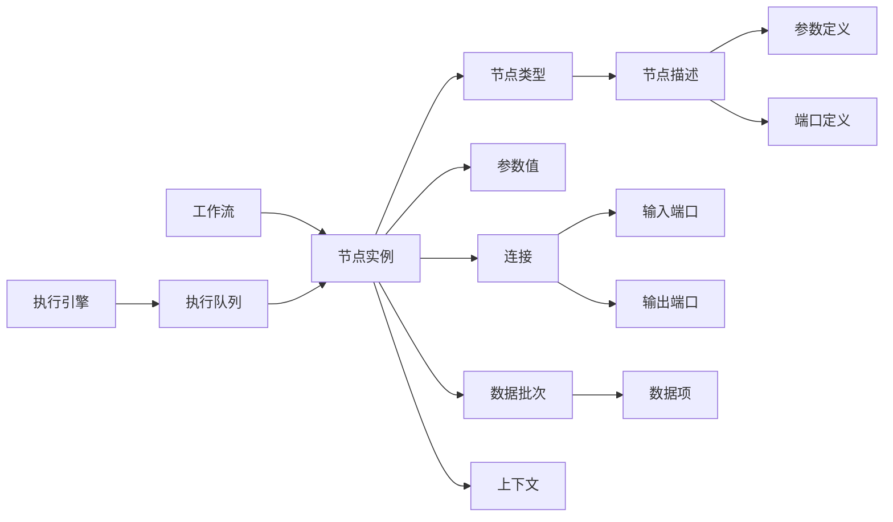

# 核心概念与术语

## 1. 设计阶段术语

| 术语 | 定义 | 使用场景 | 示例 |
|------|------|----------|------|
| **节点类型** | 节点的“类”，定义一种可复用的计算单元 | 在节点面板中选择、拖拽到画布 | `HTTP Request`、`Code`、`If` |
| **节点实例** | 画布上的一个具体节点，有自己的 ID、位置、参数 | 保存工作流、执行时创建运行时实例 | 画布上拖入的第三个 HTTP Request |
| **节点描述** | 节点类型的静态元数据：名称、图标、参数、端口、分类 | 前端渲染节点面板和参数配置面板 | HTTP Request 节点描述 |
| **参数定义** | 节点的配置字段声明，含类型、默认值、校验规则、条件显示规则 | 前端自动生成表单 | URL、请求方法、请求体 |
| **输入端口** | 接收上游节点数据的接口 | 连线时指向的目标 | HTTP Request 的 input |
| **输出端口** | 向下游节点发送数据的接口 | 连线时的起点 | HTTP Request 的 output |
| **端口类型** | 端口按用途分类：主数据端口、Agent 工具端口、LLM 供应端口、记忆端口 | 决定数据如何在节点间流转 | Agent 工具端口连接 tool 节点 |
| **工作流** | 节点实例 + 连线构成的完整定义 | 保存、执行、导出 | 一个邮件自动化流程 |
| **连接** | 从一个输出端口到另一个输入端口的线 | 画布上连接两个节点 | A.output → B.input |

## 2. 运行时术语

| 术语 | 定义 | 使用场景 | 示例 |
|------|------|----------|------|
| **数据项** | 节点间传递的最小数据单元，含结构化数据、二进制附件、错误信息、来源索引 | 每个节点处理的最小记录 | 一条 HTTP 响应 JSON |
| **数据批次** | 一批数据项组成的数组 | 节点输入/输出的批量单位 | 10 条用户记录 |
| **上下文** | 节点执行时的环境：参数、输入数据、凭据、日志、HTTP 客户端 | 节点 execute 方法入参 | 当前节点可读取 `input.id` |
| **执行队列** | 待执行节点的队列 | 引擎主循环不断从队首取节点执行 | `[NodeB, NodeC]` |
| **运行索引** | 同一节点被反复执行时的计数 | 循环、重试场景 | 第 3 次执行 NodeB |
| **多输入等待** | 多输入节点等待所有输入批次到齐后才执行 | Merge、Join 节点 | Merge 等 A 和 B 都完成 |
| **执行记录** | 一次工作流运行的完整记录 | 查询历史、调试、审计 | 某次运行的全部节点输入输出 |

## 3. 节点类型分类

| 类型 | 行为 | 例子 | 说明 |
|------|------|------|------|
| **操作节点** | 有输入 → 处理 → 有输出 | `HTTP Request`、`Code`、`Postgres` | 最常见的节点类型 |
| **触发器节点** | 无输入，后台持续监听，主动推送数据 | `Schedule Trigger`、`Webhook Trigger` | 工作流的起点 |
| **轮询节点** | 无输入，引擎定期调用，返回数据或 null | `Gmail Trigger` | 由引擎主动查询外部系统 |
| **Webhook 节点** | 无输入，注册 HTTP 端点，外部调用时触发 | `Webhook` | 支持同步/异步响应 |
| **供应节点** | 不返回数据，返回运行时对象给父节点用 | `OpenAI` 节点 | 为 Agent 节点提供 LLM 实例 |

## 4. 术语关系图



## 5. 核心数据模型

以下模型为各子系统文档共用，字段名称与含义保持一致。

```csharp
public class Workflow
{
    public Guid Id { get; set; }
    public Guid? ProjectId { get; set; }
    public string Name { get; set; }
    public int Version { get; set; }
    public string CreatedBy { get; set; }
    public DateTime CreatedAt { get; set; }
    public DateTime UpdatedAt { get; set; }

    /// <summary>
    /// 画布节点实例，含 UI 信息与参数值。
    /// 引擎执行前会转换为 <see cref="NodeDefinition"/>。
    /// </summary>
    public List<NodeInstance> Nodes { get; set; }

    /// <summary>
    /// 节点间连接，Source/Target 指向 <see cref="NodeInstance.Id"/>。
    /// 运行时对应 <see cref="NodeDefinition.Id"/>。
    /// </summary>
    public List<Connection> Connections { get; set; }

    public bool IsActive { get; set; }
}

/// <summary>
/// 画布节点实例。由前端生成并保存，包含 UI 位置与参数值。
/// </summary>
public class NodeInstance
{
    public Guid Id { get; set; }
    public string TypeName { get; set; }
    public string Name { get; set; }
    public Dictionary<string, object> Parameters { get; set; }
    public List<PortInstance> Ports { get; set; }
    public int PositionX { get; set; }
    public int PositionY { get; set; }
}

/// <summary>
/// 节点执行模型。由 <see cref="NodeInstance"/> 结合节点类型元数据转换而来，
/// 用于引擎执行，剥离了 UI 信息，补充了运行时策略。
/// </summary>
public class NodeDefinition
{
    /// <summary>
    /// 与对应 NodeInstance.Id 相同，便于关联。
    /// </summary>
    public Guid Id { get; set; }

    public string TypeName { get; set; }
    public string Name { get; set; }
    public Dictionary<string, object> Parameters { get; set; }
    public List<PortInstance> Ports { get; set; }

    /// <summary>
    /// 调试时是否禁用该节点。禁用后引擎跳过该节点，直接将其输入透传给下游。
    /// </summary>
    public bool Disabled { get; set; }

    /// <summary>
    /// 节点级重试策略。若为空，使用引擎默认值。
    /// </summary>
    public RetryPolicy RetryPolicy { get; set; }

    /// <summary>
    /// 节点级错误处理策略：Terminate / Continue / Retry。
    /// </summary>
    public ErrorStrategy ErrorStrategy { get; set; }

    /// <summary>
    /// 节点执行超时。
    /// </summary>
    public TimeSpan? Timeout { get; set; }

    /// <summary>
    /// 是否为入口节点。触发器节点默认 true，普通节点默认 false。
    /// </summary>
    public bool IsEntry { get; set; }
}

public class RetryPolicy
{
    public int MaxRetries { get; set; }
    public TimeSpan BaseDelay { get; set; }
    public TimeSpan MaxDelay { get; set; }
    public bool UseJitter { get; set; }
}

public class PortInstance
{
    public string Name { get; set; }
    public PortDirection Direction { get; set; }
    public PortType Type { get; set; }
}

public enum PortDirection { Input, Output }

public enum PortType { Main, AgentTool, LLMSupply, Memory }

public class Connection
{
    public Guid Id { get; set; }
    public Guid SourceNodeId { get; set; }
    public string SourcePortName { get; set; }
    public Guid TargetNodeId { get; set; }
    public string TargetPortName { get; set; }

    /// <summary>
    /// 可选的条件表达式。只有表达式求值为 true 时，数据才会通过该连接传递。
    /// 为空时默认传递。
    /// </summary>
    public string Condition { get; set; }
}

public class PortDefinition
{
    public string Name { get; set; }
    public string DisplayName { get; set; }
    public PortDirection Direction { get; set; }
    public PortType Type { get; set; }
    public bool Required { get; set; }
    public List<string> AllowedTypes { get; set; }

    /// <summary>
    /// 本端口输出数据的结构声明，用于设计期校验和运行期 Schema 校验。
    /// </summary>
    public DataSchema OutputSchema { get; set; }

    /// <summary>
    /// 连接到本端口的下游数据应满足的结构（设计期扩展字段，运行时可选）。
    /// </summary>
    public DataSchema ExpectedSchema { get; set; }
}

public class DataSchema
{
    public string Type { get; set; } // object, array, string, number, boolean
    public Dictionary<string, DataSchema> Properties { get; set; }
    public List<string> Required { get; set; }
    public DataSchema Items { get; set; }
    public string Description { get; set; }
}

public class ParameterDefinition
{
    public string Name { get; set; }
    public string DisplayName { get; set; }
    public ParameterType Type { get; set; }
    public object DefaultValue { get; set; }
    public bool Required { get; set; }
    public List<ValidationRule> ValidationRules { get; set; }
    public DisplayRule DisplayRule { get; set; }
    public string CredentialType { get; set; }
    public List<Option> Options { get; set; }
}

public class DisplayRule
{
    public string Condition { get; set; }
    public List<string> Dependencies { get; set; }
}

public class DataBatch
{
    public List<DataItem> Items { get; set; }
}

public class DataItem
{
    /// <summary>
    /// 节点输出数据。统一使用 JsonNode（或 JsonElement），节点内部可反序列化为强类型 POCO。
    /// 设计期可结合 PortDefinition.OutputSchema 做结构校验。
    /// </summary>
    public JsonNode Data { get; set; }

    public bool Success { get; set; }
    public NodeError Error { get; set; }
    public int SourceIndex { get; set; }
}

public class NodeError
{
    public string Code { get; set; }
    public string Message { get; set; }

    /// <summary>
    /// 出错节点定义 ID，对应 <see cref="NodeDefinition.Id"/>。
    /// </summary>
    public Guid NodeDefinitionId { get; set; }

    /// <summary>
    /// 异常详情，采用可序列化结构，避免直接持有 Exception 对象。
    /// </summary>
    public Dictionary<string, string> Details { get; set; }
    public string StackTrace { get; set; }
}

public class CredentialValue
{
    public Guid Id { get; set; }
    public string Name { get; set; }
    public string Type { get; set; }

    /// <summary>
    /// 文本字段，如 API Key、用户名、连接字符串等。
    /// </summary>
    public Dictionary<string, string> Fields { get; set; }

    /// <summary>
    /// 二进制字段，如 SSH 私钥、证书文件等。
    /// 键与 Fields 不重复，节点按字段名选择从哪个字典读取。
    /// </summary>
    public Dictionary<string, byte[]> BinaryFields { get; set; }
}

public class ToolDefinition
{
    public string Name { get; set; }
    public string Description { get; set; }
    public object ParametersSchema { get; set; }

    /// <summary>
    /// 目标工具节点定义 ID，对应 <see cref="NodeDefinition.Id"/>。
    /// </summary>
    public Guid TargetNodeDefinitionId { get; set; }
}
```

## 6. 运行时与定义阶段对照

| 定义阶段 | 运行时 |
|----------|--------|
| 节点类型 | 被实例化为节点执行对象 |
| 节点定义 | 被引擎放入执行队列并调用 execute |
| 参数定义 | 参数值被解析、求值后注入上下文 |
| 连接 | 数据批次沿连线流动 |
| 工作流定义 | 被加载为可执行图 |

## 7. 扩展术语

| 术语 | 定义 | 使用场景 |
|------|------|----------|
| **凭据** | 全局存储、工作流引用的认证信息 | HTTP 节点调用 API 时使用 |
| **表达式** | `{{ }}` 包裹的声明式引用 | 参数中引用其他节点的数据 |
| **事件总线** | 事件分发通道 | 审计日志、执行监控 |
| **审计日志** | 执行、登录、保存等操作记录 | 合规、故障回放 |
| **Agent 节点** | 由 LLM 驱动决策的节点 | 意图识别、路由 |
| **工具** | Agent 可调用的能力单元 | 子工作流、代码片段、HTTP 调用 |
| **工作流作为工具** | 将整个工作流当作一个 tool 使用 | Agent 调用复杂业务流程 |
| **Schema 推导** | 从参数定义自动推导结构化输入 | LLM 按结构传参 |
| **AI 参数占位符** | `{{ai_param:描述}}` 语法，用于声明需要从 LLM 获取的参数 | 子工作流工具自动生成参数 Schema |

## 8. 名词对照

| 本文称呼 | 通用叫法 | 说明 |
|----------|----------|------|
| 节点类型 | Node Type, Node Definition, Plugin | 节点的“类”定义 |
| 节点实例 | Workflow Node, Node Instance, Step | 画布上的一个具体节点 |
| 节点描述 | Node Description, Manifest, Metadata | 节点类型的静态元数据 |
| 参数定义 | Field Schema, Property Spec | 节点的配置字段声明 |
| 数据项 | Record, Row, Event, Payload | 节点间传递的最小数据单元 |
| 执行队列 | Run Queue, Task Queue | 待执行节点的队列 |
| 上下文 | Context, Runtime, Session | 节点执行时的环境 |
| 多输入等待 | Barrier, Join, Gather | 多输入节点等待数据到齐 |
| 运行索引 | Iteration, Attempt | 同一节点反复执行的计数 |
| 节点注册中心 | Plugin Manager, Extension Registry | 扫描并注册节点类型的模块 |
| 表达式引擎 | Template Engine, Data Binder | 求值 `{{ }}` 表达式 |
| 凭据 | Connection, Auth Profile | 全局存储、工作流引用的认证信息 |
| 事件总线 | Event Stream, Message Queue | 事件分发通道 |
| 审计日志 | Audit Trail, Event Log | 执行、登录、保存等操作记录 |

## 9. 命名约定

本节约定 C# 代码、数据库表、JSON 字段中的命名规范，防止“定义/运行时”混淆导致维护灾难。

### 9.1 定义阶段与运行时命名

| 概念 | 设计时/画布 | 执行模型 | 运行时/记录 |
|------|------------|----------|------------|
| 工作流 | `WorkflowVersion`（版本化定义） | — | `WorkflowExecution` / `ExecutionRecord` |
| 节点 | `NodeInstance`（画布上的节点，含位置、参数值） | `NodeDefinition`（执行模型，含端口、参数定义、策略） | `NodeExecution` / `NodeExecutionRecord` |
| 连接 | `Connection`（含 Source/Target/Condition） | — | `RoutingPath` / `DataRoute` |
| 凭据 | `CredentialDefinition` | — | `CredentialSnapshot`（执行范围内只读快照） |

说明：
- `NodeInstance` 保留给前端/画布使用，表示“画布上的一个节点实例”。
- 后端执行模型使用 `NodeDefinition`，与 `WorkflowDefinition` 配合。
- 运行时单次执行使用 `NodeExecution` 或 `NodeExecutionRecord`，与 `ExecutionRecord` 配合。

### 9.2 动词分级

以下动词在代码中有明确分工，禁止混用：

| 动词 | 使用场景 | 示例 |
|------|----------|------|
| `Trigger` | 外部入口触发（Webhook、手动触发） | `WebhookTrigger.TriggerAsync` |
| `Schedule` | 调度器将任务入队 | `QuartzScheduler.ScheduleAsync` |
| `Start` | 启动整个工作流执行 | `WorkflowExecutor.StartAsync` |
| `Execute` | 单个节点执行 | `NodeRuntime.ExecuteAsync` |
| `Resume` | 崩溃恢复后重建执行状态 | `RecoveryManager.ResumePendingExecutionsAsync` |
| `Capture` / `Use` | 凭据快照的捕获与使用 | `CredentialSnapshotManager.CaptureSnapshotAsync` |

### 9.3 ID 后缀规范

所有关联 ID 必须带后缀，明确其指向的实体类型：

| 推荐 | 不推荐 | 说明 |
|------|--------|------|
| `WorkflowDefinitionId` | `WorkflowId` | 避免与运行时 `ExecutionId` 混淆 |
| `NodeDefinitionId` | `NodeId` | 节点定义 ID，运行时对应 `NodeExecution.NodeDefinitionId` |
| `ExecutionId` | `RunId` | 一次工作流执行的唯一标识 |
| `ParentExecutionId` | `ParentId` | 父执行 ID |
| `TargetNodeDefinitionId` | `TargetId` | 连接目标节点定义 ID |
| `SourceNodeDefinitionId` | `SourceId` | 连接源节点定义 ID |

### 9.4 序列化与数据库命名

- C# 实体属性使用 `PascalCase`。
- JSON 字段、数据库列名使用 `camelCase`。
- 表名使用复数小写下划线：
  - `workflow_definitions`（或 `workflow_versions`）：版本化的工作流定义。
  - `node_definitions`：节点定义。
  - `executions`：执行记录。
  - `node_executions`：节点执行记录。
  - `execution_snapshots`：执行上下文快照。
  - `credentials`：凭据定义。
  - `credential_snapshots`：执行范围凭据快照。
  - `audit_events`：审计事件。

### 9.5 禁用命名

以下命名在核心代码中禁止使用：

| 禁用 | 原因 | 替代 |
|------|------|------|
| `DoWork` / `Process` / `Handle` / `Think` | 语义空洞，容易成为业务逻辑黑洞 | `ExecuteAsync` / `IterateAsync` / `MapToEngineRequest` |
| `Model` | 歧义：LLM 模型、数据模型、执行模型 | `LlmModel` / `DataPayload` / `ExecutionModel` |
| `Context`（缩写） | 高频使用类，缩写降低可读性 | 必须全拼 `NodeExecutionContext` |
| `Error`（单独使用） | 未区分错误类型会导致错误策略混乱 | `BusinessError` / `SystemError` / `NodeError` |
| `Plugin` 作为工具命名 | 与节点插件概念冲突 | 工具统一使用 `Tool` |

