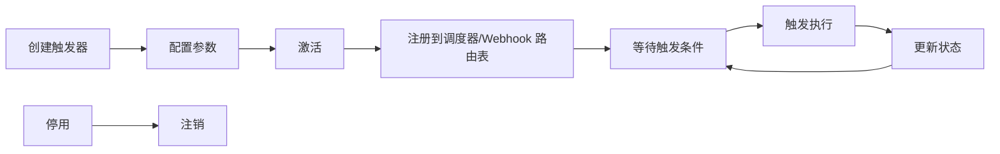

# 触发器系统

## 1. 触发器的作用

触发器是工作流的入口。它不需要上游节点输入，而是在特定条件发生时启动一次工作流执行。

Flow Engine 支持三类触发器：

| 触发器类型 | 触发方式 | 示例 |
|------------|----------|------|
| **Schedule 触发器** | 按 Cron 表达式定时触发 | 每天 9:00 执行报表 |
| **Webhook 触发器** | 外部系统发送 HTTP 请求触发 | 支付成功回调 |
| **轮询触发器** | 引擎定期查询外部系统，有新数据时触发 | 每 5 分钟拉取新邮件 |

Webhook 触发器的实现细节见 [webhook.md](webhook.md)。

## 2. 触发器模型

```csharp
public class Trigger
{
    public Guid Id { get; set; }

    /// <summary>
    /// 绑定的工作流定义 ID，对应 <see cref="Workflow.Id"/>。
    /// </summary>
    public Guid WorkflowDefinitionId { get; set; }

    /// <summary>
    /// 绑定的工作流版本。工作流更新版本后，触发器默认仍绑定旧版本。
    /// </summary>
    public int WorkflowVersion { get; set; }

    public string Type { get; set; } // "Schedule", "Webhook", "Poll"
    public string Name { get; set; }
    public bool IsActive { get; set; }
    public Dictionary<string, object> Settings { get; set; }
    public DateTime? LastTriggeredAt { get; set; }
    public DateTime? NextTriggerAt { get; set; }
}
```

- `Type`：触发器类型。
- `Settings`：类型相关配置，如 Cron 表达式、轮询间隔、Webhook 路径等。
- `IsActive`：停用后不再触发。

## 3. Schedule 触发器

### 3.1 配置

| 字段 | 说明 |
|------|------|
| `Cron` | Cron 表达式，决定触发时刻。 |
| `Timezone` | 时区，默认 `UTC`。 |
| `StartAt` / `EndAt` | 可选的有效时间范围。 |

### 3.2 调度实现：Quartz.NET

Schedule 触发器使用 **Quartz.NET** 调度。每个 active 触发器对应一个 Quartz `IJob` + `ITrigger`，由 Quartz 计算下次触发时间并精确调度：

```csharp
public class ScheduleTriggerJob : IJob
{
    private readonly IExecutionEngine _executionEngine;

    public async Task Execute(IJobExecutionContext context)
    {
        var triggerId = context.JobDetail.JobDataMap.GetGuid("TriggerId");
        var workflowDefinitionId = context.JobDetail.JobDataMap.GetGuid("WorkflowDefinitionId");
        await _executionEngine.StartAsync(workflowDefinitionId, triggerId);
    }
}
```

注册触发器到 Quartz：

```csharp
var job = JobBuilder.Create<ScheduleTriggerJob>()
    .WithIdentity($"schedule-{trigger.Id}")
    .UsingJobData("TriggerId", trigger.Id)
    .UsingJobData("WorkflowDefinitionId", trigger.WorkflowDefinitionId)
    .Build();

var quartzTrigger = TriggerBuilder.Create()
    .WithIdentity($"trigger-{trigger.Id}")
    .WithCronSchedule(trigger.Settings["Cron"], x => x.InTimeZone(timeZone))
    .StartAt(trigger.Settings.GetValueOrDefault<DateTimeOffset?>("StartAt"))
    .EndAt(trigger.Settings.GetValueOrDefault<DateTimeOffset?>("EndAt"))
    .Build();

await scheduler.ScheduleJob(job, quartzTrigger);
```

单机默认使用 Quartz 内存 JobStore（`RAMJobStore`）。横向扩展时切换为 ADO.NET JobStore，让多个实例竞争触发，避免重复执行。

`LastTriggeredAt` 和 `NextTriggerAt` 仍持久化到数据库，用于前端展示和调度恢复。Quartz 宕机重启后，通过扫描 active 触发器重新注册 Job。

## 4. 轮询触发器

### 4.1 配置

| 字段 | 说明 |
|------|------|
| `IntervalSeconds` | 轮询间隔。 |
| `TimeoutSeconds` | 单次轮询超时时间。 |
| `LastPollId` / `LastPollTime` | 上次轮询到的最新数据标识，用于去重。 |

### 4.2 轮询与去重

轮询触发器同样由 **Quartz.NET** 按 `IntervalSeconds` 周期调度，每次调度执行一次轮询 Job：

轮询 Job 的核心逻辑：
1. 从 `ITriggerStore` 加载触发器配置。
2. 通过 `INodeRegistry` 创建轮询节点实例并执行。
3. 按去重策略过滤已处理数据。
4. 并发控制：`SkipIfRunning` 配置避免轮询堆积。
5. 对每条新数据调用引擎 `StartAsync` 启动工作流。
6. 更新轮询状态（`LastPollId` / `LastPollTime`）。

```csharp
public enum PollDedupStrategy
{
    None,
    Id,
    Timestamp,
    HashSet
}
```

注册轮询触发器到 Quartz：

```csharp
var job = JobBuilder.Create<PollTriggerJob>()
    .WithIdentity($"poll-{trigger.Id}")
    .UsingJobData("TriggerId", trigger.Id)
    .Build();

var quartzTrigger = TriggerBuilder.Create()
    .WithIdentity($"poll-trigger-{trigger.Id}")
    .WithSimpleSchedule(x => x
        .WithIntervalInSeconds(trigger.Settings.GetValue<int>("IntervalSeconds"))
        .RepeatForever())
    .Build();

await scheduler.ScheduleJob(job, quartzTrigger);
```

去重策略由轮询节点声明，触发器配置中保存：

- **基于唯一标识（Id）**：外部数据有唯一 ID，引擎记录已处理 ID 集合。适用于 ID 连续或 UUID 场景。
- **基于时间戳（Timestamp）**：记录上次处理的最大时间戳，只处理更新的数据。适用于有时间戳字段的数据源。
- **基于哈希集合（HashSet）**：计算数据项哈希，记录已处理哈希。适用于无唯一 ID 但有稳定内容的数据。
- **幂等执行**：同一数据多次触发执行，结果一致，不破坏业务。作为最终兜底。

并发控制：

- `SkipIfRunning = true`：上一次轮询触发的执行尚未完成时，跳过本次轮询，避免压垮外部系统。
- `SkipIfRunning = false`：允许并行触发多个执行，适用于无状态、幂等的快速处理场景。

## 5. 状态持久化

触发器状态必须持久化，避免调度器重启后丢失进度：

| 状态 | 用途 |
|------|------|
| `LastTriggeredAt` | 记录上次触发时间。 |
| `NextTriggerAt` | 前端展示与调度恢复依据。 |
| `LastPollId` / `LastPollTime` | 轮询去重依据。 |
| `IsActive` | 是否启用。 |
| `WorkflowVersion` | 触发器绑定的工作流版本。工作流更新版本后，触发器默认仍绑定旧版本，直到用户手动切换。 |

触发器状态与工作流定义分开存储。Quartz 自身也维护调度状态：单机用内存 JobStore，多实例切换为 ADO.NET JobStore，由 Quartz 保证多节点下同一触发器只被一个实例执行。

**触发器与工作流版本**：工作流发布新版本时，现有触发器默认继续绑定旧版本，避免未经验证的新版本被自动执行。用户可在触发器配置中手动切换到新版本，或设置“始终使用最新版本”。

**Webhook 路由表持久化**：`WebhookRoute` 持久化到数据库。服务启动时从数据库加载并注册到 ASP.NET Core 路由表；新增/删除 Webhook 时同步更新数据库和内存路由表。多实例部署时所有实例共享数据库路由表，通过数据库变更通知或轮询同步。

更新触发器配置（如修改 Cron）时，需要先删除旧 Quartz Job 再重新注册，避免重复调度。

## 6. 触发器生命周期



- 工作流保存时，扫描其中所有触发器节点， upsert 触发器记录。
- 工作流激活时，注册所有 active 触发器。
- 工作流停用时，注销对应触发器。
- 删除工作流时，级联删除触发器。

## 7. 触发器与执行引擎的交互

触发器只负责**启动执行**，不负责执行本身：

```
触发器条件满足
    ↓
构造初始输入 DataBatch（可选，如 Webhook 请求体、轮询到的新数据）
    ↓
调用 ExecutionEngine.StartAsync(workflowDefinitionId, triggerId, initialData)
    ↓
引擎加载工作流 → 找到入口节点 → 开始执行
```

同一触发器在短时间内多次触发属于正常情况，执行引擎保证每次执行有独立的 `ExecutionId` 和上下文。

## 8. 安全与稳定性

- 触发器配置变更（如 Cron）需要重新计算 `NextTriggerAt`。
- 错过触发（调度器宕机）后，Schedule 触发器可根据策略选择补跑或跳过。
- 轮询触发器失败时记录错误，避免无限重试拖垮外部系统。
- Webhook 触发器支持签名验证和来源白名单，详见 [webhook.md](webhook.md)。
