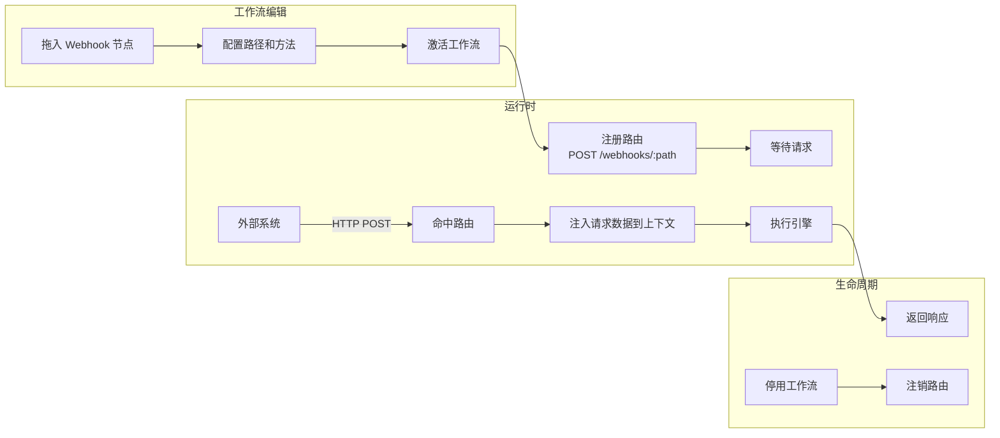

# Webhook 系统

## 1. Webhook 节点的作用

Webhook 节点是工作流的入口之一。它允许外部系统通过 HTTP 请求触发工作流执行。

典型场景：

- 外部系统推送事件到 Flow Engine。
- 第三方服务回调（如支付成功回调）。
- 自定义 API 端点供外部调用。

## 2. Webhook 类型

| 类型 | 说明 | 路径示例 |
|------|------|----------|
| **静态 Webhook** | 路径固定，工作流激活时注册路由 | `/webhooks/order-created` |
| **动态 Webhook** | 路径包含变量，请求时动态匹配 | `/webhooks/orders/{orderId}` |
| **测试 Webhook** | 编辑器中临时启用，用完自动清理 | `/webhooks/test/{uuid}` |

## 3. 生命周期



## 4. 路由注册与注销

### 4.1 注册时机

- 工作流被激活时，扫描其中所有 Webhook 节点并注册路由。
- 系统启动时，从数据库加载所有已激活工作流并注册路由。
- 测试 Webhook 在编辑器点击“监听”时注册，超时或手动关闭后注销。

### 4.2 路由表结构

```csharp
public class WebhookRoute
{
    public string Path { get; set; }
    public HttpMethod Method { get; set; }

    /// <summary>
    /// 工作流定义 ID，对应 <see cref="Workflow.Id"/>。
    /// </summary>
    public Guid WorkflowDefinitionId { get; set; }

    /// <summary>
    /// Webhook 节点定义 ID，对应 <see cref="NodeDefinition.Id"/>。
    /// </summary>
    public Guid NodeDefinitionId { get; set; }

    public bool IsStatic { get; set; }
}
```

### 4.3 动态路由匹配

动态路径使用模板匹配，如 `/webhooks/orders/{orderId}`：

```csharp
var template = TemplateParser.Parse("/webhooks/orders/{orderId}");
var result = template.Match(path);
if (result != null)
{
    context.Request.RouteValues["orderId"] = result.Values["orderId"];
}
```

## 5. 请求校验

### 5.1 签名验证

支持 HMAC-SHA256 签名验证：

```csharp
public bool VerifySignature(string secret, string body, string signature)
{
    using var hmac = new HMACSHA256(Encoding.UTF8.GetBytes(secret));
    var hash = hmac.ComputeHash(Encoding.UTF8.GetBytes(body));
    var expected = "sha256=" + Convert.ToHexString(hash).ToLowerInvariant();
    return CryptographicOperations.FixedTimeEquals(
        Encoding.UTF8.GetBytes(expected),
        Encoding.UTF8.GetBytes(signature));
}
```

### 5.2 来源白名单

- 支持 IP 白名单。
- 支持来源域名校验。

### 5.3 速率限制

- 对每个 Webhook 路径可配置 QPS 限制。
- 超限请求返回 429。

## 6. 同步响应与异步处理

### 6.1 同步模式

外部请求触发工作流执行，引擎等待工作流完成并返回结果：

```
外部系统 → POST /webhooks/order-created
              ↓
         引擎启动工作流执行
              ↓
         等待执行完成（受 maxWaitTimeout 限制）
              ↓
         返回 200 + 响应体
```

- 必须配置最大等待时间 `maxWaitTimeout`（如 30 秒），避免长时间占用 HTTP 连接。
- 超过最大等待时间后，可降级为异步模式返回 202 + executionId，或返回 504 Gateway Timeout。
- 适用场景：需要立即知道处理结果，且工作流执行时间短。

### 6.2 异步模式

外部请求触发后，引擎立即返回 202 Accepted，工作流在后台执行：

```
外部系统 → POST /webhooks/order-created
              ↓
         引擎返回 202 + executionId
              ↓
         工作流后台执行
```

适用场景：工作流执行时间长，或不需要立即返回结果。

### 6.3 响应配置

Webhook 节点可配置响应：

- HTTP 状态码
- 响应头
- 响应体（可引用执行结果或表达式）

## 7. 测试 Webhook

编辑器中提供“监听”按钮：

1. 用户点击监听，后端注册一个临时路径 `/webhooks/test/{uuid}`。
2. 外部系统发送请求到该路径。
3. 前端通过 WebSocket 实时看到请求内容和执行结果。
4. 用户关闭监听或超时后，临时路径自动注销。

## 8. 安全与稳定性

- Webhook 路径全局唯一，冲突时后激活的工作流报错。
- 请求体大小限制，防止内存耗尽。
- 恶意请求记录到审计日志。
- 未找到路由时返回 404，不泄露系统信息。
