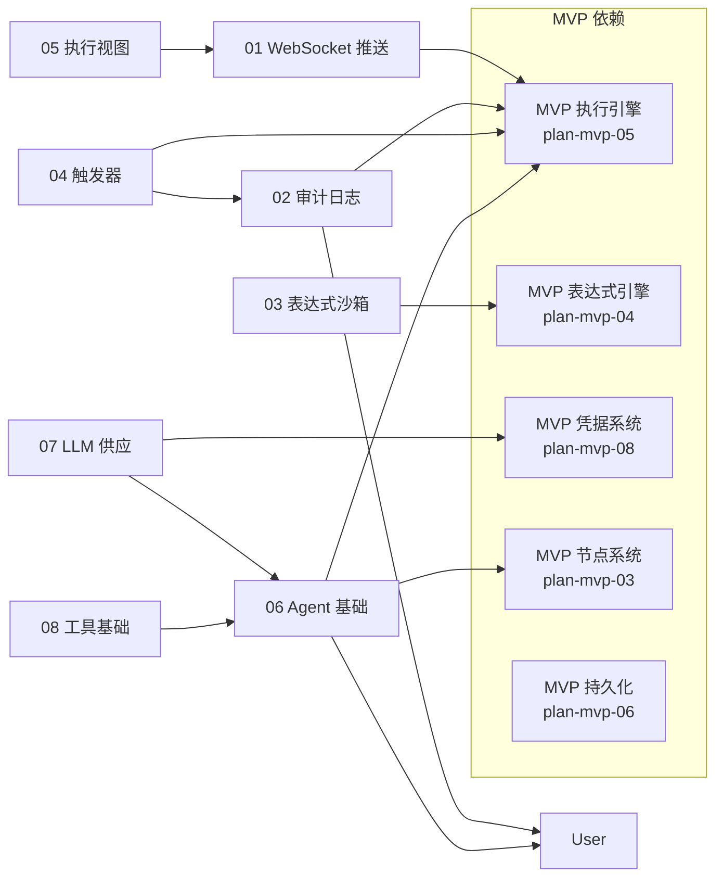

# Alpha 阶段开发计划说明（plan-alpha-00-readme）

## 1. 概述

本文件是 Flow Engine Alpha 阶段的入口与索引。Alpha 阶段在 MVP（核心引擎可运行、前端编排、手动执行）之上，补齐四类能力：

- **用户系统**：本地账号体系（注册/登录/会话/认证中间件），为 Beta RBAC 与 GA SSO 提供身份基础。
- **触发器与审计**：Schedule/Webhook 触发器、EventBus 与审计日志，使工作流可被外部事件驱动且全程可追溯。
- **实时执行视图**：WebSocket 推送执行进度与节点输出，前端可实时观察执行过程。
- **AI Agent 基础**：引入 Agent 节点、LLM 供应节点、工具收集与基础工具类型，验证"Agent 调用至少一个 tool 完成执行"的闭环。

本阶段不覆盖轮询触发器（Beta）、RBAC/多租户（Beta）、流式输出与子 Agent 嵌套（Beta）。

整体验收标准与质量门槛依据 [roadmap.md §3](../../architecture/roadmap.md#3-alpha约-3-4-周) 与 [plan-000-overview.md §7](../plan-000-overview.md#7-质量门槛)。

## 2. 模块清单

| 文件 | 模块 | 对应架构 |
|------|------|----------|
| [plan-alpha-01-websocket.md](plan-alpha-01-websocket.md) | WebSocket 推送 | overview §3.1 |
| [plan-alpha-02-audit-log.md](plan-alpha-02-audit-log.md) | 审计日志与 EventBus | audit-log §2-7 |
| [plan-alpha-03-expression-sandbox.md](plan-alpha-03-expression-sandbox.md) | 表达式沙箱强化 | expression-system §4,6 |
| [plan-alpha-04-triggers.md](plan-alpha-04-triggers.md) | 触发器系统（Schedule + Webhook） | trigger-system, webhook |
| [plan-alpha-05-execution-view.md](plan-alpha-05-execution-view.md) | 节点执行视图 | overview §3.1 |
| [plan-alpha-06-agent-basics.md](plan-alpha-06-agent-basics.md) | Agent 节点基础 | agent-and-tool §2,4-5 |
| [plan-alpha-07-llm-supply.md](plan-alpha-07-llm-supply.md) | LLM 供应节点 | agent-and-tool §3.4,4 |
| [plan-alpha-08-tool-basics.md](plan-alpha-08-tool-basics.md) | 工具基础 | agent-and-tool §6,8 |
| [plan-alpha-09-user-system.md](plan-alpha-09-user-system.md) | 用户系统 | deployment §10 |

## 3. 模块依赖关系图

依赖说明：

- `09 用户系统` 是审计日志 `Actor` 追踪、Beta RBAC、GA SSO 的前置基础。
- 用户系统与审计日志、WebSocket、表达式沙箱等模块可并行开发，但必须在 Beta RBAC 之前完成。

## 4. 整体验收标准

依据 [roadmap.md §3 验收标准](../../architecture/roadmap.md#验收标准-1)：

- Schedule Trigger 能按 Cron 表达式触发工作流执行。
- Webhook 能接收外部 HTTP 请求并触发工作流执行。
- 执行过程中前端能实时看到节点输出。
- Agent 节点能调用至少一个 tool 并完成一次执行。

## 5. 质量门槛

| 指标 | 目标 |
|------|------|
| 单元测试覆盖率 | ≥ 60% |
| 集成测试 | 触发器、Webhook、审计日志 |
| E2E 测试 | Schedule/Webhook 触发 |
| 性能目标 | 单机 100 TPS |

## 6. 实施顺序建议

1. plan-alpha-09 用户系统（Beta RBAC / GA SSO / 审计 Actor 的前置）
2. plan-alpha-02 审计日志（EventBus 是后续模块的基础设施）
3. plan-alpha-01 WebSocket 推送（执行视图与触发器测试的前端依赖）
4. plan-alpha-03 表达式沙箱强化（与上述并行）
5. plan-alpha-04 触发器系统（依赖审计日志）
6. plan-alpha-05 节点执行视图（依赖 WebSocket）
7. plan-alpha-06 Agent 节点基础
8. plan-alpha-07 LLM 供应节点（依赖 Agent 基础与凭据）
9. plan-alpha-08 工具基础（依赖 Agent 基础）

## 7. 风险概览

| 风险 | 影响 | 应对 | 相关计划 |
|------|------|------|----------|
| 表达式引擎安全漏洞 | 用户通过表达式执行恶意代码 | 白名单函数、沙箱、深度/超时限制 | plan-alpha-03 |
| Agent 工具调用循环 | LLM 无限调用 tool | 最大迭代次数与超时 | plan-alpha-06 |
| WebSocket 断线丢事件 | 实时视图中断 | 断线重连 + 事件补偿 | plan-alpha-01 |
| Quartz 调度重启丢任务 | Schedule 触发器失效 | 启动时扫描 active 触发器重新注册 | plan-alpha-04 |
| 用户系统缺失导致 RBAC/SSO 无身份基础 | Beta 权限与 GA 单点登录无法落地 | 在 Alpha 阶段优先完成用户系统 | plan-alpha-09 |

## 变更记录

| 日期 | 修改人 | 修改内容 | 关联任务 |
|------|--------|----------|----------|
| 2026-06-18 | Agent | 创建 Alpha 阶段说明文档，列出 8 个模块依赖与整体验收 | Alpha 计划编写 |
| 2026-06-18 | Agent | 新增用户系统模块（plan-alpha-09），更新模块清单、依赖图与实施顺序 | 计划 review 修复 |
