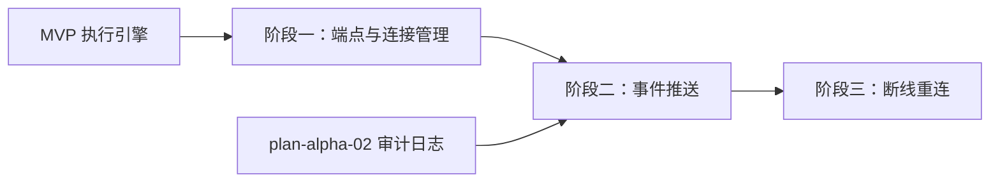

# 开发计划：WebSocket 推送（plan-alpha-01-websocket）

## 1. 概述

本模块为 Flow Engine 引入实时执行进度推送能力。通过 WebSocket 连接，前端在执行过程中可实时接收节点执行事件与节点输出，无需轮询。

覆盖范围：

- WebSocket 端点与连接管理（含鉴权）。
- 执行进度事件推送（ExecutionStarted / NodeExecuted / ExecutionCompleted 等）。
- 节点输出实时推送。
- 断线重连与事件补偿。

不覆盖：流式 LLM 输出推送（Beta）、协作编辑光标广播（Enterprise）。

事件模型与审计事件的关系见 [audit-log.md](../../architecture/audit-log.md)，前端执行视图职责见 [overview.md §3.1](../../architecture/overview.md#31-前端)。

## 2. 交付物清单

- WebSocket 端点（Host 层 `WebSocketHandlers/`）。
- 连接管理器：维护 executionId → 连接集合的映射，支持按执行订阅。
- 连接鉴权：握手时校验用户身份（基于现有 MVP 鉴权机制）。
- 事件推送适配器：订阅 EventBus 中的执行相关事件，转发到对应 WebSocket 连接。
- 节点输出推送：节点执行完成时推送输出数据。
- 断线重连机制：客户端重连后按 executionId 恢复订阅，补发缺失事件。
- 前端 WebSocket 客户端 Hook（订阅/重连/事件分发）。
- 单元测试与集成测试。

## 3. 开发阶段

### 阶段一：WebSocket 端点与连接管理

- **目标**：建立可鉴权的 WebSocket 连接，支持按 executionId 订阅。
- **核心任务**：
  - 实现 WebSocket 端点，握手时校验用户身份。
  - 实现连接管理器：维护连接生命周期、executionId → 连接集合映射。
  - 支持客户端发送订阅消息（指定 executionId）。
  - 连接关闭时清理订阅关系。
- **输入**：MVP 鉴权机制、执行记录查询接口（plan-mvp-05、plan-mvp-06）。
- **输出**：可建立鉴权连接并按执行订阅的 WebSocket 服务。
- **验收标准**：
  - 未鉴权请求被拒绝。
  - 订阅指定 executionId 后，连接进入活跃订阅状态。
  - 连接关闭后订阅关系被清理，无内存泄漏。
- **依赖**：plan-mvp-05 执行引擎、plan-mvp-06 持久化。

### 阶段二：执行进度事件推送

- **目标**：执行引擎产生的事件实时推送到订阅该执行的客户端。
- **核心任务**：
  - 订阅 EventBus 中 `Execution.Started`、`Node.Executed`、`Node.Error`、`Execution.Completed`、`Execution.Failed`、`Execution.Cancelled` 事件（事件类型见 [audit-log.md §3](../../architecture/audit-log.md#3-事件源)）。
  - 将事件按 executionId 路由到对应 WebSocket 连接。
  - 节点执行完成时推送节点输出数据（NodeExecutionRecord 摘要）。
  - 推送消息采用 JSON 格式，包含事件类型、executionId、nodeId、时间戳、输出摘要。
- **输入**：EventBus 事件流（plan-alpha-02）、执行记录。
- **输出**：前端实时收到执行进度与节点输出。
- **验收标准**：
  - 执行启动时客户端收到 ExecutionStarted 事件。
  - 每个节点执行完成时客户端收到 NodeExecuted 事件及输出预览。
  - 执行完成时客户端收到 ExecutionCompleted 事件。
- **依赖**：plan-alpha-02 审计日志（EventBus）、plan-mvp-05 执行引擎。

### 阶段三：断线重连与事件补偿

- **目标**：客户端断线重连后恢复推送，不丢失关键事件。
- **核心任务**：
  - 客户端重连时携带上次接收的事件序号或时间戳。
  - 服务端从执行记录或审计日志中补发缺失事件。
  - 心跳机制：定期 ping/pong 检测连接活性，超时自动清理。
  - 前端实现自动重连逻辑（指数退避）。
- **输入**：执行记录、审计日志查询接口。
- **输出**：断线重连后推送恢复。
- **验收标准**：
  - 主动断开连接后重连，订阅恢复。
  - 断线期间产生的事件在重连后补发。
  - 心跳超时的连接被自动清理。
- **依赖**：plan-alpha-02 审计日志、plan-mvp-06 持久化。

## 4. 阶段依赖图

## 5. 风险与待定项

| 风险/待定项 | 影响 | 应对/说明 |
|-------------|------|-----------|
| 高并发下连接数过多 | 内存与线程压力 | 限制单用户最大连接数；后续 GA 阶段引入 Redis Pub/Sub 分发 |
| 事件补发与实时推送顺序冲突 | 客户端可能收到重复或乱序事件 | 使用单调递增事件序号，客户端去重 |
| 推送数据量过大 | 网络带宽与前端渲染压力 | 节点输出仅推送摘要，完整数据按需拉取 |

## 6. 验收总标准

- 执行过程中前端实时收到节点输出（ExecutionStarted → NodeExecuted → ExecutionCompleted 全链路）。
- 断线重连后恢复推送，关键事件不丢失。
- 未鉴权连接被拒绝。
- 单机 100 并发执行时 WebSocket 推送延迟 P99 < 500ms。

## 变更记录

| 日期 | 修改人 | 修改内容 | 关联任务 |
|------|--------|----------|----------|
| 2026-06-18 | Agent | 创建 WebSocket 推送开发计划 | Alpha 计划编写 |
