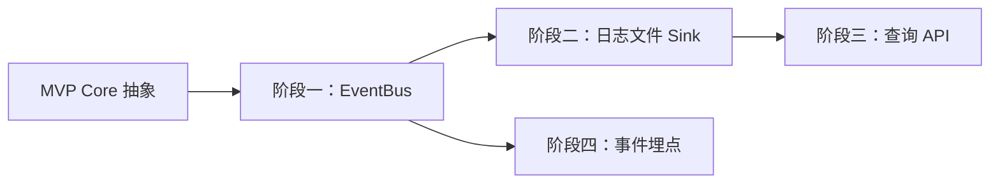

# 开发计划：审计日志与 EventBus（plan-alpha-02-audit-log）

## 1. 概述

本模块为 Flow Engine 引入事件总线与审计日志系统，使执行、保存、登录等关键操作可追溯，支持故障回放与安全审计。

覆盖范围：

- `IEventBus` 接口与内存实现（有界 Channel 背压、后台单线程消费）。
- `AuditEvent` 模型与事件类型定义。
- `AuditLogFileSink`（NDJSON 批量刷盘、每秒 Flush、关键事件同步刷盘）。
- 审计查询 API（按类型/时间/资源查询）。
- 各业务点埋点。

不覆盖：外部日志系统对接（GA）、日志归档与保留策略（Beta）。

事件模型、EventBus 接口签名、日志文件格式详见 [audit-log.md](../../architecture/audit-log.md)。

## 2. 交付物清单

- `IEventBus` 接口与 `InMemoryEventBus` 实现（有界 `Channel<T>` 容量 10000、后台单线程消费、订阅者异常隔离）。
- `AuditEvent` 模型（Id / EventType / Timestamp / Actor / ResourceType / ResourceId / Payload / Metadata）。
- 事件类型常量定义：`Workflow.*`、`Execution.*`、`Node.*`、`User.*`、`Credential.*`、`Webhook.*`。
- `AuditLogFileSink`（NDJSON 写入、每秒 Flush、关键事件同步刷盘、Dispose 时强制 Flush）。
- 审计查询 API：按 EventType / 时间范围 / ResourceType + ResourceId 查询。
- 各业务点埋点：工作流 CRUD、执行生命周期、节点执行、用户登录登出、凭据操作、Webhook 触发。
- 单元测试与集成测试。

## 3. 开发阶段

### 阶段一：EventBus 与内存实现

- **目标**：建立事件发布/订阅基础设施，支持背压与异常隔离。
- **核心任务**：
  - 实现 `IEventBus` 接口（`PublishAsync` / `Subscribe`），接口签名见 [audit-log.md §4.1](../../architecture/audit-log.md#41-eventbus-接口)。
  - `InMemoryEventBus` 使用有界 `Channel<T>`（容量 10000）做背压队列，后台单线程消费。
  - 每个订阅者独立 `try/catch`，异常写入 `InternalErrorSink`，不影响其他订阅者与事件发布。
  - 实现 `IDisposable`，关闭时完成 Channel、取消消费循环。
- **输入**：Core 层抽象契约（plan-mvp-02）。
- **输出**：可用的 EventBus 内存实现，支持发布订阅与异常隔离。
- **验收标准**：
  - 发布事件后订阅者收到。
  - 单个订阅者抛异常时，其他订阅者仍正常收到事件。
  - Channel 满时发布不阻塞主流程（按策略丢弃或记录告警）。
- **依赖**：plan-mvp-02 Core 抽象。

### 阶段二：日志文件 Sink

- **目标**：将审计事件持久化到 NDJSON 文件，保证关键事件不丢。
- **核心任务**：
  - 实现 `AuditLogFileSink`，订阅 EventBus 事件，写入 NDJSON 文件（格式见 [audit-log.md §4.3](../../architecture/audit-log.md#43-写入日志文件)）。
  - 普通事件异步入队，后台批量刷盘，每秒 Flush 一次。
  - 关键事件（凭据访问、凭据删除、执行删除）同步刷盘。
  - `Dispose` 时完成 Channel、取消 Timer、强制 Flush 并释放 Writer。
  - 日志文件按日期滚动。
- **输入**：EventBus 事件流、日志路径配置。
- **输出**：NDJSON 审计日志文件。
- **验收标准**：
  - 事件写入后日志文件中出现对应 NDJSON 行。
  - 普通事件 1 秒内落盘。
  - 关键事件同步落盘，进程异常退出不丢失。
  - Dispose 后文件正确关闭。
- **依赖**：阶段一 EventBus。

### 阶段三：审计查询 API

- **目标**：提供按类型、时间、资源查询审计事件的接口。
- **核心任务**：
  - 实现审计日志读取器：从 NDJSON 文件按条件过滤事件。
  - 查询维度：EventType、时间范围（起止时间）、ResourceType + ResourceId。
  - REST API：`GET /api/audit-events` 支持上述过滤与分页。
  - 支持按执行 ID 查询所有相关事件（ResourceType = "Execution"），为回放提供数据。
- **输入**：NDJSON 日志文件。
- **输出**：审计查询 API 与结果。
- **验收标准**：
  - 可按 EventType 过滤事件。
  - 可按时间范围过滤事件。
  - 可按 ResourceType + ResourceId 查询某次执行的全部事件。
  - 分页正确。
- **依赖**：阶段二日志文件。

### 阶段四：事件埋点

- **目标**：在所有关键业务点发布审计事件。
- **核心任务**：
  - 工作流 CRUD：`Workflow.Created` / `Workflow.Updated` / `Workflow.Deleted` / `Workflow.Activated` / `Workflow.Deactivated`。
  - 执行生命周期：`Execution.Started` / `Execution.Completed` / `Execution.Failed` / `Execution.Cancelled`。
  - 节点执行：`Node.Executed` / `Node.Error`。
  - 用户：`User.Login` / `User.Logout`。
  - 凭据：`Credential.Created`（只记录 ID，不记录值）。
  - Webhook：`Webhook.Triggered`。
  - 敏感信息过滤：凭据值、Token、私钥不落日志（见 [audit-log.md §7](../../architecture/audit-log.md#7-安全与隐私)）。
- **输入**：各业务模块代码。
- **输出**：业务操作产生对应审计事件。
- **验收标准**：
  - 保存工作流产生 `Workflow.Updated` 事件。
  - 执行工作流产生 `Execution.Started` → `Node.Executed` → `Execution.Completed` 事件链。
  - 登录产生 `User.Login` 事件。
  - 凭据事件不含明文值。
- **依赖**：阶段一 EventBus、plan-mvp-05 执行引擎、plan-mvp-06 持久化、plan-mvp-08 凭据。

## 4. 阶段依赖图

## 5. 风险与待定项

| 风险/待定项 | 影响 | 应对/说明 |
|-------------|------|-----------|
| Channel 满时事件丢失 | 审计不完整 | 关键事件同步刷盘；Channel 满时记录告警，不阻塞主流程 |
| 日志文件膨胀 | 磁盘占满 | Beta 阶段补齐日志归档与保留策略 |
| NDJSON 文件查询性能 | 大量事件时查询慢 | 当前按文件流式过滤；GA 阶段可对接 ELK |
| 敏感信息泄露 | 安全风险 | 埋点时显式过滤，凭据只记录 ID |

## 6. 验收总标准

- 执行/保存/登录等操作产生对应审计事件。
- 日志写入 NDJSON 文件，普通事件 1 秒内落盘，关键事件同步落盘。
- 可按 EventType、时间范围、ResourceType + ResourceId 查询事件。
- 敏感信息（密码、Token、私钥、凭据值）不落日志。
- 订阅者异常不影响其他订阅者与事件发布。

## 变更记录

| 日期 | 修改人 | 修改内容 | 关联任务 |
|------|--------|----------|----------|
| 2026-06-18 | Agent | 创建审计日志与 EventBus 开发计划 | Alpha 计划编写 |
