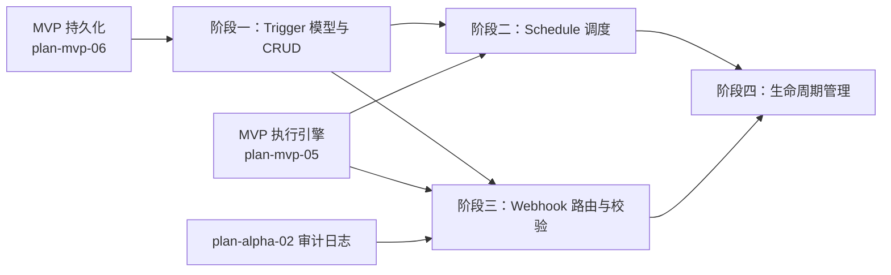

# 开发计划：触发器系统（plan-alpha-04-triggers）

## 1. 概述

本模块为 Flow Engine 引入 Schedule 与 Webhook 两类触发器，使工作流可被定时事件或外部 HTTP 请求自动驱动执行。

覆盖范围：

- Trigger 模型与 CRUD。
- Schedule 触发器（Quartz.NET Cron 调度）。
- Webhook 触发器（路由注册/签名验证/来源白名单/同步异步响应）。
- 触发器生命周期管理（激活注册/停用注销/删除级联）。
- 状态持久化（LastTriggeredAt / NextTriggerAt）与 WebhookRoute 持久化。
- 启动时从库加载路由与重新注册 Schedule Job。

不覆盖：轮询触发器（Beta）、动态路由（GA）、CORS 与速率限制（GA）。

触发器模型、Quartz 调度实现、状态持久化详见 [trigger-system.md](../../architecture/trigger-system.md)；Webhook 路由、签名验证、响应模式详见 [webhook.md](../../architecture/webhook.md)。

## 2. 交付物清单

- `Trigger` 模型（Id / WorkflowDefinitionId / WorkflowVersion / Type / Name / IsActive / Settings / LastTriggeredAt / NextTriggerAt，见 [trigger-system.md §2](../../architecture/trigger-system.md#2-触发器模型)）。
- `WebhookRoute` 模型（Path / Method / WorkflowDefinitionId / NodeDefinitionId / IsStatic，见 [webhook.md §4.2](../../architecture/webhook.md#42-路由表结构)）。
- 触发器 CRUD API 与持久化。
- `ScheduleTriggerJob`（Quartz `IJob` 实现，按 Cron 触发执行引擎，见 [trigger-system.md §3.2](../../architecture/trigger-system.md#32-调度实现quartznet)）。
- Quartz 调度器集成（单机 RAMJobStore）。
- Webhook 路由注册与注销（工作流激活/停用时同步）。
- Webhook 请求处理：签名验证（HMAC-SHA256）、来源白名单（IP/域名）、同步/异步响应（maxWaitTimeout）。
- 启动时从数据库加载 WebhookRoute 并注册到路由表。
- 启动时扫描 active Schedule 触发器重新注册 Quartz Job。
- 触发器状态更新（LastTriggeredAt / NextTriggerAt）。
- 审计埋点：`Webhook.Triggered` 事件。
- 单元测试与集成测试。

## 3. 开发阶段

### 阶段一：Trigger 模型与 CRUD

- **目标**：建立触发器数据模型与增删改查接口。
- **核心任务**：
  - 定义 `Trigger` 模型，`Type` 支持 "Schedule" 与 "Webhook"。
  - 定义 `WebhookRoute` 模型。
  - 实现触发器 CRUD API（创建/查询/更新/删除）。
  - 持久化到 SQLite（plan-mvp-06 持久化层）。
  - 删除工作流时级联删除关联触发器。
- **输入**：MVP 持久化层（plan-mvp-06）、工作流定义。
- **输出**：触发器可创建、查询、更新、删除。
- **验收标准**：
  - 可创建 Schedule 与 Webhook 类型触发器并持久化。
  - 可按工作流 ID 查询关联触发器。
  - 删除工作流时关联触发器被级联删除。
- **依赖**：plan-mvp-06 持久化。

### 阶段二：Schedule 调度（Quartz RAMJobStore）

- **目标**：Schedule 触发器按 Cron 表达式定时触发工作流。
- **核心任务**：
  - 集成 Quartz.NET，单机使用 RAMJobStore。
  - 实现 `ScheduleTriggerJob`（Quartz `IJob`），触发时调用执行引擎 `StartAsync`。
  - 工作流激活时注册 Quartz Job + Trigger（Cron 表达式 + 时区 + StartAt/EndAt）。
  - 工作流停用时注销对应 Quartz Job。
  - 修改 Cron 配置时先删除旧 Job 再重新注册。
  - 更新 `LastTriggeredAt` 与 `NextTriggerAt`。
  - 启动时扫描 active Schedule 触发器重新注册。
- **输入**：Trigger 模型（阶段一）、MVP 执行引擎。
- **输出**：Schedule 触发器按 Cron 定时触发。
- **验收标准**：
  - 配置 Cron `*/1 * * * * ?`（每秒）后，工作流每秒被触发一次。
  - 工作流停用后不再触发。
  - 修改 Cron 后按新表达式触发。
  - 服务重启后 active 触发器恢复调度。
  - `NextTriggerAt` 正确反映下次触发时间。
- **依赖**：阶段一、plan-mvp-05 执行引擎。

### 阶段三：Webhook 路由与校验

- **目标**：Webhook 触发器接收外部 HTTP 请求并触发工作流，支持签名验证与来源白名单。
- **核心任务**：
  - 实现 Webhook 请求处理端点（`POST /webhooks/{path}`）。
  - 工作流激活时扫描 Webhook 节点并注册 `WebhookRoute` 到数据库与内存路由表。
  - 工作流停用时注销路由。
  - 签名验证：HMAC-SHA256（见 [webhook.md §5.1](../../architecture/webhook.md#51-签名验证)），使用 `CryptographicOperations.FixedTimeEquals` 防时序攻击。
  - 来源白名单：IP 白名单与来源域名校验。
  - 同步响应模式：等待执行完成（受 maxWaitTimeout 限制），超时降级为 202 或返回 504。
  - 异步响应模式：立即返回 202 + executionId。
  - 未找到路由返回 404，不泄露系统信息。
  - 启动时从数据库加载 WebhookRoute 注册到路由表。
  - 发布 `Webhook.Triggered` 审计事件。
- **输入**：Trigger 模型（阶段一）、MVP 执行引擎、审计日志（plan-alpha-02）。
- **输出**：Webhook 可接收 HTTP 请求触发工作流。
- **验收标准**：
  - 外部 POST 请求到 Webhook 路径触发工作流执行。
  - 配置签名验证后，无签名或签名错误请求被拒绝。
  - 来源白名单外的 IP 被拒绝。
  - 同步模式下工作流完成后返回结果，超时返回 202 或 504。
  - 异步模式立即返回 202 + executionId。
  - 工作流停用后 Webhook 路由返回 404。
  - 服务重启后路由恢复。
  - Webhook 触发产生 `Webhook.Triggered` 审计事件。
- **依赖**：阶段一、plan-mvp-05 执行引擎、plan-alpha-02 审计日志。

### 阶段四：生命周期管理

- **目标**：触发器与工作流生命周期联动，状态正确持久化。
- **核心任务**：
  - 工作流保存时扫描触发器节点，upsert 触发器记录。
  - 工作流激活时注册所有 active 触发器（Schedule + Webhook）。
  - 工作流停用时注销对应触发器。
  - 工作流版本更新时，触发器默认绑定旧版本（见 [trigger-system.md §5](../../architecture/trigger-system.md#5-状态持久化)）。
  - 触发器状态（LastTriggeredAt / NextTriggerAt / IsActive）持久化。
- **输入**：阶段二、阶段三。
- **输出**：触发器生命周期与工作流联动。
- **验收标准**：
  - 激活工作流后触发器生效，停用后失效。
  - 触发器状态持久化，重启后恢复。
  - 工作流版本更新后触发器仍绑定旧版本。
- **依赖**：阶段二、阶段三。

## 4. 阶段依赖图

## 5. 风险与待定项

| 风险/待定项 | 影响 | 应对/说明 |
|-------------|------|-----------|
| Quartz RAMJobStore 重启丢任务 | 调度中断 | 启动时扫描 active 触发器重新注册 |
| Webhook 路径冲突 | 后激活工作流报错 | 路径全局唯一校验，冲突时报错 |
| 同步响应超时占用连接 | HTTP 连接耗尽 | maxWaitTimeout 限制，超时降级异步 |
| 时区处理错误 | Schedule 触发时间偏差 | 明确配置时区，默认 UTC |
| 多实例下重复触发 | 重复执行 | 单机不涉及；GA 阶段切换 ADO.NET JobStore |

## 6. 验收总标准

- Schedule 触发器按 Cron 表达式触发工作流执行。
- Webhook 接收外部 HTTP 请求并触发工作流执行。
- 工作流停用后 Webhook 路由返回 404。
- 触发器状态（LastTriggeredAt / NextTriggerAt）持久化。
- 签名验证（HMAC-SHA256）与来源白名单生效。
- 服务重启后触发器与 Webhook 路由恢复。
- Webhook 触发产生审计事件。

## 变更记录

| 日期 | 修改人 | 修改内容 | 关联任务 |
|------|--------|----------|----------|
| 2026-06-18 | Agent | 创建触发器系统开发计划 | Alpha 计划编写 |
