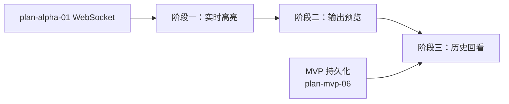

# 开发计划：节点执行视图（plan-alpha-05-execution-view）

## 1. 概述

本模块为前端提供执行实时视图与历史回看能力。基于 WebSocket 推送的执行事件，前端可实时观察节点高亮变化与输出预览，并支持查看历史执行记录。

覆盖范围：

- 执行实时视图（节点高亮、输出预览）。
- 订阅 WebSocket 执行事件。
- 执行历史回看。

不覆盖：Agent 执行视图（LLM 思考过程、tool 调用链，Beta）、流式输出展示（Beta）。

前端职责见 [overview.md §3.1](../../architecture/overview.md#31-前端)。

## 2. 交付物清单

- 执行实时视图组件：节点高亮（Running / Completed / Error 状态）、输出预览面板。
- WebSocket 事件订阅与分发逻辑（基于 plan-alpha-01 客户端 Hook）。
- 节点输出预览：点击节点查看输出数据摘要。
- 执行历史列表：按时间倒序展示历史执行。
- 执行详情回看：查看某次历史执行的节点执行记录与输出。
- 单元测试与 E2E 测试。

## 3. 开发阶段

### 阶段一：实时高亮

- **目标**：执行过程中画布节点状态实时变化。
- **核心任务**：
  - 订阅 WebSocket 执行事件（ExecutionStarted / NodeExecuted / NodeError / ExecutionCompleted）。
  - 根据事件更新节点状态：Running（执行中）、Completed（完成）、Error（错误）、Skipped（跳过）。
  - 节点状态映射为视觉样式（边框颜色、图标、动画）。
  - 执行完成后重置节点状态。
- **输入**：WebSocket 事件流（plan-alpha-01）。
- **输出**：执行中节点高亮实时变化。
- **验收标准**：
  - 执行启动后入口节点变为 Running。
  - 节点执行完成后变为 Completed。
  - 节点出错时变为 Error 并显示错误标记。
  - 执行完成后所有节点状态稳定。
- **依赖**：plan-alpha-01 WebSocket 推送。

### 阶段二：输出预览

- **目标**：点击节点可查看其输出数据。
- **核心任务**：
  - 节点输出预览面板：点击节点时展示该节点的输出摘要。
  - 输出数据格式化展示（JSON 折叠/展开）。
  - 大数据量时截断显示并提示完整数据可拉取。
  - 错误节点展示错误信息。
- **输入**：WebSocket 节点输出推送、执行记录查询 API。
- **输出**：可预览节点输出。
- **验收标准**：
  - 点击 Completed 节点显示输出数据。
  - 点击 Error 节点显示错误信息。
  - 大数据量输出被截断并提示。
- **依赖**：阶段一。

### 阶段三：历史回看

- **目标**：查看历史执行记录与节点输出。
- **核心任务**：
  - 执行历史列表：按工作流 ID 查询历史执行，按时间倒序展示。
  - 执行详情页：展示某次执行的节点执行记录、状态、输出、耗时。
  - 历史回看不依赖 WebSocket，从执行记录 API 拉取数据。
  - 支持按执行状态（成功/失败/取消）过滤。
- **输入**：执行记录查询 API（plan-mvp-06、plan-mvp-11）。
- **输出**：可查看历史执行详情。
- **验收标准**：
  - 执行历史列表按时间倒序展示。
  - 可查看某次执行的各节点状态与输出。
  - 可按执行状态过滤。
- **依赖**：阶段二、plan-mvp-06 持久化、plan-mvp-11 手动执行。

## 4. 阶段依赖图

## 5. 风险与待定项

| 风险/待定项 | 影响 | 应对/说明 |
|-------------|------|-----------|
| 高频事件导致前端渲染卡顿 | 实时视图不流畅 | 事件节流/批量更新；输出预览按需拉取 |
| 历史执行数据量大 | 列表加载慢 | 分页加载；后续可加索引优化 |
| 节点输出含敏感信息 | 数据泄露 | 输出预览遵循凭据脱敏规则 |

## 6. 验收总标准

- 执行中节点高亮状态实时变化（Running → Completed / Error）。
- 可点击节点预览输出数据。
- 可查看历史执行列表与详情。
- 执行视图不阻塞画布编辑操作。

## 变更记录

| 日期 | 修改人 | 修改内容 | 关联任务 |
|------|--------|----------|----------|
| 2026-06-18 | Agent | 创建节点执行视图开发计划 | Alpha 计划编写 |
