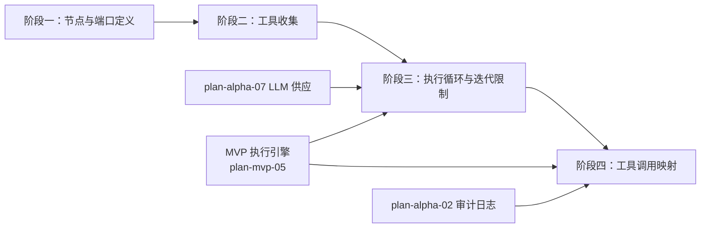

# 开发计划：Agent 节点基础（plan-alpha-06-agent-basics）

## 1. 概述

本模块引入 AI Agent 节点基础能力，使工作流可包含自主决策循环的 AI 节点。Agent 节点通过工具端口连接下游 tool 节点，执行时收集可用工具并交给 LLM 决策调用。

覆盖范围：

- Agent 节点（`INodeType` 实现）。
- Agent 工具端口（`PortType.AgentTool`，Output 方向）。
- 工具收集机制（`CollectTools` 扫描下游 tool 节点）。
- LLM 调用循环（最大迭代次数限制、超时）。
- LLM 工具调用 → 引擎内部执行请求映射。
- `ToolDefinition` 模型。

不覆盖：子 Agent 嵌套与内联解析器（Beta）、流式输出（Beta）、记忆端口实现（Beta）。

Agent 节点执行流程、端口类型、工具收集机制详见 [agent-and-tool.md](../../architecture/agent-and-tool.md)。

## 2. 交付物清单

- Agent 节点实现（`INodeType`，`TypeName = "Agent"`）。
- Agent 工具端口定义（`PortType.AgentTool`，`PortDirection.Output`，见 [agent-and-tool.md §4](../../architecture/agent-and-tool.md#4-agent-节点的端口类型)）。
- `CollectTools` 方法：扫描 Agent 工具端口连接的下游 tool 节点，生成 `ToolDefinition` 列表（见 [agent-and-tool.md §5](../../architecture/agent-and-tool.md#5-工具收集机制)）。
- `ToolDefinition` 模型（字段定义见 terminology 核心数据模型）。
- LLM 调用循环：调用 LLM → 解析 tool_calls → 映射为引擎执行请求 → 执行 tool 节点 → 结果回填 LLM → 循环直到无 tool_calls 或达到上限。
- 最大迭代次数限制（可配置）。
- LLM 调用超时控制。
- LLM 工具调用 → 引擎内部执行请求映射（见 [agent-and-tool.md §7](../../architecture/agent-and-tool.md#7-llm-工具调用--引擎请求映射)）。
- 单元测试与集成测试。

## 3. 开发阶段

### 阶段一：Agent 节点与端口定义

- **目标**：定义 Agent 节点类型与工具端口，使其可被节点注册中心识别。
- **核心任务**：
  - 实现 Agent 节点（`INodeType`），声明 `TypeName`、端口定义。
  - 定义 Agent 工具端口（`PortType.AgentTool`，`PortDirection.Output`）。
  - 定义 LLM 供应端口（`PortType.LLM`，`PortDirection.Input`，消费侧）。
  - 定义主数据端口（输入）。
  - 节点参数：最大迭代次数、超时、Prompt 模板。
  - 注册到节点注册中心，前端节点面板可见。
- **输入**：MVP 节点系统（plan-mvp-03）、Core 抽象（plan-mvp-02）。
- **输出**：Agent 节点可拖入画布并连线。
- **验收标准**：
  - Agent 节点出现在前端节点面板。
  - 可拖入画布并连接下游 tool 节点（通过 Agent 工具端口）。
  - 可连接 LLM 供应节点（通过 LLM 供应端口）。
- **依赖**：plan-mvp-03 节点系统、plan-mvp-02 Core 抽象。

### 阶段二：工具收集

- **目标**：Agent 节点执行前收集所有可用工具。
- **核心任务**：
  - 实现 `CollectTools`：扫描 Agent 工具端口（Output 方向）连接的下游 tool 节点。
  - 对每个 tool 节点生成 `ToolDefinition`（名称、描述、ParametersSchema）。
  - `ParametersSchema` 优先从工具节点的 `ParameterDefinition` 推导。
  - 工具节点声明 `{{ai_param:描述}}` 占位符时，转为结构化参数（见 [agent-and-tool.md §8.4](../../architecture/agent-and-tool.md#84-schema-感知)）。
- **输入**：工作流定义（节点 + 连线）、tool 节点定义。
- **输出**：Agent 执行时获得可用工具列表。
- **验收标准**：
  - Agent 节点执行时收集到所有通过工具端口连接的 tool 节点。
  - 每个工具生成 `ToolDefinition`，包含名称、描述、参数 Schema。
  - 无工具连接时返回空列表。
- **依赖**：阶段一、plan-mvp-03 节点系统。

### 阶段三：执行循环与迭代限制

- **目标**：Agent 节点通过 LLM 循环调用工具直到完成或达到上限。
- **核心任务**：
  - 构建执行上下文：加载模型实例（从 LLM 供应端口）、Prompt、工具列表。
  - 调用 LLM，解析返回的 tool_calls。
  - 无 tool_calls 时返回最终结果。
  - 有 tool_calls 时映射为引擎内部执行请求，执行对应 tool 节点。
  - tool 执行结果回填 LLM，继续循环。
  - 最大迭代次数限制：达到上限时终止并返回当前结果。
  - LLM 调用超时控制。
- **输入**：工具列表（阶段二）、LLM 供应节点（plan-alpha-07）、MVP 执行引擎。
- **输出**：Agent 节点可完成一次执行。
- **验收标准**：
  - Agent 调用 LLM 后，LLM 决定调用 tool 时正确执行对应节点。
  - tool 结果回填 LLM 后继续决策。
  - LLM 决定不调用 tool 时返回最终结果。
  - 达到最大迭代次数时终止执行。
  - LLM 调用超时时终止执行。
- **依赖**：阶段二、plan-alpha-07 LLM 供应节点、plan-mvp-05 执行引擎。

### 阶段四：工具调用映射

- **目标**：LLM 工具调用描述正确转为引擎可执行的内部请求。
- **核心任务**：
  - 将 LLM 返回的 tool_calls 解析为引擎内部执行请求（携带目标节点、输入参数、调用 ID）。
  - 引擎执行目标 tool 节点，收集结果。
  - 结果格式化后回填 LLM（见 [agent-and-tool.md §7](../../architecture/agent-and-tool.md#7-llm-工具调用--引擎请求映射)）。
  - tool 执行生成 `NodeExecutionRecord`，接受错误策略与审计。
- **输入**：阶段三、MVP 执行引擎。
- **输出**：LLM 工具调用与引擎执行正确映射。
- **验收标准**：
  - LLM 返回 tool_calls 后，对应 tool 节点被执行。
  - tool 执行结果正确回填 LLM。
  - tool 执行生成执行记录。
  - tool 执行错误时不导致 Agent 崩溃（按错误策略处理）。
- **依赖**：阶段三、plan-mvp-05 执行引擎、plan-alpha-02 审计日志。

## 4. 阶段依赖图

## 5. 风险与待定项

| 风险/待定项       | 影响             | 应对/说明                      |
| ----------------- | ---------------- | ------------------------------ |
| LLM 无限调用 tool | 资源耗尽         | 最大迭代次数与超时双重限制     |
| LLM 返回格式异常  | 解析失败         | 容错解析，异常时终止并返回错误 |
| tool 执行超时     | Agent 阻塞       | tool 执行受引擎超时控制        |
| 工具收集遗漏      | LLM 缺少可用工具 | 单元测试覆盖多种连线拓扑       |

## 6. 验收总标准

- Agent 节点能收集通过工具端口连接的 tool 节点。
- Agent 调用至少一个 tool 并完成一次执行。
- 达到最大迭代次数时终止执行。
- LLM 调用超时时终止执行。
- tool 执行生成执行记录，可被审计。

## 变更记录

| 日期       | 修改人 | 修改内容                    | 关联任务       |
| ---------- | ------ | --------------------------- | -------------- |
| 2026-06-18 | Agent  | 创建 Agent 节点基础开发计划 | Alpha 计划编写 |
