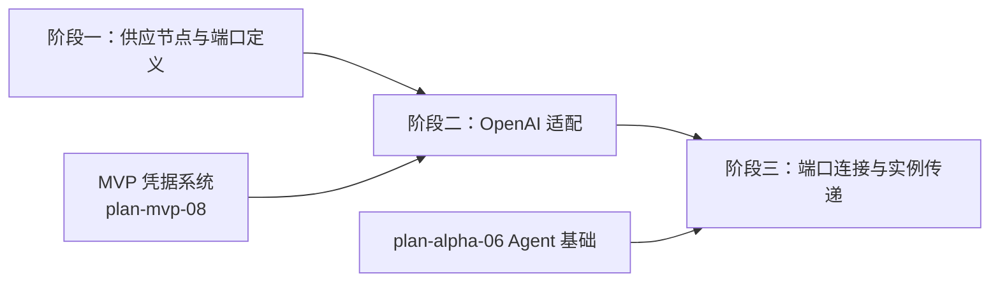

# 开发计划：LLM 供应节点（plan-alpha-07-llm-supply）

## 1. 概述

本模块引入 LLM 供应节点，将模型配置（API Key、模型版本、温度等）集中管理，通过供应端口向 Agent / LLM Transform 等消费节点提供模型实例。

覆盖范围：

- LLM 供应节点（`PortType.LLMSupply`，Output 方向）。
- OpenAI 适配（API Key 凭据、模型配置、温度）。
- 供应端口连接消费节点（Agent / LLM Transform）。
- 模型实例传递给父节点。

不覆盖：Fallback 模型（GA）、批处理（GA）、流式响应（Beta）、自定义 LLM 适配器（GA）。

供应端口与消费节点关系见 [agent-and-tool.md §3.4](../../architecture/agent-and-tool.md#34-与-llm-供应节点的关系) 与 [agent-and-tool.md §4](../../architecture/agent-and-tool.md#4-agent-节点的端口类型)。

## 2. 交付物清单

- LLM 供应节点实现（`INodeType`，`TypeName = "LLMSupply"` 或 `OpenAI`）。
- LLM 供应端口定义（`PortType.LLMSupply`，`PortDirection.Output`）。
- OpenAI 适配器：调用 OpenAI API（Chat Completions），支持模型配置、温度、API Key 凭据注入。
- 模型实例抽象：供应节点输出模型实例（非数据），消费节点通过供应端口获取。
- 凭据注入：API Key 通过 `ICredentialAccessor` 注入（plan-mvp-08）。
- 节点参数：模型名称、温度、max_tokens、凭据选择器。
- 单元测试与集成测试。

## 3. 开发阶段

### 阶段一：供应节点与端口定义

- **目标**：定义 LLM 供应节点类型与供应端口，使其可被节点注册中心识别。
- **核心任务**：
  - 实现 LLM 供应节点（`INodeType`），声明 `TypeName`、端口定义。
  - 定义 LLM 供应端口（`PortType.LLMSupply`，`PortDirection.Output`）。
  - 节点参数：模型名称、温度、max_tokens、凭据选择器。
  - 注册到节点注册中心，前端节点面板可见。
  - 供应节点不返回普通数据，只返回模型实例（供应模式）。
- **输入**：MVP 节点系统（plan-mvp-03）、Core 抽象（plan-mvp-02）。
- **输出**：LLM 供应节点可拖入画布。
- **验收标准**：
  - LLM 供应节点出现在前端节点面板。
  - 可拖入画布并配置模型名称、温度、凭据。
  - 供应端口（Output 方向）可连接到 Agent 节点的 LLM 供应端口（Input 方向）。
- **依赖**：plan-mvp-03 节点系统、plan-mvp-02 Core 抽象。

### 阶段二：OpenAI 适配

- **目标**：供应节点能调用 OpenAI API 并返回模型实例。
- **核心任务**：
  - 实现 OpenAI 适配器：调用 Chat Completions API。
  - API Key 通过 `ICredentialAccessor` 从凭据系统注入（plan-mvp-08）。
  - 支持模型配置：模型名称（如 `gpt-4`）、温度、max_tokens。
  - 模型实例抽象：封装 OpenAI 客户端，供消费节点调用。
  - 调用超时与错误处理。
- **输入**：凭据系统（plan-mvp-08）、OpenAI API。
- **输出**：供应节点可创建 OpenAI 模型实例。
- **验收标准**：
  - 配置有效 API Key 后，供应节点可创建 OpenAI 客户端实例。
  - API Key 从凭据系统注入，不硬编码。
  - 调用失败时返回友好错误。
- **依赖**：阶段一、plan-mvp-08 凭据系统。

### 阶段三：端口连接与实例传递

- **目标**：供应端口连接消费节点，模型实例传递给父节点。
- **核心任务**：
  - 消费节点（Agent / LLM Transform）通过 LLM 供应端口（Input 方向）获取模型实例。
  - 引擎执行消费节点时，从供应端口连接的供应节点获取模型实例。
  - 供应节点先于消费节点执行（引擎保证拓扑顺序）。
  - 模型实例传递到消费节点的执行上下文。
- **输入**：阶段二、Agent 节点（plan-alpha-06）。
- **输出**：消费节点可使用供应节点提供的模型实例。
- **验收标准**：
  - OpenAI 供应节点连接 Agent 节点后，Agent 执行时获得模型实例。
  - Agent 使用该模型实例调用 LLM 完成 tool 调用。
  - 凭据通过 `ICredentialAccessor` 注入，不暴露明文。
- **依赖**：阶段二、plan-alpha-06 Agent 节点基础。

## 4. 阶段依赖图

## 5. 风险与待定项

| 风险/待定项 | 影响 | 应对/说明 |
|-------------|------|-----------|
| OpenAI API 不可达 | 供应失败 | 错误友好提示；GA 阶段补 Fallback 模型 |
| API Key 泄露 | 安全风险 | 通过 `ICredentialAccessor` 注入，不落日志 |
| 模型实例传递机制设计 | 与现有执行引擎集成 | 供应端口走特殊数据流，不作为普通 DataItem |
| 多消费节点复用同一供应节点 | 实例管理 | 当前每次执行创建实例；GA 阶段可引入连接池 |

## 6. 验收总标准

- OpenAI 供应节点可连接 Agent 节点。
- 供应节点提供模型实例，Agent 使用该实例调用 LLM。
- API Key 凭据通过 `ICredentialAccessor` 注入，不硬编码、不落日志。
- 模型配置（名称、温度、max_tokens）生效。

## 变更记录

| 日期 | 修改人 | 修改内容 | 关联任务 |
|------|--------|----------|----------|
| 2026-06-18 | Agent | 创建 LLM 供应节点开发计划 | Alpha 计划编写 |
