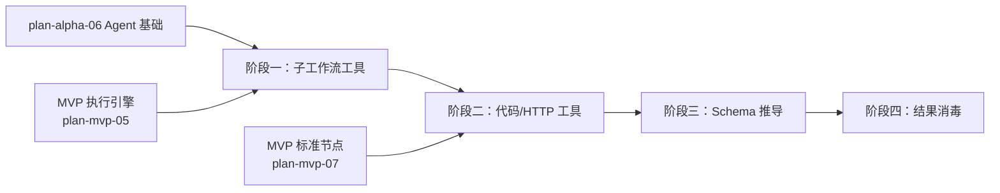

# 开发计划：工具基础（plan-alpha-08-tool-basics）

## 1. 概述

本模块实现 Agent 可调用的基础工具类型，使 Agent 能够通过子工作流、代码片段、HTTP 请求等方式执行实际任务。同时实现 Schema 自动推导与工具结果消毒，保障安全与可用性。

覆盖范围：

- 子工作流工具（参数嵌入 JSON 方式）。
- 代码片段工具。
- HTTP 工具。
- Schema 推导（从 `ParameterDefinition` 推导 `ParametersSchema`、`{{ai_param:描述}}` 占位符转结构化参数）。
- 工具结果消毒（长度截断、模式过滤 prompt injection、结构化包装、敏感信息过滤）。

不覆盖：数据库加载子工作流（Beta）、子 Agent 工具（Beta）、MCP 工具集（Enterprise）、重试配置（Beta）。

工具类型、Schema 感知、结果消毒详见 [agent-and-tool.md §6](../../architecture/agent-and-tool.md#6-工具类型) 与 [agent-and-tool.md §8](../../architecture/agent-and-tool.md#8-工作流作为工具workflow-as-tool)。

## 2. 交付物清单

- 子工作流工具节点：通过参数嵌入 JSON 方式定义子工作流，作为 tool 被 Agent 调用。
- 代码片段工具节点：沙箱执行用户代码片段。
- HTTP 工具节点：发送 HTTP 请求。
- Schema 推导：从工具节点的 `ParameterDefinition` 推导 `ParametersSchema`。
- `{{ai_param:描述}}` 占位符解析：转为结构化参数描述，LLM 按结构传参（见 [agent-and-tool.md §8.4](../../architecture/agent-and-tool.md#84-schema-感知)）。
- 工具结果消毒：长度截断、prompt injection 模式过滤、结构化包装、敏感信息过滤（见 [agent-and-tool.md §11.1](../../architecture/agent-and-tool.md#111-tool-结果消毒)）。
- 单元测试与集成测试。

## 3. 开发阶段

### 阶段一：子工作流工具

- **目标**：子工作流可作为 tool 被 Agent 调用。
- **核心任务**：
  - 实现子工作流工具节点：通过参数嵌入 JSON 方式定义子工作流（见 [agent-and-tool.md §8.2](../../architecture/agent-and-tool.md#82-子工作流来源) "参数"来源）。
  - LLM 调用该 tool 时，执行嵌入的子工作流。
  - 等待子工作流完成，格式化结果返回 LLM。
  - 工具输入验证：校验 LLM 传入的参数。
- **输入**：Agent 节点（plan-alpha-06）、MVP 执行引擎。
- **输出**：子工作流可作为 tool 被调用。
- **验收标准**：
  - Agent 调用子工作流工具时，子工作流被执行。
  - 子工作流结果格式化后返回 LLM。
  - 工具输入验证生效，非法参数被拒绝。
- **依赖**：plan-alpha-06 Agent 节点基础、plan-mvp-05 执行引擎。

### 阶段二：代码片段工具与 HTTP 工具

- **目标**：提供代码执行与 HTTP 请求两类基础工具。
- **核心任务**：
  - 代码片段工具节点：在沙箱中执行用户编写的代码片段（复用 MVP Code 节点沙箱机制）。
  - HTTP 工具节点：发送 HTTP 请求（GET/POST/PUT/DELETE），支持 URL、请求头、请求体参数。
  - 两类工具均可被 Agent 通过工具端口调用。
  - 工具执行结果格式化为字符串返回 LLM。
- **输入**：阶段一、MVP 标准节点（plan-mvp-07）。
- **输出**：代码片段与 HTTP 工具可用。
- **验收标准**：
  - Agent 调用代码片段工具时，代码被执行，结果返回 LLM。
  - Agent 调用 HTTP 工具时，HTTP 请求发出，响应返回 LLM。
  - 代码片段在沙箱中执行，无法访问危险资源。
- **依赖**：阶段一、plan-mvp-07 标准节点。

### 阶段三：Schema 推导

- **目标**：工具参数 Schema 自动推导，LLM 按结构传参。
- **核心任务**：
  - 从工具节点的 `ParameterDefinition` 推导 `ParametersSchema`（JSON Schema 格式）。
  - 解析 `{{ai_param:描述}}` 占位符：转为结构化参数描述（见 [agent-and-tool.md §8.4](../../architecture/agent-and-tool.md#84-schema-感知)）。
  - 含占位符的工具自动升级为结构化工具，LLM 收到结构化参数描述。
  - 无占位符的工具作为简单工具，LLM 收到任意字符串参数。
- **输入**：阶段一、阶段二、工具节点参数定义。
- **输出**：工具 Schema 自动推导。
- **验收标准**：
  - 工具节点有 `ParameterDefinition` 时，`ParametersSchema` 正确推导。
  - `{{ai_param:要查询的日期}}` 占位符转为结构化参数描述。
  - LLM 收到结构化参数描述后按结构传参。
- **依赖**：阶段一、阶段二。

### 阶段四：结果消毒

- **目标**：tool 执行结果返回 LLM 前消毒，防止提示注入与信息泄露。
- **核心任务**：
  - 长度截断：超过阈值（如 32K 字符）的结果截断并附加省略说明（见 [agent-and-tool.md §11.1](../../architecture/agent-and-tool.md#111-tool-结果消毒)）。
  - 模式过滤：过滤已知 prompt injection 模式（如 `ignore previous instructions`、`<system>` 等）。
  - 结构化包装：tool 结果用 JSON 包裹，标注来源与类型（如 `{"tool":"queryDatabase","status":"success","result":{...}}`）。
  - 敏感信息过滤：移除结果中可能包含的凭据、Token、私钥。
- **输入**：阶段一至三。
- **输出**：tool 结果消毒生效。
- **验收标准**：
  - 超长结果被截断并附加省略说明。
  - prompt injection 模式被过滤。
  - 结果以结构化 JSON 包装返回 LLM。
  - 结果中的凭据、Token、私钥被移除。
- **依赖**：阶段一至三。

## 4. 阶段依赖图

## 5. 风险与待定项

| 风险/待定项 | 影响 | 应对/说明 |
|-------------|------|-----------|
| 子工作流执行超时 | Agent 阻塞 | 子工作流受引擎超时控制 |
| 代码片段沙箱逃逸 | 安全风险 | 复用 MVP Code 节点沙箱，限制资源与时间 |
| Schema 推导不完整 | LLM 传参错误 | 单元测试覆盖多种参数类型 |
| prompt injection 模式遗漏 | LLM 被注入 | 维护模式列表；当前按已知模式过滤，GA 阶段增强 |
| 敏感信息过滤误判 | 正常数据被移除 | 按模式匹配，可配置白名单 |

## 6. 验收总标准

- 子工作流可作为 tool 被 Agent 调用并返回结果。
- 代码片段工具与 HTTP 工具可被 Agent 调用。
- 工具 Schema 从 `ParameterDefinition` 自动推导。
- `{{ai_param:描述}}` 占位符转为结构化参数，LLM 按结构传参。
- tool 结果消毒生效：长度截断、prompt injection 过滤、结构化包装、敏感信息移除。

## 变更记录

| 日期 | 修改人 | 修改内容 | 关联任务 |
|------|--------|----------|----------|
| 2026-06-18 | Agent | 创建工具基础开发计划 | Alpha 计划编写 |
