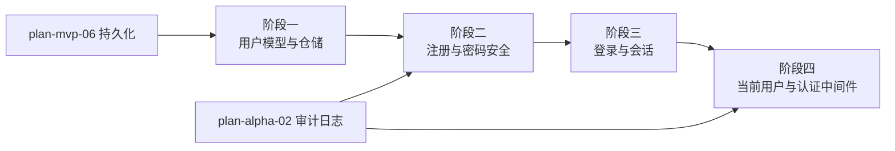

# 开发计划：用户系统（plan-alpha-09-user-system）

## 1. 概述

本模块建立 Flow Engine 的用户与认证基础设施，为 Beta 阶段的 RBAC 权限、GA 阶段的 SSO 单点登录以及审计日志中的 `Actor` 追踪提供基础。Alpha 阶段的用户系统聚焦本地账号体系：用户模型、注册、登录、会话管理与认证中间件。

覆盖范围：

- 用户实体与仓储（User、UserRole、Session）。
- 注册与密码安全（ bcrypt/Argon2 / PBKDF2 哈希、强度校验）。
- 登录与会话（JWT 或 Cookie-based，统一 `IUserContext`）。
- 当前用户获取与认证中间件（`[Authorize]`、`IUserContext` 注入）。
- 用户 CRUD 与密码重置（管理员视角）。

不覆盖范围：

- RBAC 角色与权限模型本身（Beta plan-beta-01）。
- SSO / SAML / OIDC（GA plan-ga-06）。
- LDAP 目录同步（Enterprise plan-enterprise-06）。
- 多因素认证（MFA）。

## 2. 交付物清单

- `src/FlowEngine.Core/Identity/User.cs`、`UserRole.cs` 等实体与值对象。
- `src/FlowEngine.Infrastructure/Identity/UserStore.cs`（仓储实现）。
- `src/FlowEngine.Application/Identity/AuthenticationService.cs`（注册/登录/密码校验）。
- `src/FlowEngine.Host/Controllers/AuthController.cs`（注册/登录/登出/当前用户 API）。
- `src/FlowEngine.Host/Middlewares/CurrentUserMiddleware.cs`（解析会话并注入 `IUserContext`）。
- `src/FlowEngine.Application/Identity/IUserContext.cs`（当前用户抽象）。
- 单元测试：密码哈希、登录校验、会话解析、认证中间件。

## 3. 开发阶段

### 阶段一：用户模型与仓储

- 目标：定义用户实体与持久化仓储。
- 核心任务：
  - 定义 `User` 实体：Id、Email、UserName、PasswordHash、DisplayName、CreatedAt、UpdatedAt、IsActive。
  - 定义 `UserRole` 关联（多对多），为 Beta RBAC 预留角色关联表（Alpha 阶段可仅保存字符串角色）。
  - 定义 `IUserStore` 接口：CreateAsync、GetByIdAsync、GetByEmailAsync、UpdateAsync、DeleteAsync。
  - 实现 SQLite/EF Core 仓储。
  - 数据库迁移。
- 输入：[terminology.md](../../architecture/terminology.md) §9.4 数据库命名规范。
- 输出：用户实体、仓储接口与实现。
- 验收标准：
  - 用户可创建、按邮箱查询、按 ID 查询。
  - 数据库表名符合 `users`、`user_roles` 约定。
  - 密码哈希字段不存明文。
- 依赖：plan-mvp-01 项目骨架、plan-mvp-06 持久化。

### 阶段二：注册与密码安全

- 目标：实现安全的用户注册流程。
- 核心任务：
  - 密码哈希：使用 ASP.NET Core Identity PasswordHasher 或独立实现（推荐 PBKDF2 / bcrypt / Argon2）。
  - 密码强度策略：最小长度、复杂度要求（可配置）。
  - 注册 API：`POST /api/v1/auth/register`。
  - 邮箱唯一性校验。
  - 注册事件 `User.Registered` 写入审计日志（依赖 plan-alpha-02）。
- 输入：[audit-log.md](../../architecture/audit-log.md) §3 事件源。
- 输出：注册服务与 API。
- 验收标准：
  - 注册时密码以哈希存储，不可逆。
  - 重复邮箱返回明确错误。
  - 弱密码被拒绝。
  - 注册成功后生成审计事件。
- 依赖：阶段一、plan-alpha-02 审计日志。

### 阶段三：登录与会话

- 目标：实现登录认证与会话管理。
- 核心任务：
  - 登录 API：`POST /api/v1/auth/login`，验证邮箱+密码。
  - 会话方案选型：JWT（Bearer Token）或 Cookie-based Session。
  - JWT 方案：签发 Access Token（短期）+ Refresh Token（可选）；Cookie 方案：使用 ASP.NET Core Cookie Authentication。
  - 登出 API：使会话失效。
  - 密码错误次数限制（防暴力破解）。
- 输入：[deployment.md](../../architecture/deployment.md) §10 安全与权限。
- 输出：登录、登出、会话管理。
- 验收标准：
  - 正确凭据登录后返回 Token 或建立 Session。
  - 错误密码返回 401，不泄露用户是否存在。
  - 登出后原 Token/Session 不可用。
  - 登录事件写入审计日志。
- 依赖：阶段二。

### 阶段四：当前用户与认证中间件

- 目标：在 HTTP 管道中解析当前用户并注入业务层。
- 核心任务：
  - 实现 `CurrentUserMiddleware`：从请求头 Cookie 解析用户身份，注入 `IUserContext`。
  - 实现 `IUserContext`：提供 UserId、Email、Roles、IsAuthenticated。
  - 实现 `[Authorize]` 属性或策略基线（Alpha 阶段仅要求登录，Beta 阶段扩展角色权限）。
  - 在审计事件、执行记录中填充 `Actor`。
- 输入：[audit-log.md](../../architecture/audit-log.md) §2 AuditEvent.Actor。
- 输出：认证中间件与当前用户上下文。
- 验收标准：
  - 已登录请求可正确解析 `IUserContext.UserId`。
  - 未登录请求访问受保护端点返回 401。
  - 审计事件中的 `Actor` 为当前用户标识。
- 依赖：阶段三、plan-alpha-02 审计日志。

## 4. 阶段依赖图

## 5. 风险与待定项

| 风险/待定项 | 影响 | 应对策略 |
|------------|------|---------|
| 密码哈希算法选型 | 安全强度与性能权衡 | 默认使用 ASP.NET Core Identity PasswordHasher（PBKDF2），未来可配置 Argon2 |
| 会话 Token 泄露 | 未授权访问 | Access Token 短 TTL；Cookie 启用 HttpOnly/Secure/SameSite |
| 暴力破解登录 | 账号被盗 | 密码错误次数限制、登录审计、IP 异常检测 |
| JWT 与 Cookie 方案取舍 | 影响前端集成与 SSO 扩展 | Alpha 默认 JWT（便于 API 测试与 SPA）；GA SSO 阶段保留统一认证抽象 |

## 6. 验收总标准

- 用户可注册、登录、登出。
- 密码以安全哈希存储，不返回明文。
- 受保护 API 未登录访问返回 401。
- `IUserContext` 在业务层可正确获取当前用户。
- 注册/登录/登出事件写入审计日志。
- 单元测试覆盖率 ≥ 60%（与 Alpha 阶段整体门槛一致）。

## 变更记录

| 日期 | 修改人 | 修改内容 | 关联任务 |
|------|--------|----------|----------|
| 2026-06-18 | Agent | 创建 Alpha 用户系统开发计划，补齐 RBAC/SSO 前置依赖 | 计划 review 修复 |
