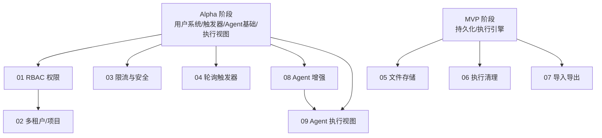

# Beta 阶段开发计划说明（plan-beta-00-readme）

## 1. 概述

Beta 阶段在 Alpha 已具备的执行引擎、触发器、审计日志、AI Agent 基础能力之上，补齐企业落地所需的基础能力：权限、多租户、安全、文件、Agent 增强。本阶段不引入 Redis 队列、独立 Worker 等多机组件（属于 GA），所有能力在单机后台服务中承载，符合 [deployment.md](../../architecture/deployment.md) §7.1 的"单机可承载"分类。

本文件作为 Beta 阶段的入口，描述 10 个模块的依赖关系、整体验收标准与质量门槛。各模块的具体交付物、阶段划分与验收标准见对应的 `plan-beta-NN-*.md`。

### 1.1 覆盖范围

- RBAC 权限（角色/Scope/中间件/资源级校验）
- 多租户/项目（项目 CRUD、成员、作用域隔离）
- 限流与安全（IP/用户限流、配置化阈值、安全中间件）
- 轮询触发器（Quartz 周期调度、去重、状态持久化、并发控制）
- 文件/二进制数据（上传、本地存储、S3 适配预留、节点间传递）
- 执行清理（定时清理、保留策略）
- 导入导出（工作流 JSON、批量操作、校验）
- Agent 增强（子 Agent 嵌套、多轮记忆、内联解析器、工作流工具增强）
- Agent 执行视图（LLM 思考过程、tool 调用链、流式输出）

### 1.2 不覆盖范围

- Redis 队列与独立 Worker 进程（GA 阶段）
- SSO / LDAP（GA 阶段）
- Git 版本管理、协作编辑（Enterprise 阶段）
- 外部凭据 Vault（Enterprise 阶段）
- MCP 协议（Enterprise 阶段）

## 2. 交付物清单

| 模块 | 计划文件 | 主要交付物 |
|------|----------|-----------|
| RBAC 权限 | [plan-beta-01-rbac.md](plan-beta-01-rbac.md) | 角色定义、Scope 枚举、鉴权中间件、资源级权限、角色权限映射 |
| 多租户/项目 | [plan-beta-02-multitenant.md](plan-beta-02-multitenant.md) | 项目 CRUD、成员管理、projectId 作用域隔离、查询过滤 |
| 限流与安全 | [plan-beta-03-rate-limit.md](plan-beta-03-rate-limit.md) | IP/用户限流、配置化阈值、安全中间件、429 响应 |
| 轮询触发器 | [plan-beta-04-poll-trigger.md](plan-beta-04-poll-trigger.md) | 轮询 Job、去重策略、状态持久化、并发控制 |
| 文件存储 | [plan-beta-05-file-storage.md](plan-beta-05-file-storage.md) | 文件上传 API、本地存储、IFileStorage 抽象、二进制 DataItem |
| 执行清理 | [plan-beta-06-execution-cleanup.md](plan-beta-06-execution-cleanup.md) | 清理 HostedService、保留策略、清理审计 |
| 导入导出 | [plan-beta-07-import-export.md](plan-beta-07-import-export.md) | JSON 导出、导入校验、批量操作、节点类型校验 |
| Agent 增强 | [plan-beta-08-agent-enhance.md](plan-beta-08-agent-enhance.md) | 子 Agent 嵌套、记忆节点、内联解析器、工作流工具增强 |
| Agent 执行视图 | [plan-beta-09-agent-view.md](plan-beta-09-agent-view.md) | Agent 执行视图、思考过程展示、流式输出 |

## 3. 模块依赖关系图

依赖说明：

- **RBAC（01）** 依赖 Alpha 用户系统（用户、会话、登录态）。
- **多租户（02）** 依赖 RBAC（01），项目成员关系建立在角色与用户之上。
- **限流（03）** 依赖 Alpha 的 HTTP 管道与用户上下文。
- **轮询触发器（04）** 依赖 Alpha 触发器系统（plan-alpha-04），复用 Quartz 调度与触发器模型。
- **文件存储（05）** 依赖 MVP 持久化与执行引擎（DataItem 传递）。
- **执行清理（06）** 依赖 MVP 持久化（ExecutionRecord 存储）。
- **导入导出（07）** 依赖 MVP 工作流 CRUD 与节点注册中心。
- **Agent 增强（08）** 依赖 Alpha Agent 基础（plan-alpha-06）与工具基础（plan-alpha-08）。
- **Agent 执行视图（09）** 依赖 Alpha 执行视图（plan-alpha-05）与 Agent 增强（08）。

## 4. 整体验收标准

依据 [roadmap.md](../../architecture/roadmap.md) §4，Beta 阶段需满足以下整体验收：

- 不同项目的工作流互相不可见（多租户隔离生效）。
- 管理员/编辑/查看三种角色权限生效，未授权访问被拒绝。
- 文件能在节点间传递，二进制 DataItem 可作为附件在上下游节点流转。
- Agent 支持多轮对话记忆和子 Agent 嵌套执行。
- 轮询触发器能拉取外部系统新数据并触发工作流，去重生效、状态持久化。
- 工作流可导出为 JSON 并在导入后正常加载执行。
- 过期执行记录按保留策略自动清理。

## 5. 质量门槛

依据 [roadmap.md](../../architecture/roadmap.md) §8：

| 指标 | 目标 |
|------|------|
| 单元测试覆盖率 | ≥ 70% |
| 集成测试 | RBAC、多租户隔离、轮询触发器、文件传递 |
| E2E 测试 | 多用户协作编辑、跨项目数据隔离 |
| 性能目标 | 单机 200 TPS |

性能测试指标定义见 [roadmap.md](../../architecture/roadmap.md) §8：TPS、P99 延迟、资源占用、崩溃恢复时间。

## 6. 风险与待定项

| 风险 | 影响 | 应对 | 相关计划 |
|------|------|------|----------|
| 多租户数据隔离不彻底 | 跨项目数据泄露 | 所有查询强制带 projectId 过滤，集成测试覆盖跨项目访问场景 | plan-beta-02 |
| RBAC 鉴权遗漏端点 | 未授权访问 | 统一中间件 + 资源级校验，默认拒绝 | plan-beta-01 |
| 轮询触发器重复处理 | 数据重复执行 | 去重策略 + 幂等兜底 | plan-beta-04 |
| Agent 嵌套深度失控 | 资源耗尽、无限循环 | 最大迭代次数与嵌套深度限制 | plan-beta-08 |
| 文件存储路径越权 | 任意文件读写 | 路径校验、沙箱目录限制 | plan-beta-05 |

## 7. 验收总标准

- 9 个模块计划文档全部完成并通过 Code Review。
- 各模块单元测试覆盖率 ≥ 70%，集成测试通过。
- 单机性能基准达到 200 TPS。
- roadmap §4 的四项整体验收标准全部满足。

## 变更记录

| 日期 | 修改人 | 修改内容 | 关联任务 |
|------|--------|----------|----------|
| 2026-06-18 | Agent | 创建 Beta 阶段说明与模块依赖图 | Beta 计划编写 |
| 2026-06-18 | Agent | 修正模块数量描述（9→10）与 E2E 测试描述（协作编辑→跨项目数据隔离） | 计划 review 修复 |
