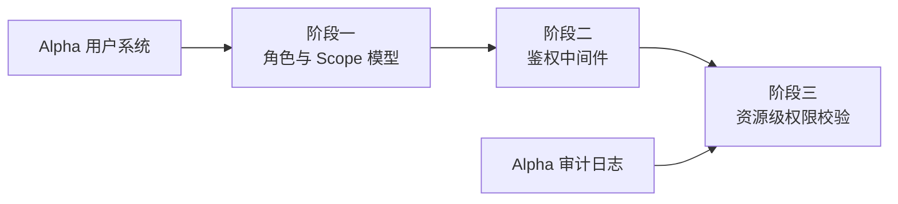

# 开发计划：RBAC 权限（plan-beta-01-rbac）

## 1. 概述

为 Flow Engine 引入基于角色的访问控制（RBAC），使管理员、编辑、查看三类角色在工作流、凭据、执行、触发器等资源上具备差异化操作权限。本模块解决"谁能做什么"的问题，是 Beta 阶段企业能力的基础。

### 1.1 覆盖范围

- 角色定义：管理员、编辑、查看。
- Scope 枚举：标识可操作的资源域。
- 权限中间件：HTTP 请求统一鉴权。
- 资源级权限校验：工作流、凭据、执行、触发器的访问控制。
- 角色与权限映射：角色可执行的操作集合。

### 1.2 不覆盖范围

- 多租户/项目隔离（由 [plan-beta-02-multitenant.md](plan-beta-02-multitenant.md) 承担）。
- 限流与安全加固（由 [plan-beta-03-rate-limit.md](plan-beta-03-rate-limit.md) 承担）。
- SSO / LDAP（GA 阶段）。
- 细粒度字段级权限（不在 Beta 范围）。

## 2. 交付物清单

- 角色定义（管理员/编辑/查看）与角色实体。
- Scope 枚举（Workflow / Credential / Execution / Trigger / Project / User 等）。
- 权限中间件（ASP.NET Core 中间件，统一鉴权）。
- 资源级权限校验器（按资源类型校验读/写/执行/删除）。
- 角色与权限映射表（角色 → 可执行操作集合）。
- 单元测试与集成测试。

## 3. 开发阶段

### 阶段一：角色与 Scope 模型

- 目标：建立角色、Scope、权限的数据模型与枚举。
- 核心任务：
  - 定义角色枚举（管理员/编辑/查看）。
  - 定义 Scope 枚举，覆盖工作流、凭据、执行、触发器、项目、用户。
  - 定义操作枚举（Read / Write / Execute / Delete）。
  - 建立角色与权限映射表（默认权限矩阵）。
  - 持久化角色与用户关联关系。
- 输入：Alpha 用户系统（[plan-alpha-09-user-system.md](../alpha/plan-alpha-09-user-system.md)）。
- 输出：角色与权限模型代码、默认权限矩阵、迁移脚本。
- 验收标准：
  - 三种角色定义完整，权限矩阵可查询。
  - 用户可被分配角色，角色可变更。
  - 单元测试覆盖角色分配与权限查询。
- 依赖：Alpha 用户系统（plan-alpha-09）。

### 阶段二：鉴权中间件

- 目标：在 HTTP 管道中统一鉴权，未授权请求被拒绝。
- 核心任务：
  - 实现权限中间件，从请求上下文提取用户与角色。
  - 按路由 + Scope + 操作匹配权限矩阵。
  - 未授权访问返回 403。
  - 默认拒绝策略：未显式允许的操作一律拒绝。
- 输入：阶段一的角色与权限模型。
- 输出：鉴权中间件、路由权限配置。
- 验收标准：
  - 未登录用户访问受保护端点返回 401。
  - 已登录但无权限的用户访问返回 403。
  - 默认拒绝策略生效。
- 依赖：阶段一。

### 阶段三：资源级权限校验

- 目标：对工作流、凭据、执行、触发器等具体资源进行访问控制。
- 核心任务：
  - 在资源查询/修改/删除前校验当前用户角色是否具备对应 Scope 的操作权限。
  - 工作流：查看角色只读，编辑角色可改，管理员可删。
  - 凭据：仅管理员与编辑可创建/修改，查看角色不可见凭据值。
  - 执行：查看角色可查看执行历史，编辑与管理员可触发执行。
  - 触发器：编辑与管理员可创建/修改/启停。
  - 集成 RBAC 与审计日志，记录权限拒绝事件。
- 输入：阶段二的鉴权中间件、Alpha 审计日志。
- 输出：资源级权限校验器、审计事件。
- 验收标准：
  - 不同角色对同一资源可执行的操作不同。
  - 越权操作被拒绝并记录审计。
  - 凭据值对查看角色不可见。
- 依赖：阶段二、Alpha 审计日志。

## 4. 阶段依赖图

## 5. 风险与待定项

| 风险 | 影响 | 应对 |
|------|------|------|
| 鉴权遗漏部分端点 | 越权访问 | 默认拒绝策略 + 集成测试覆盖全部受保护端点 |
| 权限矩阵变更影响存量用户 | 权限丢失或扩大 | 角色变更走审计，迁移脚本幂等 |
| 待定：是否支持自定义角色 | 影响 Beta 范围 | Beta 仅支持三种内置角色，自定义角色延后 |

## 6. 验收总标准

- 三种角色（管理员/编辑/查看）定义完整，权限矩阵覆盖工作流、凭据、执行、触发器。
- 权限中间件对所有受保护端点生效，未授权访问返回 401/403。
- 资源级权限校验通过，不同角色可执行操作不同。
- 凭据值对查看角色不可见。
- 单元测试覆盖率 ≥ 70%，集成测试覆盖越权场景。

## 变更记录

| 日期 | 修改人 | 修改内容 | 关联任务 |
|------|--------|----------|----------|
| 2026-06-18 | Agent | 创建 RBAC 权限开发计划 | Beta 计划编写 |
