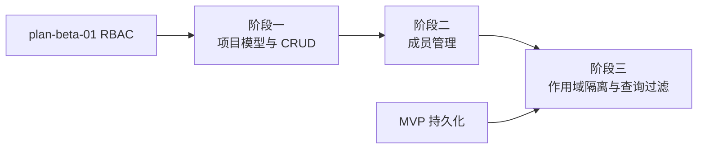

# 开发计划：多租户/项目（plan-beta-02-multitenant）

## 1. 概述

为 Flow Engine 引入项目（Project）作为多租户隔离边界，使不同项目的工作流、凭据、触发器、执行记录互不可见。本模块在 RBAC 权限之上叠加数据作用域隔离，解决"数据归属与可见性"问题。

### 1.1 覆盖范围

- 项目 CRUD。
- 项目成员管理（用户加入/移出项目、项目内角色）。
- 工作流、凭据、触发器、执行记录的 projectId 作用域隔离。
- 所有数据查询强制带 projectId 过滤。
- 跨项目数据不可见保证。

### 1.2 不覆盖范围

- 项目级配额与计费（不在 Beta 范围）。
- 项目间资源共享（Beta 默认禁止）。
- 跨租户协作编辑（Enterprise 阶段）。

## 2. 交付物清单

- 项目实体与 CRUD API。
- 项目成员管理 API（加入/移出/查询成员）。
- 项目内角色分配（复用 [plan-beta-01-rbac.md](plan-beta-01-rbac.md) 角色）。
- 工作流、凭据、触发器、执行记录实体增加 projectId 字段。
- 查询过滤器：所有仓储查询强制带 projectId。
- 跨项目访问校验与拒绝逻辑。
- 单元测试与集成测试。

## 3. 开发阶段

### 阶段一：项目模型与 CRUD

- 目标：建立项目实体与基本管理能力。
- 核心任务：
  - 定义项目实体（Id、名称、描述、创建者、创建时间）。
  - 实现项目 CRUD API，受 RBAC 鉴权保护。
  - 项目创建者默认为管理员。
  - 持久化项目记录。
- 输入：[plan-beta-01-rbac.md](plan-beta-01-rbac.md) 角色与权限模型。
- 输出：项目实体、CRUD API、迁移脚本。
- 验收标准：
  - 项目可创建、查询、更新、删除。
  - 删除项目时级联处理其下资源（工作流、凭据等）。
  - 仅管理员可删除项目。
- 依赖：plan-beta-01。

### 阶段二：成员管理

- 目标：管理项目成员及其项目内角色。
- 核心任务：
  - 定义项目成员关系（projectId、userId、角色）。
  - 实现成员加入/移出/查询 API。
  - 项目内角色复用 RBAC 三种角色（管理员/编辑/查看）。
  - 用户可属于多个项目，在不同项目可有不同角色。
  - 成员变更走审计日志。
- 输入：阶段一项目模型、Alpha 用户系统。
- 输出：成员管理 API、成员关系持久化。
- 验收标准：
  - 用户可被加入/移出项目。
  - 用户在项目内的角色可查询与变更。
  - 非成员无法访问项目资源。
- 依赖：阶段一。

### 阶段三：作用域隔离与查询过滤

- 目标：所有资源按 projectId 隔离，跨项目数据不可见。
- 核心任务：
  - 工作流、凭据、触发器、执行记录实体增加 projectId 字段。
  - 所有仓储查询强制带 projectId 过滤，缺失 projectId 的查询被拒绝。
  - 请求上下文中注入当前 projectId（从路由或会话解析）。
  - 跨项目查询返回空结果并记录审计。
  - 凭据按项目隔离，工作流只能引用本项目凭据。
  - 触发器与执行记录归属对应项目。
- 输入：阶段二成员关系、MVP 持久化层。
- 输出：projectId 作用域隔离、查询过滤器、跨项目访问校验。
- 验收标准：
  - 不同项目的工作流互不可见。
  - 跨项目查询无数据泄露。
  - 工作流只能引用本项目凭据。
  - 缺失 projectId 的查询被拒绝。
- 依赖：阶段二、MVP 持久化。引用 [overview.md](../../architecture/overview.md) §6 持久化设计。

## 4. 阶段依赖图

## 5. 风险与待定项

| 风险 | 影响 | 应对 |
|------|------|------|
| 查询遗漏 projectId 过滤 | 跨项目数据泄露 | 仓储基类强制注入 projectId，集成测试覆盖跨项目访问 |
| 存量数据无 projectId | 隔离失效 | 迁移脚本为存量数据分配默认项目 |
| 待定：项目间凭据共享 | 影响隔离边界 | Beta 默认禁止跨项目引用，共享需求延后 |
| 待定：项目级配额 | 影响资源滥用防护 | Beta 不实现，GA 评估 |

## 6. 验收总标准

- 项目 CRUD 与成员管理功能完整。
- 工作流、凭据、触发器、执行记录均带 projectId 作用域。
- 不同项目的工作流互不可见，跨项目查询无数据泄露。
- 工作流只能引用本项目凭据。
- 单元测试覆盖率 ≥ 70%，集成测试覆盖跨项目隔离场景。

## 变更记录

| 日期 | 修改人 | 修改内容 | 关联任务 |
|------|--------|----------|----------|
| 2026-06-18 | Agent | 创建多租户/项目开发计划 | Beta 计划编写 |
