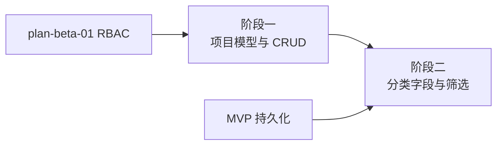

# 开发计划：项目分类（plan-beta-02-project-classification）

## 1. 概述

为 Flow Engine 引入项目（Project）作为**分类维度**，用于对工作流、凭据、触发器、执行记录、文件等资源进行分组展示与筛选。项目不是租户隔离边界，也不决定数据可见性；所有数据在系统内对授权用户可见，仅通过 `ProjectId` 做可选的分类过滤。

本模块在 RBAC 全局权限之上提供“按项目组织资源”的能力，解决“资源归类与导航”问题。

### 1.1 覆盖范围

- 项目 CRUD。
- 项目作为分类字段，关联到工作流、凭据、触发器、执行记录、文件等实体。
- 列表/筛选支持按 `ProjectId` 过滤，`ProjectId = null` 表示未分类/全局资源。
- 删除项目时处理其下资源的分类归属（如置空 `ProjectId` 或级联软删，视业务决策）。

### 1.2 不覆盖范围

- 项目级数据隔离（本系统为内部私有化部署，不做多租户隔离）。
- 项目成员与项目内角色（角色为系统级 RBAC，见 [plan-beta-01-rbac.md](plan-beta-01-rbac.md)）。
- 项目级配额与计费。
- 项目间资源共享限制（默认不限制）。

## 2. 交付物清单

- 项目实体与 CRUD API。
- 工作流、凭据、触发器、执行记录、文件实体增加 `projectId` 分类字段。
- 列表查询支持按 `ProjectId` 筛选，缺失 `ProjectId` 时返回全部（不做拒绝）。
- 单元测试与集成测试。

## 3. 开发阶段

### 阶段一：项目模型与 CRUD

- 目标：建立项目实体与基本管理能力。
- 核心任务：
  - 定义项目实体（Id、名称、描述、创建者、创建时间）。
  - 实现项目 CRUD API，受 RBAC 鉴权保护。
  - 持久化项目记录。
- 输入：[plan-beta-01-rbac.md](plan-beta-01-rbac.md) 角色与权限模型。
- 输出：项目实体、CRUD API、迁移脚本。
- 验收标准：
  - 项目可创建、查询、更新、删除。
  - 删除项目时按业务策略处理其下资源（建议置空 `ProjectId`，不物理删除资源）。
  - 仅管理员可删除项目。
- 依赖：plan-beta-01。

### 阶段二：资源分类字段与筛选

- 目标：让核心资源支持按项目分类，并在列表中可按项目筛选。
- 核心任务：
  - 工作流、凭据、触发器、执行记录、文件实体增加 `ProjectId` 字段（可空）。
  - 创建/更新资源时允许指定/修改所属项目。
  - 列表查询支持按 `ProjectId` 过滤；未指定时返回全部资源。
  - 请求上下文中注入当前选中的 `ProjectId`（从路由、QueryString 或前端状态解析），仅用于默认筛选展示，不做权限拒绝。
- 输入：阶段一项目模型、MVP 持久化层。
- 输出：分类字段、筛选参数、ProjectContextMiddleware。
- 验收标准：
  - 资源可归属到项目，也可不归属（`ProjectId = null`）。
  - 按 `ProjectId` 筛选时只显示该分类下的资源。
  - 未按 `ProjectId` 筛选时显示全部资源，无数据隐藏。
- 依赖：阶段一、MVP 持久化。

## 4. 阶段依赖图

## 5. 风险与待定项

| 风险 | 影响 | 应对 |
|------|------|------|
| 查询误将 `ProjectId` 当作隔离条件 | 数据被错误隐藏 | 代码审查明确“仅筛选、不隔离”；测试覆盖带/不带 `ProjectId` 的列表查询 |
| 存量数据无 `ProjectId` | 分类为空 | 作为未分类资源展示，无需回填默认项目 |
| 删除项目后资源归属 | 数据不一致 | 明确策略：置空 `ProjectId` 为未分类，或随项目级联软删 |

## 6. 验收总标准

- 项目 CRUD 功能完整。
- 工作流、凭据、触发器、执行记录、文件均带 `ProjectId` 分类字段。
- 列表支持按项目筛选；未筛选时展示全部资源，不存在跨项目隐藏。
- 单元测试覆盖率 ≥ 70%，集成测试覆盖分类筛选场景。

## 变更记录

| 日期 | 修改人 | 修改内容 | 关联任务 |
|------|--------|----------|----------|
| 2026-06-18 | Agent | 创建项目/多租户开发计划 | Beta 计划编写 |
| 2026-07-04 | Agent | 调整为内部私有化部署模型：项目仅用于分类，删除隔离与成员管理相关描述 | task-align-no-saas-multitenant |
