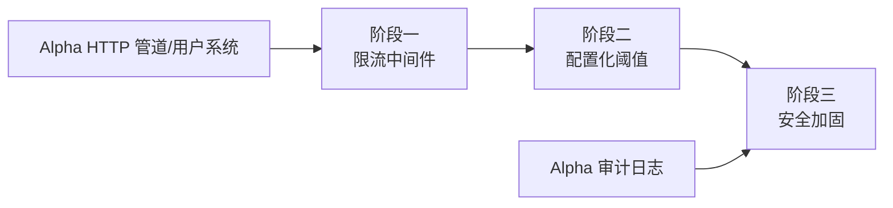

# 开发计划：限流与安全（plan-beta-03-rate-limit）

## 1. 概述

为 Flow Engine 引入请求限流与安全加固，防止暴力破解、API 滥用与资源耗尽。本模块提供 IP 级与用户级限流能力，阈值可配置，超限请求返回 429。

### 1.1 覆盖范围

- IP 限流：针对登录、注册等敏感端点。
- 用户限流：针对已认证用户的 API 调用。
- 配置化阈值：限流参数可通过配置调整。
- 安全中间件：统一入口校验。
- 超限响应：返回 429 与 Retry-After。

### 1.2 不覆盖范围

- Webhook 入口签名验证与来源白名单（Alpha 已实现）。
- WAF / 反爬虫（不在 Beta 范围）。
- 分布式限流（需 Redis，GA 阶段）。

## 2. 交付物清单

- IP 限流中间件（按 IP + 端点维度计数）。
- 用户限流中间件（按 userId + API 维度计数）。
- 限流配置（阈值、时间窗口、端点白名单）。
- 安全中间件（统一安全头、异常处理）。
- 429 响应与 Retry-After 头。
- 限流命中审计事件。
- 单元测试与集成测试。

## 3. 开发阶段

### 阶段一：限流中间件

- 目标：实现 IP 与用户维度的限流中间件。
- 核心任务：
  - 实现 IP 限流中间件，按 IP + 时间窗口计数。
  - 登录、注册端点配置独立阈值（如 5 次/分钟）。
  - 实现用户限流中间件，按 userId + 时间窗口计数。
  - 已认证 API 调用按用户维度限流。
  - 超限请求返回 429，附带 Retry-After 头。
  - 限流计数器使用内存实现（单机）。
- 输入：Alpha HTTP 管道、用户上下文。
- 输出：IP/用户限流中间件、429 响应。
- 验收标准：
  - 超过阈值的请求返回 429。
  - Retry-After 头正确返回剩余等待时间。
  - 不同 IP/用户互不影响。
- 依赖：Alpha HTTP 管道与用户系统。

### 阶段二：配置化阈值

- 目标：限流阈值可通过配置调整，无需改代码。
- 核心任务：
  - 定义限流配置结构（端点、阈值、时间窗口、是否启用）。
  - 配置热加载支持（可选）。
  - 端点白名单（如健康检查不限流）。
  - 默认配置项（登录/注册/API 各自阈值）。
- 输入：阶段一中间件。
- 输出：限流配置模型、默认配置。
- 验收标准：
  - 修改配置后阈值生效。
  - 白名单端点不受限流。
  - 默认配置合理（登录 5 次/分钟、API 100 次/分钟等）。
- 依赖：阶段一。

### 阶段三：安全加固

- 目标：统一安全头与异常处理，提升整体安全基线。
- 核心任务：
  - 安全响应头（X-Content-Type-Options、X-Frame-Options、CSP 等）。
  - 统一异常处理中间件，避免敏感信息泄露。
  - 限流命中事件写入审计日志。
  - 异常请求（429、403）记录审计。
- 输入：阶段二配置、Alpha 审计日志。
- 输出：安全中间件、审计事件。
- 验收标准：
  - 响应头包含安全相关字段。
  - 异常响应不泄露堆栈或敏感信息。
  - 限流命中与拒绝事件可审计。
- 依赖：阶段二、Alpha 审计日志。

## 4. 阶段依赖图

## 5. 风险与待定项

| 风险 | 影响 | 应对 |
|------|------|------|
| 内存计数器在多实例下失效 | 限流不准 | Beta 单机内存实现，多实例需 Redis（GA） |
| 限流误伤正常用户 | 用户体验差 | 阈值可配置，提供白名单 |
| 待定：是否支持按租户限流 | 影响多租户公平性 | Beta 暂按 IP/用户，租户级限流延后 |

## 6. 验收总标准

- IP 限流对登录/注册端点生效，超限返回 429。
- 用户限流对已认证 API 调用生效，超限返回 429。
- 限流阈值可通过配置调整。
- 安全响应头与异常处理到位。
- 单元测试覆盖率 ≥ 70%，集成测试覆盖限流命中场景。

## 变更记录

| 日期 | 修改人 | 修改内容 | 关联任务 |
|------|--------|----------|----------|
| 2026-06-18 | Agent | 创建限流与安全开发计划 | Beta 计划编写 |
