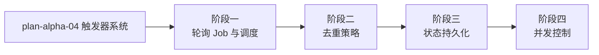

# 开发计划：轮询触发器（plan-beta-04-poll-trigger）

## 1. 概述

为 Flow Engine 引入轮询触发器，使工作流能按固定间隔查询外部系统，有新数据时触发执行。本模块复用 Alpha 阶段的 Quartz 调度与触发器模型，新增去重策略、状态持久化与并发控制。

### 1.1 覆盖范围

- 轮询触发器配置（IntervalSeconds、TimeoutSeconds、去重策略）。
- 轮询 Job：Quartz 按 IntervalSeconds 周期调度，创建节点实例执行轮询。
- 去重策略：Id / Timestamp / HashSet / 幂等兜底。
- 状态持久化：LastPollId / LastPollTime。
- 并发控制：SkipIfRunning。

### 1.2 不覆盖范围

- Schedule 触发器与 Webhook 触发器（Alpha 已实现）。
- 轮询节点的具体数据源适配（由插件实现）。
- 分布式调度（需 Quartz ADO.NET JobStore，GA 阶段）。

## 2. 交付物清单

- 轮询触发器配置模型（IntervalSeconds、TimeoutSeconds、PollDedupStrategy、SkipIfRunning）。
- 轮询 Job（Quartz IJob 实现，按周期调度执行轮询节点）。
- 去重策略实现（Id / Timestamp / HashSet / 幂等）。
- 轮询状态持久化（LastPollId / LastPollTime 更新与恢复）。
- 并发控制（SkipIfRunning 跳过逻辑）。
- 轮询触发器 CRUD API（受 RBAC 保护）。
- 单元测试与集成测试。

## 3. 开发阶段

### 阶段一：轮询 Job 与调度

- 目标：实现轮询触发器的 Quartz 调度与 Job 执行。
- 核心任务：
  - 定义轮询触发器配置（IntervalSeconds、TimeoutSeconds）。
  - 实现 PollTriggerJob（Quartz IJob），按 IntervalSeconds 周期调度。
  - 轮询 Job 从 ITriggerStore 加载触发器配置。
  - 通过 INodeRegistry 创建轮询节点实例并执行。
  - 对每条新数据调用引擎 StartAsync 启动工作流。
  - 轮询触发器 CRUD API。
- 输入：Alpha 触发器系统（plan-alpha-04）、Quartz 调度器、节点注册中心。
- 输出：PollTriggerJob、轮询触发器配置、CRUD API。
- 验收标准：
  - 轮询触发器可创建并按 IntervalSeconds 周期调度。
  - 轮询 Job 能创建节点实例执行并拉取数据。
  - 拉取到新数据时触发工作流执行。
- 依赖：plan-alpha-04。引用 [trigger-system.md](../../architecture/trigger-system.md) §4。

### 阶段二：去重策略

- 目标：避免重复处理已轮询过的数据。
- 核心任务：
  - 实现 PollDedupStrategy 枚举（None / Id / Timestamp / HashSet）。
  - Id 策略：记录已处理 ID 集合，过滤重复。
  - Timestamp 策略：记录上次最大时间戳，只处理更新数据。
  - HashSet 策略：计算数据项哈希，过滤重复。
  - 幂等执行兜底：同一数据多次触发结果一致。
  - 去重策略由轮询节点声明，触发器配置中保存。
- 输入：阶段一轮询 Job。
- 输出：去重策略实现、已处理数据记录。
- 验收标准：
  - Id 策略下重复 ID 不触发执行。
  - Timestamp 策略下旧时间戳数据被过滤。
  - HashSet 策略下内容重复数据被过滤。
- 依赖：阶段一。

### 阶段三：状态持久化

- 目标：轮询状态持久化，重启后不丢失进度。
- 核心任务：
  - 持久化 LastPollId / LastPollTime 到触发器记录。
  - 每次轮询完成后更新状态。
  - 服务重启后从持久化状态恢复，避免重复处理。
  - 状态更新与去重策略联动（如 Timestamp 策略用 LastPollTime）。
- 输入：阶段二去重策略、Alpha 触发器状态持久化。
- 输出：轮询状态持久化与恢复逻辑。
- 验收标准：
  - 轮询状态持久化到数据库。
  - 服务重启后从上次状态继续轮询，不重复处理。
  - LastPollId / LastPollTime 正确更新。
- 依赖：阶段二。

### 阶段四：并发控制

- 目标：避免轮询堆积，保护外部系统。
- 核心任务：
  - 实现 SkipIfRunning 配置。
  - SkipIfRunning = true：上次轮询触发的执行未完成时跳过本次轮询。
  - SkipIfRunning = false：允许并行触发多个执行。
  - 跳过事件记录审计日志。
- 输入：阶段三状态持久化。
- 输出：SkipIfRunning 并发控制逻辑。
- 验收标准：
  - SkipIfRunning = true 时，上次执行未完成则跳过本次轮询。
  - SkipIfRunning = false 时，允许并行触发。
  - 跳过事件可审计。
- 依赖：阶段三。

## 4. 阶段依赖图

## 5. 风险与待定项

| 风险 | 影响 | 应对 |
|------|------|------|
| 去重集合无限增长 | 内存耗尽 | 设置上限并 LRU 淘汰，或定期清理 |
| 外部系统不可达 | 轮询失败堆积 | 超时控制 + 失败记录，避免无限重试 |
| 待定：去重集合持久化方式 | 影响重启后去重 | Beta 用数据库持久化，大规模场景需 Redis（GA） |
| 待定：轮询失败重试策略 | 影响可靠性 | Beta 记录失败并跳过，重试策略延后 |

## 6. 验收总标准

- 轮询触发器能按 IntervalSeconds 周期调度并拉取外部数据触发工作流。
- 去重策略生效，已处理数据不重复触发。
- 轮询状态持久化，重启后不丢失进度。
- SkipIfRunning 并发控制生效，避免轮询堆积。
- 单元测试覆盖率 ≥ 70%，集成测试覆盖去重与状态恢复场景。

## 变更记录

| 日期 | 修改人 | 修改内容 | 关联任务 |
|------|--------|----------|----------|
| 2026-06-18 | Agent | 创建轮询触发器开发计划 | Beta 计划编写 |
