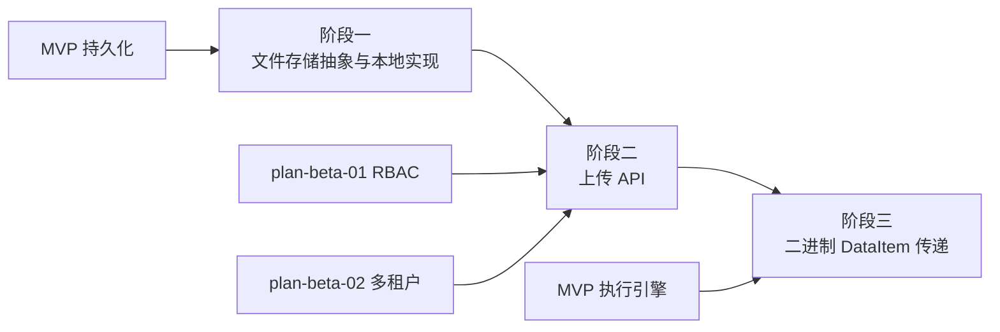

# 开发计划：文件存储（plan-beta-05-file-storage）

## 1. 概述

为 Flow Engine 引入文件与二进制数据处理能力，使工作流能上传、存储、在节点间传递文件。本模块提供本地存储实现并预留 S3/MinIO 适配抽象。

### 1.1 覆盖范围

- 文件上传 API。
- 本地 storage/ 目录存储实现。
- S3/MinIO 适配预留（IFileStorage 抽象）。
- 二进制 DataItem（附件）在节点间传递。
- 文件存储配置（路径、类型）。

### 1.2 不覆盖范围

- S3/MinIO 具体实现（GA 或 Enterprise 阶段）。
- 文件版本管理（不在 Beta 范围）。
- 大文件分片上传（不在 Beta 范围）。

## 2. 交付物清单

- IFileStorage 抽象接口（本地/S3 适配预留）。
- LocalFileStorage 实现（本地 storage/ 目录）。
- 文件上传 API（POST /api/v1/files）。
- 文件元数据持久化（Id、名称、大小、类型、存储路径、projectId）。
- 二进制 DataItem 类型（附件，可在节点间传递）。
- 文件存储配置（Storage:Type、Storage:Path）。
- 单元测试与集成测试。

## 3. 开发阶段

### 阶段一：文件存储抽象与本地实现

- 目标：建立文件存储抽象与本地实现。
- 核心任务：
  - 定义 IFileStorage 抽象接口（Save、Read、Delete、Exists）。
  - 实现 LocalFileStorage，存储到本地 storage/ 目录。
  - 文件存储路径校验，防止目录穿越攻击。
  - 文件元数据持久化（名称、大小、类型、存储路径、projectId）。
  - 文件存储配置（Storage:Type、Storage:Path）。
- 输入：MVP 持久化层。
- 输出：IFileStorage 抽象、LocalFileStorage 实现、配置模型。
- 验收标准：
  - 文件可保存到本地 storage/ 目录。
  - 文件元数据可持久化与查询。
  - 路径校验防止目录穿越。
  - 存储路径可通过配置调整。
- 依赖：MVP 持久化。引用 [deployment.md](../../architecture/deployment.md) §5 横向扩展预留。

### 阶段二：上传 API

- 目标：提供文件上传与查询 API。
- 核心任务：
  - 实现 POST /api/v1/files 上传端点。
  - 实现 GET /api/v1/files/{id} 查询文件元数据。
  - 实现 GET /api/v1/files/{id}/content 下载文件内容。
  - 上传文件受 RBAC 鉴权与 projectId 作用域隔离。
  - 文件大小限制与类型校验。
- 输入：阶段一存储抽象。
- 输出：文件上传/查询/下载 API。
- 验收标准：
  - 文件可上传并返回元数据。
  - 文件元数据可查询。
  - 文件内容可下载。
  - 上传受权限与项目隔离保护。
- 依赖：阶段一、plan-beta-01、plan-beta-02。

### 阶段三：二进制 DataItem 传递

- 目标：文件可作为二进制 DataItem 在节点间传递。
- 核心任务：
  - 扩展 DataItem 支持二进制附件类型（引用文件 Id）。
  - 节点输出可包含二进制 DataItem。
  - 下游节点可接收并访问二进制数据。
  - 二进制 DataItem 在执行上下文中传递（不直接传递文件内容，传递引用）。
  - 节点按需读取文件内容（通过 IFileStorage）。
- 输入：阶段二上传 API、MVP 执行引擎（DataItem 模型）。
- 输出：二进制 DataItem 类型、节点间传递逻辑。
- 验收标准：
  - 节点可输出二进制 DataItem（附件引用）。
  - 下游节点可接收并访问二进制数据。
  - 二进制数据在节点间传递时不丢失。
- 依赖：阶段二、MVP 执行引擎。

## 4. 阶段依赖图

## 5. 风险与待定项

| 风险 | 影响 | 应对 |
|------|------|------|
| 路径穿越攻击 | 任意文件读写 | 路径校验、文件名白名单、沙箱目录限制 |
| 大文件内存占用 | OOM | 流式读写，避免全量加载到内存 |
| 待定：S3/MinIO 实现时机 | 影响云部署 | Beta 仅预留抽象，实现延后到 GA |
| 待定：文件清理策略 | 磁盘占用 | Beta 不自动清理，手动管理；自动清理延后 |

## 6. 验收总标准

- 文件可上传到本地 storage/ 目录并持久化元数据。
- 文件元数据可查询，内容可下载。
- 二进制 DataItem 可在节点间传递，下游节点可访问。
- 存储路径可通过配置调整。
- 路径校验防止目录穿越攻击。
- 单元测试覆盖率 ≥ 70%，集成测试覆盖上传与传递场景。

## 变更记录

| 日期 | 修改人 | 修改内容 | 关联任务 |
|------|--------|----------|----------|
| 2026-06-18 | Agent | 创建文件存储开发计划 | Beta 计划编写 |
