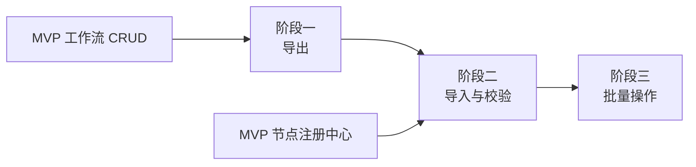

# 开发计划：导入导出（plan-beta-07-import-export）

## 1. 概述

为 Flow Engine 引入工作流导入导出能力，使工作流可在不同环境间迁移、备份与批量操作。导出为 JSON，导入时校验节点类型与端口合法性。

### 1.1 覆盖范围

- 工作流 JSON 导出（含节点、连线、参数）。
- 工作流导入（含校验）。
- 批量导出与导入。
- 导入时节点类型与端口校验。

### 1.2 不覆盖范围

- Git 版本管理（Enterprise 阶段）。
- 工作流版本对比与回滚（Enterprise 阶段）。
- 凭据导出（凭据值不可导出，仅导出引用）。

## 2. 交付物清单

- 工作流导出 API（GET /api/v1/workflows/{id}/export）。
- 工作流导入 API（POST /api/v1/workflows/import）。
- 批量导出 API（GET /api/v1/workflows/export）。
- 批量导入 API（POST /api/v1/workflows/import-batch）。
- 导出 JSON 格式定义（节点、连线、参数、元数据）。
- 导入校验逻辑（节点类型存在性、端口匹配、参数合法性）。
- 单元测试与集成测试。

## 3. 开发阶段

### 阶段一：导出

- 目标：工作流可导出为 JSON。
- 核心任务：
  - 定义导出 JSON 格式（工作流元数据、节点定义、连线、参数）。
  - 实现 GET /api/v1/workflows/{id}/export 端点。
  - 导出内容包含节点类型、参数、连线关系。
  - 凭据仅导出引用 ID，不导出凭据值。
  - 导出受 RBAC 鉴权与 projectId 作用域隔离。
- 输入：MVP 工作流 CRUD。
- 输出：导出 API、JSON 格式定义。
- 验收标准：
  - 工作流可导出为 JSON 文件。
  - JSON 包含完整节点、连线、参数信息。
  - 凭据值不出现在导出内容中。
- 依赖：MVP 工作流 CRUD。

### 阶段二：导入与校验

- 目标：工作流可导入并校验合法性。
- 核心任务：
  - 实现 POST /api/v1/workflows/import 端点。
  - 导入时校验节点类型是否存在（通过 INodeRegistry）。
  - 校验端口匹配（连线源端口与目标端口存在且类型兼容）。
  - 校验参数合法性（必填参数、类型匹配）。
  - 非法导入被拒绝并返回错误详情。
  - 导入时分配新 projectId（或归属当前项目）。
  - 导入受 RBAC 鉴权。
- 输入：阶段一导出格式、MVP 节点注册中心。
- 输出：导入 API、校验逻辑。
- 验收标准：
  - 合法 JSON 导入后工作流可正常加载执行。
  - 节点类型不存在的导入被拒绝。
  - 端口不匹配的导入被拒绝。
  - 参数非法的导入被拒绝。
  - 错误信息清晰可定位问题。
- 依赖：阶段一、MVP 节点注册中心。

### 阶段三：批量操作

- 目标：支持批量导出与导入。
- 核心任务：
  - 实现 GET /api/v1/workflows/export 批量导出（按 projectId 或选中工作流）。
  - 实现 POST /api/v1/workflows/import-batch 批量导入。
  - 批量导入逐条校验，部分失败不影响其他。
  - 批量操作结果汇总（成功数、失败数、失败详情）。
- 输入：阶段二导入逻辑。
- 输出：批量导出/导入 API。
- 验收标准：
  - 批量导出可下载多个工作流。
  - 批量导入逐条校验，部分失败不影响其他。
  - 结果汇总清晰。
- 依赖：阶段二。

## 4. 阶段依赖图

## 5. 风险与待定项

| 风险 | 影响 | 应对 |
|------|------|------|
| 导入 JSON 格式不兼容 | 导入失败 | 版本字段标识，校验兼容性 |
| 节点类型在目标环境缺失 | 导入后无法执行 | 导入时校验节点类型存在性 |
| 待定：凭据跨环境迁移 | 影响可移植性 | Beta 仅导出引用 ID，凭据需手动重建 |
| 待定：导入冲突策略 | 同名工作流处理 | Beta 默认创建新工作流，覆盖策略延后 |

## 6. 验收总标准

- 工作流可导出为 JSON，包含节点、连线、参数。
- 导入后工作流可正常加载执行。
- 非法导入（节点类型缺失、端口不匹配、参数非法）被拒绝。
- 批量导出与导入可用，部分失败不影响其他。
- 凭据值不出现在导出内容中。
- 单元测试覆盖率 ≥ 70%，集成测试覆盖导入校验场景。

## 变更记录

| 日期 | 修改人 | 修改内容 | 关联任务 |
|------|--------|----------|----------|
| 2026-06-18 | Agent | 创建导入导出开发计划 | Beta 计划编写 |
