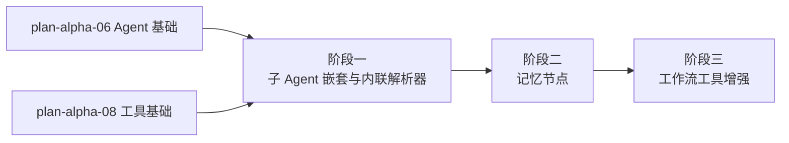

# 开发计划：Agent 增强（plan-beta-08-agent-enhance）

## 1. 概述

在 Alpha 阶段 Agent 基础能力之上，增强 Agent 的嵌套执行、多轮记忆与工作流工具能力。本模块引入子 Agent 嵌套、内联解析器、记忆节点、工作流工具增强（数据库加载子工作流、AI 占位符 Schema 推导、重试配置）。

### 1.1 覆盖范围

- 子 Agent 工具（嵌套 Agent）。
- 多轮对话记忆（记忆端口 PortType.Memory）。
- 最大迭代次数限制。
- 内联解析器（复用执行语义、子记录 ParentRecordId 指向父 Agent NodeExecutionRecord、不创建新顶层 ExecutionRecord）。
- 记忆节点。
- 工作流工具增强（数据库加载子工作流、AI 占位符 Schema 推导、重试配置）。

### 1.2 不覆盖范围

- Agent 流式输出（由 [plan-beta-09-agent-view.md](plan-beta-09-agent-view.md) 承担）。
- Agent token 用量追踪与可观测（GA 阶段）。
- Fallback 模型与批处理（GA 阶段）。
- JSON Config Agent（Enterprise 阶段）。

## 2. 交付物清单

- 子 Agent 工具节点（嵌套 Agent 执行）。
- 内联解析器（处理子 Agent 工具调用请求，复用执行语义）。
- 子记录机制（ParentRecordId 指向父 Agent NodeExecutionRecord）。
- 记忆节点（PortType.Memory 端口实现）。
- 多轮对话记忆持久化（会话上下文存储）。
- 最大迭代次数限制配置。
- 工作流工具增强：数据库加载子工作流。
- 工作流工具增强：AI 占位符 Schema 推导（`{{ai_param:描述}}`）。
- 工作流工具增强：重试配置。
- 单元测试与集成测试。

## 3. 开发阶段

### 阶段一：子 Agent 嵌套与内联解析器

- 目标：实现子 Agent 工具与内联解析器，支持 Agent 嵌套执行。
- 核心任务：
  - 实现子 Agent 工具节点（嵌套 Agent，复用 Agent 执行逻辑）。
  - 实现内联解析器（Inline Resolver），处理子 Agent 产生的工具调用请求。
  - 内联解析器在同一执行上下文中循环执行：解析请求 → 调用引擎执行 tool 节点 → 结果返回子 Agent → 子 Agent 决定是否继续。
  - 子记录机制：内联解析器调用的 tool 节点生成 NodeExecutionRecord，ParentRecordId 指向父 Agent 的 NodeExecutionRecord.Id。
  - 不创建新的顶层 ExecutionRecord，子 Agent 及其 tool 调用记录作为父 Agent 节点执行记录的子记录存在。
  - 执行历史展示时，父 Agent 及其子记录可折叠为一次 Agent 调用过程。
  - 嵌套深度限制配置。
- 输入：Alpha Agent 基础（plan-alpha-06）、Alpha 工具基础（plan-alpha-08）。
- 输出：子 Agent 工具节点、内联解析器、子记录机制。
- 验收标准：
  - 父 Agent 可调用子 Agent 工具，子 Agent 可调用其下 tool。
  - 内联解析器循环执行直到子 Agent 返回最终结果。
  - 子记录的 ParentRecordId 正确指向父 Agent NodeExecutionRecord。
  - 不创建新的顶层 ExecutionRecord。
  - 执行历史中子记录可折叠展示。
  - 嵌套深度超限被拒绝。
- 依赖：plan-alpha-06、plan-alpha-08。引用 [agent-and-tool.md](../../architecture/agent-and-tool.md) §9。

### 阶段二：记忆节点

- 目标：实现多轮对话记忆能力。
- 核心任务：
  - 实现记忆节点（PortType.Memory 端口，Input 方向连接 Agent 节点）。
  - 记忆节点提供会话上下文存储（历史消息、摘要）。
  - Agent 节点通过记忆端口获取上下文记忆，支持多轮对话。
  - 记忆持久化（会话级或长期，按配置）。
  - 最大迭代次数限制配置（防止 LLM 无限调用 tool）。
- 输入：阶段一 Agent 执行逻辑。
- 输出：记忆节点、记忆端口实现、迭代限制。
- 验收标准：
  - Agent 通过记忆端口获取历史上下文。
  - 多轮对话中 Agent 能引用前序对话内容。
  - 记忆可持久化，重启后可恢复。
  - 最大迭代次数超限后 Agent 终止并返回错误。
- 依赖：阶段一。

### 阶段三：工作流工具增强

- 目标：增强工作流工具能力，支持数据库加载、Schema 推导与重试。
- 核心任务：
  - 数据库加载子工作流：工作流工具节点支持按工作流 ID 从数据库加载子工作流执行。
  - AI 占位符 Schema 推导：子工作流参数含 `{{ai_param:描述}}` 占位符时，自动生成结构化参数 Schema，LLM 按结构传参。
  - 重试配置：工作流工具调用失败时可配置重试次数与间隔。
  - 工具结果消毒（长度截断、模式过滤、结构化包装、敏感信息过滤）。
- 输入：阶段二记忆节点、Alpha 工具基础。
- 输出：数据库加载子工作流、Schema 推导、重试配置、结果消毒。
- 验收标准：
  - 工作流工具可从数据库加载子工作流执行。
  - AI 占位符自动生成 Schema，LLM 按结构传参。
  - 工具调用失败时按配置重试。
  - 工具结果消毒生效（截断、过滤、包装）。
- 依赖：阶段二。

## 4. 阶段依赖图

## 5. 风险与待定项

| 风险 | 影响 | 应对 |
|------|------|------|
| Agent 嵌套深度失控 | 资源耗尽、无限循环 | 嵌套深度限制 + 最大迭代次数限制 |
| 内联解析器与执行引擎语义不一致 | 审计/取消/错误策略失效 | 复用引擎执行路径，不绕过执行记录 |
| 记忆持久化性能 | 大量会话存储压力 | 会话级记忆默认内存，长期记忆可选持久化 |
| 待定：记忆节点存储后端 | 影响扩展性 | Beta 用数据库，向量存储延后 |
| 待定：工具结果消毒阈值 | 影响 LLM 上下文质量 | Beta 按字符数近似，tokenizer 计数延后 |

## 6. 验收总标准

- Agent 支持多轮对话记忆，能引用前序对话内容。
- 子 Agent 嵌套执行可用，父 Agent 可调用子 Agent 工具。
- 内联解析器生成子记录，ParentRecordId 正确指向父 Agent NodeExecutionRecord。
- 不创建新的顶层 ExecutionRecord。
- 工作流工具支持数据库加载子工作流、AI 占位符 Schema 推导、重试配置。
- 最大迭代次数与嵌套深度限制生效。
- 单元测试覆盖率 ≥ 70%，集成测试覆盖嵌套与记忆场景。

## 变更记录

| 日期 | 修改人 | 修改内容 | 关联任务 |
|------|--------|----------|----------|
| 2026-06-18 | Agent | 创建 Agent 增强开发计划 | Beta 计划编写 |
