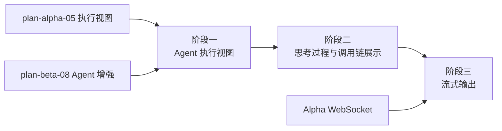

# 开发计划：Agent 执行视图（plan-beta-09-agent-view）

## 1. 概述

为 Flow Engine 前端提供 Agent 执行专用视图，展示 LLM 思考过程、tool 调用链与流式输出。本模块在 Alpha 执行视图与 Beta Agent 增强基础上，补齐 Agent 执行的可视化体验。

### 1.1 覆盖范围

- 前端 Agent 执行视图。
- LLM 思考过程展示。
- tool 调用链展示。
- 流式输出（IStreamingNodeType / StreamingChunk 通过 WS/SSE 推送）。

### 1.2 不覆盖范围

- Agent token 用量追踪与可观测（GA 阶段）。
- Agent 执行链路追踪（GA 阶段）。
- Agent 执行性能分析（GA 阶段）。

## 2. 交付物清单

- 前端 Agent 执行视图组件。
- LLM 思考过程展示组件（流式文本、中间结果）。
- tool 调用链展示组件（调用顺序、输入输出、状态）。
- 流式输出接入（WebSocket/SSE 推送 StreamingChunk）。
- 子记录折叠展示（父 Agent 与子记录折叠为一次调用过程）。
- 单元测试与集成测试。

## 3. 开发阶段

### 阶段一：Agent 执行视图

- 目标：建立前端 Agent 执行视图基础框架。
- 核心任务：
  - 实现 Agent 执行视图组件，作为执行视图的 Agent 节点专用展示。
  - 视图区分 Agent 节点与普通节点的展示样式。
  - 展示 Agent 节点的基本信息（模型、迭代次数、状态）。
  - 接入 Alpha 执行视图的事件订阅机制。
  - 子记录折叠展示：父 Agent 及其子记录折叠为一次 Agent 调用过程，可展开查看详情。
- 输入：Alpha 执行视图（plan-alpha-05）、Beta Agent 增强（plan-beta-08）。
- 输出：Agent 执行视图组件。
- 验收标准：
  - Agent 节点在执行视图中有专用展示样式。
  - 子记录可折叠与展开。
  - Agent 基本信息（模型、迭代次数、状态）可见。
- 依赖：plan-alpha-05、plan-beta-08。

### 阶段二：思考过程与调用链展示

- 目标：展示 LLM 思考过程与 tool 调用链。
- 核心任务：
  - LLM 思考过程展示：流式文本、中间结果、推理步骤。
  - tool 调用链展示：调用顺序、工具名称、输入参数、输出结果、调用状态（成功/失败/进行中）。
  - 调用链按时间顺序排列，支持展开查看单次调用的输入输出详情。
  - 多轮迭代展示：每轮 LLM 调用与 tool 调用分组展示。
  - 子 Agent 嵌套调用链展示：父 Agent 调用子 Agent 的链路可折叠展开。
- 输入：阶段一 Agent 执行视图。
- 输出：思考过程展示组件、调用链展示组件。
- 验收标准：
  - LLM 思考过程实时展示。
  - tool 调用链按顺序展示，含输入输出与状态。
  - 多轮迭代分组展示。
  - 子 Agent 嵌套调用链可折叠展开。
- 依赖：阶段一。

### 阶段三：流式输出

- 目标：Agent 节点流式输出通过 WS/SSE 实时推送前端。
- 核心任务：
  - 后端实现 IStreamingNodeType 接口的 Agent 节点流式输出。
  - StreamingChunk 通过 WebSocket 或 SSE 推送前端。
  - StreamingChunk 区分内容类型（Content / IsToolCall / IsFinal）。
  - 前端订阅流式事件，实时渲染思考过程与 tool 调用。
  - 流式执行同样生成 NodeExecutionRecord，最终聚合结果作为节点输出。
  - 流式中断处理（断线重连、错误展示）。
- 输入：阶段二展示组件、Alpha WebSocket 推送。
- 输出：流式输出后端实现、前端流式订阅。
- 验收标准：
  - Agent 节点流式输出实时推送前端。
  - 思考过程与 tool 调用实时展示。
  - 流式执行生成 NodeExecutionRecord。
  - 断线重连后可继续接收流式事件。
- 依赖：阶段二、Alpha WebSocket。引用 [agent-and-tool.md](../../architecture/agent-and-tool.md) §11.2。

## 4. 阶段依赖图

## 5. 风险与待定项

| 风险 | 影响 | 应对 |
|------|------|------|
| 流式输出延迟 | 体验差 | WebSocket 优先，SSE 兜底，前端缓冲渲染 |
| 调用链过长 | 界面拥挤 | 折叠默认，按需展开 |
| 待定：流式输出协议选型 | 影响实现 | Beta 优先 WebSocket，SSE 作为备选 |
| 待定：流式断线重连策略 | 影响连续性 | Beta 支持重连续传，完整重放延后 |

## 6. 验收总标准

- 前端显示 LLM 思考过程与 tool 调用链。
- 流式输出实时展示，思考过程与 tool 调用实时更新。
- 子 Agent 嵌套调用链可折叠展开。
- 流式执行生成 NodeExecutionRecord，最终聚合结果作为节点输出。
- 断线重连后可继续接收流式事件。
- 单元测试覆盖率 ≥ 70%，集成测试覆盖流式输出场景。

## 变更记录

| 日期 | 修改人 | 修改内容 | 关联任务 |
|------|--------|----------|----------|
| 2026-06-18 | Agent | 创建 Agent 执行视图开发计划 | Beta 计划编写 |
