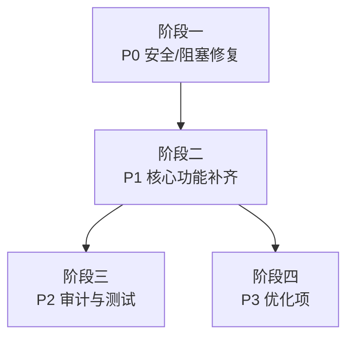

# 开发计划：Beta 阶段缺口补齐（plan-beta-10-gap-fill）

## 1. 概述

基于对 Beta 阶段 9 个模块的深度代码审查，发现 32 项缺口。本计划按 P0（安全/阻塞）、P1（功能缺失）、P2（审计/测试缺失）、P3（优化项）四级优先级组织，每项含问题描述、影响、修复方案与验收标准。

### 1.1 缺口总览

| 优先级 | 数量  | 范围                         |
| ------ | ----- | ---------------------------- |
| P0     | 7 项  | 安全漏洞、数据泄露、启动阻塞 |
| P1     | 13 项 | 核心功能未实现、隔离不彻底   |
| P2     | 5 项  | 审计事件缺失、测试空白       |
| P3     | 7 项  | 配置不一致、硬编码、兜底缺失 |

### 1.2 不覆盖范围

- Redis 队列与独立 Worker（GA 阶段）
- 自定义角色（Beta 仅支持三种内置角色）
- 完整的 E2E 测试编写（属于各模块计划范围）

## 2. P0 — 安全/阻塞级问题（7 项）

### GAP-01：导出未过滤凭据值

- **关联**：plan-beta-07
- **问题**：WorkflowExportService.MapToExportResult 直接序列化 node.Parameters，凭据明文可能被导出。
- **影响**：凭据泄露风险。
- **修复方案**：
  - 区分凭据引用（CredentialId，可安全导出）与凭据值（CredentialValue 明文，必须脱敏）。
  - 在 MapToExportResult 中递归扫描节点 Parameters，对 CredentialValue 类型字段移除明文值字段（如 apiKey/token/password/secret 等），仅保留 CredentialId 引用。
  - 凭据实体本身（Credential 表）不在导出范围。
- **验收标准**：导出 JSON 中不含凭据明文值；CredentialId 引用保留可解析；导入到目标环境后需手动重建凭据实体。

### GAP-02：AgentMemory 为死代码

- **关联**：plan-beta-08
- **问题**：AgentNode.cs:99-103 创建 memory 对象后从未使用，多轮记忆未生效。
- **影响**：Agent 多轮对话记忆完全失效。
- **修复方案**：
  - 将创建的 memory 注入到执行上下文或 LLM 调用参数中。
  - 确保 LLM 调用时携带历史记忆。
- **验收标准**：Agent 在多轮对话中能引用前序轮次的上下文。

### GAP-03：嵌套深度追踪 Bug

- **关联**：plan-beta-08
- **问题**：InlineResolver.cs:227 `NestingDepth = _parentContext.NestingDepth` 未递增，深层嵌套检测失效。
- **影响**：Agent 嵌套可能无限循环，耗尽资源。
- **修复方案**：改为 `NestingDepth = _parentContext.NestingDepth + 1`。
- **验收标准**：嵌套深度达到上限时正确抛出异常。

### GAP-04：默认 admin 未分配 Admin 角色

- **关联**：plan-beta-01
- **问题**：SeedDefaultAdminAsync 未分配角色，初始部署后无法访问任何受保护端点。
- **影响**：首次部署后系统不可用。
- **修复方案**：在 SeedDefaultAdminAsync 中为默认用户分配 Admin 角色。
- **验收标准**：初始部署后 admin 用户能正常访问所有管理端点。

### GAP-05：ExecutionService/TriggerService 缺少 ProjectId 分类字段

- **关联**：plan-beta-02
- **问题**：ExecutionService.GetAsync / TriggerService.GetByIdAsync 直接按 ID 查询，未携带 ProjectId 分类信息。
- **影响**：无法按项目分类筛选执行记录和触发器。
- **修复方案**：
  - 为 ExecutionRecord / Trigger 实体增加 ProjectId 字段。
  - 查询列表时支持按 ProjectId 过滤；按 ID 查询保持不变（系统内可见）。
- **验收标准**：列表接口支持按 ProjectId 筛选；不存在因 ProjectId 导致的访问拒绝。

### GAP-06：FileService.UploadAsync 未校验写权限

- **关联**：plan-beta-05
- **问题**：上传接口未校验当前用户是否具备写权限。
- **影响**：Viewer 等低权限用户可能上传文件。
- **修复方案**：在上传前校验用户系统角色（Admin/Editor）。
- **验收标准**：无写权限用户上传时返回 403。

### GAP-07：文件大小/类型校验缺失

- **关联**：plan-beta-05
- **问题**：无文件大小限制和类型白名单，存在 DoS 与任意文件上传风险。
- **影响**：服务器磁盘耗尽、可执行文件上传。
- **修复方案**：
  - 配置最大文件大小（如 50MB）。
  - 配置允许的 MIME 类型白名单。
  - 在上传入口校验。
- **验收标准**：超大文件和非法类型被拒绝，返回 400。

## 3. P1 — 功能缺失（13 项）

### GAP-08：流式输出整体未实现

- **关联**：plan-beta-09
- **问题**：无 IStreamingNodeType 接口、StreamingChunk 类型、WS 推送、前端订阅。6 项验收要点全缺。
- **影响**：Agent 执行过程对用户不可见。
- **修复方案**：
  - 定义 IStreamingNodeType 接口（`IAsyncEnumerable<StreamChunk>`）。
  - 定义 StreamingChunk DTO（Content/Done/Thinking 字段）。
  - LLM 节点实现该接口。
  - WebSocket handler 推送流式数据。
  - 前端 useWebSocketExecution 订阅流式事件。
- **验收标准**：LLM 响应逐 token 推送到前端并实时渲染。

### GAP-09：记忆节点未实现

- **关联**：plan-beta-08
- **问题**：PortType.Memory 枚举已定义但无 MemoryNode 实现类，记忆持久化缺失。
- **影响**：Agent 无法在节点间传递上下文记忆。
- **修复方案**：
  - 实现 MemoryNode，支持 Save/Load/Clear 操作。
  - 与 plan-beta-08 §3 阶段二验收对齐：Beta 阶段实现会话级与长期持久化（按配置），使用数据库存储；GA 阶段再评估向量存储。
- **验收标准**：MemoryNode 能正确注册并执行三种操作；记忆可持久化，重启后可恢复。

### GAP-10：RetryPolicy 未应用

- **关联**：plan-beta-08
- **问题**：RetryPolicy.cs 已定义但无任何引用。
- **影响**：节点执行失败后无自动重试。
- **修复方案**：在节点执行引擎中读取 RetryPolicy 配置并实现重试逻辑。
- **验收标准**：配置 RetryPolicy 后节点失败自动重试指定次数。

### GAP-11：Trigger/ExecutionRecord 缺 ProjectId 分类字段

- **关联**：plan-beta-02
- **问题**：仅通过 WorkflowDefinitionId 间接关联，无法按项目分类筛选。
- **影响**：列表无法直接按 ProjectId 过滤，依赖 JOIN 性能差。
- **修复方案**：
  - 为 Trigger 和 ExecutionRecord 实体添加 ProjectId 字段（可空）。
  - 生成迁移。
  - 在写入时同步填充（从关联 Workflow 的 ProjectId 复制，允许 null）。
  - 存量数据根据关联的 WorkflowDefinitionId 回填 ProjectId（迁移脚本内完成，无关联时保持 null）。
- **验收标准**：两个实体均可按 ProjectId 筛选；存量数据可正确回填或保持未分类。

### GAP-12：CurrentProjectId 无中间件注入

- **关联**：plan-beta-02
- **问题**：IProjectContext.CurrentProjectId 永远为 null，分类筛选默认值无法生效。
- **影响**：列表无法按当前选中项目默认过滤。
- **修复方案**：实现 ProjectContextMiddleware，从请求头、QueryString 或路由中提取 ProjectId 并注入 IProjectContext，仅用于分类筛选。
- **验收标准**：请求携带 ProjectId 时 IProjectContext 能正确读取；缺失时保持 null 并返回全部资源。

### GAP-13：删除项目后资源归属未处理

- **关联**：plan-beta-02
- **问题**：仅软删项目本身，工作流/凭据/触发器/执行记录的 ProjectId 仍指向已删除项目。
- **影响**：分类筛选出现孤儿分类。
- **修复方案**：删除项目时将其下所有资源的 ProjectId 置空（标记为未分类），或按业务策略级联软删。
- **验收标准**：项目删除后其下资源不再显示在原项目分类下。

### GAP-14：批量导出端点未暴露

- **关联**：plan-beta-07
- **问题**：ExportBatchAsync 服务方法已有，但 Controller 无 HttpGet 端点。
- **影响**：批量导出功能不可用。
- **修复方案**：在 WorkflowsController 添加 `[HttpGet("export-batch")]` 端点。
- **验收标准**：批量导出端点可正常调用并返回结果。

### GAP-15：导入未校验端口类型与参数合法性

- **关联**：plan-beta-07
- **问题**：WorkflowValidator 已实现但导入流程未调用。
- **影响**：非法工作流 JSON 可被导入，执行时报错。
- **修复方案**：在 WorkflowImportService 中调用 WorkflowValidator 校验。
- **验收标准**：非法工作流导入时返回明确错误信息。

### GAP-16：用户角色分配 API 未暴露

- **关联**：plan-beta-01
- **问题**：UserStore.AddRoleAsync 存在但无 UsersController。
- **影响**：无法通过 API 管理用户角色。
- **修复方案**：创建 UsersController，暴露角色分配/撤销端点。
- **验收标准**：管理员可通过 API 分配和撤销用户角色。

### GAP-17：ResourceAuthorizationService 未被调用

- **关联**：plan-beta-01
- **问题**：资源级 RBAC 校验流于形式，业务服务未调用。
- **影响**：资源级权限控制不生效。
- **修复方案**：在各业务 Service 的关键操作中注入并调用 ResourceAuthorizationService。
- **验收标准**：越权访问具体资源时被拒绝。

### GAP-18：Poll 触发器重启不恢复调度

- **关联**：plan-beta-04
- **问题**：UseInitialization 只恢复 Schedule 类型，Poll 触发器需手动 Update。
- **影响**：服务重启后 Poll 触发器停止工作。
- **修复方案**：在初始化逻辑中增加 Poll 类型触发器的调度恢复。
- **验收标准**：服务重启后 Poll 触发器自动恢复调度。

### GAP-19：HashSet 去重未真正过滤

- **关联**：plan-beta-04
- **问题**：ShouldProcess 始终返回 true，重复数据仍触发。
- **影响**：去重机制形同虚设。
- **修复方案**：修正 ShouldProcess 逻辑，基于数据指纹判断是否重复。
- **验收标准**：相同数据第二次到达时被跳过。

### GAP-20：幂等执行兜底未实现

- **关联**：plan-beta-04
- **问题**：重复触发时无幂等保护。
- **影响**：同一数据可能触发多次执行。
- **修复方案**：基于触发数据唯一键做幂等检查。
- **验收标准**：相同触发数据仅执行一次。

## 4. P2 — 审计/测试缺失（5 项）

### GAP-21：关键事件未写入审计

- **问题**：越权拒绝、限流命中、成员变更、Poll 跳过等事件均未写入审计日志。
- **影响**：安全事件不可追溯。
- **修复方案**：在 AuditEventTypes 中新增 PermissionDenied / RateLimited / MemberAdded / MemberRemoved / MemberRoleChanged / PollSkipped / FileAccessDenied / ExportPerformed / ImportPerformed 等类型，在对应位置写入审计事件。
- **验收标准**：关键安全和操作事件均产生审计记录。

### GAP-22：清理逻辑零测试

- **关联**：plan-beta-06
- **问题**：仅 4 个配置绑定测试，清理逻辑无测试覆盖。
- **影响**：清理策略变更可能引入回归。
- **修复方案**：补充 ExecutionCleanupHostedService 的单元测试，覆盖双策略清理逻辑。
- **验收标准**：清理逻辑有独立单元测试，覆盖过期删除和数量裁剪。

### GAP-23：无端到端集成测试

- **问题**：所有模块均无 WebApplicationFactory 集成测试。
- **影响**：模块间交互问题无法在测试阶段发现。
- **修复方案**：为核心流程（登录→创建项目→创建工作流→执行→导出）编写集成测试。
- **验收标准**：至少覆盖 RBAC + 项目分类筛选 + 导入导出三条端到端路径。

### GAP-24：前端 Agent 组件无测试

- **关联**：plan-beta-09
- **问题**：AgentExecutionView / LLMThinkingView / ToolCallChain 三个组件无任何测试。
- **影响**：前端组件变更无回归保护。
- **修复方案**：为三个组件编写单元测试，覆盖渲染逻辑和交互。
- **验收标准**：每个组件至少有基本的渲染测试。

### GAP-25：前后端 Agent 数据契约未建立

- **关联**：plan-beta-09
- **问题**：后端 AgentNode.CreateSuccessResult 仅返回字符串，前端 agent-execution.ts 定义的 AgentExecutionData 等类型后端无对应 DTO。前端靠 extractAgentData 反向推断且大概率失效。
- **影响**：前后端数据格式不匹配，功能异常。
- **修复方案**：
  - 后端定义 AgentExecutionResult DTO。
  - AgentNode 输出符合该 DTO 的结构化数据。
  - 前端直接使用 DTO 类型，移除 extractAgentData。
- **验收标准**：前后端使用统一的 Agent 数据结构，类型检查通过。

## 5. P3 — 优化项（7 项）

### GAP-26：缺统一异常处理中间件

- **关联**：plan-beta-03
- **问题**：生产环境异常堆栈可能泄露。
- **修复方案**：实现 GlobalExceptionHandlerMiddleware，生产环境返回通用错误信息。
- **验收标准**：未处理异常不泄露堆栈。

### GAP-27：缺 CSP 安全头

- **关联**：plan-beta-03
- **问题**：SecurityHeadersMiddleware 未配置 Content-Security-Policy。
- **修复方案**：在 SecurityHeadersMiddleware 中添加 CSP 头。
- **验收标准**：响应包含 CSP 头。

### GAP-28：文件端点路径不符

- **关联**：plan-beta-05
- **问题**：实际 /files/upload 与 /files/{id}/download，计划要求 /files 与 /files/{id}/content。
- **修复方案**：统一端点路径，或更新计划文档与实际一致。
- **验收标准**：端点路径与计划文档一致。

### GAP-29：文件存储配置项不一致

- **关联**：plan-beta-05
- **问题**：appsettings 的 Storage:Type/Path 与代码读取的 FileStorage:BasePath 不匹配。
- **修复方案**：统一配置键名，确保代码读取正确的配置路径。
- **验收标准**：修改 appsettings 后文件存储路径正确生效。

### GAP-30：分批删除未实现

- **关联**：plan-beta-06
- **问题**：大批量清理可能锁表。
- **修复方案**：将清理逻辑改为分批删除（如每批 1000 条）。
- **验收标准**：大批量清理不阻塞数据库。

### GAP-31：SubAgentToolNode 硬编码

- **关联**：plan-beta-08
- **问题**：硬编码 maxIterations=10，未传递 ParentRecordId。
- **修复方案**：从配置或上下文读取 maxIterations，正确传递 ParentRecordId。
- **验收标准**：参数可配置，子记录正确关联父记录。

### GAP-32：SSE 兜底未实现

- **关联**：plan-beta-09
- **问题**：WebSocket 不可用时无 SSE 降级方案。
- **修复方案**：实现 SSE 端点作为 WebSocket 的降级方案。
- **验收标准**：WebSocket 断开时自动切换到 SSE。

## 6. 开发阶段划分

### 阶段一：P0 安全/阻塞修复

- 目标：消除安全漏洞和启动阻塞。
- 核心任务：
  - P0 7 项均不依赖数据库迁移，重点修复启动阻塞与安全漏洞。
  - 修复 SeedDefaultAdminAsync 角色分配（GAP-04）。
  - 为 ExecutionService/TriggerService 补充 ProjectId 分类字段（GAP-05）。
  - 修复 FileService 上传写权限校验和文件校验（GAP-06, GAP-07）。
  - 修复导出凭据过滤（GAP-01）。
  - 修复 AgentMemory 死代码（GAP-02）。
  - 修复嵌套深度追踪 Bug（GAP-03）。
- 验收标准：所有 P0 项修复完毕，应用可正常启动，安全漏洞消除。
- 依赖：无。

### 阶段二：P1 核心功能补齐

- 目标：完成 Beta 阶段承诺的核心功能。
- 核心任务：
  - 实现流式输出全链路（GAP-08）。
  - 实现 MemoryNode（GAP-09）。
  - 应用 RetryPolicy（GAP-10）。
  - 补充 Trigger/ExecutionRecord 的 ProjectId 分类字段（GAP-11）。
  - 实现 ProjectContextMiddleware 用于分类筛选（GAP-12）。
  - 处理项目删除后资源分类归属（GAP-13）。
  - 暴露批量导出端点（GAP-14）。
  - 导入调用 WorkflowValidator（GAP-15）。
  - 创建 UsersController（GAP-16）。
  - 调用 ResourceAuthorizationService（GAP-17）。
  - 修复 Poll 触发器恢复和去重（GAP-18, GAP-19, GAP-20）。
- 验收标准：所有 P1 项完成，Beta 承诺的功能全部可用。
- 依赖：阶段一。

### 阶段三：P2 审计与测试

- 目标：补齐审计事件和测试覆盖。
- 核心任务：
  - 新增审计事件类型并写入（GAP-21）。
  - 补充清理逻辑测试（GAP-22）。
  - 编写端到端集成测试（GAP-23）。
  - 编写前端 Agent 组件测试（GAP-24）。
  - 建立前后端 Agent 数据契约（GAP-25）。
- 验收标准：审计事件完整，核心路径有集成测试，前端组件有测试。
- 依赖：阶段二。

### 阶段四：P3 优化项

- 目标：提升安全性和健壮性。
- 核心任务：
  - 实现全局异常处理中间件（GAP-26）。
  - 添加 CSP 安全头（GAP-27）。
  - 统一文件端点路径（GAP-28）。
  - 统一文件存储配置（GAP-29）。
  - 实现分批删除（GAP-30）。
  - 修复 SubAgentToolNode 硬编码（GAP-31）。
  - 实现 SSE 兜底（GAP-32）。
- 验收标准：所有 P3 项完成。
- 依赖：阶段二。

## 7. 阶段依赖图

## 8. 风险与待定项

| 风险                     | 影响     | 应对                                 |
| ------------------------ | -------- | ------------------------------------ |
| 迁移生成与现有数据冲突   | 数据丢失 | 开发环境验证，生产环境备份后执行     |
| 流式输出前后端联调复杂   | 延期     | 先定义接口契约，前后端并行开发       |
| 项目分类语义调整影响现有查询 | 回归风险 | 每项改动配套集成测试，明确“仅筛选、不隔离” |
| 审计事件类型新增影响性能 | 写入延迟 | 异步写入审计日志                     |
| 端到端测试编写工作量大   | 时间紧张 | 优先覆盖核心路径，非核心路径后续补充 |

## 9. 验收总标准

- P0：7 项全部修复，应用正常启动，无安全漏洞。
- P1：13 项全部完成，Beta 承诺功能可用。
- P2：审计事件完整，核心路径有集成测试。
- P3：全部优化项完成。

## 变更记录

| 日期       | 修改人 | 修改内容                             | 关联任务        |
| ---------- | ------ | ------------------------------------ | --------------- |
| 2026-07-03 | Agent  | 创建 Beta 缺口补齐计划               | Beta 完整性检查 |
| 2026-07-03 | Agent | 基于深度代码审查重写，补充 32 项缺口 | Beta 深度审查 |
| 2026-07-04 | Agent | 调整 GAP-05/06/11/12/13 等多租户相关项为项目分类语义 | task-align-no-saas-multitenant |
