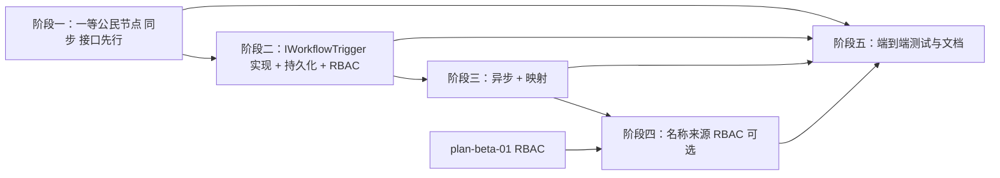

# 开发计划：子工作流协调（plan-beta-11-sub-workflow-coordination）

## 1. 概述

本模块把"子工作流"从「仅 Agent 工具可用」升级为「一等公民的控制流能力」，并补齐执行可观测性，使
README Features 中 "AI Agent … sub-workflow coordination" 与架构文档
[execution-engine.md §8.3](../../architecture/execution-engine.md) / [agent-and-tool.md §8](../../architecture/agent-and-tool.md) 的描述完全落地。

覆盖范围：

- 一等公民子工作流节点（`SubWorkflowNode`）：在任何工作流中（不仅限于 Agent）调用另一个**已保存**的工作流。
- 持久化子执行记录：每次子工作流运行在库中生成 `ExecutionRecord`，`ParentExecutionId` 指向父执行，且子工作流内部节点生成各自的 `NodeExecutionRecord`，可完整追溯。
- 异步触发模式（`Sync` / `Async`）与输入/输出参数映射。
- 名称来源 + 名称解析鉴权（架构 §8.2 第三种来源）。

不覆盖：

- Saga 补偿（见 [execution-engine.md §7](../../architecture/execution-engine.md)，未在 roadmap 排期，本计划不涉及）。
- 子 Agent 工具（Beta 另案 plan-beta-08 已覆盖）。
- **前端配套**：本计划仅交付后端能力（节点、触发抽象、持久化、RBAC、测试）。前端画布节点注册、参数配置面板（`Source`/`WorkflowId`/`Mode`/映射）、执行视图按 `ParentExecutionId` 展示子执行树，均另案处理（见 §5 风险/待定项 F6）。

### 当前基线（已实现，避免重复劳动）

- `plugins/FlowEngine.Plugins.Standard/SubWorkflowToolNode.cs`（`TypeName = "workflowTool"`，AI 分类）：Agent 工具节点，支持 `Database`（按 ID，经 `context.WorkflowLoader`）与 `Inline`（JSON）两种来源、`ToolName/ToolDescription`、超时、校验与错误处理。该节点面向 LLM 工具调用，保留 `Inline` 来源。
- `plugins/FlowEngine.Plugins.Standard/SubWorkflowExecutor.cs`：轻量「当前上下文内」按拓扑顺序执行子工作流节点的执行器（入口解析、输入收集、分支端口、错误中断），当前仅由 `SubWorkflowToolNode`（AI 工具）使用。
- `backend/FlowEngine.Application/Executions/ExecutionService.cs`：`ExecuteAsync` 内部已做 `authGuard.RequireAccessAsync(ResourceKind.Workflow, workflowId, Operation.Execute)`（L47），即**按工作流的 Execute 权限校验已由真实执行管线保证**。
- `backend/FlowEngine.Core/Entities/NodeExecutionContext.cs`：含 `NestingDepth`（L112）；`ToolContextFactory` 已用 `parentContext.NestingDepth + 1` 传递嵌套深度（Agent 子 Agent 嵌套），可作为子工作流嵌套的复用范式。
- 单元测试：`tests/FlowEngine.Runtime.Tests/Plugins/SubWorkflowToolNodeTests.cs`。
- 数据模型：`ExecutionRecord.ParentExecutionId`（Core 实体 + 各迁移已含该字段），目前子工作流未写入。

> **设计决策 A：本计划新增的 `SubWorkflowNode` 不提供 `Inline` 来源。** `Inline` 在执行时现解析未保存的 JSON，绕过了保存时校验（节点类型存在性、连接完整性、环路、必填参数等仅在 `Application` 层 `WorkflowValidator.Validate` 中校验，插件不可达），AI 生成场景下易因幻觉节点类型/断裂连接而在运行时才失败。因此 `SubWorkflowNode` 仅引用**已保存、保存时已过校验**的工作流（`Database` 按 ID / `Name` 按名称 + RBAC），从源头规避该风险。
>
> **设计决策 B：两个子工作流节点的长期定位。** `workflowTool`（AI 分类）：作为 Agent 的工具，允许 `Inline` JSON，轻量执行（当前上下文内），无独立持久化；`subWorkflow`（Flow/Control 分类）：作为一等控制流节点，仅引用已保存工作流，经真实管线完整持久化（`ParentExecutionId` + 节点记录）。两者并存，适用场景不同。

## 2. 交付物清单

- `SubWorkflowNode`（新插件节点，`TypeName = "subWorkflow"`，分类 `Flow`/`Control`）：经 Core 层执行触发抽象调用**真实执行管线**运行子工作流，支持 `Database`（按 ID）/ `Name`（按名称 + RBAC）来源、同步阻塞执行、超时、校验、错误传播；子工作流内部节点生成独立 `NodeExecutionRecord`。
- 子执行持久化：子工作流运行产生带 `ParentExecutionId` 的 `ExecutionRecord` 及逐节点 `NodeExecutionRecord`，可在执行视图/查询中追溯。
- `Mode` 参数（`Sync` 默认 / `Async`）：异步模式下节点立即返回子执行 ID（触发结果句柄），子工作流独立运行。
- 输入/输出映射：将父节点输入字段映射到子工作流入口输入、选择性返回子工作流输出。
- 名称来源 + RBAC：按工作流名称解析并做权限校验（与现有工作流读取鉴权对齐）。
- 单元测试（节点正常/缺参/类型转换/输出形态，用 stub `IWorkflowTrigger`）+ 集成测试（WebApplicationFactory 端到端含持久化追溯、节点级记录、Async 模式、映射、RBAC 拒绝路径）。

## 3. 开发阶段

### 阶段一：一等公民子工作流节点（同步，接口先行）

- **目标**：非 AI 工作流也能拖入「调用子工作流」节点，同步阻塞执行并返回输出，且子工作流内部节点可观测。
- **核心任务**：
  - 定义 Core 层执行触发抽象 `IWorkflowTrigger`（接口契约与返回类型见下）。由宿主（Host/Application）实现，并作为新属性 `WorkflowTrigger` 注入 `NodeExecutionContext`；插件经 `context.WorkflowTrigger` 访问（详见下方接口伪代码）。
  - 新增 `SubWorkflowNode : INodeType`（仅引用 Core，不引用 Runtime/Application/Infrastructure，遵循插件边界）。
  - 参数：`Source`（`Database`）、`WorkflowId`、超时 `TimeoutSeconds`、嵌套深度由 `context.NestingDepth` 派生；端口 `Input`/`Output`（主端口）。（`Name` 来源在阶段四加入。）
  - **不复用 `SubWorkflowExecutor`**：经 `context.WorkflowTrigger` 调用真实管线（实现在阶段二），以获得完整的 `NodeExecutionRecord` 与错误/取消语义，而非轻量执行器的黑盒结果。
  - `Database` 模式经 `context.WorkflowLoader` 加载目标工作流定义（已保存、保存时已过校验），得到 `workflowId` 后交触发器。
  - **嵌套深度**：读取 `context.NestingDepth`，以 `NestingDepth + 1` 经 `SubWorkflowOptions` 传入（复用现有 `NodeExecutionContext.NestingDepth` 与 `ToolContextFactory` 的 `+1` 范式）。
  - **取消传播（同步）**：将父节点 `CancellationToken` 经 `SubWorkflowOptions`/联动 `CancellationTokenSource` 传递给子执行；父取消时子执行同步取消。
  - **超时（同步）**：节点参数 `TimeoutSeconds`（`int?`）经 `TimeSpan.FromSeconds(TimeoutSeconds.Value)` 转换为 `SubWorkflowOptions.Timeout` 传入；到期时取消子执行并返回 `SubWorkflowTimeout` 错误；异步模式超时无意义。
  - 校验：缺 `WorkflowId`、工作流不存在、空工作流；错误以 `NodeExecutionResult.Error` 返回。
  - 错误传播：子工作流失败时返回错误结果，由父工作流节点的错误策略（重试/终止/继续）接管（见 [execution-engine.md §8.3](../../architecture/execution-engine.md) 末尾）。
  - **`IWorkflowTrigger` 接口伪代码（Core 层）**：
  ```csharp
  public interface IWorkflowTrigger
  {
      // 同步：阻塞等待子执行完成，返回完整结果
      Task<WorkflowTriggerResult> TriggerAndWaitAsync(
          Guid workflowId, JsonNode? input, SubWorkflowOptions options, CancellationToken ct);

      // 异步：立即返回子执行 ID（触发结果句柄）
      Task<Guid> TriggerAsync(
          Guid workflowId, JsonNode? input, SubWorkflowOptions options, CancellationToken ct);
  }

  public class SubWorkflowOptions
  {
      public Guid ParentExecutionId { get; set; }   // 填父执行 ID，落库到子 ExecutionRecord
      public int NestingDepth { get; set; }          // 父 NestingDepth + 1，供管线拦截环路
      public TimeSpan? Timeout { get; set; }         // 同步超时；异步忽略
      // ParentNodeRecordId 暂不使用（见 §5 风险 F4），预留以便未来节点级关联
  }

  // 同步触发返回的子执行结果，节点据此构造自身 NodeExecutionResult
  public class WorkflowTriggerResult
  {
      public Guid ExecutionId { get; set; }          // 子执行 ID
      public ExecutionStatus Status { get; set; }    // 子执行最终状态
      public DataBatch Output { get; set; } = new(); // 子工作流最终输出（末节点结果）
      public NodeError? Error { get; set; }          // 子执行失败时的错误信息
  }
  ```
- **输入**：`IWorkflowTrigger` 接口契约、`SubWorkflowToolNode`（参照其参数/校验/超时风格）、MVP 执行引擎（plan-mvp-05）、`NodeExecutionContext.NestingDepth`。
- **输出**：节点逻辑就绪，可经 stub 触发器单测；真实执行在阶段二接通。
- **验收标准**：
  - 节点参数/校验/超时/错误传播逻辑单测通过（用 stub `IWorkflowTrigger`）。
  - `Database` 缺 ID / 工作流不存在时返回明确错误，不崩溃。
  - 节点正确调用 `context.WorkflowTrigger.TriggerAndWaitAsync` 并消费其返回结果；传入 `NestingDepth + 1` 与父 `CancellationToken`。
- **依赖**：无（接口自包含）。

### 阶段二：IWorkflowTrigger 宿主实现 + 持久化子执行记录

- **目标**：实现真实管线触发，落库带 `ParentExecutionId` 的子 `ExecutionRecord` 及节点记录；确立插件调用真实管线的抽象边界与 RBAC/取消/ProjectId 语义。
- **核心任务**：
  - 宿主实现 `IWorkflowTrigger`：以给定 `workflowId` 启动**独立执行**，写入 `ExecutionRecord` 并填 `ParentExecutionId`（= `options.ParentExecutionId`），生成逐节点 `NodeExecutionRecord`，复用引擎的错误策略/取消/等待区语义；注入 `NodeExecutionContext.WorkflowTrigger`。
  - **RBAC 由真实管线保证（关键）**：宿主实现直接复用 `ExecutionService.ExecuteAsync(workflowId, …)`，该方法内部已做 `RequireAccessAsync(ResourceKind.Workflow, workflowId, Operation.Execute)`（L47）。因此**无论 `Database` 还是 `Name` 来源，子工作流执行前都会按当前用户校验目标工作流的 Execute 权限**，无需在节点内重复实现。当前用户即父执行的 `IUserContext`（宿主在请求作用域内解析），子执行自然继承父执行用户上下文。
  - **嵌套深度拦截**：宿主在触发前检查 `options.NestingDepth` 是否超过配置阈值（默认 10），超限返回明确错误，防止递归/环路执行风暴。
  - **取消传播（同步）**：宿主将父 `CancellationToken` 与子执行联动（链接 `CancellationTokenSource` 或父取消时调用 `engine.CancelAsync`），父取消即取消子执行；异步模式子执行独立，父取消不影响。
  - **ProjectId 继承**：子 `ExecutionRecord.ProjectId` 默认取**父执行**的 `ProjectId`，使子执行出现在父项目执行树下；跨项目执行由上述 RBAC 控制可见性与权限。
  - **采用方案 B（真实管线）作为默认实现（已决策，原 D1）**：子工作流作为独立执行经 `IWorkflowTrigger` 交由真实执行引擎运行，由该引擎负责持久化与 `ParentExecutionId`、节点记录。
    - 理由：方案 A（扩展轻量 `SubWorkflowExecutor` 仅补一条 `ExecutionRecord`）无法产生子工作流内部节点的 `NodeExecutionRecord`，可观测性不足；且 Async 模式需要独立执行实例才能返回句柄。方案 B 天然满足「以 `ParentExecutionId` 区分独立/父子执行」与节点级追溯，并复用 `ExecutionService` 的 RBAC/取消/审计。
    - 方案 A 不再采用；`SubWorkflowExecutor` 仍仅服务于 `SubWorkflowToolNode`（AI 工具），不在本节点复用。
  - **事务边界**：子执行为独立事务，与父节点执行不在同一事务中。存在短暂不一致窗口（父记录先写、子记录异步写入）；父执行回滚不影响已启动的子执行（可能产生孤儿执行，由执行清理 plan-beta-06 回收）。此为可接受的最终一致级别。
  - 子执行状态与父执行状态在查询/视图中可关联展示（按 `ParentExecutionId` 查找）。
- **输入**：阶段一接口、真实执行引擎（`ExecutionService`）、`ExecutionRecord` 实体（含 `ParentExecutionId`、`ProjectId`）、`NodeExecutionContext.NestingDepth`。
- **输出**：每次子工作流运行产生可查询的带 `ParentExecutionId` 的子执行记录及节点记录，且执行前已做 RBAC。
- **验收标准**：
  - 执行含子工作流的工作流后，库中新增子 `ExecutionRecord` 且 `ParentExecutionId` 正确指向父执行、`ProjectId` 继承父执行，并含子工作流各节点的 `NodeExecutionRecord`。
  - **RBAC 拒绝路径**：当前用户对目标子工作流无 Execute 权限时，触发返回权限错误（复用 `ExecutionService` 的 `PermissionDeniedException`），不执行。
  - 嵌套深度超过阈值时返回明确错误。
  - 执行视图/查询能按 `ParentExecutionId` 找到对应子执行及其节点记录。
- **依赖**：阶段一。

### 阶段三：异步触发与参数映射

- **目标**：支持「触发即返回」的异步子工作流，以及显式输入/输出映射。
- **核心任务**：
  - `Mode` 参数：`Sync`（默认，经 `IWorkflowTrigger.TriggerAndWaitAsync` 阻塞等待完成，消费 `WorkflowTriggerResult.Output` 作为本节点输出）/`Async`（经 `IWorkflowTrigger.TriggerAsync` 创建独立子执行后立即返回子 `ExecutionId`）。
    - **Async 返回值形态**：节点 `Output` 为含单个 `DataItem` 的 `DataBatch`，其 `Data` = 子执行 ID 字符串（即 `context.Ok(JsonValue.Create(childExecutionId.ToString()))`），作为下游可引用的触发结果句柄。
  - 输入/输出映射配置（最小结构草图，细节阶段三细化）：
    ```json
    {
      "inputMapping":  { "childInputField":  "input.items[0].data.field" },
      "outputMapping": { "parentOutputField": "output.items[0].data.result" }
    }
    ```
    - 映射值为 **JS 表达式**（由引擎脚本引擎 Jint 求值，与全局参数表达式一致），不是 `{{ }}` 模板语法（`{{ }}` 仅用于节点展示模板与 `{{ai_param:…}}` AI 占位符）。
    - **绑定对象**：`input` 绑定父节点输入 `DataBatch`（同 `context.GetInputBatch()`），`output` 绑定子工作流最终输出 `DataBatch`（即 `WorkflowTriggerResult.Output`）；表达式中以 `input.items[0].data` / `output.items[0].data` 访问首元素数据（camelCase JSON）。
    - 输入映射：将父节点 `Input` 端口字段映射到子工作流入口节点输入（当前为整包首元素透传）。
    - 输出映射：选择性返回子工作流某一出口/节点输出（默认无映射时，本节点 `Output` 直接等于子工作流 `Output`，即末节点结果）。
  - 映射失败时返回明确错误，不静默透传。
- **输入**：阶段二。
- **输出**：异步触发与字段级映射可用。
- **验收标准**：
  - `Async` 模式下父节点不等待子工作流完成即返回子 `ExecutionId`；该 ID 可查询到对应独立子执行。
  - 配置输入映射后，子工作流入口收到映射后的字段；输出映射生效。
- **依赖**：阶段二。

### 阶段四：名称来源 + 名称解析鉴权（可选，可延后）

- **目标**：支持按工作流名称解析来源并做权限校验（架构 §8.2 第三种来源），作为 `Database`（按 ID）之外的第二来源。
- **核心任务**：
  - 新增 `Source = Name`：按名称查找工作流（经工作流读取服务），复用现有工作流读取的 RBAC 鉴权。
  - 与 `Database` 来源统一校验与错误处理。
  - **注意**：目标工作流的 **Execute 权限**已在阶段二经 `ExecutionService` 统一保证；本阶段额外负责「名称→ID 解析」及其**可见性/解析权限**校验（无权限解析名称时返回明确错误）。
- **输入**：阶段一、RBAC（plan-beta-01）。
- **输出**：可按名称引用子工作流并鉴权。
- **验收标准**：按名称引用在有权限时执行，无权限（含名称不可解析）时返回明确错误。
- **依赖**：阶段一、plan-beta-01 RBAC。

### 阶段五：测试与文档

- **目标**：节点插件测试覆盖 + 端到端验证 + 文档同步（**非「全部测试放最后」**：单元测试已在阶段一随 stub 完成，集成测试在阶段二随宿主实现完成，本阶段为端到端收尾 + 文档）。
- **核心任务**：
  - `SubWorkflowNode` 单元测试（stub `IWorkflowTrigger`）：正常输出、缺参/非法 ID 错误、`JsonElement` 转换、输出符合 `DataBatch`→`DataItem`、超时（遵循 backend-code-rules §12）。
  - 集成测试（WebApplicationFactory）：含 `ParentExecutionId` 持久化追溯、**子工作流节点级 `NodeExecutionRecord`**、`Async` 模式（返回子 `ExecutionId` 可查）、映射、**RBAC 拒绝路径**、嵌套深度超限。
  - 同步更新 [execution-engine.md §8.3](../../architecture/execution-engine.md) / [agent-and-tool.md §8](../../architecture/agent-and-tool.md)（仅接口/意图，不贴实现），使架构文档与「`SubWorkflowNode` 经 `IWorkflowTrigger` 复用 `ExecutionService` 真实管线、无 Inline 来源」的实现一致。
- **输入**：阶段一至四。
- **输出**：测试通过、文档与实现一致。
- **验收标准**：`dotnet test` 全绿；架构文档与代码一致。
- **依赖**：阶段一至四。

## 4. 阶段依赖图



## 5. 风险与待定项

| 编号 | 风险/待定项 | 影响 | 应对/说明 |
|------|-------------|------|-----------|
| F1 | 不提供 Inline 来源（已决策） | 失去「粘贴 JSON 快速验证」能力 | `Inline` 绕过保存时校验，AI 场景易出错；`SubWorkflowNode` 仅引用已保存（保存时已过校验）工作流。`SubWorkflowToolNode`（AI 工具）仍保留 `Inline`。 |
| F2 | 插件边界：节点仅引用 Core | 子工作流执行/持久化需触达执行管线与 `DbContext`，但插件不能引用 Runtime/Application/Infrastructure | 定义 Core 层 `IWorkflowTrigger` 抽象（由宿主实现并注入 `NodeExecutionContext`），插件经此调用真实管线并间接产生 `ExecutionRecord`/`NodeExecutionRecord`，不反向引用上层。 |
| F3 | RBAC（安全基线） | 父执行者是否有权执行目标子工作流 | **由真实管线保证**：宿主实现复用 `ExecutionService.ExecuteAsync`（L47 已做 `RequireAccessAsync(ResourceKind.Workflow, …, Operation.Execute)`），所有来源统一校验；子执行继承父 `IUserContext`。阶段四仅补充名称解析的可见性校验。 |
| F4 | 子执行与父节点的关联维度（延期项） | 一个父执行可有多个 `subWorkflow` 节点、各触发多次，仅靠 `ParentExecutionId` 无法定位到具体节点 | 当前 `ExecutionRecord` 仅含 `ParentExecutionId`，已能满足大部分追溯；节点级关联（`ParentNodeRecordId`）留待后续增强，不在本计划加字段/迁移。`SubWorkflowOptions` 已预留该字段位。 |
| F5 | 子工作流递归/环路 | 栈溢出或执行风暴 | 复用 `NodeExecutionContext.NestingDepth`（L112）+ `ToolContextFactory` 的 `+1` 范式；宿主在触发前检查阈值（默认 10，可配置），超限返回明确错误。 |
| F6 | 前端配套缺失（另案处理） | 画布节点、参数面板、执行树视图需前端支持 | 本计划仅后端；前端注册 `subWorkflow` 类型、参数面板、`ParentExecutionId` 执行树视图列入后续前端计划，不在本计划范围。 |
| F7 | 异步模式孤儿执行 | 父执行结束但子执行仍在跑 | 子执行为独立 `ExecutionRecord`，由执行清理（plan-beta-06）按保留策略回收。 |
| F8 | 事务边界与一致性 | 子执行为独立事务，存在短暂不一致窗口；父回滚不撤销子 | 接受最终一致级别；子执行独立落库，孤儿由 F7 回收。 |
| F9 | 性能 | 同步模式阻塞父工作线程；子执行占用引擎资源（队列/等待区/日志） | 初期接受；异步模式与未来执行池为优化方向。 |
| F10 | 输入/输出映射表达式错误 | 子工作流收到错误数据 | 映射失败时返回明确错误，不静默透传。 |
| F11 | 审计事件 | 子执行是否需额外审计 | 子执行复用 `ExecutionService` 已有的执行生命周期事件（ExecutionStarted 等），无需新增审计事件类型。 |

## 6. 验收总标准

- 任意工作流可拖入 `subWorkflow` 节点调用另一个**已保存**工作流（同步阻塞），并消费其输出。
- 子工作流每次运行在库中产生带 `ParentExecutionId` 的子 `ExecutionRecord` 及逐节点 `NodeExecutionRecord`，可关联追溯；`ProjectId` 继承父执行。
- 所有来源（Database/Name）执行前均按当前用户校验目标工作流 Execute 权限（复用 `ExecutionService`）。
- `Async` 模式触发即返回子 `ExecutionId`；输入/输出映射生效。
- （可选）支持按名称引用子工作流并做 RBAC 鉴权（含名称解析可见性）。
- 节点单元测试（stub 触发器）与端到端集成测试覆盖正常/边界/错误/RBAC 拒绝路径，`dotnet test` 全绿。
- 架构文档与实现一致（无 Inline 来源；经 `IWorkflowTrigger` 复用 `ExecutionService` 真实管线）。

## 变更记录

| 日期 | 修改人 | 修改内容 | 关联任务 |
|------|--------|----------|----------|
| 2026-07-14 | Agent | 创建子工作流协调开发计划（基于已实现 SubWorkflowToolNode/SubWorkflowExecutor 补全一等公民节点、持久化、异步与映射） | 子工作流协调实施 |
| 2026-07-14 | Agent | 修订：放弃 `Inline` 来源；D1 默认方案 B（真实管线，经 Core 层 `IWorkflowTrigger` 抽象），确保节点级 `NodeExecutionRecord` 与 `ParentExecutionId` 可追溯；补充插件边界抽象与依赖图 S4→S5 | 子工作流协调评审 |
| 2026-07-14 | Agent | 评审修订（豆包评审 + 独立核实）：补 `IWorkflowTrigger` 接口伪代码；RBAC 明确复用 `ExecutionService.ExecuteAsync`（L47）自动保证所有来源；补取消传播、嵌套深度（复用 `NestingDepth`+`ToolContextFactory` 范式）、超时、ProjectId 继承、事务边界、性能/审计风险；明确前端另案处理、两节点职责边界、节点级关联（ParentNodeRecordId）降为延期项 | 子工作流协调评审 |
| 2026-07-14 | Agent | 评审补遗：补 `WorkflowTriggerResult` 返回类型定义；明确 Async 返回值为单 DataItem 的 DataBatch（Data=子执行 ID 字符串）；补 `TimeoutSeconds`→`TimeSpan.FromSeconds` 转换；明确映射 `input`/`output` 绑定 `DataBatch` 且以 `items[0].data` 访问；阶段四标题改为「名称来源 + 名称解析鉴权」；`ToolContextFactory` 嵌套传递已 grep 核实（L72/L97） | 子工作流协调评审 |
