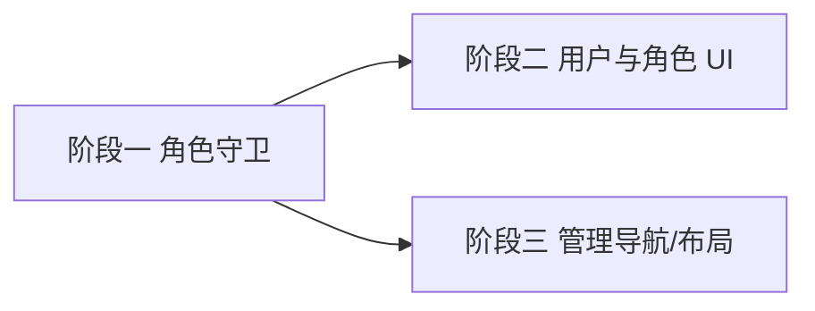

# 开发计划：前端用户与权限管理（RBAC）UI（plan-beta-12-frontend-rbac）

> 配套后端计划：`beta/plan-beta-01-rbac.md`、`alpha/plan-alpha-09-user-system.md`
> 横向约定与推荐实施路线见 `plan-frontend-management-ui.md`
> 阶段归属：Beta（对应后端 RBAC 模块）

## 1. 概述

为「用户-角色」能力提供前端管理界面，并补齐**基于角色**的前端权限守卫，使 `/admin/*` 受控、管理导航按需显隐。同时承担「管理分区导航与布局」职责（原属模块六的权限相关部分，详见 §5 说明）。

覆盖范围：
- 用户角色分配/撤销界面。
- **基于角色**的权限模型：`AuthContext` 暴露 `roles`，提供 `RequireRole` 守卫与受保护路由（仅用 `hasRole('Admin')`，**不做 scope/action 泛化判定**）。
- 管理导航入口（Header「系统管理」菜单）与 admin 布局，按 `hasRole('Admin')` 显隐。

不覆盖范围：
- 后端用户/角色 API（已存在 `UsersController` 的 roles 子资源；**用户列表端点 `GET /users` 当前缺失**，见 §6 后端阻塞项）。
- 角色定义/权限矩阵的编辑。
- 细粒度 scope/operation 权限判定：前端**无法获取**「当前用户有哪些 scope/action 权限」，此类判定一律交由后端（`[AuthorizePermission]` / 403）+ 统一错误提示，前端不做预判定。

## 2. 交付物清单

- `src/types/workflow.ts`：**扩展 `UserDto` 增加 `roles: string[]`**（已知缺口：后端 `UserDto.Roles` 为 `IReadOnlyList<string>`，JSON 反序列化后即为数组，无需额外转换；`/auth/me` 已返回 `Roles`）。
- `src/hooks/AuthContext.tsx`：扩展暴露 `roles: string[]`、`hasRole(role: string)`。（路径即 `src/hooks/AuthContext.tsx`，非 `src/contexts/`。）
- `src/hooks/useRoles.ts`：返回 `{ roles, hasRole }`，**仅角色判定，无 `hasPermission(scope, action)`**。命名准确反映职责——不涉及 scope/action 泛化权限。
- `src/components/common/RequireRole.tsx`：角色守卫组件（`<RequireRole role="Admin">…</RequireRole>`，内部 `hasRole` 判定；单元测试覆盖）。
- `src/pages/AdminUsersPage.tsx`：用户表格 + 行内「管理角色」。
- `src/components/admin/RoleAssignModal.tsx`：多选角色分配 Modal（调用 `assignRole`/`revokeRole`）。
- `src/services/api.ts` 新增：`getUserRoles`、`assignRole`、`revokeRole`、`listUsers`（依赖 §6 后端待补 `GET /users`）。
- `src/App.tsx`：受保护的 `/admin/*` 路由组，外层包 `<RequireRole role="Admin">`。
- 管理导航与布局：
  - `src/components/Layout/HeaderToolbar.tsx`：新增「系统管理」菜单（`hasRole('Admin')` 显隐），菜单内子项：用户管理、项目分类、审计日志、文件管理。放在导航栏左侧导航项区（与 Workflows/Documents 并列）。
  - `src/components/Layout/MainLayout.tsx`：admin 页面复用 `MainLayout`（顶部 Header + 可选面板），管理页不引入独立布局。
  - **Bell 图标保持不变**（当前为死控件，第 99-101 行无 onClick），不做管理入口。Bell 预留为真实通知功能，本期不修改。
- 测试：`src/hooks/__tests__/useRoles.test.ts`、`src/components/common/__tests__/RequireRole.test.tsx`、`src/components/admin/__tests__/RoleAssignModal.test.tsx`。

## 3. 现有改造点（需修改的既有文件）

| 文件 | 改造内容 |
|------|----------|
| `src/types/workflow.ts` | `UserDto` 增加 `roles: string[]` |
| `src/hooks/AuthContext.tsx` | 解析 `/auth/me` 的 `roles` 并暴露 `hasRole` |
| `src/App.tsx` | 新增 `/admin/*` 受保护路由组（`RequireRole`） |
| `src/components/Layout/HeaderToolbar.tsx` | 新增「系统管理」下拉菜单（hasRole('Admin') 显隐）|
| `src/components/Layout/MainLayout.tsx` | 管理页沿用现有布局，无独立布局 |

## 4. 开发阶段

### 阶段一：基于角色的权限模型与守卫

- 目标：前端能感知当前用户角色并做路由守卫。
- 核心任务：
  - **已知待办（非风险）**：扩展前端 `UserDto.roles`；`AuthContext` 从 `getCurrentUser()` 结果读取 `roles` 并暴露 `hasRole`。（后端 `/auth/me` 已确认返回 `Roles`，无需后端改动。）
  - 实现 `RequireRole` 与 `ProtectedRoute` 角色变体；非 Admin 访问受保护路由显示无权限提示而非 404。
  - **不做 scope/action 泛化**：文件上传/下载等具体操作**不**在前端预判定，交由后端 403 + 统一错误提示（见 §2 不覆盖范围）。
- 输入：`beta/plan-beta-01-rbac.md`、`frontend-code-rules.md`。
- 输出：可运行的角色守卫。
- 验收标准：
  - 非 Admin 用户访问受保护路由被拦截并提示。
  - `hasRole('Admin')` 判定正确（有单测覆盖）。

### 阶段二：用户与角色分配 UI

- 目标：查看用户、为其分配/撤销角色。
- 核心任务：
  - `AdminUsersPage` 拉取用户列表（依赖 §6 后端待补 `GET /users`；端点就绪前按降级方案仅展示当前登录用户一行卡片，上部提示「用户列表端点待就绪，当前仅显示您的信息」；角色分配 Modal 可编辑当前用户角色）。
  - `RoleAssignModal` 调用 `assignRole`/`revokeRole`（`POST/DELETE /users/{userId}/roles`）。
  - 列表角色标签实时更新。
- 输入：阶段一、`UsersController` roles 端点。
- 输出：用户角色管理界面。
- 验收标准：
  - 可为用户分配/撤销角色，列表即时反映。
  - 操作失败经 `api.ts` 的 `ApiError` 拦截器 + `notifications.show` 提示（全局未捕获异常由 `utils/globalErrorHandler.ts` 兜底）。

### 阶段三：管理导航入口与布局

- 目标：管理入口仅对 Admin 可见，导航体验一致。
- 核心任务：
  - `HeaderToolbar` 导航项区新增「系统管理」下拉菜单（`hasRole('Admin')` 显隐），内含子项：用户管理 → `/admin/users`、项目分类 → `/admin/projects`、审计日志 → `/admin/audit`、文件管理 → `/admin/files`。与其他导航项（Workflows/Documents）并列显示。
  - admin 页面复用 `MainLayout`，不新建布局；admin 页面顶部可引入面包屑导航辅助定位。
  - **Bell 图标保持原样**（当前死控件，不做管理入口）。Bell 预留为真实通知功能，本期不修改。
- 输入：阶段一。
- 输出：权限驱动的导航（原模块六「导航补齐」部分，因依赖 RBAC 权限模型，归属本模块 Beta 阶段落地）。

## 5. 与模块六（设置页）的边界

模块六（Alpha）仅负责**设置页内容**（当前用户信息、API Key 管理）与注册入口清理，这些**不依赖权限守卫**，任何已登录用户均可访问其自身设置。本模块的管理导航/权限显隐属权限相关，归本模块（Beta）。这样避免「Alpha 模块依赖 Beta 模块」的阶段倒挂。

## 6. 阶段依赖图

## 7. 风险与待定项（跨模块后端阻塞项）

| 风险/待定项 | 影响 | 应对策略 |
|------------|------|---------|
| **【后端阻塞】`UsersController` 无 `GET /users` 列表端点** | 用户管理页无法列出全部用户 | **后端待补端点**，契约建议：`GET /api/v1/users` 返回 `UserSummary[]`，字段至少含 `id`/`email`/`userName`/`displayName`/`roles`/`isActive`/`createdAt`。端点就绪前降级：页面显示当前登录用户单行卡片 + 顶部提示条「用户列表端点待就绪，当前仅显示您的信息」；角色分配 Modal 可编辑当前用户角色 |
| 后端无 `/roles` 列表端点 | 角色来源不明 | 用前端固定角色枚举（Admin/Editor/Viewer），待后端提供 |

> 索引文件模块一状态已标为「后端阻塞」。

## 8. 验收总标准（含验证用例）

- 前端角色守卫生效，非 Admin 访问 `/admin/*` 被拦截提示。
- 用户角色可分配/撤销并即时反映。
- 管理导航仅对 Admin 显隐；Header「系统管理」下拉菜单提供各子页面入口。
- 遵循前端代码规范，`npm run build` + `npm run typecheck` 通过。

**具体验证用例**：
1. 使用非 Admin 账号访问 `/admin/users`，应显示「无权限」提示，而非空白页或 404。
2. 浏览器网络面板中，后端返回 403 时前端有友好提示（经 `api.ts` `ApiError` 拦截器 + `notifications.show`），无未捕获异常。
3. `RequireRole` 单测：`role="Admin"` 且 `hasRole('Admin')=false` 时不渲染子节点；`=true` 时渲染。
4. `useRoles` 单测：`hasRole('Admin')` 在当前 `roles` 下返回预期布尔值。
5. 角色分配组件测试：打开 `RoleAssignModal`，勾选角色并提交，调用 `assignRole` 且列表标签更新。
6. Admin 用户 Header 显示「系统管理」下拉菜单，内含子项可分别进入各管理页面；非 Admin 用户不显示该菜单。

## 9. 测试要求

- 单元测试（Vitest）：`useRoles` 的 `hasRole` 逻辑、`RequireRole` 渲染分支。
- 组件测试（Vitest + RTL）：`RoleAssignModal` 打开/勾选/提交交互；权限不足时 `AdminUsersPage` 提示渲染。
- 测试命名：`{函数/组件} - {场景} - {预期结果}`。

## 变更记录

| 日期 | 修改人 | 修改内容 | 关联任务/PR |
|------|--------|----------|------------|
| 2026-07-15 | Agent | 初版（根目录 plan-frontend-rbac.md） | 前端功能缺口审计 |
| 2026-07-15 | Agent | 迁移至 beta/ 并按规范命名；角色缺口改为已知待办；补全测试/验证用例/改造点 | 计划评审 P0/P1/P2 |
| 2026-07-15 | Agent | 二轮修订：移除 hasPermission 泛化改基于角色（hasRole）；错误链改为 api.ts ApiError+notifications；GET /users 标后端阻塞并给契约；吸收管理导航/布局/Bell 决策（解决阶段倒挂）；Roles 数组说明；路径确认为 src/hooks/ | 计划评审第二轮 P0/P1/P2 |
| 2026-07-15 | Agent | P2：AdminUsersPage 降级态 UI 细化（单行卡片+顶部提示条）；P2：admin 内部导航（下拉子菜单列出子页面）；P3：usePermissions→useRoles 更名；P3：Bell 局限性说明 | 源码评审 |
| 2026-07-15 | Agent | 重新设计管理入口：Bell 不做管理入口，改为「系统管理」导航下拉菜单；Bell 保持死控件原样 | 用户反馈 |
