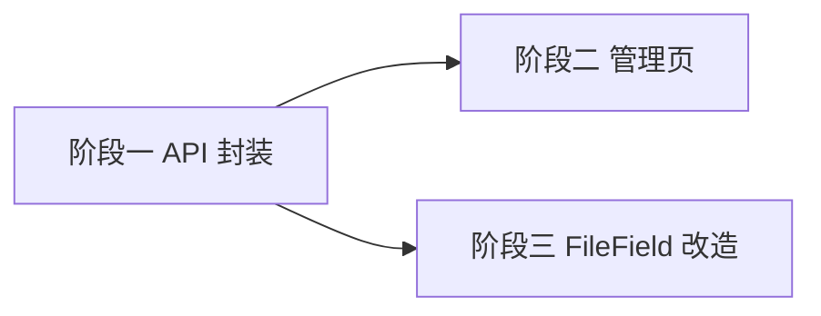

# 开发计划：前端文件存储管理 UI（plan-beta-14-frontend-file-storage）

> 配套后端计划：`beta/plan-beta-05-file-storage.md`
> 横向约定与推荐实施路线见 `plan-frontend-management-ui.md`
> 阶段归属：Beta（对应后端文件存储模块）

## 1. 概述

让文件真正接入后端存储：提供文件管理界面，并将参数面板的 `FileField` 从「仅存文件名」改造为「真实上传并保存文件 ID」。

覆盖范围：
- 文件上传 / 列表 / 下载 / 删除界面。
- `FileField` 改造为真实上传，保存返回的文件 ID。

不覆盖范围：
- 后端文件系统（已实现 `FilesController`：upload/list/download/delete）。
- 大文件分片上传（本期单请求上传）。

## 2. 交付物清单

- `src/services/api.ts` 新增：`uploadFile`、`listFiles(projectId)`、`downloadFile(id)`、`deleteFile(id)`，及类型 `StoredFileDto`、`UploadFileResult`。
- `src/pages/AdminFilesPage.tsx`：项目选择 → 上传区（拖拽/选择）+ 文件表格（名称/大小/类型/时间）+ 下载/删除。
- 改造 `src/components/ParameterPanel/fields/FileField.tsx`：选择文件后调用 `uploadFile`，保存文件 ID。
- `src/utils/`：文件大小格式化（可选）。

## 3. 现有改造点（需修改的既有文件）

| 文件 | 改造内容 |
|------|----------|
| `src/services/api.ts` | 新增文件上传/列表/下载/删除封装与类型 |
| `src/components/ParameterPanel/fields/FileField.tsx` | 改为真实上传并保存文件 ID（当前仅存文件名字符串） |
| `src/App.tsx` | 注册 `/admin/files` 路由（受 RBAC 守卫） |

## 4. 开发阶段

### 阶段一：API 封装

- 目标：前端可操作文件存储。
- 核心任务：
  - `uploadFile(file, projectId)`：`POST /api/v1/files/upload?projectId={guid}`（multipart + **必填 `[FromQuery] Guid projectId`，无全局默认值**）。
  - `listFiles(projectId)`：`GET /api/v1/files?projectId=`（**后端 `GetAll` 的 `projectId` 为必填参数，无法全局列出**）。
  - `downloadFile(id)`：`GET /api/v1/files/{id}/download`（blob 下载）。
  - `deleteFile(id)`：`DELETE /api/v1/files/{id}`。
  - 定义 `StoredFileDto`、`UploadFileResult`。
- 输入：`FilesController`、`frontend-code-rules.md`。
- 输出：文件 API 封装与类型。

### 阶段二：文件管理页（先选项目再看文件）

- 目标：可视化上传/管理文件。
- 核心任务：
  - `AdminFilesPage` 交互流程：**先选 project（下拉/从项目列表进入）→ 再调用 `listFiles(projectId)` 列出该项目文件**；无项目选中时提示先选择项目。
  - 上传区将文件上传至选中项目；表格展示 + 下载/删除，用 `notifications` 反馈。
- 输入：阶段一。
- 输出：文件管理界面（受项目作用域约束）。
- 验收标准：
  - 选择项目后可见该项目的文件列表。
  - 可上传/下载/删除，反馈明确。

### 阶段三：FileField 改造

- 目标：工作流参数中的文件字段对接真实存储。
- 核心任务：
  - `FileField` 新增可选 prop `projectId?: string | null`，由父级 `ParameterPanel` 注入（从工作流 store/context 读取当前工作流的 `projectId`）。`FileField` 本身不自行获取工作流信息，保持通用性。
  - 选择文件后，**必须携带 `projectId` 上传**。
  - **冲突处理（工作流无项目时）**：`FilesController.Upload` 的 `projectId` 为必填且无全局默认值；若 `projectId == null` 或未传入，**禁止上传并提示用户先为工作流指定项目**（或弹出项目选择），不得静默用「全局默认」上传。
  - 加载已有值时按 ID 回显文件名；旧数据仅存文件名时无 ID，回退显示原文件名。
- 输入：阶段二。

## 5. 阶段依赖图

## 6. 风险与待定项

| 风险/待定项 | 影响 | 应对策略 |
|------------|------|---------|
| 旧工作流参数仅存文件名字符串 | 加载回显失败 | 无 ID 时回退显示原文件名 |
| 大文件上传超时 | 上传失败 | 本期单请求；超限由后端拒绝并提示 |
| `FileField` 上传所需 `projectId` 缺失 | 工作流无项目时无法上传 | **禁止上传并提示先指定项目**（后端 Upload 无全局默认）；不静默兜底 |
| 下载鉴权 | 越权下载 | 依赖后端 403，前端仅触发下载 |

## 7. 验收总标准（含验证用例）

- 文件可真实上传/下载/删除，列表正确。
- `FileField` 保存文件 ID 并正确回显；兼容旧数据。
- 遵循前端代码规范，构建/类型检查通过。

**具体验证用例**：
1. 进入 `/admin/files`，未选项目时提示先选择项目；选择项目后出现该项目的文件列表（空则提示无文件）。
2. 上传一个文件，列表新增该文件（名称/大小/时间正确）；点击下载触发文件保存；点击删除后从列表移除。
3. 在工作流编辑器参数中 `FileField` 选择文件，保存后参数值为文件 ID；重新打开编辑器，按 ID 回显文件名（旧「仅文件名」数据也能显示原名）。
4. 切换项目，文件列表仅显示该项目文件，不因缺 `projectId` 报错。

## 8. 测试要求

- 单元测试：文件大小格式化；`FileField` 在「有 ID / 仅文件名」两种数据下的回显逻辑。
- 组件测试（RTL）：`AdminFilesPage` 项目选择→列表加载流程；`FileField` 选择文件触发上传并保存 ID。

## 变更记录

| 日期 | 修改人 | 修改内容 | 关联任务/PR |
|------|--------|----------|------------|
| 2026-07-15 | Agent | 初版（根目录 plan-frontend-file-storage.md） | 前端功能缺口审计 |
| 2026-07-15 | Agent | 迁移至 beta/ 并按规范命名；明确 projectId 必填的交互流程；补全测试/验证用例/改造点 | 计划评审 P0/P1/P2 |
| 2026-07-15 | Agent | P0：FileField 新增可选 prop projectId 由父级注入，不得自取；更新风险表/阶段三任务 | 源码评审 |
