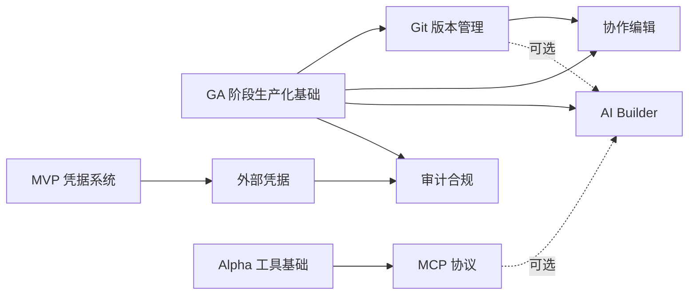

# Enterprise 阶段开发计划总览（plan-enterprise-00-readme）

## 1. 概述

本阶段面向大型企业客户，在 GA 阶段生产化能力之上补齐版本管理、协作编辑、外部凭据、MCP 协议、AI Builder、审计合规等企业级能力。Enterprise 阶段不改变核心执行引擎的确定性语义，所有新增能力均围绕"设计时协作"与"运行时合规"展开。

覆盖范围：

- 工作流版本管理与 Git 集成（自动保存、版本对比、回滚、分支管理）。
- 多用户实时协作编辑（Yjs CRDT、光标广播、写锁定、冲突解决）。
- 外部凭据 Provider（HashiCorp Vault、AWS Secrets Manager、Azure Key Vault）与密钥轮换。
- MCP 协议（Server 暴露工具/资源/提示模板、Client 节点消费外部工具）。
- AI Builder 与自然语言转 DSL（语义解析、校验纠错、人工确认、JSON Config Agent）。
- 审计合规（安全扫描、执行脱敏、合规导出、执行评估、LDAP 集成）。

不覆盖范围：

- 核心执行引擎主循环、节点接口契约、表达式沙箱等已在 MVP/Alpha 定型的能力。
- Redis 队列、独立 Worker、SSO 等已在 GA 定型的能力。
- 各模块的架构设计与接口签名，统一在 [docs/architecture/](../../architecture/) 维护。

## 2. 交付物清单

| 模块 | 计划文档 | 核心交付物 |
|------|----------|-----------|
| Git 版本管理 | [plan-enterprise-01-git.md](plan-enterprise-01-git.md) | 工作流导出到 Git、版本对比、回滚、分支管理、工作流版本历史 |
| 协作编辑 | [plan-enterprise-02-collab.md](plan-enterprise-02-collab.md) | Yjs CRDT 实时协作、光标广播、写锁定、冲突解决、多节点房间路由 |
| 外部凭据 | [plan-enterprise-03-external-cred.md](plan-enterprise-03-external-cred.md) | Vault/AWS SM/Azure KV 适配、ICredentialProvider 抽象、密钥轮换、凭据访问审计强化 |
| MCP 协议 | [plan-enterprise-04-mcp.md](plan-enterprise-04-mcp.md) | MCP Server、MCP Client 节点、工具集注册 |
| AI Builder | [plan-enterprise-05-ai-builder.md](plan-enterprise-05-ai-builder.md) | 语义解析层、校验纠错循环、人工确认与版本化、JSON Config Agent、对话式编辑器、临时节点执行 |
| 审计合规 | [plan-enterprise-06-compliance.md](plan-enterprise-06-compliance.md) | 安全扫描、违规检测、执行脱敏、合规导出、执行评估、LDAP 集成 |

## 3. 模块依赖关系图

依赖说明：

- Git 版本管理、协作编辑、AI Builder、审计合规均依赖 GA 阶段的生产化基础（Redis 队列、监控、SSO、Agent 生产化）。
- 外部凭据依赖 MVP 阶段的凭据系统（plan-mvp-08），在其之上扩展 Provider 抽象与密钥轮换。
- MCP 协议依赖 Alpha 阶段的工具基础（plan-alpha-08），复用工具收集机制与 ToolDefinition 模型。
- 协作编辑依赖 Git 版本管理，协作产生的版本变更需进入版本历史。实时编辑能力（光标广播、冲突解决）本质是前端+WebSocket 能力，可独立先行开发，但版本持久化环节依赖 Git。实施时建议实时编辑与 Git 集成并行推进，最终在"版本保存"接口处对接。
- AI Builder 核心依赖 GA 生产化基础、节点注册中心与执行引擎；MCP 协议（生成的工具可暴露为 MCP 工具）与 Git 版本管理（生成的 DSL 进入版本化流程）为可选增强，非强依赖。
- 审计合规依赖外部凭据（凭据访问审计强化）。

## 4. 整体验收标准

依据 [roadmap.md](../../architecture/roadmap.md) §6 Enterprise 阶段验收标准：

- 多用户可实时协作编辑同一工作流。
- 工作流变更可回滚到任意历史版本。
- MCP Server 可被外部 AI 调用。

补充验收项：

- 自然语言可生成可执行工作流，并经人工确认后版本化保存。
- 凭据可从 HashiCorp Vault 读取，密钥轮换不中断服务。
- 合规报告可导出，脱敏按策略生效，LDAP 账号自动同步。

## 5. 质量门槛

依据 [roadmap.md](../../architecture/roadmap.md) §8 测试与性能基准：

| 维度 | 门槛 |
|------|------|
| 单元测试覆盖率 | ≥ 80%（按客户需求） |
| 集成测试 | MCP、外部凭据、协作编辑、Git 版本管理 |
| E2E 测试 | 完整审批流程（自然语言生成 → 人工确认 → 版本化 → 协作编辑 → 合规导出） |
| 性能目标 | 按客户需求，协作编辑延迟 ≤ 200ms（P99） |

## 6. 风险与待定项

| 风险/待定项 | 影响 | 应对策略 |
|------------|------|---------|
| 协作编辑多节点房间路由复杂 | 大规模协作时 WebSocket 连接抖动 | 先单节点验证 CRDT 正确性，再扩展多节点路由 |
| 外部凭据 Provider 差异大 | 适配成本高 | 抽象 ICredentialProvider，按 Provider 分阶段交付 |
| LLM 生成 DSL 质量不稳定 | 人工确认负担重 | 校验纠错循环 + Few-shot 示例优化，最大重试次数可配置 |
| LDAP 目录结构因客户而异 | 同步逻辑需定制 | 提供映射配置，不硬编码目录结构 |
| Git 集成在 Windows 环境兼容性 | LibGit2Sharp 与原生 Git 行为差异 | 优先 LibGit2Sharp，必要时回退 Git 命令 |

## 7. 验收总标准

- 6 个模块计划文档全部完成，各模块阶段验收标准全部通过。
- 整体验收三项核心标准（协作编辑、版本回滚、MCP Server 调用）全部满足。
- 单元测试覆盖率 ≥ 80%，集成测试与 E2E 测试通过。
- 所有新增能力不破坏 GA 阶段已有的生产化能力。

## 变更记录

| 日期 | 修改人 | 修改内容 | 关联任务 |
|------|--------|----------|----------|
| 2026-06-18 | Agent | 创建 Enterprise 阶段开发计划总览 | plan-enterprise-00-readme |
| 2026-06-18 | Agent | 弱化 AI Builder 对 MCP/Git 的依赖标注，改为可选增强 | 计划 review 修复 |
