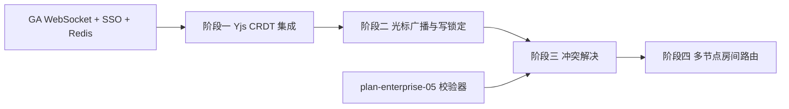

# 开发计划：协作编辑（plan-enterprise-02-collab）

## 1. 概述

本模块为工作流编辑器提供多用户实时协作能力，解决大型企业多团队共同编排工作流时的一致性问题。基于 Yjs CRDT 实现无冲突数据同步，覆盖光标位置广播、写锁定、冲突自动解决，以及大规模协作场景下的 WebSocket 多节点房间路由。

不覆盖范围：

- 工作流版本管理与回滚（见 [plan-enterprise-01-git.md](plan-enterprise-01-git.md)）。
- 协作权限控制（依赖 GA 阶段 RBAC）。
- 执行引擎的并发执行（本模块仅涉及设计时编辑协作）。

## 2. 交付物清单

- Yjs CRDT 实时协作（工作流 JSON 文档共享编辑）。
- 光标位置广播（多用户光标与选区可见）。
- 写锁定（节点级锁定，防止冲突编辑）。
- 冲突解决（CRDT 自动合并 + 冲突提示）。
- WebSocket 多节点房间路由（大规模协作场景）。
- 前端协作编辑器集成。
- 单元测试与集成测试。

## 3. 开发阶段

### 阶段一：Yjs CRDT 集成

- 目标：将工作流 JSON 文档接入 Yjs CRDT，实现多客户端数据同步。
- 核心任务：
  - 引入 Yjs 与 yjs-server（WebSocket 后端）。
  - 工作流 JSON 与 Yjs 文档的双向映射。
  - 客户端连接、断开重连、状态同步。
  - 基础房间管理（按工作流 ID 划分房间）。
- 输入：GA 阶段工作流编辑器、WebSocket 推送能力。
- 输出：多客户端可同步编辑同一工作流 JSON。
- 验收标准：
  - 两个客户端同时编辑同一工作流，数据实时同步。
  - 客户端断开重连后自动同步最新状态。
  - 房间按工作流 ID 隔离，不同工作流互不干扰。
- 依赖：GA 阶段 WebSocket 推送、工作流编辑器。

### 阶段二：光标广播与写锁定

- 目标：实现多用户光标位置可见，以及节点级写锁定防止冲突编辑。
- 核心任务：
  - 光标位置与选区广播（Awareness 协议）。
  - 用户身份标识展示（依赖 GA 阶段 SSO 用户信息）。
  - 节点级写锁定（用户编辑某节点时，该节点对其他用户锁定）。
  - 锁定超时自动释放（防止用户离开后死锁）。
- 输入：阶段一、GA 阶段 SSO。
- 输出：光标广播与写锁定能力。
- 验收标准：
  - 多用户光标位置实时可见，显示用户名。
  - 用户编辑某节点时，其他用户无法编辑该节点，显示锁定提示。
  - 用户断开连接后，锁定在超时时间内自动释放。
- 依赖：阶段一、GA 阶段 SSO。

### 阶段三：冲突解决

- 目标：利用 CRDT 自动合并并发编辑，对无法自动合并的冲突提供提示。
- 核心任务：
  - CRDT 自动合并策略（节点新增/删除/参数修改）。
  - 连线冲突检测与解决（同一连线两端被并发修改）。
  - 冲突提示与手动解决界面。
  - 合并后工作流 JSON 校验（复用语义解析层校验器）。
- 输入：阶段二、语义解析层校验器（plan-enterprise-05）。
- 输出：冲突自动解决能力。
- 验收标准：
  - 并发编辑同一节点不同参数时，CRDT 自动合并无冲突。
  - 同一节点同一参数并发修改时，提示冲突并支持手动选择。
  - 合并后工作流 JSON 通过校验器校验。
- 依赖：阶段二、plan-enterprise-05 语义解析层校验器。

### 阶段四：多节点房间路由

- 目标：支持大规模协作场景下的 WebSocket 多节点部署与房间路由。
- 核心任务：
  - 房间路由策略（按工作流 ID 哈希到指定 WebSocket 节点）。
  - 跨节点房间状态同步（Redis Pub/Sub 或共享存储）。
  - 节点故障时房间迁移。
  - 连接负载均衡。
- 输入：阶段三、GA 阶段 Redis。
- 输出：多节点房间路由能力。
- 验收标准：
  - 多 WebSocket 节点部署时，同一工作流的客户端可路由到同一节点。
  - 节点故障后，房间可迁移到其他节点，客户端自动重连。
  - 跨节点协作数据一致。
- 依赖：阶段三、GA 阶段 Redis。

## 4. 阶段依赖图

## 5. 风险与待定项

| 风险/待定项 | 影响 | 应对策略 |
|------------|------|---------|
| Yjs 文档与工作流 JSON 映射复杂 | 数据同步异常 | 设计明确的映射规则，单元测试覆盖典型拓扑 |
| 大型工作流 CRDT 性能 | 同步延迟 | 评估文档大小阈值，必要时分片同步 |
| 写锁定死锁 | 用户无法编辑 | 锁定超时自动释放 + 管理员强制解锁 |
| 多节点房间路由一致性 | 跨节点数据不一致 | 使用 Redis Pub/Sub 同步房间状态 |
| 节点故障迁移期间数据丢失 | 编辑丢失 | 房间状态持久化到 Redis，迁移后恢复 |

## 6. 验收总标准

- 多用户可实时协作编辑同一工作流（roadmap §6 核心验收项）。
- 冲突自动解决，无法自动解决的冲突提供手动解决界面。
- 光标位置实时广播，写锁定防止冲突编辑。
- 多节点部署时房间路由正确，节点故障可迁移。
- 单元测试覆盖率 ≥ 80%。

## 变更记录

| 日期 | 修改人 | 修改内容 | 关联任务 |
|------|--------|----------|----------|
| 2026-06-18 | Agent | 创建协作编辑开发计划 | plan-enterprise-02-collab |
