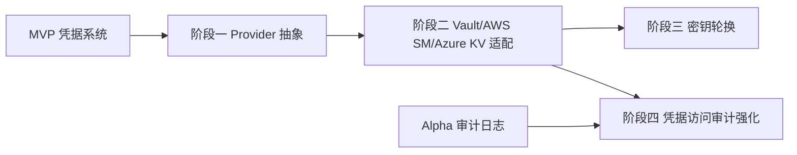

# 开发计划：外部凭据（plan-enterprise-03-external-cred）

## 1. 概述

本模块在 MVP 凭据系统之上扩展外部密钥管理服务集成能力，解决大型企业对凭据集中托管、密钥轮换、访问审计强化的诉求。覆盖 HashiCorp Vault、AWS Secrets Manager、Azure Key Vault 三类外部凭据 Provider 适配，ICredentialProvider 抽象（可替换本地加密），密钥轮换（生成新版本/后台重新加密/旧版本保留），以及凭据访问审计强化。

不覆盖范围：

- 凭据 CRUD、加密存储、运行时解密注入（MVP 已实现，见 plan-mvp-08）。
- 外部密钥管理服务本身的部署与运维。
- 凭据值在前端的展示（前端永远不可见明文）。

## 2. 交付物清单

- ICredentialProvider 抽象（可替换本地加密实现）。
- HashiCorp Vault 适配。
- AWS Secrets Manager 适配。
- Azure Key Vault 适配。
- 密钥轮换（生成新版本、后台重新加密、旧版本保留）。
- 凭据访问审计强化（访问链路全记录、异常访问告警）。
- Provider 配置与切换界面。
- 单元测试与集成测试。

## 3. 开发阶段

### 阶段一：外部凭据 Provider 抽象

- 目标：抽象 ICredentialProvider 接口，使本地加密与外部密钥管理服务可替换。
- 核心任务：
  - 定义 ICredentialProvider 接口（读取、写入、轮换能力）。
  - 重构现有本地加密实现为 LocalCredentialProvider。
  - 凭据记录关联 Provider 类型与配置。
  - Provider 注册与配置切换机制。
- 输入：MVP 凭据系统（plan-mvp-08）、[credentials.md](../../architecture/credentials.md) §6.1。
- 输出：ICredentialProvider 抽象与本地实现迁移。
- 验收标准：
  - ICredentialProvider 接口定义清晰，覆盖读取/写入/轮换能力。
  - 本地加密实现迁移为 LocalCredentialProvider，原有功能不受影响。
  - 凭据记录可关联 Provider 类型，支持配置切换。
- 依赖：plan-mvp-08（凭据系统）。

### 阶段二：Vault/AWS SM/Azure KV 适配

- 目标：实现三类主流外部密钥管理服务的 Provider 适配。
- 核心任务：
  - HashiCorp Vault 适配（KV Secrets Engine v2）。
  - AWS Secrets Manager 适配（含 IAM 认证）。
  - Azure Key Vault 适配（含 Managed Identity 认证）。
  - 各 Provider 连接配置（端点、认证凭据、命名空间）。
  - 凭据缓存策略（减少外部调用，配置 TTL）。
- 输入：阶段一 ICredentialProvider 抽象。
- 输出：三类外部凭据 Provider 实现。
- 验收标准：
  - 凭据可从 HashiCorp Vault 读取并注入节点执行上下文。
  - 凭据可从 AWS Secrets Manager 读取并注入。
  - 凭据可从 Azure Key Vault 读取并注入。
  - 各 Provider 认证凭据通过本地凭据系统引用，不硬编码。
- 依赖：阶段一。

### 阶段三：密钥轮换

- 目标：实现主密钥轮换能力，降低单一密钥长期使用风险。
- 核心任务：
  - 生成新版本主密钥（标记版本号）。
  - 后台任务扫描旧版本凭据，重新加密并更新版本号。
  - 旧版本密钥保留一段时间（可配置），用于解密未及时轮换的记录。
  - 轮换进度监控与告警。
  - 外部 Provider 的密钥轮换对接（Vault/AWS SM/Azure KV 原生轮换能力）。
- 输入：阶段二、[credentials.md](../../architecture/credentials.md) §6.1。
- 输出：密钥轮换能力。
- 验收标准：
  - 密钥轮换不中断服务，轮换期间工作流可正常执行。
  - 轮换后所有凭据记录更新为新版本密钥加密。
  - 旧版本密钥保留期内可解密未轮换记录，超期自动失效。
  - 轮换进度可监控，异常可告警。
- 依赖：阶段二。

### 阶段四：凭据访问审计强化

- 目标：强化凭据访问的审计链路，满足合规要求。
- 核心任务：
  - 凭据访问事件全链路记录（用户、执行、节点、时间、Provider）。
  - 异常访问检测（非授权访问、高频访问、非工作时间访问）。
  - 审计事件对接外部日志系统（ELK/Splunk）。
  - 凭据访问审计报告导出。
- 输入：阶段二、Alpha 阶段审计日志系统、[credentials.md](../../architecture/credentials.md) §6.2。
- 输出：凭据访问审计强化能力。
- 验收标准：
  - 凭据访问审计完整，包含用户、执行、节点、Provider 等维度。
  - 异常访问可检测并告警。
  - 审计事件可对接外部日志系统。
  - 凭据访问审计报告可导出。
- 依赖：阶段二、Alpha 阶段审计日志系统。

## 4. 阶段依赖图

## 5. 风险与待定项

| 风险/待定项 | 影响 | 应对策略 |
|------------|------|---------|
| 外部 Provider 网络不稳定 | 凭据读取失败 | 缓存策略 + 降级到本地加密 |
| 密钥轮换期间服务中断 | 工作流执行失败 | 后台异步轮换，旧版本密钥保留期兜底 |
| 各 Provider API 差异大 | 适配成本高 | 抽象层屏蔽差异，按 Provider 分阶段交付 |
| 外部 Provider 认证凭据泄露 | 凭据全部暴露 | 认证凭据通过本地凭据系统引用，定期轮换 |
| 凭据缓存与外部更新不一致 | 使用过期凭据 | 配置 TTL + 主动失效机制 |

## 6. 验收总标准

- 凭据可从 HashiCorp Vault 读取（roadmap §6 验收项）。
- 密钥轮换不中断服务，旧版本密钥保留期可兜底。
- 凭据访问审计完整，异常访问可检测告警。
- 三类外部 Provider 适配完成，可配置切换。
- 单元测试覆盖率 ≥ 80%。

## 变更记录

| 日期 | 修改人 | 修改内容 | 关联任务 |
|------|--------|----------|----------|
| 2026-06-18 | Agent | 创建外部凭据开发计划 | plan-enterprise-03-external-cred |
