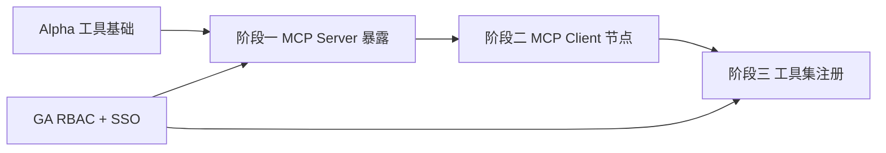

# 开发计划：MCP 协议（plan-enterprise-04-mcp）

## 1. 概述

本模块实现 Model Context Protocol（MCP）协议支持，使 Flow Engine 既能作为 MCP Server 暴露工具/资源/提示模板给外部 AI 调用，也能作为 MCP Client 节点消费外部 MCP 工具集。覆盖 MCP Server 暴露、MCP Client 节点、工具集（ToolCollection）注册。

不覆盖范围：

- 工具收集机制与 ToolDefinition 模型（Alpha 已实现，见 plan-alpha-08）。
- Agent 节点的执行流程与工具调用映射（Alpha/Beta 已实现）。
- MCP 协议规范本身（遵循 MCP 官方规范）。

## 2. 交付物清单

- MCP Server（暴露工具/资源/提示模板给外部 AI 调用）。
- MCP Client 节点（消费外部 MCP 工具集）。
- 工具集（ToolCollection）注册。
- MCP 协议传输层（stdio / SSE / WebSocket）。
- MCP 工具与现有 ToolDefinition 模型适配。
- 单元测试与集成测试。

## 3. 开发阶段

### 阶段一：MCP Server 暴露

- 目标：将 Flow Engine 的工作流、节点能力暴露为 MCP 工具/资源/提示模板，供外部 AI 调用。
- 核心任务：
  - 实现 MCP Server 端点（遵循 MCP 协议规范）。
  - 工具暴露：将工作流注册为 MCP 工具，外部 AI 可调用执行。
  - 资源暴露：将工作流定义、节点定义暴露为 MCP 资源（只读）。
  - 提示模板暴露：将常用工作流模板暴露为 MCP 提示模板。
  - MCP 传输层实现（stdio / SSE / WebSocket 可配置）。
  - 调用鉴权（依赖 GA 阶段 RBAC 与 SSO）。
- 输入：Alpha 工具基础（plan-alpha-08）、[agent-and-tool.md](../../architecture/agent-and-tool.md) §6。
- 输出：MCP Server 能力。
- 验收标准：
  - MCP Server 可被外部 AI 客户端发现并调用（roadmap §6 核心验收项）。
  - 工作流可注册为 MCP 工具，外部 AI 调用后触发执行并返回结果。
  - 资源与提示模板可被外部 AI 读取。
  - 调用受 RBAC 鉴权，未授权调用被拒绝。
- 依赖：plan-alpha-08（工具基础）、GA 阶段 RBAC 与 SSO。

### 阶段二：MCP Client 节点

- 目标：实现 MCP Client 节点，使工作流可消费外部 MCP 工具集。
- 核心任务：
  - 定义 MCP Client 节点类型（作为 Agent 工具端口下游节点）。
  - 连接外部 MCP Server（配置端点、认证凭据）。
  - 动态发现外部 MCP 工具并注册为 ToolDefinition。
  - 工具调用结果适配（MCP 响应转引擎内部执行结果）。
  - 连接池与重连机制。
- 输入：阶段一、Alpha 工具收集机制。
- 输出：MCP Client 节点能力。
- 验收标准：
  - MCP Client 节点可连接外部 MCP Server 并发现工具。
  - 发现的工具可注册为 Agent 可调用工具。
  - Agent 调用 MCP 工具后，结果正确返回 LLM。
  - 连接断开后自动重连。
- 依赖：阶段一、Alpha 工具收集机制。

### 阶段三：工具集注册

- 目标：实现工具集（ToolCollection）注册能力，支持批量管理 MCP 工具。
- 核心任务：
  - 定义 ToolCollection 抽象（一组相关工具的集合）。
  - MCP Server 暴露的工具按集合组织注册。
  - 工具集权限控制（按集合授权）。
  - 工具集元数据管理（名称、描述、版本、来源）。
  - 前端工具集管理界面。
- 输入：阶段二。
- 输出：工具集注册能力。
- 验收标准：
  - 工具可按集合组织注册，支持批量管理。
  - 工具集权限按集合授权，未授权集合不可调用。
  - 工具集元数据完整，前端可管理。
- 依赖：阶段二、GA 阶段 RBAC。

## 4. 阶段依赖图

## 5. 风险与待定项

| 风险/待定项 | 影响 | 应对策略 |
|------------|------|---------|
| MCP 协议版本演进 | 适配失效 | 跟踪 MCP 官方规范，抽象协议层便于升级 |
| 外部 MCP Server 工具发现延迟 | Agent 执行阻塞 | 工具发现异步化 + 缓存 |
| MCP 工具调用结果格式差异 | 适配复杂 | 统一适配为 ToolDefinition 与引擎内部结果 |
| MCP Server 暴露工作流的安全风险 | 未授权调用 | 强制 RBAC 鉴权，敏感工作流不暴露 |
| 传输层兼容性 | 部分客户端不支持 | 支持 stdio / SSE / WebSocket 多种传输 |

## 6. 验收总标准

- MCP Server 可被外部 AI 调用（roadmap §6 核心验收项）。
- MCP Client 节点可消费外部 MCP 工具集。
- 工具集（ToolCollection）注册完成，支持批量管理与权限控制。
- 多种传输层（stdio / SSE / WebSocket）支持。
- 单元测试覆盖率 ≥ 80%。

## 变更记录

| 日期 | 修改人 | 修改内容 | 关联任务 |
|------|--------|----------|----------|
| 2026-06-18 | Agent | 创建 MCP 协议开发计划 | plan-enterprise-04-mcp |
