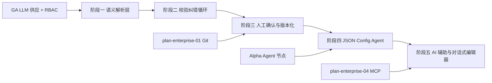

# 开发计划：AI Builder 与自然语言转 DSL（plan-enterprise-05-ai-builder）

## 1. 概述

本模块实现自然语言生成工作流与 AI 辅助编辑能力，解决非技术用户编排工作流的门槛问题。覆盖语义解析层（构造 Prompt 含节点类型列表/输出格式/Few-shot）、生成-校验-纠错循环（最大重试次数）、人工确认与版本化、JSON Config Agent（按名称解析工作流工具/RBAC 鉴权）、AI 辅助编写表达式、对话式编辑器前端、临时节点执行（单节点作为 tool 内存执行不落库）。

不覆盖范围：

- 执行引擎对 DSL 的执行逻辑（执行引擎只接受已校验 DSL，不感知自然语言）。
- LLM 供应节点的模型管理（Alpha 已实现）。
- 工作流版本管理的存储与回滚（见 [plan-enterprise-01-git.md](plan-enterprise-01-git.md)）。

## 2. 交付物清单

- 语义解析层（构造 Prompt 含节点类型列表/输出格式/Few-shot）。
- 生成-校验-纠错循环（最大重试次数可配置）。
- 人工确认与版本化（确认后生成工作流版本，保存原始描述）。
- JSON Config Agent（按名称解析工作流工具、RBAC 鉴权）。
- AI 辅助编写表达式（自然语言转表达式语法）。
- 对话式编辑器前端（自然语言交互、差异对比、版本选择）。
- 临时节点执行（单节点作为 tool 内存执行不落库）。
- 单元测试与集成测试。

## 3. 开发阶段

### 阶段一：语义解析层

- 目标：实现自然语言到工作流 JSON 草案的生成能力。
- 核心任务：
  - 构造结构化 Prompt（含节点类型列表、输出格式要求、Few-shot 示例）。
  - 调用 LLM 生成工作流 JSON 草案。
  - 节点类型目录（NodeTypeCatalog）序列化注入 Prompt。
  - 生成记录持久化（原始输入、LLM 输出、时间、操作人）。
- 输入：GA 阶段 LLM 供应节点、[natural-language-to-dsl.md](../../architecture/natural-language-to-dsl.md) §3.1。
- 输出：语义解析层能力。
- 验收标准：
  - 自然语言输入可生成符合 schema 的工作流 JSON 草案。
  - Prompt 包含节点类型列表、输出格式、Few-shot 示例。
  - 生成记录完整持久化，满足审计要求。
- 依赖：GA 阶段 LLM 供应节点。

### 阶段二：校验纠错循环

- 目标：实现生成-校验-纠错闭环，校验失败时自动反馈 LLM 重新生成。
- 核心任务：
  - Schema 校验（结构合法性）。
  - 节点类型校验（typeName 是否已注册）。
  - 端口方向校验与连接完整性校验（悬空、闭环、不可达节点）。
  - 必填参数校验。
  - 校验失败时错误信息反馈 LLM，重新生成（最大重试次数可配置）。
  - 超过最大重试次数时返回人工处理。
- 输入：阶段一、[natural-language-to-dsl.md](../../architecture/natural-language-to-dsl.md) §3.2/§3.3。
- 输出：校验纠错循环能力。
- 验收标准：
  - 校验失败自动纠错，达到最大重试次数后返回人工处理。
  - 校验覆盖 Schema、节点类型、端口方向、连接完整性、必填参数。
  - 纠错循环可配置最大重试次数。
- 依赖：阶段一。

### 阶段三：人工确认与版本化

- 目标：校验通过的 DSL 经人工确认后保存为工作流版本。
- 核心任务：
  - 人工确认界面（展示生成的 DSL 与原始描述）。
  - 确认后生成工作流版本号。
  - 保存原始自然语言描述，便于追溯。
  - 版本化保存对接 Git 版本管理（plan-enterprise-01）。
  - 确认人记录与审计。
- 输入：阶段二、plan-enterprise-01 Git 版本管理。
- 输出：人工确认与版本化能力。
- 验收标准：
  - 校验通过的 DSL 可经人工确认后版本化保存。
  - 原始自然语言描述与生成 DSL 关联保存。
  - 确认人、时间、版本号记录完整。
- 依赖：阶段二、plan-enterprise-01。

### 阶段四：JSON Config Agent

- 目标：实现通过 JSON 声明式定义 Agent（无需画布），按名称解析工作流工具并 RBAC 鉴权。
- 核心任务：
  - JSON 声明式 Agent 配置 schema（工具按名称引用）。
  - 按名称解析工作流工具（[agent-and-tool.md](../../architecture/agent-and-tool.md) §8.2 JSON 配置来源）。
  - RBAC 鉴权（按名称解析时校验调用方对目标工作流的权限）。
  - JSON Config Agent 执行（复用 Agent 执行流程）。
  - 配置校验（名称是否存在、权限是否足够）。
- 输入：阶段三、Alpha Agent 节点、[agent-and-tool.md](../../architecture/agent-and-tool.md) §8.2。
- 输出：JSON Config Agent 能力。
- 验收标准：
  - JSON 声明式 Agent 可按名称解析工作流工具。
  - 解析时 RBAC 鉴权，无权限工作流不可被引用。
  - JSON Config Agent 可执行并调用解析到的工具。
- 依赖：阶段三、Alpha Agent 节点、GA 阶段 RBAC。

### 阶段五：AI 辅助与对话式编辑器

- 目标：实现 AI 辅助编写表达式与对话式编辑器前端，以及临时节点执行能力。
- 核心任务：
  - AI 辅助编写表达式（自然语言转 `{{ }}` 表达式语法）。
  - 对话式编辑器前端（自然语言交互、差异对比、版本选择）。
  - 自然语言修改现有工作流（增量编辑）。
  - 根据错误信息自动修正工作流。
  - 临时节点执行（单节点作为 tool 内存执行不落库，用于细粒度 tool 注册）。
- 输入：阶段四、plan-enterprise-04 MCP 协议。
- 输出：AI 辅助与对话式编辑器能力。
- 验收标准：
  - 自然语言可生成可执行工作流（roadmap §6 验收项）。
  - AI 辅助编写表达式，生成语法正确的表达式。
  - 对话式编辑器支持自然语言修改现有工作流与差异对比。
  - 临时节点执行不落库，结果内存返回。
- 依赖：阶段四、plan-enterprise-04 MCP 协议。

## 4. 阶段依赖图

## 5. 风险与待定项

| 风险/待定项 | 影响 | 应对策略 |
|------------|------|---------|
| LLM 生成 DSL 质量不稳定 | 人工确认负担重 | Few-shot 示例优化 + 校验纠错循环，最大重试次数可配置 |
| 提示注入污染工作流定义 | 安全风险 | JSON Schema 强校验 + 字符串黑名单过滤 + Prompt 与外部输入隔离 |
| JSON Config Agent 名称解析冲突 | 工具引用错误 | 名称唯一性校验 + RBAC 鉴权 |
| 临时节点执行内存泄漏 | 资源耗尽 | 执行完成后立即释放，限制并发临时执行数 |
| 对话式编辑器交互复杂 | 用户体验差 | 分阶段交付，先支持生成再支持增量修改 |

## 6. 验收总标准

- 自然语言可生成可执行工作流（roadmap §6 验收项）。
- 校验失败自动纠错，达到最大重试次数后返回人工处理。
- 人工确认后版本化保存，原始描述可追溯。
- JSON 声明式 Agent 可按名称解析工作流工具并 RBAC 鉴权。
- AI 辅助编写表达式，对话式编辑器支持增量修改。
- 临时节点执行不落库，结果内存返回。
- 单元测试覆盖率 ≥ 80%。

## 变更记录

| 日期 | 修改人 | 修改内容 | 关联任务 |
|------|--------|----------|----------|
| 2026-06-18 | Agent | 创建 AI Builder 与自然语言转 DSL 开发计划 | plan-enterprise-05-ai-builder |
