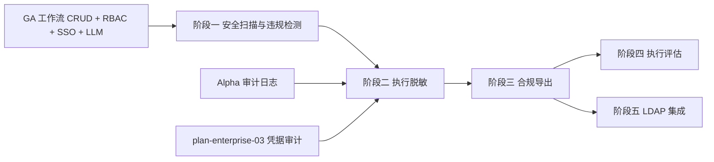

# 开发计划：审计合规（plan-enterprise-06-compliance）

## 1. 概述

本模块补齐大型企业合规审计所需能力，覆盖安全扫描报告、违规检测、执行脱敏（按策略自动隐藏敏感字段/可配置脱敏级别）、合规导出、执行评估（测试数据集运行/结果对比/LLM 评估）、LDAP 用户目录同步（自动开通/停用账号）。

不覆盖范围：

- 审计日志系统的事件模型与写入机制（Alpha 已实现）。
- 凭据访问审计强化（见 [plan-enterprise-03-external-cred.md](plan-enterprise-03-external-cred.md)）。
- RBAC 权限模型（Beta 已实现）。

## 2. 交付物清单

- 安全扫描报告（工作流定义静态扫描）。
- 违规检测（检测不符合安全策略的配置）。
- 执行脱敏（按策略自动隐藏敏感字段、可配置脱敏级别）。
- 合规导出（审计报告、执行报告、脱敏报告导出）。
- 执行评估（测试数据集运行、结果对比、LLM 评估）。
- LDAP 用户目录同步（自动开通/停用账号）。
- 单元测试与集成测试。

## 3. 开发阶段

### 阶段一：安全扫描与违规检测

- 目标：对工作流定义进行静态安全扫描，检测违规配置。
- 核心任务：
  - 安全扫描规则定义（硬编码凭据、不安全 HTTP、无限循环风险等）。
  - 工作流定义静态扫描（保存时触发 + 手动触发）。
  - 违规检测报告生成（违规项、级别、修复建议）。
  - 扫描规则可配置（按企业安全策略定制）。
  - 严重违规阻断保存（可配置）。
- 输入：GA 阶段工作流 CRUD、[audit-log.md](../../architecture/audit-log.md) §7。
- 输出：安全扫描与违规检测能力。
- 验收标准：
  - 工作流保存时可触发安全扫描，生成违规检测报告。
  - 扫描规则可配置，支持企业定制。
  - 严重违规可阻断保存（可配置）。
- 依赖：GA 阶段工作流 CRUD。

### 阶段二：执行脱敏

- 目标：按策略自动隐藏执行结果中的敏感字段，支持可配置脱敏级别。
- 核心任务：
  - 脱敏策略定义（字段名匹配规则、正则、凭据类型）。
  - 脱敏级别配置（完全隐藏、部分掩码、哈希替换）。
  - 执行结果与审计日志脱敏（运行时拦截）。
  - 脱敏策略按项目/工作流/节点粒度配置。
  - 脱敏审计（记录脱敏操作）。
- 输入：阶段一、Alpha 审计日志系统、[audit-log.md](../../architecture/audit-log.md) §7。
- 输出：执行脱敏能力。
- 验收标准：
  - 执行结果中敏感字段按策略自动脱敏。
  - 脱敏级别可配置（完全隐藏/部分掩码/哈希替换）。
  - 脱敏策略按项目/工作流/节点粒度生效。
  - 审计日志中不包含明文敏感信息。
- 依赖：阶段一、Alpha 审计日志系统。

### 阶段三：合规导出

- 目标：支持审计报告、执行报告、脱敏报告的合规导出。
- 核心任务：
  - 审计报告导出（按时间/类型/资源维度）。
  - 执行报告导出（执行记录、节点输入输出、耗时）。
  - 脱敏报告导出（脱敏操作记录）。
  - 导出格式支持（PDF/CSV/JSON）。
  - 导出权限控制（依赖 GA RBAC）。
  - 导出范围与时间筛选。
- 输入：阶段二、Alpha 审计日志系统。
- 输出：合规导出能力。
- 验收标准：
  - 合规报告可导出（roadmap §6 验收项）。
  - 支持 PDF/CSV/JSON 格式。
  - 导出受 RBAC 权限控制。
  - 导出范围与时间可筛选。
- 依赖：阶段二、GA 阶段 RBAC。

### 阶段四：执行评估

- 目标：通过测试数据集运行工作流并评估结果质量。
- 核心任务：
  - 测试数据集管理（上传、维护、版本化）。
  - 工作流在测试数据集上运行（不触发实际副作用，沙箱模式）。
  - 结果对比（与预期结果对比，输出差异）。
  - LLM 评估（对非结构化输出进行语义评估）。
  - 评估报告生成（通过率、差异项、LLM 评分）。
- 输入：阶段三、GA 阶段 LLM 供应节点。
- 输出：执行评估能力。
- 验收标准：
  - 测试数据集可上传并版本化管理。
  - 工作流可在测试数据集上运行，不触发实际副作用。
  - 结果可与预期对比，输出差异。
  - LLM 可对非结构化输出进行语义评估。
- 依赖：阶段三、GA 阶段 LLM 供应节点。

### 阶段五：LDAP 集成

- 目标：实现 LDAP 用户目录同步，自动开通/停用账号。
- 核心任务：
  - LDAP 连接配置（端点、绑定 DN、搜索基础、认证凭据引用）。
  - 用户目录同步（定时拉取 LDAP 用户）。
  - 自动开通账号（LDAP 用户首次登录自动创建本地账号）。
  - 自动停用账号（LDAP 用户被禁用/删除时停用本地账号）。
  - 用户属性映射（LDAP 属性到本地用户字段，可配置）。
  - 角色映射（LDAP 组到本地角色，依赖 GA RBAC）。
- 输入：阶段三、GA 阶段 SSO 与 RBAC。
- 输出：LDAP 集成能力。
- 验收标准：
  - LDAP 账号自动同步（roadmap §6 验收项）。
  - LDAP 用户首次登录自动开通本地账号。
  - LDAP 用户被禁用/删除时自动停用本地账号。
  - 用户属性与角色映射可配置。
- 依赖：阶段三、GA 阶段 SSO 与 RBAC。

## 4. 阶段依赖图

## 5. 风险与待定项

| 风险/待定项 | 影响 | 应对策略 |
|------------|------|---------|
| 安全扫描规则误报 | 阻断正常保存 | 规则可配置，严重级别分级，非严重违规仅告警 |
| 脱敏性能开销 | 执行延迟 | 脱敏在审计日志异步通道处理，不影响主流程 |
| LDAP 目录结构因客户而异 | 同步逻辑需定制 | 提供属性映射配置，不硬编码目录结构 |
| LLM 评估结果不稳定 | 评估可信度低 | 多次评估取平均 + 人工抽检 |
| 合规导出数据量大 | 导出超时 | 分页导出 + 异步生成 + 下载通知 |
| LDAP 同步期间账号状态不一致 | 登录异常 | 增量同步 + 状态变更日志 |

## 6. 验收总标准

- 合规报告可导出（roadmap §6 验收项）。
- 脱敏按策略生效，可配置脱敏级别。
- LDAP 账号自动同步，开通/停用自动化。
- 安全扫描与违规检测覆盖工作流定义静态扫描。
- 执行评估支持测试数据集运行与 LLM 评估。
- 单元测试覆盖率 ≥ 80%。

## 变更记录

| 日期 | 修改人 | 修改内容 | 关联任务 |
|------|--------|----------|----------|
| 2026-06-18 | Agent | 创建审计合规开发计划 | plan-enterprise-06-compliance |
