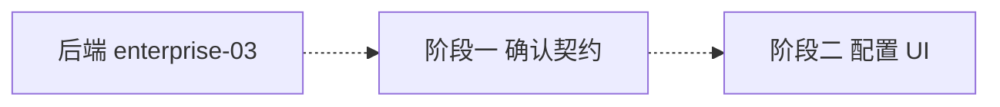

# 开发计划：前端外部凭据提供方配置 UI（plan-enterprise-07-frontend-external-credentials）

> 配套后端计划：`enterprise/plan-enterprise-03-external-cred.md`
> 横向约定与推荐实施路线见 `plan-frontend-management-ui.md`
> 阶段归属：Enterprise（对应后端外部凭据模块）

## 状态：暂缓（DEFERRED）

本模块**暂缓实施**，原因：
1. 后端 `enterprise-03` 尚未落地——代码库未发现 `external-credentials` 类控制器，无可供前端对接的 API 契约。
2. 当前语境（国内部署）暂无使用 Vault / AWS Secrets Manager / Azure Key Vault 的需求；本地凭据（`LocalCredentialProvider`，AES-256-GCM 加密存库）已覆盖绝大多数场景。

**重启条件**：待 `enterprise/plan-enterprise-03-external-cred.md` 完成后（即后端 Provider 适配与配置端点落地）重启本模块，并按实际契约细化 API 封装、类型与交互。

本文件仅保留预设计，重启前不排期。

## 1. 概述（预设计）

在凭据管理基础上，支持配置外部密钥管理服务（Vault / AWS SM / Azure KV）的连接与同步，使凭据真实值托管于外部服务、运行时由引擎读取注入。

覆盖范围（待定）：
- 提供方类型选择（Vault / AWS SM / Azure KV / 本地）。
- 连接配置表单（端点、认证凭据引用、命名空间）。
- 凭据同步状态展示。

不覆盖范围：
- 后端 Provider 适配、密钥轮换、审计强化（属 `enterprise-03` 后端范畴）。
- 凭据明文展示（前端永远不可见）。

## 2. 交付物清单（预设计，待细化）

- `src/pages/AdminExternalCredentialsPage.tsx` 或扩展 `CredentialListModal`：提供方配置 UI。
- `src/services/api.ts` 增加外部提供方相关封装（端点确认后补充）。
- `src/types/workflow.ts` 增加 `CredentialProvider` 等类型。

## 3. 开发阶段（预设计）

### 阶段一：确认后端契约
- 确认 `enterprise-03` 的提供方枚举、配置端点、同步端点。

### 阶段二：提供方配置 UI
- 实现提供方类型选择、连接配置、凭据同步。

## 4. 阶段依赖图

## 5. 风险与待定项

| 风险/待定项 | 影响 | 应对策略 |
|------------|------|---------|
| 后端未落地 | 无法实施 | 暂缓；后端就绪后细化 |
| 国内无对应服务需求 | 价值存疑 | 本地凭据已足够；真需集中托管时改接国内 KMS（阿里云/腾讯云/华为云）适配器 |

## 6. 验收总标准（待契约确定）

- 可按提供方类型配置连接并拉取/同步凭据。
- 本地凭据列表可标注来源。
- 遵循前端代码规范，构建/类型检查通过。

## 变更记录

| 日期 | 修改人 | 修改内容 | 关联任务/PR |
|------|--------|----------|------------|
| 2026-07-15 | Agent | 初版（根目录 plan-frontend-external-credentials.md） | 前端功能缺口审计 |
| 2026-07-15 | Agent | 迁移至 enterprise/ 并按规范命名；标记暂缓并增加重启条件；mermaid 虚线语法修正 | 计划评审 P0/P1/P2/P3 |
