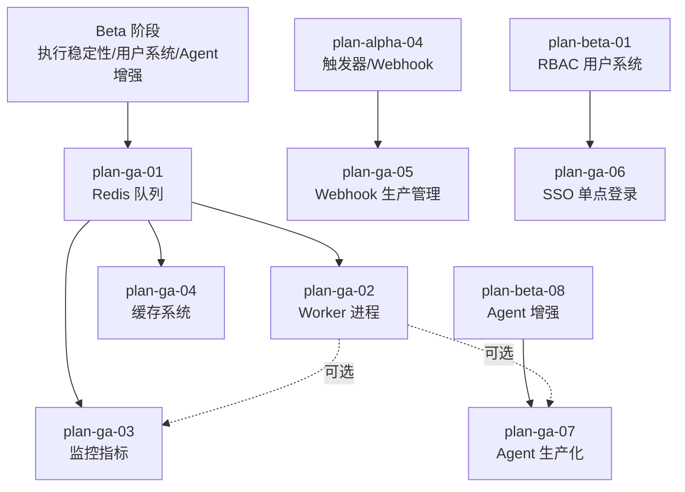

# 开发计划：GA 阶段说明（plan-ga-00-readme）

## 1. 概述

本文件是 Flow Engine GA（General Availability）阶段的入口与索引。GA 阶段的目标是把 Beta 阶段已具备企业基础能力的系统推向生产可用：引入 Redis 队列与独立 Worker 进程以支撑横向扩展，补齐监控指标与分布式链路追踪以保障可观测性，落地 SSO 单点登录以对接企业身份系统，并完成 Agent 节点的生产化（流式输出、Fallback、批处理、可观测）。

本阶段覆盖范围：

- Redis 队列替换内存 `Channel<T>`，执行状态外置。
- 独立 Worker 进程，含心跳、任务抢占、优雅关闭、崩溃恢复。
- Prometheus 指标、OpenTelemetry 链路追踪、Sentry 错误上报。
- 内存 + Redis 双层缓存，配置化 TTL 与失效策略。
- Webhook 生产管理（动态路由、CORS、速率限制、请求校验强化、测试 Webhook）。
- SSO 单点登录（SAML 2.0 / OIDC）。
- Agent 生产化（流式响应、Fallback 模型、批处理、可观测）。

不覆盖范围：

- 协作编辑、Git 版本管理、外部凭据 Vault、MCP 协议、AI Builder（属 Enterprise 阶段）。
- 数据库从 SQLite 迁移到 PostgreSQL 的具体迁移脚本（由运维按 [deployment.md](../../architecture/deployment.md) §5 扩展路径执行）。

GA 阶段强依赖 Beta 阶段的执行稳定性、用户系统、限流安全、Agent 增强等能力。各模块计划只写"要做什么"和"怎么验收"，不重复 `docs/architecture/` 中已有的设计内容，架构设计、接口签名、数据模型统一在架构文档中维护。

## 2. 交付物清单

| 类别 | 交付物 |
|------|--------|
| 队列与执行 | Redis 队列实现、入队/出队协议、结果回写、失败重试、执行状态外置 |
| Worker 进程 | 独立 Worker 进程、心跳检测、任务抢占、优雅关闭、崩溃恢复扫描 |
| 监控 | Prometheus 指标采集端点、OpenTelemetry 追踪导出、Sentry 错误上报集成 |
| 缓存 | 双层缓存抽象、内存缓存实现、Redis 缓存实现、TTL 与失效策略、节点元数据与表达式 AST 缓存接入 |
| Webhook | 动态路由匹配、CORS 配置、QPS 速率限制、签名/白名单/请求体大小校验、测试 Webhook 临时路径 |
| SSO | SAML 2.0 / OIDC 登录适配、自动建用户、角色映射、IdP 配置管理 |
| Agent 生产化 | 流式响应接口、Fallback 模型降级、批处理、子 Agent 内联执行、token 用量追踪 |
| 测试 | 单元测试覆盖率 ≥75%、Redis 队列+Worker 集成测试、Worker 故障转移 E2E |
| 文档 | 各模块计划文档、配置说明、运维手册补充 |

## 3. 开发阶段

GA 阶段按模块划分为 7 个并行/串行开发计划，详见各模块计划文档。本节仅给出阶段级目标与依赖说明。

### 阶段一：Redis 队列与执行状态外置

- 目标：用 Redis 队列替换内存 `Channel<T>`，使执行任务可跨进程分发。
- 核心任务：Redis 队列适配、入队/出队协议、结果回写与失败重试。
- 输入：Beta 执行引擎、执行记录持久化（Pending 状态）。
- 输出：Redis 队列实现、跨进程任务分发能力。
- 验收标准：任务可跨进程分发，入队前已持久化为 Pending，失败可重试。
- 依赖：Beta 执行稳定性（plan-beta-06 执行清理、plan-beta-08 Agent 增强）。

### 阶段二：独立 Worker 进程

- 目标：Worker 可独立部署，崩溃后任务被其他 Worker 接管。
- 核心任务：Worker 进程与心跳、任务抢占、优雅关闭、崩溃恢复。
- 输入：GA Redis 队列。
- 输出：独立 Worker 进程、故障转移能力。
- 验收标准：Worker 崩溃后任务被其他 Worker 接管，优雅关闭不丢任务。
- 依赖：plan-ga-01 Redis 队列。

### 阶段三：监控与可观测

- 目标：监控指标可导出 Prometheus，链路可追踪，未处理异常自动上报。
- 核心任务：Prometheus 指标采集、OpenTelemetry 追踪、Sentry 集成。
- 输入：GA 队列与 Worker。
- 输出：指标端点、追踪导出、错误上报。
- 验收标准：监控指标可导出 Prometheus，链路追踪可查，未处理异常自动上报。
- 依赖：GA 队列（plan-ga-01）。

### 阶段四：缓存系统

- 目标：双层缓存降低数据库与表达式引擎压力。
- 核心任务：缓存抽象与双层实现、TTL 与失效策略、缓存接入节点元数据与表达式 AST。
- 输入：GA 基础设施。
- 输出：可配置缓存系统。
- 验收标准：缓存命中率提升，TTL 可配置，失效策略生效。
- 依赖：GA 阶段引入的 Redis 连接基础设施（共享 plan-ga-01 的 Redis 连接管理，不依赖队列入队/出队协议）。

### 阶段五：Webhook 生产管理

- 目标：Webhook 在生产环境可用，支持动态路由与安全校验。
- 核心任务：动态路由、CORS 与速率限制、请求校验强化、测试 Webhook。
- 输入：Alpha Webhook 触发器（plan-alpha-04）。
- 输出：生产级 Webhook 路由与安全校验。
- 验收标准：动态路由匹配，超限返回 429，请求体大小限制生效。
- 依赖：plan-alpha-04 触发器。

### 阶段六：SSO 单点登录

- 目标：企业 IdP 用户可自动登录并映射角色。
- 核心任务：SAML/OIDC 适配、自动建用户与角色映射、IdP 配置管理。
- 输入：Beta 用户系统（plan-beta-01 RBAC）。
- 输出：SSO 登录与角色映射。
- 验收标准：SSO 用户可自动登录并映射角色，IdP 配置可管理。
- 依赖：Beta 用户系统（plan-beta-01 RBAC）。

### 阶段七：Agent 生产化

- 目标：Agent 支持流式输出、Fallback 降级、token 用量可追踪。
- 核心任务：流式响应、Fallback 与批处理、Agent 可观测。
- 输入：Beta Agent 增强（plan-beta-08）。
- 输出：生产级 Agent 能力。
- 验收标准：Agent 支持流式输出，Fallback 降级生效，token 用量可追踪。
- 依赖：plan-beta-08 Agent 增强。

## 4. 阶段依赖图

模块依赖关系说明：

- `plan-ga-01 Redis 队列` 是 GA 阶段的核心前置，Worker、监控、缓存均依赖执行状态外置。
- `plan-ga-02 Worker` 强依赖 Redis 队列；监控与 Agent 可观测在 Worker 就绪后可更完整地采集跨进程指标。
- `plan-ga-05 Webhook 生产管理` 依赖 Alpha 阶段的 Webhook 触发器，与队列无强耦合。
- `plan-ga-06 SSO` 依赖 Beta 的 RBAC 用户系统，与其他 GA 模块并行。
- `plan-ga-07 Agent 生产化` 依赖 Beta Agent 增强，流式输出与可观测独立于队列。

## 5. 风险与待定项

| 风险/待定项 | 影响 | 应对策略 |
|-------------|------|----------|
| Redis 连接不稳定导致任务丢失 | 执行任务无法分发 | 入队前持久化 Pending；Worker 出队后先标记 Running 再执行；连接重试与降级到内存队列的开关 |
| Worker 崩溃恢复误判任务状态 | 任务重复执行或遗漏 | 依赖 `LastExecutionRecord` 辅助幂等；恢复扫描以数据库状态为准而非内存 |
| Prometheus 指标采集影响主流程性能 | 高并发下指标采集成为瓶颈 | 指标采集异步化，使用采样与聚合；指标缓冲区限流 |
| SSO IdP 协议差异大 | 适配成本高 | 先支持 OIDC（覆盖面广），SAML 按客户需求迭代；IdP 配置抽象为统一模型 |
| Agent 流式输出与现有执行记录模型冲突 | 流式结果难以落库 | 流式执行同样生成 `NodeExecutionRecord`，最终聚合结果作为节点输出（见 [agent-and-tool.md](../../architecture/agent-and-tool.md) §11.2） |
| 缓存失效策略与多 Worker 一致性 | 跨 Worker 缓存不一致 | 写操作失效广播（Redis Pub/Sub）；关键缓存短 TTL 兜底 |
| 1000 TPS 多 Worker 性能目标 | 需要压测环境与调优 | 预留压测阶段，先达标单 Worker 再扩展多 Worker |

## 6. 验收总标准

GA 阶段整体验收标准（对应 [roadmap.md](../../architecture/roadmap.md) §5）：

- [ ] Worker 崩溃后任务可被其他 Worker 接管（故障转移 E2E 通过）。
- [ ] 监控指标可导出到 Prometheus（`/metrics` 端点可被抓取）。
- [ ] SSO 用户可自动登录并映射角色（SAML/OIDC 至少一种走通）。
- [ ] Agent 支持流式输出（`StreamingChunk` 经 WebSocket/SSE 推送到前端）。
- [ ] 单元测试覆盖率 ≥75%。
- [ ] 多 Worker 场景下达到 1000 TPS（性能压测通过）。
- [ ] 优雅关闭不丢任务（`ApplicationStopping` 钩子验证通过）。
- [ ] 缓存命中率与无缓存相比有可量化提升。
- [ ] Webhook 超限请求返回 429，请求体超限被拒绝。

## 变更记录

| 日期 | 修改人 | 修改内容 | 关联任务 |
|------|--------|----------|----------|
| 2026-06-18 | Agent | 创建 GA 阶段说明文档，定义模块依赖与整体验收标准 | GA 计划编写 |
