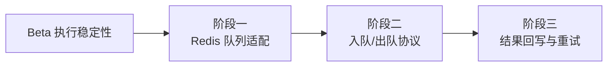

# 开发计划：Redis 队列（plan-ga-01-redis-queue）

## 1. 概述

本模块用 Redis 队列替换 MVP 阶段的内存 `Channel<T>` 执行队列，使执行任务可跨进程分发，为独立 Worker 进程与横向扩展提供基础。核心原则遵循 [deployment.md](../../architecture/deployment.md) §5 的状态外置：执行入队前先将 `ExecutionRecord` 持久化为 `Pending`，再写入 Redis 队列；Worker 出队后执行，结果回写数据库，失败按策略重试。

覆盖范围：

- Redis 队列适配实现（替换内存 `Channel<T>`）。
- 主节点入队协议（执行前持久化 Pending）。
- Worker 出队执行协议。
- 执行结果回写与失败重试。
- 执行状态外置到数据库。

不覆盖范围：

- 独立 Worker 进程的生命周期管理（心跳、抢占、优雅关闭、崩溃恢复）见 [plan-ga-02-worker.md](plan-ga-02-worker.md)。
- 监控指标采集见 [plan-ga-03-monitoring.md](plan-ga-03-monitoring.md)。
- 数据库从 SQLite 迁移到 PostgreSQL 的具体实施。

## 2. 交付物清单

| 类别 | 交付物 |
|------|--------|
| 代码 | Redis 队列实现（实现现有执行队列抽象）、入队/出队协议、结果回写、失败重试逻辑 |
| 配置 | Redis 连接配置、队列名称规范、重试策略配置（次数/退避） |
| 测试 | 跨进程分发集成测试、入队前持久化验证、失败重试用例 |
| 文档 | 队列协议说明、配置项说明 |

## 3. 开发阶段

### 阶段一：Redis 队列适配

- 目标：用 Redis 实现替换内存 `Channel<T>`，保持执行队列抽象不变。
- 核心任务：
  - 引入 Redis 客户端依赖。
  - 实现 Redis 队列（List/Stream 结构选型），满足现有 `IExecutionQueue` 抽象。
  - 配置化切换：单机默认内存队列，生产环境启用 Redis 队列。
  - 队列名称按工作流/优先级维度规划。
- 输入：Beta 执行引擎、执行队列抽象接口。
- 输出：Redis 队列实现、配置开关。
- 验收标准：
  - Redis 队列实现现有执行队列抽象，主流程无需感知底层实现。
  - 单机模式下仍可使用内存队列，行为不变。
  - 生产模式启用 Redis 队列后，任务可被多个消费者读取。
- 依赖：Beta 执行稳定性（plan-beta-06 执行清理）。

### 阶段二：入队/出队协议

- 目标：定义主节点入队与 Worker 出队的协议，保证入队前已持久化。
- 核心任务：
  - 主节点入队流程：先将 `ExecutionRecord` 持久化为 `Pending`，再写入 Redis 队列。
  - Worker 出队流程：从 Redis 取任务，标记为 `Running`，开始执行。
  - 队列消息结构定义（执行 ID、工作流定义 ID、输入数据引用）。
  - 入队原子性保证：数据库写入与 Redis 入队的一致性（先持久化再入队，失败回滚状态）。
- 输入：阶段一 Redis 队列实现、执行记录持久化。
- 输出：入队/出队协议实现。
- 验收标准：
  - 入队前 `ExecutionRecord` 必须已持久化为 `Pending`，否则入队失败。
  - 数据库写入成功但 Redis 入队失败时，任务可被恢复扫描重新入队。
  - Worker 出队后任务状态变为 `Running`。
- 依赖：阶段一。

### 阶段三：结果回写与失败重试

- 目标：Worker 执行完成后回写结果，失败按策略重试。
- 核心任务：
  - 执行成功：回写 `ExecutionRecord` 为 `Completed`，写入输出数据。
  - 执行失败：按重试策略（次数/退避）重新入队，超过次数标记 `Failed`。
  - 重试退避策略（固定间隔/指数退避）配置化。
  - 结果回写与队列解耦：结果写数据库，队列只承载任务分发。
- 输入：阶段二入队/出队协议。
- 输出：结果回写与重试逻辑。
- 验收标准：
  - 执行成功后结果可查询，队列中无残留。
  - 失败任务按配置次数重试，超过次数标记 `Failed`。
  - 重试间隔符合退避策略配置。
- 依赖：阶段二。

## 4. 阶段依赖图

## 5. 风险与待定项

| 风险/待定项 | 影响 | 应对策略 |
|-------------|------|----------|
| 数据库写入与 Redis 入队非原子 | 任务持久化但未入队，或入队但未持久化 | 先持久化 Pending 再入队；入队失败时状态仍为 Pending，由恢复扫描重新入队 |
| Redis 队列消息丢失 | 任务无法被消费 | 使用 Redis Stream（支持消费者组与 ACK）或 List + 备份；入队前已持久化，可恢复 |
| 重试风暴压垮下游 | 失败任务反复重试导致雪崩 | 退避策略 + 最大重试次数 + 死信队列 |
| 队列结构选型（List vs Stream） | 影响可靠性与复杂度 | 待定项：评估 Redis Stream 消费者组方案，优先选 Stream 以支持 ACK 与积压 |

## 6. 验收总标准

- [ ] Redis 队列替换内存 `Channel<T>`，执行队列抽象不变。
- [ ] 任务可跨进程分发（多消费者场景下任务不重复消费）。
- [ ] 入队前 `ExecutionRecord` 已持久化为 `Pending`。
- [ ] Worker 出队后任务状态变为 `Running`。
- [ ] 执行成功结果回写，失败按策略重试，超过次数标记 `Failed`。
- [ ] 单机模式仍可使用内存队列，行为不变。
- [ ] 单元测试覆盖率 ≥75%，跨进程分发集成测试通过。

## 变更记录

| 日期 | 修改人 | 修改内容 | 关联任务 |
|------|--------|----------|----------|
| 2026-06-18 | Agent | 创建 Redis 队列开发计划 | GA 计划编写 |
