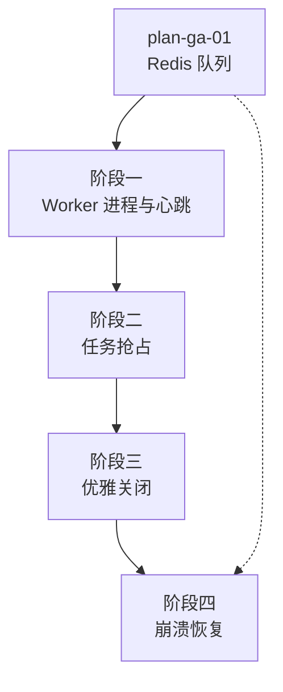

# 开发计划：Worker 进程（plan-ga-02-worker）

## 1. 概述

本模块实现独立 Worker 进程，承载执行引擎从 Redis 队列消费任务并执行。Worker 具备心跳检测、任务抢占、优雅关闭与崩溃恢复能力，确保单 Worker 崩溃后任务可被其他 Worker 接管，服务停止时不丢任务。优雅关闭与崩溃恢复机制遵循 [deployment.md](../../architecture/deployment.md) §9 的设计。

覆盖范围：

- 独立 Worker 进程（可独立部署、多实例运行）。
- 心跳检测（Worker 存活上报）。
- 任务抢占（多 Worker 竞争消费，任务不重复执行）。
- 优雅关闭（`IHostApplicationLifetime.ApplicationStopping` 钩子）。
- 崩溃恢复（扫描 Pending/Running 重新入队，`LastExecutionRecord` 辅助幂等）。

不覆盖范围：

- Redis 队列本身实现见 [plan-ga-01-redis-queue.md](plan-ga-01-redis-queue.md)。
- 监控指标采集见 [plan-ga-03-monitoring.md](plan-ga-03-monitoring.md)。
- Worker 内部执行引擎主循环（复用 Beta 执行引擎）。

## 2. 交付物清单

| 类别 | 交付物 |
|------|--------|
| 代码 | Worker 进程入口、心跳上报服务、任务抢占逻辑、优雅关闭托管服务、崩溃恢复扫描器 |
| 配置 | Worker 实例标识、心跳间隔、`ShutdownTimeout`（默认 30 秒）、恢复扫描间隔 |
| 测试 | Worker 崩溃故障转移 E2E、优雅关闭不丢任务用例、崩溃恢复重新入队用例 |
| 文档 | Worker 部署说明、故障转移流程说明 |

## 3. 开发阶段

### 阶段一：Worker 进程与心跳

- 目标：Worker 可独立启动，向协调服务上报心跳。
- 核心任务：
  - 创建独立 Worker 进程入口（复用执行引擎主循环，从 Redis 队列消费）。
  - 心跳检测：Worker 定期上报存活状态（心跳写入 Redis 或数据库，含 Worker ID、最后心跳时间）。
  - 心跳超时判定：超过阈值未收到心跳，标记 Worker 为失活。
  - Worker 注册与注销机制。
- 输入：plan-ga-01 Redis 队列、Beta 执行引擎。
- 输出：可独立运行的 Worker 进程、心跳上报与失活判定。
- 验收标准：
  - Worker 进程可独立启动并消费 Redis 队列任务。
  - 心跳按配置间隔上报，失活 Worker 被正确标记。
  - 多个 Worker 可同时运行，各自消费不同任务。
- 依赖：plan-ga-01 Redis 队列。

### 阶段二：任务抢占

- 目标：多 Worker 竞争消费时任务不重复执行。
- 核心任务：
  - 任务抢占：Worker 出队后原子标记为 `Running`（绑定 Worker ID），其他 Worker 跳过。
  - 抢占失败处理：已被其他 Worker 抢占的任务不再执行。
  - 失活 Worker 任务释放：心跳超时的 Worker 持有的 `Running` 任务被释放，重新入队。
- 输入：阶段一 Worker 与心跳。
- 输出：任务抢占与失活释放逻辑。
- 验收标准：
  - 同一任务不会被两个 Worker 同时执行。
  - 失活 Worker 的任务被释放并重新入队。
  - 抢占基于原子操作，无竞态条件。
- 依赖：阶段一。

### 阶段三：优雅关闭

- 目标：Worker 停止时不丢任务，未完成任务被妥善处理。
- 核心任务：
  - 注册 `IHostApplicationLifetime.ApplicationStopping` 钩子。
  - 停止接收新任务：Worker 停止从 Redis 队列消费。
  - 等待当前执行完成（受 `ShutdownTimeout` 限制，默认 30 秒）。
  - 超时未完成的执行取消并记录为 `Cancelled`。
  - 释放资源（队列连接、数据库连接）。
- 输入：阶段二任务抢占。
- 输出：优雅关闭托管服务。
- 验收标准：
  - 收到停止信号后 Worker 不再消费新任务。
  - `ShutdownTimeout` 内完成的任务结果正常回写。
  - 超时未完成任务被取消并标记 `Cancelled`，不残留 `Running` 状态。
  - 关闭过程不丢任务（已出队未完成的任务在恢复扫描时重新入队）。
- 依赖：阶段二。

### 阶段四：崩溃恢复

- 目标：Worker 崩溃后，其任务被其他 Worker 接管并重新入队。
- 核心任务：
  - 启动时扫描数据库中状态为 `Pending` 或 `Running` 的执行记录，重新入队。
  - `Running` 状态任务：判断绑定 Worker 是否失活，失活则重新入队。
  - 利用 `NodeExecutionContext.LastExecutionRecord` 辅助节点实现幂等（崩溃前可能已产生副作用）。
  - 恢复扫描按配置间隔周期性执行（兜底机制）。
- 输入：阶段三优雅关闭、plan-ga-01 Redis 队列。
- 输出：崩溃恢复扫描器。
- 验收标准：
  - Worker 崩溃后，其 `Running` 任务在心跳超时后被其他 Worker 接管。
  - 恢复扫描重新入队 `Pending`/`Running` 任务，不遗漏。
  - `LastExecutionRecord` 在恢复执行时正确提供，节点可据此判断副作用。
  - 崩溃恢复平均时间符合预期（Pending 重新入队并完成）。
- 依赖：阶段三、plan-ga-01。

## 4. 阶段依赖图

## 5. 风险与待定项

| 风险/待定项 | 影响 | 应对策略 |
|-------------|------|----------|
| 心跳超时阈值与任务执行时长不匹配 | 长任务执行中被误判失活 | 心跳间隔远小于超时阈值；长任务执行中持续刷新心跳；超时阈值可配置 |
| 崩溃恢复误判 `Running` 任务 | 任务被重复执行 | 以绑定 Worker 心跳状态为准；`LastExecutionRecord` 辅助幂等；节点实现应尽可能幂等 |
| `ShutdownTimeout` 过短 | 优雅关闭时任务被强制取消 | 默认 30 秒，可配置；关键任务建议拆分为可中断的子步骤 |
| 多 Worker 同时触发恢复扫描 | 重复入队 | 恢复扫描加分布式锁或基于数据库状态原子更新 |
| Worker 与主节点共享数据库连接池耗尽 | 高并发下连接不足 | Worker 独立连接池配置；连接数监控 |

## 6. 验收总标准

- [ ] Worker 崩溃后任务被其他 Worker 接管（故障转移 E2E 通过）。
- [ ] 优雅关闭不丢任务，未完成任务标记 `Cancelled`。
- [ ] 崩溃恢复扫描重新入队 `Pending`/`Running` 任务。
- [ ] `LastExecutionRecord` 在恢复执行时正确提供。
- [ ] 多 Worker 并发消费无重复执行。
- [ ] 心跳失活判定准确，长任务不被误判。
- [ ] 单元测试覆盖率 ≥75%，Worker 故障转移 E2E 通过。

## 变更记录

| 日期 | 修改人 | 修改内容 | 关联任务 |
|------|--------|----------|----------|
| 2026-06-18 | Agent | 创建 Worker 进程开发计划 | GA 计划编写 |
