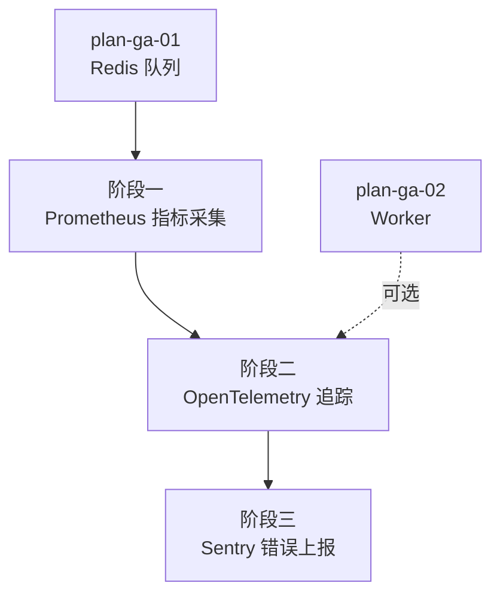

# 开发计划：监控指标（plan-ga-03-monitoring）

## 1. 概述

本模块为 Flow Engine 补齐生产级可观测能力，包括 Prometheus 指标采集、OpenTelemetry 分布式链路追踪、Sentry 错误上报。目标是让运维能够实时监控执行吞吐、错误率、队列深度、缓存命中率与 HTTP 路由访问量，追踪跨进程执行链路，并自动捕获未处理异常。

覆盖范围：

- Prometheus 指标：执行数/时长/错误率、队列深度、缓存命中率、HTTP 路由访问量。
- OpenTelemetry 分布式链路追踪：导出到 Jaeger/Zipkin/Datadog。
- Sentry 错误上报：自动捕获未处理异常、性能监控。

不覆盖范围：

- 缓存系统本身见 [plan-ga-04-cache.md](plan-ga-04-cache.md)。
- Agent 可观测（LLM token 用量追踪）见 [plan-ga-07-agent-prod.md](plan-ga-07-agent-prod.md)，本模块提供通用追踪基础设施。
- 外部监控系统（Prometheus/Jaeger/Sentry 服务端）的部署运维。

## 2. 交付物清单

| 类别 | 交付物 |
|------|--------|
| 代码 | Prometheus 指标采集中间件、`/metrics` 端点、OpenTelemetry 追踪初始化、Sentry 集成 |
| 配置 | 指标采集配置、追踪导出配置（Jaeger/Zipkin/Datadog）、Sentry DSN 与采样率 |
| 测试 | 指标端点可抓取验证、追踪链路完整性用例、异常上报验证 |
| 文档 | 监控配置说明、指标清单、追踪接入说明 |

## 3. 开发阶段

### 阶段一：Prometheus 指标采集

- 目标：暴露 `/metrics` 端点，可被 Prometheus 抓取。
- 核心任务：
  - 引入 Prometheus 指标库。
  - 定义核心指标：
    - 执行数（计数器，按工作流/状态维度）。
    - 执行时长（直方图，P50/P95/P99）。
    - 错误率（计数器，按错误类型）。
    - 队列深度（仪表盘，Redis 队列长度）。
    - 缓存命中率（计数器，命中/未命中）。
    - HTTP 路由访问量（计数器，按路由/状态码）。
  - 指标采集埋点：执行引擎主循环、队列操作、缓存操作、HTTP 中间件。
  - 暴露 `/metrics` 端点（遵循 Prometheus exposition format）。
- 输入：GA 队列（plan-ga-01）、Beta 执行引擎。
- 输出：Prometheus 指标采集与端点。
- 验收标准：
  - `/metrics` 端点返回符合 Prometheus 格式的指标。
  - 执行工作流后执行数、时长指标更新。
  - 队列深度、缓存命中率、HTTP 路由访问量指标可查。
  - 指标采集不影响主流程性能（异步埋点）。
- 依赖：GA 队列（plan-ga-01）。

### 阶段二：OpenTelemetry 分布式链路追踪

- 目标：跨进程执行链路可追踪，导出到 Jaeger/Zipkin/Datadog。
- 核心任务：
  - 引入 OpenTelemetry SDK。
  - 配置追踪导出器（Jaeger/Zipkin/Datadog，可配置切换）。
  - 链路埋点：
    - 工作流执行 Span（根 Span）。
    - 节点执行 Span（子 Span，关联父工作流）。
    - 跨 Worker 传播上下文（通过队列消息携带 trace context）。
    - HTTP 请求 Span、数据库操作 Span。
  - 采样率配置（避免高并发下追踪数据爆炸）。
- 输入：阶段一指标采集、GA Worker（plan-ga-02，可选但建议就绪）。
- 输出：OpenTelemetry 追踪初始化与埋点。
- 验收标准：
  - 工作流执行链路在 Jaeger/Zipkin 可查（至少一种导出器验证）。
  - 跨 Worker 执行的链路可串联（trace context 正确传播）。
  - 节点执行 Span 关联到父工作流 Span。
  - 采样率配置生效。
- 依赖：阶段一、GA 队列（plan-ga-01）；Worker 就绪后可验证跨进程链路。

### 阶段三：Sentry 错误上报

- 目标：未处理异常自动上报 Sentry，性能监控可用。
- 核心任务：
  - 引入 Sentry SDK。
  - 配置 Sentry DSN、环境、采样率。
  - 全局异常处理：捕获未处理异常自动上报。
  - 执行错误上报：执行引擎错误策略触发时上报（含执行上下文）。
  - 性能监控：启用 Sentry Performance（事务追踪）。
  - 敏感信息过滤：上报前移除凭据、Token 等敏感字段。
- 输入：阶段二追踪基础设施。
- 输出：Sentry 集成与错误上报。
- 验收标准：
  - 未处理异常自动上报到 Sentry。
  - 执行错误上报包含执行上下文（工作流 ID、节点 ID、错误信息）。
  - 性能监控事务可查。
  - 上报内容不含敏感信息（凭据、Token 已过滤）。
- 依赖：阶段二。

## 4. 阶段依赖图

## 5. 风险与待定项

| 风险/待定项 | 影响 | 应对策略 |
|-------------|------|----------|
| 指标采集影响主流程性能 | 高并发下埋点成为瓶颈 | 异步埋点；指标缓冲区限流；采样与聚合 |
| 追踪数据量爆炸 | 存储成本高、查询慢 | 采样率配置；按工作流/节点类型采样 |
| 跨 Worker trace context 传播失败 | 链路断裂 | 队列消息结构包含 trace context；Worker 出队时恢复上下文 |
| Sentry 上报泄露敏感信息 | 安全风险 | 上报前过滤；白名单字段；SDK scrubbing 配置 |
| 多种导出器（Jaeger/Zipkin/Datadog）适配 | 配置复杂 | 待定项：默认提供 OTLP 导出，按部署环境配置具体后端 |

## 6. 验收总标准

- [ ] 监控指标可导出到 Prometheus（`/metrics` 端点可被抓取）。
- [ ] 执行数、时长、错误率、队列深度、缓存命中率、HTTP 路由访问量指标齐全。
- [ ] 分布式链路追踪可在 Jaeger/Zipkin 查询（至少一种）。
- [ ] 跨 Worker 执行链路可串联。
- [ ] 未处理异常自动上报 Sentry。
- [ ] 上报内容不含敏感信息。
- [ ] 指标采集与追踪不影响主流程性能。
- [ ] 单元测试覆盖率 ≥75%。

## 变更记录

| 日期 | 修改人 | 修改内容 | 关联任务 |
|------|--------|----------|----------|
| 2026-06-18 | Agent | 创建监控指标开发计划 | GA 计划编写 |
