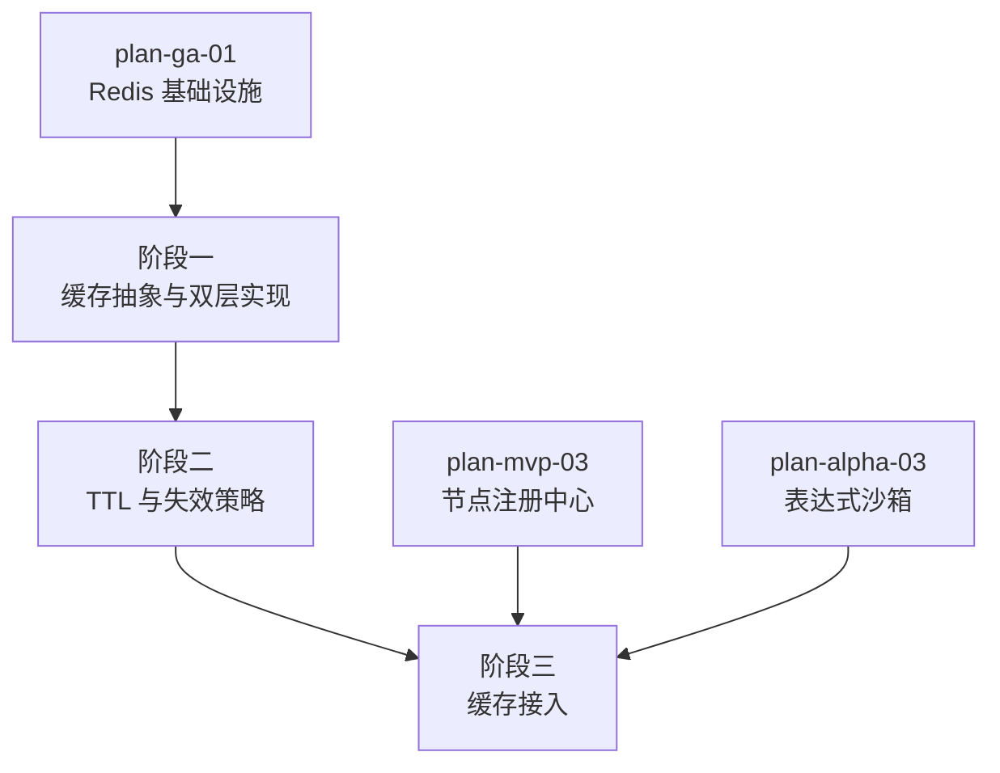

# 开发计划：缓存系统（plan-ga-04-cache）

## 1. 概述

本模块实现内存缓存（`IMemoryCache`）与 Redis 缓存的双层缓存系统，降低数据库查询与表达式引擎重复解析的开销。缓存支持配置化 TTL、失效策略，并接入节点类型元数据缓存与表达式 AST 缓存两个典型场景。

覆盖范围：

- 缓存抽象与双层实现（内存 + Redis）。
- 配置化 TTL。
- 失效策略（主动失效、TTL 过期、跨 Worker 失效广播）。
- 缓存接入：节点类型元数据缓存、表达式 AST 缓存。

不覆盖范围：

- 缓存命中率指标采集见 [plan-ga-03-monitoring.md](plan-ga-03-monitoring.md)（本模块提供命中/未命中计数）。
- 业务数据缓存（工作流定义、执行记录）的缓存策略由各模块按需接入。

## 2. 交付物清单

| 类别 | 交付物 |
|------|--------|
| 代码 | 缓存抽象接口、内存缓存实现、Redis 缓存实现、双层缓存协调器、失效广播 |
| 配置 | 缓存开关、TTL 配置（按缓存类别）、Redis 连接配置、失效广播频道 |
| 测试 | 双层缓存读写用例、TTL 过期用例、失效策略用例、跨 Worker 失效验证 |
| 文档 | 缓存配置说明、缓存接入指南 |

## 3. 开发阶段

### 阶段一：缓存抽象与双层实现

- 目标：提供统一的缓存抽象，内存与 Redis 双层实现可切换/组合。
- 核心任务：
  - 定义缓存抽象接口（Get/Set/Remove，支持泛型与 TTL）。
  - 内存缓存实现（基于 `IMemoryCache`）。
  - Redis 缓存实现（基于 Redis 客户端）。
  - 双层缓存协调器：先查内存，未命中查 Redis，回填内存；写入时同步两层。
  - 配置化选择缓存层级（仅内存/仅 Redis/双层）。
- 输入：GA 基础设施（Redis 连接，plan-ga-01 起）。
- 输出：缓存抽象与双层实现。
- 验收标准：
  - 统一缓存接口可读写。
  - 双层模式下先查内存，未命中查 Redis 并回填。
  - 缓存层级可配置切换。
  - 命中/未命中计数可被监控模块采集。
- 依赖：GA 基础设施（plan-ga-01 Redis 连接）。

### 阶段二：TTL 与失效策略

- 目标：缓存 TTL 可配置，失效策略生效，跨 Worker 缓存一致。
- 核心任务：
  - 配置化 TTL：按缓存类别（节点元数据、表达式 AST 等）配置不同 TTL。
  - 主动失效：数据变更时主动移除缓存（如节点插件重新加载时清空元数据缓存）。
  - TTL 过期：内存与 Redis 各自 TTL 过期机制。
  - 跨 Worker 失效广播：通过 Redis Pub/Sub 广播失效消息，各 Worker 收到后清空本地内存缓存。
  - 缓存击穿防护：热点 key 过期时单实例回源（锁机制）。
- 输入：阶段一缓存实现。
- 输出：TTL 与失效策略。
- 验收标准：
  - TTL 按配置过期，过期后查询触发回源。
  - 主动失效后缓存被移除，下次查询回源。
  - 跨 Worker 失效广播生效，一个 Worker 失效缓存后其他 Worker 本地缓存同步清除。
  - 热点 key 过期不会导致多个 Worker 同时回源。
- 依赖：阶段一。

### 阶段三：缓存接入

- 目标：将缓存接入节点类型元数据与表达式 AST 两个典型场景。
- 核心任务：
  - 节点类型元数据缓存：节点注册中心加载元数据后缓存，插件重载时失效。
  - 表达式 AST 缓存：表达式解析后的 AST 缓存，相同表达式不重复解析。
  - 缓存 key 规范设计（按类别 + 标识）。
  - 接入监控指标（命中率埋点）。
- 输入：阶段二 TTL 与失效策略、节点注册中心、表达式引擎。
- 输出：节点元数据与表达式 AST 缓存接入。
- 验收标准：
  - 节点元数据缓存后重复查询命中缓存，不重复加载。
  - 表达式 AST 缓存后相同表达式不重复解析。
  - 插件重载后节点元数据缓存失效。
  - 缓存命中率与无缓存相比有可量化提升。
- 依赖：阶段二、MVP 节点注册中心（plan-mvp-03）、Alpha 表达式沙箱（plan-alpha-03）。

## 4. 阶段依赖图

## 5. 风险与待定项

| 风险/待定项 | 影响 | 应对策略 |
|-------------|------|----------|
| 跨 Worker 缓存不一致 | 数据陈旧 | Redis Pub/Sub 失效广播；关键缓存短 TTL 兜底 |
| 缓存击穿 | 热点 key 过期瞬间回源压力 | 单实例回源锁；逻辑过期（后台异步刷新） |
| 缓存雪崩 | 大量 key 同时过期 | TTL 加随机偏移；分批预热 |
| 序列化兼容性 | 缓存对象反序列化失败 | 版本化缓存 key；反序列化失败时回源并覆盖 |
| 表达式 AST 缓存 key 设计 | 相同语义不同写法导致缓存未命中 | 待定项：评估是否按归一化表达式生成 key |

## 6. 验收总标准

- [ ] 缓存抽象统一，内存与 Redis 双层实现可切换。
- [ ] TTL 按缓存类别可配置，过期机制生效。
- [ ] 主动失效与跨 Worker 失效广播生效。
- [ ] 节点类型元数据缓存接入，插件重载后失效。
- [ ] 表达式 AST 缓存接入，相同表达式不重复解析。
- [ ] 缓存命中率与无缓存相比有可量化提升。
- [ ] 单元测试覆盖率 ≥75%。

## 变更记录

| 日期 | 修改人 | 修改内容 | 关联任务 |
|------|--------|----------|----------|
| 2026-06-18 | Agent | 创建缓存系统开发计划 | GA 计划编写 |
