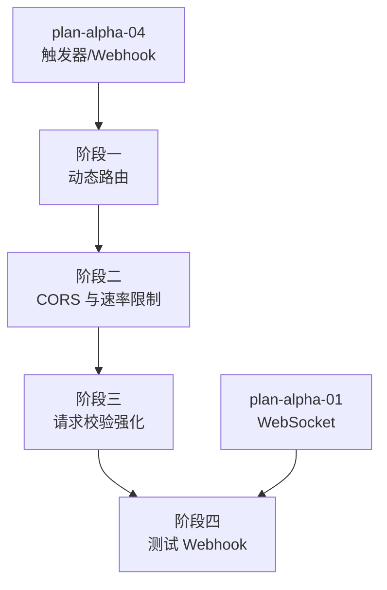

# 开发计划：Webhook 生产管理（plan-ga-05-webhook-prod）

## 1. 概述

本模块将 Alpha 阶段的 Webhook 触发器推向生产可用，补齐动态路由、CORS 配置、速率限制、请求校验强化与测试 Webhook 能力。Webhook 路由注册、生命周期与请求校验设计遵循 [webhook.md](../../architecture/webhook.md)。

覆盖范围：

- 动态路由（模板匹配，如 `/webhooks/orders/{orderId}`）。
- CORS 配置。
- 速率限制（QPS，按 Webhook 路径配置）。
- 请求校验强化（签名验证、来源白名单、请求体大小限制）。
- 测试 Webhook（临时路径、超时清理）。

不覆盖范围：

- Webhook 触发器基础路由注册（Alpha 已实现，plan-alpha-04）。
- Webhook 同步/异步响应模式（Alpha 已实现）。
- 限流中间件的通用实现（Beta plan-beta-03，本模块针对 Webhook 路径级 QPS）。

## 2. 交付物清单

| 类别 | 交付物 |
|------|--------|
| 代码 | 动态路由匹配器、CORS 中间件配置、Webhook 路径级速率限制、请求校验强化（签名/白名单/大小限制）、测试 Webhook 临时路径管理 |
| 配置 | 动态路由模板、CORS 策略、QPS 阈值、签名密钥、白名单、请求体大小上限、测试 Webhook 超时 |
| 测试 | 动态路由匹配用例、CORS 用例、速率限制 429 用例、签名校验用例、请求体超限用例、测试 Webhook 清理用例 |
| 文档 | Webhook 生产配置说明、安全校验说明 |

## 3. 开发阶段

### 阶段一：动态路由

- 目标：支持路径包含变量的动态 Webhook 路由匹配。
- 核心任务：
  - 实现动态路由模板匹配（如 `/webhooks/orders/{orderId}`）。
  - 匹配后提取路径变量注入请求上下文（`RouteValues`）。
  - 动态路由与静态路由统一注册到路由表，按优先级匹配。
  - 路由冲突检测（动态路由与静态路由重叠时报错）。
- 输入：Alpha Webhook 路由表（plan-alpha-04）。
- 输出：动态路由匹配器。
- 验收标准：
  - 动态路径请求可匹配到对应 Webhook 节点。
  - 路径变量正确提取并注入上下文。
  - 动态路由与静态路由冲突时给出明确错误。
- 依赖：plan-alpha-04 触发器。

### 阶段二：CORS 与速率限制

- 目标：Webhook 端点支持 CORS 配置与 QPS 速率限制。
- 核心任务：
  - CORS 配置：按 Webhook 路径或全局配置允许的来源、方法、头。
  - 预检请求（OPTIONS）处理。
  - 速率限制：按 Webhook 路径配置 QPS，超限返回 429。
  - 速率限制基于 Redis 计数（多实例一致）或内存令牌桶（单机）。
  - 429 响应包含 `Retry-After` 头。
- 输入：阶段一动态路由、GA Redis 基础设施（可选，多实例时）。
- 输出：CORS 与速率限制中间件。
- 验收标准：
  - CORS 预检请求正确响应允许的来源与方法。
  - 超过 QPS 阈值的请求返回 429。
  - 429 响应包含 `Retry-After` 头。
  - 多实例下速率限制一致（基于 Redis 时）。
- 依赖：阶段一。

### 阶段三：请求校验强化

- 目标：Webhook 请求支持签名验证、来源白名单、请求体大小限制。
- 核心任务：
  - 签名验证：HMAC-SHA256 签名校验（见 [webhook.md](../../architecture/webhook.md) §5.1）。
  - 来源白名单：IP 白名单、来源域名校验。
  - 请求体大小限制：按 Webhook 路径配置上限，超限拒绝。
  - 恶意请求记录到审计日志。
  - 未找到路由返回 404，不泄露系统信息。
- 输入：阶段二 CORS 与速率限制。
- 输出：请求校验强化中间件。
- 验收标准：
  - 配置签名的 Webhook，签名错误请求被拒绝。
  - 白名单外的来源请求被拒绝。
  - 请求体超过大小限制被拒绝（413 或自定义错误）。
  - 恶意请求记录到审计日志。
- 依赖：阶段二。

### 阶段四：测试 Webhook

- 目标：编辑器中可启用临时测试 Webhook，用完自动清理。
- 核心任务：
  - 临时路径注册：`/webhooks/test/{uuid}`。
  - 超时清理：配置超时时间，超时后自动注销临时路径。
  - 手动关闭：用户关闭监听后注销。
  - 前端通过 WebSocket 实时查看请求内容与执行结果。
- 输入：阶段三请求校验强化、Alpha WebSocket（plan-alpha-01）。
- 输出：测试 Webhook 临时路径管理。
- 验收标准：
  - 测试 Webhook 临时路径可注册并接收请求。
  - 超时后临时路径自动注销。
  - 手动关闭后临时路径注销。
  - 前端可实时查看请求内容与执行结果。
- 依赖：阶段三、plan-alpha-01 WebSocket。

## 4. 阶段依赖图

## 5. 风险与待定项

| 风险/待定项 | 影响 | 应对策略 |
|-------------|------|----------|
| 动态路由匹配性能 | 高并发下路由匹配慢 | 路由表索引优化；热点路由优先匹配 |
| 速率限制基于内存时多实例不一致 | 超限判定不准 | 多实例部署时强制使用 Redis 计数；单机可内存 |
| 签名验证密钥管理 | 密钥泄露风险 | 密钥加密存储；不落日志；定期轮换 |
| 请求体大小限制误伤合法请求 | 大请求被拒 | 按路径配置上限；提供明确错误提示 |
| 测试 Webhook 临时路径残留 | 路径泄露 | 超时强制清理；服务重启时清理过期临时路径 |

## 6. 验收总标准

- [ ] Webhook 生产可用（动态路由、CORS、速率限制、校验齐全）。
- [ ] 动态路由模板匹配生效，路径变量正确提取。
- [ ] 超过 QPS 阈值请求返回 429，含 `Retry-After`。
- [ ] 签名验证、来源白名单、请求体大小限制生效。
- [ ] 测试 Webhook 临时路径可注册、超时自动清理。
- [ ] 恶意请求记录到审计日志。
- [ ] 单元测试覆盖率 ≥75%。

## 变更记录

| 日期 | 修改人 | 修改内容 | 关联任务 |
|------|--------|----------|----------|
| 2026-06-18 | Agent | 创建 Webhook 生产管理开发计划 | GA 计划编写 |
