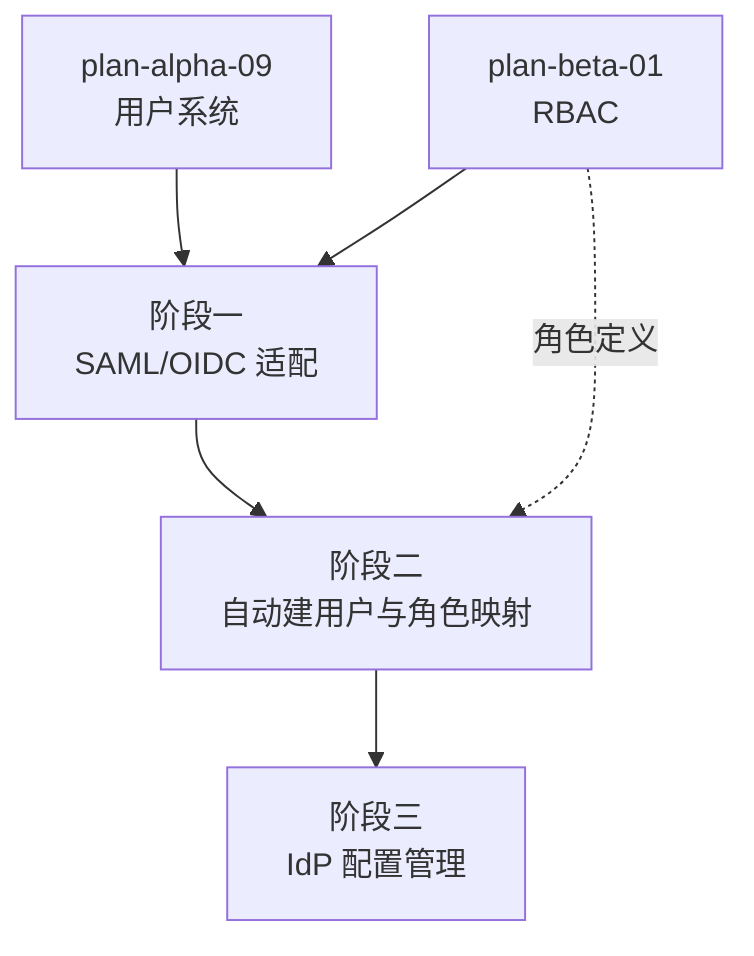

# 开发计划：SSO 单点登录（plan-ga-06-sso）

## 1. 概述

本模块实现 SSO 单点登录，支持企业身份提供商（IdP）通过 SAML 2.0 或 OIDC 协议登录 Flow Engine。SSO 用户首次登录时自动创建账号，并根据 IdP 返回的属性映射到系统角色。提供 IdP 配置管理界面，支持多 IdP 接入。

覆盖范围：

- SAML 2.0 登录适配。
- OIDC 登录适配。
- 自动创建用户（首次登录）。
- 角色映射（IdP 属性 → 系统角色）。
- IdP 配置管理（增删改查、启用/禁用）。

不覆盖范围：

- RBAC 权限模型本身（Beta plan-beta-01 已实现）。
- LDAP 目录同步（属 Enterprise 阶段）。
- 多因素认证（MFA）。

## 2. 交付物清单

| 类别 | 交付物 |
|------|--------|
| 代码 | SAML 2.0 认证适配器、OIDC 认证适配器、自动建用户逻辑、角色映射器、IdP 配置管理 API |
| 配置 | IdP 配置存储（元数据、证书、客户端 ID/密钥、角色映射规则）、回调 URL 配置 |
| 测试 | SAML 登录用例、OIDC 登录用例、自动建用户用例、角色映射用例、IdP 配置 CRUD 用例 |
| 文档 | SSO 接入说明、IdP 配置指南、角色映射说明 |

## 3. 开发阶段

### 阶段一：SAML/OIDC 适配

- 目标：支持通过 SAML 2.0 或 OIDC 协议完成登录认证。
- 核心任务：
  - OIDC 适配：引入 OIDC 认证库，实现授权码流程（Authorization Code Flow）。
  - SAML 2.0 适配：引入 SAML 库，实现 SP（Service Provider）发起的登录与断言解析。
  - 认证回调处理：接收 IdP 回调，验证令牌/断言有效性。
  - 回调 URL 路由注册。
  - 登录会话建立（与现有认证体系集成）。
- 输入：Alpha 用户系统（[plan-alpha-09-user-system.md](../alpha/plan-alpha-09-user-system.md)）、Beta RBAC（plan-beta-01）。
- 输出：SAML/OIDC 认证适配器。
- 验收标准：
  - OIDC 授权码流程可完成登录（至少对接一种测试 IdP）。
  - SAML 2.0 断言可解析并验证签名。
  - 认证回调后建立登录会话。
  - 令牌/断言无效时拒绝登录。
- 依赖：Alpha 用户系统（plan-alpha-09）、Beta RBAC（plan-beta-01）。

### 阶段二：自动建用户与角色映射

- 目标：SSO 用户首次登录自动创建账号，并根据 IdP 属性映射角色。
- 核心任务：
  - 自动建用户：SSO 登录时若用户不存在，根据 IdP 返回属性（邮箱、用户名、姓名）自动创建。
  - 用户关联：SSO 用户与本地用户通过唯一标识（邮箱或 IdP 用户 ID）关联。
  - 角色映射：配置 IdP 属性值到系统角色的映射规则（如 `department=engineering` → 编辑角色）。
  - 角色同步：每次登录时根据 IdP 属性更新用户角色。
  - 自动建用户开关：可配置是否允许自动建用户（关闭时仅允许已存在用户登录）。
- 输入：阶段一 SAML/OIDC 适配、Beta RBAC 角色定义。
- 输出：自动建用户与角色映射逻辑。
- 验收标准：
  - 首次登录的 SSO 用户自动创建账号。
  - 角色映射规则生效，用户角色与 IdP 属性一致。
  - 再次登录时角色同步更新。
  - 关闭自动建用户时，未知用户被拒绝。
- 依赖：阶段一、Beta RBAC（plan-beta-01）。

### 阶段三：IdP 配置管理

- 目标：提供 IdP 配置管理界面，支持多 IdP 接入。
- 核心任务：
  - IdP 配置存储：协议类型（SAML/OIDC）、元数据/端点、证书/密钥、客户端 ID/密钥、角色映射规则。
  - IdP 配置 CRUD API。
  - IdP 启用/禁用：禁用后该 IdP 登录不可用。
  - 多 IdP 支持：登录页展示可用 IdP，用户选择后跳转。
  - 证书/密钥加密存储。
- 输入：阶段二自动建用户与角色映射。
- 输出：IdP 配置管理 API 与界面。
- 验收标准：
  - IdP 配置可增删改查。
  - 启用/禁用 IdP 生效。
  - 多 IdP 场景下登录页展示可选 IdP。
  - 证书/密钥加密存储，不返回前端。
- 依赖：阶段二。

## 4. 阶段依赖图

## 5. 风险与待定项

| 风险/待定项 | 影响 | 应对策略 |
|-------------|------|----------|
| SAML 协议复杂、IdP 差异大 | 适配成本高 | 先支持 OIDC（覆盖面广）；SAML 按客户需求迭代；抽象统一认证模型 |
| IdP 属性与角色映射规则复杂 | 映射不准 | 提供灵活的映射规则配置（属性值 → 角色）；支持默认角色 |
| 自动建用户导致未授权用户进入 | 安全风险 | 自动建用户开关默认关闭；管理员审核；首次登录默认最小权限 |
| 证书/密钥泄露 | 安全风险 | 加密存储；不落日志；不返回前端；定期轮换 |
| SSO 登录会话与本地登录会话冲突 | 会话混乱 | 统一会话管理；SSO 登出同步本地登出 |
| SAML 库选型 | 影响维护成本 | 待定项：评估开源 SAML 库（如 ITfoxtec、Sustainsys） |

## 6. 验收总标准

- [ ] SSO 用户可自动登录（SAML/OIDC 至少一种走通）。
- [ ] 首次登录的 SSO 用户自动创建账号。
- [ ] 角色映射生效，用户角色与 IdP 属性一致。
- [ ] IdP 配置可增删改查，启用/禁用生效。
- [ ] 多 IdP 场景下登录页可选。
- [ ] 证书/密钥加密存储，不返回前端。
- [ ] 单元测试覆盖率 ≥75%。

## 变更记录

| 日期 | 修改人 | 修改内容 | 关联任务 |
|------|--------|----------|----------|
| 2026-06-18 | Agent | 创建 SSO 单点登录开发计划 | GA 计划编写 |
| 2026-06-18 | Agent | 修正用户系统依赖指向 plan-alpha-09，补充 RBAC 依赖 | 计划 review 修复 |
