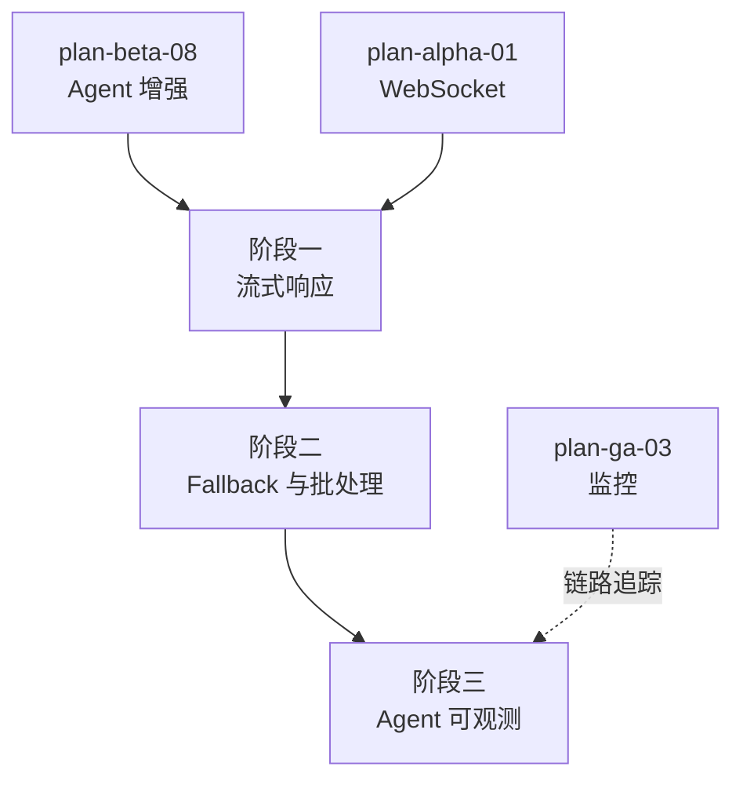

# 开发计划：Agent 生产化（plan-ga-07-agent-prod）

## 1. 概述

本模块将 Beta 阶段的 Agent 能力推向生产可用，补齐流式响应、Fallback 模型降级、批处理、子 Agent 内联执行与 Agent 可观测能力。流式输出接口设计遵循 [agent-and-tool.md](../../architecture/agent-and-tool.md) §11.2。

覆盖范围：

- 流式响应（`IStreamingNodeType` / `ExecuteStreamingAsync` / `StreamingChunk`）。
- Fallback 模型（主模型失败降级到备用模型）。
- 批处理（Agent 按批次处理数据项）。
- 子 Agent 内联执行（复用内联解析器，减少上下文切换开销）。
- Agent 可观测（LLM token 用量追踪、tool 调用耗时、Agent 执行链路追踪）。

不覆盖范围：

- Agent 节点基础能力与工具收集机制（Alpha plan-alpha-06 已实现）。
- 子 Agent 嵌套与内联解析器基础（Beta plan-beta-08 已实现，本模块做生产化强化）。
- 通用监控基础设施（Prometheus/OpenTelemetry/Sentry）见 [plan-ga-03-monitoring.md](plan-ga-03-monitoring.md)，本模块提供 Agent 专属可观测埋点。

## 2. 交付物清单

| 类别 | 交付物 |
|------|--------|
| 代码 | 流式响应接口与实现、Fallback 模型降级逻辑、批处理执行器、子 Agent 内联执行强化、Agent 可观测埋点 |
| 配置 | Fallback 模型链配置、批处理批次大小配置、流式输出开关、token 用量上报配置 |
| 测试 | 流式输出用例、Fallback 降级用例、批处理用例、token 用量追踪用例 |
| 文档 | Agent 生产化配置说明、流式输出接入说明、可观测指标说明 |

## 3. 开发阶段

### 阶段一：流式响应

- 目标：Agent 节点支持流式输出，前端实时展示 LLM 思考过程与中间结果。
- 核心任务：
  - 实现流式节点接口（`IStreamingNodeType`，`ExecuteStreamingAsync` 返回 `IAsyncEnumerable<StreamingChunk>`，见 [agent-and-tool.md](../../architecture/agent-and-tool.md) §11.2）。
  - `StreamingChunk` 结构：内容、是否 tool 调用、tool 调用信息、是否最终结果。
  - 流式输出通过 WebSocket / SSE 推送到前端。
  - 流式执行同样生成 `NodeExecutionRecord`，最终聚合结果作为节点输出。
  - 非流式节点仍使用 `ExecuteAsync` 返回完整结果。
- 输入：Beta Agent 增强（plan-beta-08）、Alpha WebSocket（plan-alpha-01）。
- 输出：流式响应接口与实现。
- 验收标准：
  - Agent 节点流式输出 `StreamingChunk` 经 WebSocket/SSE 推送到前端。
  - 流式执行生成 `NodeExecutionRecord`，最终聚合结果正确。
  - 非流式节点行为不变。
  - 流式输出可被取消（`CancellationToken` 生效）。
- 依赖：plan-beta-08 Agent 增强、plan-alpha-01 WebSocket。

### 阶段二：Fallback 与批处理

- 目标：主模型失败时降级到备用模型；Agent 支持按批次处理数据项。
- 核心任务：
  - Fallback 模型链配置：主模型 → 备用模型列表，按顺序尝试。
  - 降级触发条件：主模型调用失败（超时、限流、错误）时切换备用模型。
  - 降级日志记录：记录降级事件（原模型、备用模型、失败原因）。
  - 批处理执行器：将输入数据按批次大小分批，逐批处理。
  - 批次间上下文传递：批次结果可累积，供后续批次参考。
  - 批处理失败处理：单批失败不影响其他批次（可配置）。
- 输入：阶段一流式响应、Beta Agent 增强（plan-beta-08）。
- 输出：Fallback 模型降级与批处理执行器。
- 验收标准：
  - 主模型失败时自动降级到备用模型，降级事件记录。
  - 备用模型全部失败时按错误策略处理。
  - 批处理按配置批次大小分批执行。
  - 单批失败可配置为跳过或整体失败。
- 依赖：阶段一、plan-beta-08。

### 阶段三：Agent 可观测

- 目标：LLM token 用量可追踪，tool 调用耗时可查，Agent 执行链路可追踪。
- 核心任务：
  - LLM token 用量追踪：记录每次 LLM 调用的 prompt token、completion token、总 token。
  - token 用量上报：聚合到执行记录与监控指标。
  - tool 调用耗时追踪：记录每个 tool 调用的开始/结束时间、耗时。
  - Agent 执行链路追踪：基于 OpenTelemetry 埋点（Agent 执行 Span、LLM 调用 Span、tool 调用 Span）。
  - 可观测数据接入执行视图：前端展示 token 用量与 tool 调用耗时。
- 输入：阶段二 Fallback 与批处理、GA 监控（plan-ga-03，可选但建议就绪）。
- 输出：Agent 可观测埋点与数据上报。
- 验收标准：
  - 每次 LLM 调用的 token 用量可查（prompt/completion/total）。
  - tool 调用耗时可查。
  - Agent 执行链路在追踪系统可查（依赖 plan-ga-03）。
  - 前端执行视图展示 token 用量与 tool 调用耗时。
- 依赖：阶段二、plan-ga-03 监控（链路追踪部分）。

## 4. 阶段依赖图

## 5. 风险与待定项

| 风险/待定项 | 影响 | 应对策略 |
|-------------|------|----------|
| 流式输出与执行记录模型冲突 | 流式结果难以落库 | 流式执行同样生成 `NodeExecutionRecord`，最终聚合结果作为节点输出（见 [agent-and-tool.md](../../architecture/agent-and-tool.md) §11.2） |
| Fallback 模型链配置复杂 | 用户难以维护 | 提供配置化模型链；默认 Fallback 为同系列低配模型 |
| 批处理批次间状态累积导致内存增长 | 内存压力 | 批次结果按需持久化；批次大小限制；上下文裁剪 |
| token 用量统计依赖 LLM 供应节点返回 | 部分模型不返回 token 用量 | 供应节点适配时尽量获取；无法获取时标注未知 |
| 流式输出被取消后状态不一致 | 部分结果已推送 | 取消时标记执行为 `Cancelled`；已推送 chunk 不回滚 |
| 流式输出前端展示性能 | 大量 chunk 导致前端卡顿 | 前端节流/缓冲；增量渲染 |

## 6. 验收总标准

- [ ] Agent 支持流式输出（`StreamingChunk` 经 WebSocket/SSE 推送到前端）。
- [ ] 流式执行生成 `NodeExecutionRecord`，最终聚合结果正确。
- [ ] Fallback 降级生效，主模型失败时切换备用模型。
- [ ] 批处理按配置批次大小分批执行。
- [ ] LLM token 用量可追踪（prompt/completion/total）。
- [ ] tool 调用耗时可查。
- [ ] Agent 执行链路在追踪系统可查（依赖 plan-ga-03）。
- [ ] 单元测试覆盖率 ≥75%。

## 变更记录

| 日期 | 修改人 | 修改内容 | 关联任务 |
|------|--------|----------|----------|
| 2026-06-18 | Agent | 创建 Agent 生产化开发计划 | GA 计划编写 |
